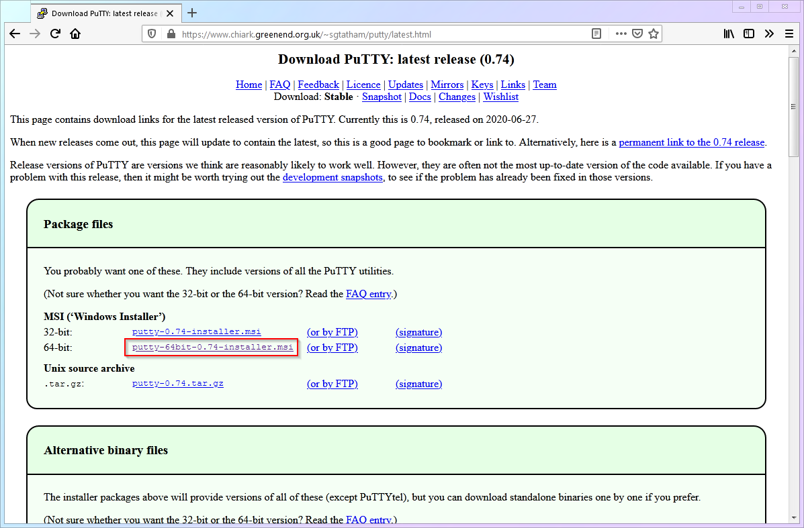
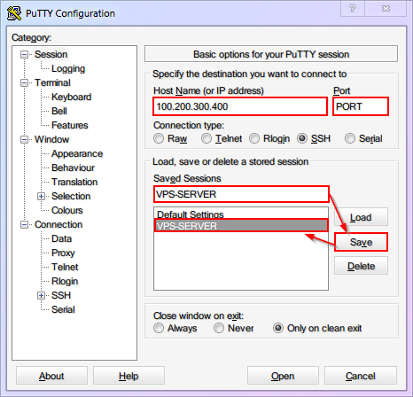
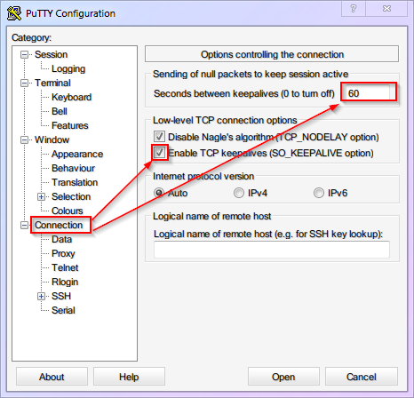
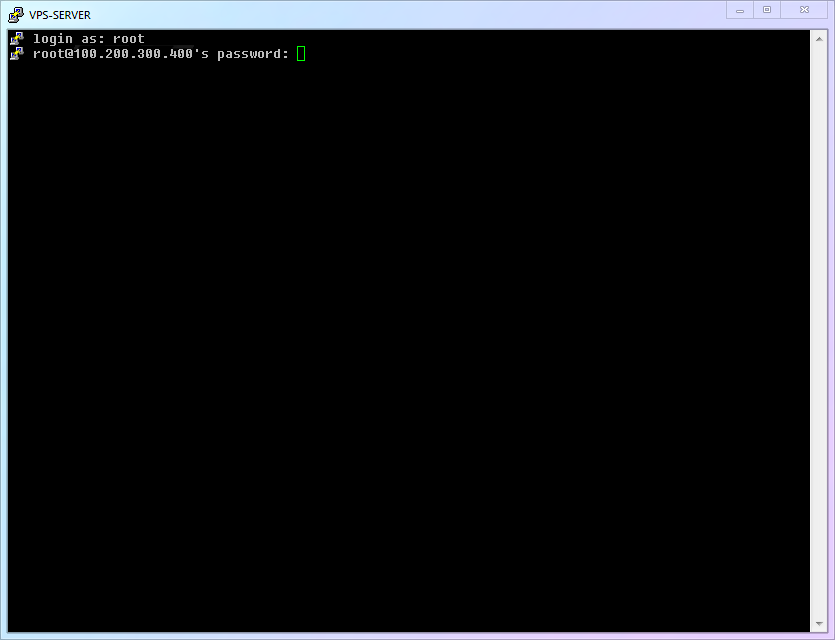
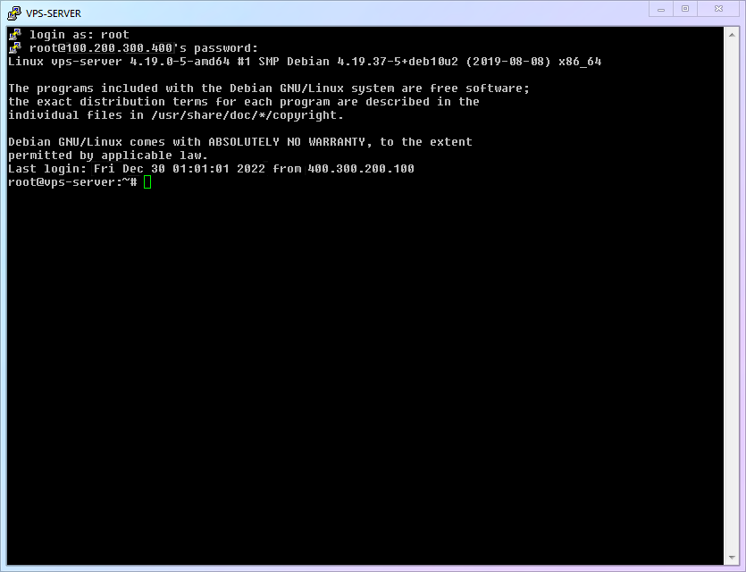
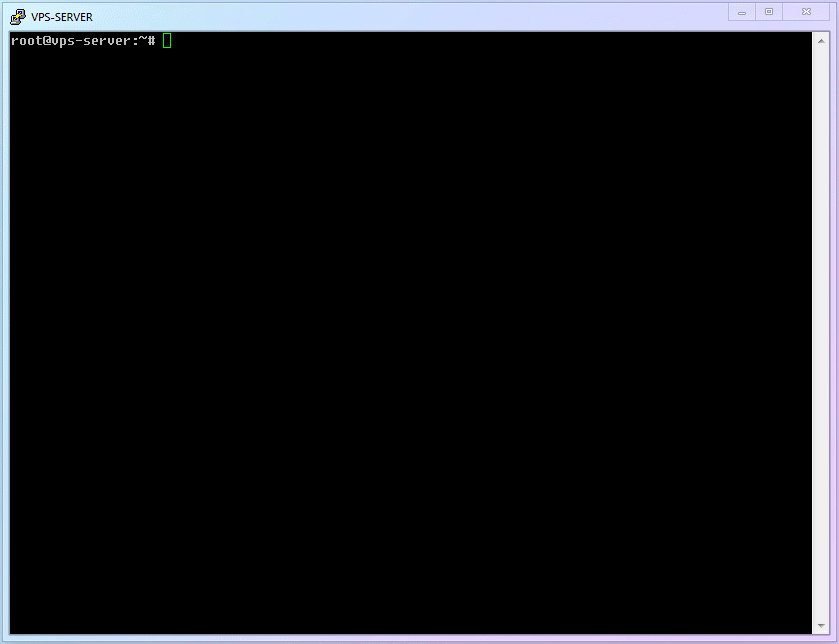

# 【第 3 章】远程登录篇

## 3.1 远程登录 VPS (PuTTY)

首先，鉴于零基础人群中 Windows 的用户基数最大，所以本文以 Windows 为例进行展示。

其次，虽然 Windows 10 之后的 PowerShell 和 WSL 也可以达到很好的 SSH 操作体验。但是因为并非所有版本的 Windows 都有最新的组件，故本文还是以老牌的 PuTTY 为例，进行 SSH 远程登录的操作详解。（使用其他工具的话、在 SSH 登陆之后的操作都是一样的）

下面就跟我一步步操作吧。

1. 进入 PuTTY 的[官网](https://www.chiark.greenend.org.uk/~sgtatham/putty/latest.html)，选择适合你操作系统的版本下载。（本文以 64 位版本为例）

   

2. 安装运行后，将会看到 PuTTY 的主界面。现在请拿出你上一章记东西的[小本本](../ch02-preparation/#21-%E8%8E%B7%E5%8F%96%E4%B8%80%E5%8F%B0vps)，在下图的对应位置填入你 VPS 的**IP 地址(VPS IP)**和**端口(VPS PORT)**。为了方便以后使用时不用重复输入，我们可以保存会话 (Saved Sessions)，未来使用时只要按 Load 即可一键载入设置。

   

3. 我建议将 `Connection` 中的 `keepalive` 设置为 `60` 秒，防止你一段时间没有操作之后 SSH 自动断线。另外务必再次保存设置。

   

::: warning 注意
对 PuTTY 的任何设置更新都要再次手动保存 Session，不然关闭后就会丢失
:::

4. 点击 Open 就会进入 SSH 连接窗口，对应下图输入用户名与密码，与你的 VPS 远程主机建立连接。（本文假设默认用户名是 `root`，另外，在 Linux 系统输入密码的时候，是不会出现 `******` 这种提示符的，这样可以避免密码长度泄漏，不是你的键盘坏掉了哦！）

   

## 3.2 成功登录 SSH！初识命令行界面！

1. 如果你的信息都填写正确，你将会看到类似下图的界面，说明已登录成功：

   

   这个界面，就等于远程服务器的【桌面】，但它没有你熟悉的图标和鼠标，没有绚丽的色彩，有的只是简单文字，这就是【**命令行界面**】- `Command Line Interface`，或者缩写为 `CLI`。

   接下来的所有操作，都需要你像电影里的黑客一样，在这个命令行界面中完成。也许你会觉得陌生，但请相信我，使用命令行既不可怕，也不神秘。说到底，它只不过是把你习惯的鼠标操作变成了文字指令而已，**你说一句，它做一句**。

2. 现在，你可以稍微观察并熟悉一下命令行环境，这个界面其实已经告诉了你一些有用的信息了，比如系统内核版本（比如图内是 `4.19.37-5`）、上次登录时间及 IP 等。当然根据 VPS 的不同，你看到的界面可能会略有不同。

3. 请注意命令行最下面一行，闪动的光标左边，有一串字符。图中显示的是`root@vps-server:~#`，这一串要怎么理解呢？很简单：

   - 现在的用户是 `root`
   - `root` 所在的服务器是 `vps-server`
   - `root` 现在所在的文件夹是 `~`
   - `#` 之后是你可以输入命令的地方

   前两个很直观，无需多说。第三个是关于 Linux 的文件夹系统，现在也不需要过于深入，你只需要知道，"`~`"就是【当前用户的大本营】。第四个，提示符`#`，你也不用管，只需要知道，未来文章中会写一些需要你输入的命令，都会以 "`#`" 或者 "`$`" 开头，提示你**后面**是你输入命令的地方。（所以你复制命令的时候，**只需要复制后面的内容**，不要复制提示符）

## 3.3 第一次更新 Linux 的软件！

1. 正如你的手机，无论安卓还是 iPhone，为了 APP 及时更新（获取安全补丁和新功能），都会时不时从应用商店获得更新信息，并且提示你有多少个 APP 可更新。Linux 系统也有逻辑十分类似的更新机制。所以只要你会更新手机 APP，就能学会更新 Linux 软件！

2. Linux 下，每个 APP 都叫做一个“包” （package）。管理 APP 的程序自然就叫做“包管理器”（Package Manager）。你可以通过它安装、更新、卸载各种软件、甚至更新 Linux 系统本身。Linux 下的包管理器非常强大，此处按下不表，现在你只需要知道 Debian 系统的包管理器叫做 `apt` 即可。接下来，我们就先使用 `apt` 做一次软件的全面更新，让你熟悉它的基本操作。

3. 小小白白 Linux 基础命令：

   |   编号   |   命令名称    |   命令说明   |
   | :------: | :-----------: | :----------: |
   | `cmd-01` | `apt update`  | 查询软件更新 |
   | `cmd-02` | `apt upgrade` | 执行软件更新 |

4. 现在请输入第一条命令，获取更新信息

   ```
   # apt update
   ```

5. 然后请输入第二条命令，并在询问是否继续安装 `(Y/n)` 时输入 `y` 并回车确认，开始安装

   ```
   # apt upgrade
   ```

6. 完整流程演示如下：

   

## 3.4 你的进度

**恭喜你又迈出了坚实的一步！** 现在，你已经可以通过 SSH 来登录你的远程服务器了！那登录进去之后，除了升级软件之外，应该再做点什么呢？敬请进入下一章一探究竟吧！

> ⬛⬛⬛⬜⬜⬜⬜⬜ 37.5%
