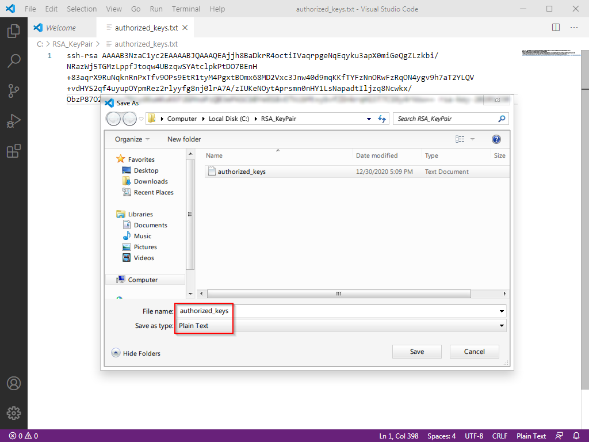

# 【第 4 章】安全防护篇

## 4.1 为什么要做安全防护

Linux 服务器的安全防护是一个纷繁复杂的巨大课题。无数的网站、APP、服务、甚至线下基础设施都建立在 Linux 的基石之上，这背后牵涉到巨大的经济利益和商业价值，当然也就就意味着黑灰产有巨大的攻击动力。但是这些服务是如此重要、根本不允许出现重大的安全漏洞。于是无数的运维专业人员都在安全攻防的战场上拼搏努力，这才让大家能享受到基本稳定的现代化数字生活。

现在，你拥有了一台 VPS，并且将会敞开他的数据访问渠道来达到流量转发的目标，那就相当于你已经置身于安全攻防战场的第一线、直面所有风险。但与此同时，新人由于知识和信息的不足，看待安全问题是总是难免两极分化：要么觉得轻如鸿毛和自己没有半点关系，要么觉得重于泰山甚至惶惶不可终日。

- 对于前者，我的建议是：安全无小事，尽量多查一些安全方面的信息，免得自己真的受了损失才后悔莫及

- 对于后者，我的建议是：不用紧张，我们的服务器仍不具有太高的价值、一般不会吸引到高水平的攻击，需要面对的基本都是一些自动化脚本的恶意扫描和登录尝试，跟着本文做一些基础的防护即可

## 4.2 具体的风险到底是什么

就像我们在《远程登录篇》配置的一样，任何人只需要知道【IP 地址】+【端口】+【用户名】+【密码】这四个要素，就能登录你的 VPS 服务器。那很显然，这四要素的安全就是我们要防护的底线。我们来逐一分析：

1. 【IP 地址】：恶意脚本会随机尝试和扫描 IP 段，可以简单认为是公开信息、无法隐藏

2. 【端口】：如果使用默认端口，那么【端口 = `22`】

3. 【用户名】：如果使用默认用户，那么【用户名 = `root`】

4. 【密码】：密码不存在默认值，一定是由 VPS 后台随机生成或由你自行设置的。也就是说，如果你的服务器都是默认设置，则四要素中的三个已经是已知的，那么你整个服务器的安全，就全部寄托在一串小小的密码上了。这时有几种情况：

   - 如果你用了 VPS 管理后台随机生成密码，它一般包含随机的十几个大小写混杂的字母和符号，相对比较安全

   - 如果你为了好记、把密码改成了类似`123456`这种超弱的密码，破解你的 VPS 服务器可谓不费吹灰之力

   - 如果你为了好记、把密码改成了比较复杂、但在别的地方用过的密码，其实也并不安全。你要明白黑客手里有作弊器，比如说`密码表`，包含数万、数十万、数百万甚至更多曾经泄漏的真实密码）

5. 但你要明白，没有哪个黑客真的要坐在电脑前一次一次的尝试你的密码，全部的攻击尝试都是恶意脚本自动进行的，它会 24 小时不眠不休的工作。也许每天你酣睡之时，你的服务器都在经受着一轮又一轮的冲击。

   一旦密码被成功撞破，意味着你的四要素全部被攻击者掌握，恶意脚本就会快速登录服务器、获取服务器的最高 `root` 控制权、安装部署它的恶意服务，然后就可以用你的服务器来 24 小时做各种坏事（比如挖矿、传播病毒、发送垃圾邮件、欺诈邮件、做 BT 中继、甚至暗网公众节点等等等等）。如果恶意脚本比较克制，其实可以做到相当的隐蔽性。而新人一般也不会去观察留意 VPS 的登录记录、进程变化、CPU 占用变化、流量变化等指标，你其实就很难发现自己被黑了。直到你的 VPS 服务商封禁你的账号、或者收到律师函为止。

6. 别忘了，你获得 VPS 时大概率需要使用真实的支付信息，你登录各种网站、社交平台时也会留下你的 IP 地址，这些都与你的身份有直接或者间接的关系。于是，**一旦这些坏事发生，它们就不可避免的与你产生了关联。**

## 4.3 我们要做的安全防护有哪些

基于上述分析，我们要做的，自然就是对【端口】、【用户名】、【密码】这三要素进行加强，来降低被攻破的风险：

1. 【端口】：将 SSH 远程登录端口修改为【非 22 端口】 （4.4）
2. 【用户名】：建立【非 root】的新用户、并禁用 root 用户 SSH 远程登录 （4.5、4.6）
3. 【密码】：SSH 启用 RSA 密钥验证登录、同时禁用密码验证登录 （4.7）

记得按顺序来，别把自己锁在门外了。

## 4.4 将 SSH 远程登录端口修改为非 22 端口

现在，我们来解决【端口 = `22`】的问题。（注意：有些 VPS 服务商，默认的端口已经是非 22 端口，那么你可以忽略这一步，当然也可以跟着本文改成别的端口）

1. 小小白白 Linux 基础命令：

   |   编号   |      命令名称       |   命令说明   |
   | :------: | :-----------------: | :----------: |
   | `cmd-03` |       `nano`        |  文本编辑器  |
   | `cmd-04` | `systemctl restart` | 重启某个服务 |

2. 小小白白 Linux 基础配置文件

   |   编号    |      配置文件位置      |       文件说明       |
   | :-------: | :--------------------: | :------------------: |
   | `conf-01` | `/etc/ssh/sshd_config` | SSH 远程登录程序设置 |

3. 我们要做的第一件事，当然就是【用`nano`这个文本编辑器打开`SSH远程登录程序设置`】，在 Windows 下，你会【找到文件并双击】，在 Linux 下该怎么办呢？仔细看看上面的命令说明，是不是就很简单了？没错，就是：

   ```shell
   nano /etc/ssh/sshd_config
   ```

4. 文件打开后，你就进入了`nano`的界面，稍微观察一下，你会发现，它把重要的快捷键都显示在屏幕下方了（下图红框内），直接开卷考试、不用死记硬背，是不是很贴心呢？

   

5) 我们要做的第二件事，是【在打开的文件中找到`Port`这一项，并修改它的端口】。Port 后面的数字就是 SSH 的端口，一般建议把它改成一个大于`1024`小于`65535`的整数（本文以`9753`为例）。请结合`nano`的快捷键，想一下该怎么操作呢？果然，你又说对了！就是：

   - 使用 `ctrl+w` 进入搜索模式，然后输入 `Port 22` 并回车
   - 删除 `22` 并改成 `9753`
   - 说明：如果这一行开头有个`#`，证明这一行【不生效】（被注释掉了），你可像我一样在文件最后写一个不带`#`的，或者把`#`删掉就好。

   ::: warning
   本文以`9753`为例，就意味着随着本文的发布，这个端口会变成一个不大不小的特征，也许会被攻击者优先尝试、也许被 GFW 干扰、阻断。所以我强烈建议你用一个自己想到的其他端口，毕竟，你有 6 万多个端口可以自由选择。
   :::

6. 我们要做的第三件事，是【保存文件并退出】

   - 如果第 3 步你有仔细观察，就会发现保存并不是常见的 `ctrl+s`。
   - 正确的快捷键：保存是 `ctrl+o` + `回车`，退出是 `ctrl+x`
  
   - (部分操作系统) 新增一个防火墙规则，设置为新增的SSH端口, 否则实例重启后无法SSH登陆。
   - 如 Ubuntu 的 ufw
   ```shell
   sudo ufw allow 9753/tcp
   ```

7. 我们最后要做的事，是【重启 ssh 服务，使变更生效】

   ```shell
   systemctl restart ssh
   ```

   然后可以尝试在ssh软件上打开新的会话尝试是否可以连上，如果出现问题可以通过旧的ssh会话修改配置(重启sshd时已经打开的ssh不会被关闭)

8. 完整流程演示如下：

   

9. 修改 PuTTY 配置

   现在新的端口已经生效，下次使用 PuTTY 登录时就要用`9753`了。所以现在请到 PuTTY 的设置中修改端口号码，然后保存 Session。嗯，你应该知道去哪里改了吧？（如果不知道的话，要重读前面的内容了哦！）

## 4.5 建立非 root 的新用户

第二步，我们来解决【用户名 = `root`】的问题。

首先你要理解， Linux 系统中的`root`，不仅仅是一个管理员账号那么简单。它是整个系统的【根基】、是系统的主宰、至高无上的神。一旦`root`账号出现安全问题，整个系统都只能任人鱼肉、无处可逃。那么就跟随我进行操作吧：

1. 小小白白 Linux 基础命令：

   |   编号   |   命令名称    |           命令说明           |
   | :------: | :-----------: | :--------------------------: |
   | `cmd-05` |   `adduser`   |        给系统新增用户        |
   | `cmd-06` | `apt install` |         安装某个软件         |
   | `cmd-07` |   `visudo`    | 修改 sudo 权限设置专用编辑器 |

2. 我们要做的第一件事，是【新增一个用户并设定登录密码】，名字你可以随便起，我这里以`vpsadmin`为例：

   ```shell
   adduser vpsadmin
   ```

   执行命令后，根据提示操作即可。请务必设置一个用户密码（别忘记设置密码时你时看不到 `******` 的）。之后系统会询问你一些用户的附加信息，这些就可以无视，一路回车即可。

   

   ::: warning
   本文以`vpsadmin`为例，就意味着随着本文的发布，这个用户名也会变成一个不大不小的特征，也许会被攻击者优先尝试。所以和端口一样，我强烈建议你用一个自己想到的其他用户名。
   :::

3. 完整流程演示如下：

   

4. 我们要做的第二件事，是【安装`sudo`功能】（`sudo` 就是在关键时刻，让普通账户临时获得 `root` 的神力，战力全开拯救世界）

   ```shell
   apt update && apt install sudo
   ```

   聪明的你大概已经发现，这一行命令其实是两个命令。前一半 `apt update` 你之前已经见过并且用过了，是去服务器刷新软件版本信息。后面的 `apt install`
   就是这一次要用到的【安装命令】。两条连接在一起，就是让系统去【刷新可用的最新软件，然后安装最新版的`sudo`程序】。 `&&` 则是把两个命令连起来执行的意思。

5. 我们要做的第三件事，是【把`vpsadmin`用户加入`sudo`名单里，让他有资格借用`root`的神力】

   ```shell
   visudo
   ```

   在 `User Privilege Specification` 下加入一行 `vpsadmin ALL=(ALL) NOPASSWD: ALL` 即可。

   ::: warning
   我要特别说明的是`NOPASSWD`这个设置，它的意思是`vpsadmin`用户临时使用`root`权限时，不用额外输入密码。**这与一般的安全建议相反**。我之所以如此推荐，是因为很多新人不顾危险坚持使用`root`账号就是因为用`root`时不用重复输入密码、觉得轻松。“两害相权取其轻”，我认为【直接用`root`用户的风险】大于【使用`sudo`
   时不用输密码的风险】，所以做了以上的建议。

   如果你希望遵守传统习惯、每次使用`sudo`时需要输入密码，那么这一行改成 `vpsadmin ALL=(ALL:ALL) ALL` 即可。
   :::

6. 完整流程演示如下：

   

## 4.6 禁用 root 用户 SSH 远程登录

1. 现在你已经逐渐熟悉 Linux 了，所以这次换你思考，我们要做的第一件事是什么呢？没错，还是【用`nano`编辑器打开`SSH远程登录程序设置`】，什么，你想不起来怎么操作了？那去复习一下上面的内容再回来吧！............ 正确答案：

   ```shell
   nano /etc/ssh/sshd_config
   ```

2. 找到`PermitRootLogin Yes`这一项，然后把它后面的设定值改为`no`即可。还记得怎么操作吗？............ 正确答案：

   - 使用 `ctrl+w` 进入搜索模式，然后输入 `PermitRootLogin` 并回车
   - 删除 `yes` 并改成 `no`

3. 保存文件并退出。还记得怎么操作吗？............ 正确答案：

   - 保存是 `ctrl+o`，然后 `回车` 确认
   - 退出是 `ctrl+x`

4. 重启 ssh 服务，让变更生效。还记得............ 算了直接公布正确答案：

   ```shell
   systemctl restart ssh
   ```

5. 完整流程演示如下：

   

6. 下次通过 PuTTY 远程 SSH 登录的时候，`root`用户已无法连接，用户名就要换成`vpsadmin`了！方便起见，我们可以在 PuTTY 中把`vpsadmin`设置成默认登录用户名。（啰嗦君：别忘了保存 Session）

   

## 4.7 使用 RSA 密钥登录并禁用密码登录

第三步，我们来解决【密码】可能被撞破的问题。

前面我说过，黑客并不是很蠢的用穷举法破解你的密码，而是会用一些比如“密码表”的作弊手段。除非你用的是随机生成的超长密码（比如借助 1Password，或者 macOS 的 keychain 等密码管理工具），否则很容易中招。

超长随机密码虽然安全性有所提高，但是基本上无法记忆，手动输入也十分麻烦易错。为了解决这个困境，我们可以直接弃用【密码验证】方式，改用更安全的【密钥验证】。

所谓的【密钥验证】，就是生成【一对】相关联的密钥文件（公钥和私钥），然后把【公钥】上传到 VPS 备用。每次登录时，SSH 会将【公钥】和【私钥】进行匹配，若验证是正确的【密钥对】，则验证通过。（换言之，你无需记忆和输入复杂的密码，只要保护好【私钥】这个文件不外泄即可）

::: warning
本文以 `RSA` 密钥举例，是因为 `RSA` 密钥在各种设备、各种 `SSH` 客户端中有广泛悠久的支持历史，且目前依然能提供够用的安全性。但它绝非唯一选择。

其他的常见密钥还有：

- `DSA` - 已经从数学层面被证明不安全，所以永远不要用它
- `ECDSA` - 密钥小安全性高，但其算法被指留有 NSA 的后门，如果你的 VPS 上有值得 NSA 关注的东西就不要用它
- `Ed25519` - 这是一个与 `ECDSA` 十分类似的算法，故具有相似的性能优势。同时其文档全部公开，所以普遍认为无后门

所以，如果你的设备和软件都支持的话，我建议优先选择 `Ed25519` 密钥。
:::

那我们现在就来配置【密钥验证】吧！

1. 运行`PuTTYgen` (PuTTY 密钥生成器)。位置是 `开始菜单` --> `所有程序` --> `PuTTY (64-bit)` --> `PuTTYgen`

   1. 点击`Generate`开始生成（在界面空白处乱晃鼠标增加随机数）

      

   ::: warning
   本图中是以 `2048` 位的 `RSA` 密钥为例的。但实际上，如果要获得与 `EDCSA/Ed25519` 的 `256` 位密钥相同的安全性，你需要使用 `3072` 位的 `RSA` 密钥。（即右下角的数字改成 `3072`）
   :::

   2. 你可以给私钥设置密码，增加一层安全性
   3. 点击 `Save public key` 保存公钥，文件名为 `id_rsa.pub`
   4. 点击 `Save private key` 保存私钥，文件名为 `id_rsa` (PuTTY 私钥自带`.ppk`后缀)
   5. 最重要的，将上方红框内的内容，向下滚动全部复制出来并保存，文件名为 `authorized_keys`。（用 vscode 保存，默认会变成带`txt`后缀的文本文件，这没关系，之后上传 VPS 时我们会把后缀名去掉）

      

2. 将公钥上传至 VPS 的`vpsadmin`用户下

   1. 这一步就需要用到之前准备的`WinSCP`了。
   2. 去[官网](https://winscp.net/eng/index.php)下载并安装，会提示你导入 PuTTY 的设置，当然一键导入啦！

      

   3. 如果没有提示导入或者你已经提前安装好了，那按照下图进行配置即可

      

   4. WinSCP 左边的目录就是本地电脑上的文件夹和文件，请定位到密钥所在的文件夹

   5. WinSCP 右边的目录则是 VPS 服务器上的文件夹和文件，默认就在 `/home/vpsadmin/` 文件夹，此时在请点击右下角 `X hidden` 来显示隐藏文件

      

   6. 在右边（VPS 中）点击右键并新建文件夹，起名`.ssh` （注意有一个`.`）

      

   7. 将【公钥】`authorized_keys`上传到`.ssh`文件夹内

      

   8. 在上传时，将【公钥】从 `authorized_keys.txt` 改名为 `authorized_keys`（去掉`.txt`这个后缀名）

      

   9. 完整流程演示如下：

      

3. 在 VPS 端设置 SSH 启用 RSA 密钥验证登录、同时禁用密码验证登录

   1. 小小白白 Linux 基础命令：
      | 编号 | 命令名称 | 命令说明 |
      |:--:|:--:|:--:|
      | `cmd-08` | `sudo` | 用`root`权限运行某个命令 |
      | `cmd-09` | `chmod` | 修改目标文件/文件夹的权限 |

   2. SSH 远程连接到 VPS 上（PuTTY）

   3. 修改 `authorized_keys` 文件权限为 `600` （仅所有者可读可写）

      ```shell
      chmod 600 ~/.ssh/authorized_keys
      ```

   4. 修改 SSH 配置。这个我们已经用了很多次，但现在我们已经从无所不能的`root`变成了普通用户`vpsadmin`，此时的我们是没有权限直接编辑 SSH 配置的。这时候就需要使用`sudo`命令了：

      ```shell
      sudo nano /etc/ssh/sshd_config
      ```

   5. 找到(`ctrl+w`) `PasswordAuthentication` 改成 `no`

   6. 找到(`ctrl+w`) `PubkeyAuthentication` 改成 `yes`，然后保存(`ctrl+o`)退出(`ctrl+x`)

   7. 重启 SSH 服务。（啰嗦君：别忘了现在需要使用`sudo`来获得权限）

      ```shell
      sudo systemctl restart ssh
      ```

   8. 完整流程如下:

      

4. VPS 端已经设置好了公钥，现在要给 PuTTY 指定私钥位置供登录时使用（啰嗦君：别忘了保存 Session）

   

5. 至此，【密钥登录】已成功开启、【密码验证】已成功关闭、并且还给 PuTTY 保存了默认的登录用户名和私钥。未来使用 PuTTY 登录时，载入`VPS-SERVER`配置后，点击`Open`就可以一键登录了。

   如果你给私钥设置了密码保护，登录时当然还需要输入这个密码才能使用密钥，如下图：

   

6. 别忘了给`WinSCP`也做对应的密钥设置，否则之后想要传输文件时就无法登录了：

   

::: warning
任何需要借助 SSH 进行登录的软件都需要密钥验证了，软件过多，无法逐一展示，请根据你的需要自行设置好哦
:::

## 4.8 你的进度

到这里为止，你的 VPS 已经完成了【端口】、【用户名】、【密码】这三要素的基本安全保障，虽然远称不上固若金汤，但一般的恶意脚本应该已经无法对你造成伤害了！

现在我们终于有了一个安全的系统基础，下一章，我们就可以开始逐步安装配置 Xray 需要的基础设施了！（什么基础设施呢？一个网页，一张证书）

> ⬛⬛⬛⬛⬜⬜⬜⬜ 50%
