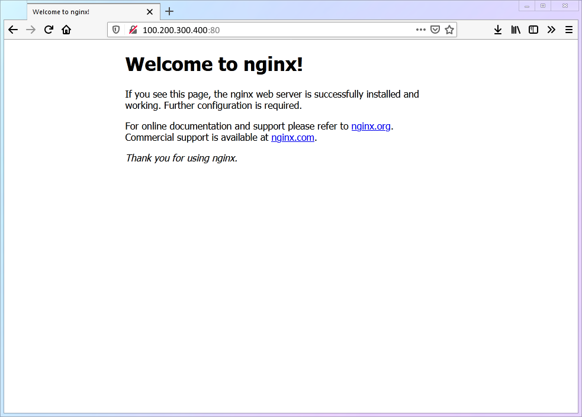
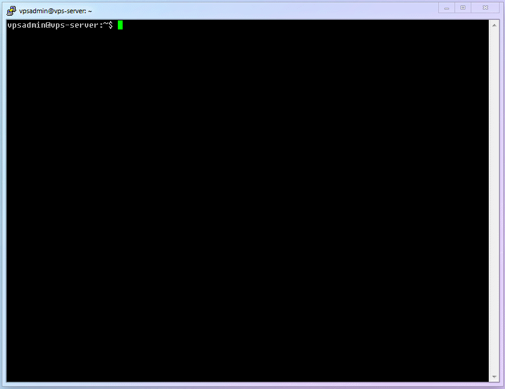
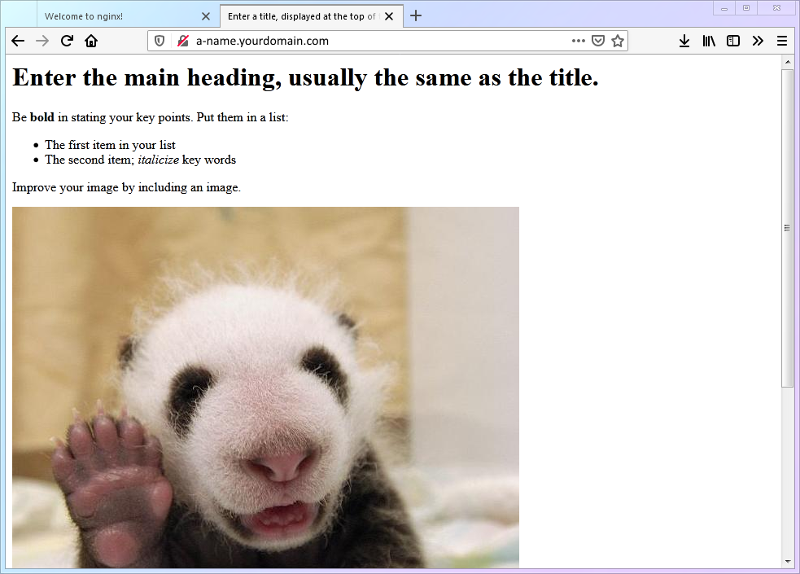

# 【第 5 章】网站建设篇

## 5.1 为什么要做一个网站？

新人也许会迷惑，为什么科学上网还要建一个网站？我不会编程啊，是不是特别麻烦？

先回答第一个问题，建网站的原因有：

1. 申请合法的 TLS 证书（非常重要）
2. 提供合理的回落，防止主动探测攻击，提高安全性
3. 建设一个伪装站（如博客、私人网盘、多媒体网站、游戏网站等），直接访问时有合理的前台，使流量使用看上去更合理。

再回答第二个问题：

1. 本文作为演示，仅仅使用了一个最简单的【单文件 html 页面 + Nginx】来搭建，以此完成上面的目标，所以【非常简单】
2. 这个网站完全可以不仅仅是伪装，而是真的做大做强，这个复杂性就完全取决于你了
3. 对于“伪装”和“网站运营”这个目标，需要的就是各不相同、秀出真我，需要的同学可以自行搜索学习。这个内容已经完全偏离了科学上网，本文就不深入解析了。

## 5.2 登录 VPS、安装运行 Nginx

1. 这里用到的，都是之前已经详解过的命令，所以就不重复讲解了。看不懂的同学可以看看前面的章节哦。

   ```shell
   sudo apt update && sudo apt install nginx
   ```

2. 完成后，Nginx 已经自动运行。此时打开 Windows 上的浏览器并输入 `http://100.200.300.400:80`，若看到下图的界面就说明 Nginx 已经正常在运行了。

   

3. 如果无法看到上述Nginx默认页面，可能是需要配置Debian系统上默认的防火墙组件Uncomplicated Firewall (UFW)，以便启用 HTTP (80) 和 HTTPS (443) 端口流量。

   a. 验证方法，输入：
   ```shell
   sudo ufw status
   ```
   b. 如果输出如下，表明80和433端口未开启，需要执行c步骤
   ```shell
   Status: active
   To                         Action      From
   --                         ------      ----
   22/tcp                     ALLOW       Anywhere
   22/tcp (v6)                ALLOW       Anywhere (v6)
   ```
   c. 启用UFW的Nginx 80 和 443 端口命令
   ```shell
   sudo ufw allow 'Nginx Full'
   ```
   d. 输入a中命令再次验证，如果输出如下，表示Nginx流量已经被防火墙放行，这样就应该可以看到前述第2点中的Nginx默认页面。
   ```shell
   Status: active
   To                         Action      From
   --                         ------      ----
   22/tcp                     ALLOW       Anywhere
   Nginx Full                 ALLOW       Anywhere
   22/tcp (v6)                ALLOW       Anywhere (v6)
   Nginx Full (v6)            ALLOW       Anywhere (v6)
   ```

   
## 5.3 创建一个最简单的网页

1. 小小白白 Linux 基础命令：
   | 编号 | 命令名称 | 命令说明 |
   |:--:|:--:|:--:|
   | `cmd-10` | `mkdir` | 新建文件夹 |
   | `cmd-11` | `systemctl reload` | 重新加载某个服务 |

2. 小小白白 Linux 基础配置文件：
   | 编号 | 配置文件位置 | 文件说明 |
   |:--:|:--:|:--:|
   | `conf-02` | `/etc/nginx/nginx.conf` | Nginx 程序设置 |

3. 创建一个网站专用的文件夹`/home/vpsadmin/www/webpage/`并建立网页文件`index.html`
   ```shell
   mkdir -p ~/www/webpage/ && nano ~/www/webpage/index.html
   ```

::: warning
如果你用的不是 `vpsadmin` 这个用户名，请务必理解这条命令中 `“~”` 符号的意义（这关系到【第 5 步】你要写的内容）：

- 如果是 【非 `root` 用户】，`“~”` 就等价于 `/home/用户名`
- 如果是 【 `root` 用户】，`“~”` 就等价于 `/root`
  :::

4. 把下面的内容完整的复制进去，然后保存(`ctrl+o`)退出(`ctrl+x`)

   ```html
   <html lang="">
     <!-- Text between angle brackets is an HTML tag and is not displayed.
           Most tags, such as the HTML and /HTML tags that surround the contents of
           a page, come in pairs; some tags, like HR, for a horizontal rule, stand
           alone. Comments, such as the text you're reading, are not displayed when
           the Web page is shown. The information between the HEAD and /HEAD tags is
           not displayed. The information between the BODY and /BODY tags is displayed.-->
     <head>
       <title>Enter a title, displayed at the top of the window.</title>
     </head>
     <!-- The information between the BODY and /BODY tags is displayed.-->
     <body>
       <h1>Enter the main heading, usually the same as the title.</h1>
       <p>Be <b>bold</b> in stating your key points. Put them in a list:</p>
       <ul>
         <li>The first item in your list</li>
         <li>The second item; <i>italicize</i> key words</li>
       </ul>
       <p>Improve your image by including an image.</p>
       <p>
         
       </p>
       <p>
         Add a link to your favorite
         <a href="https://www.dummies.com/">Web site</a>. Break up your page
         with a horizontal rule or two.
       </p>
       <hr />
       <p>
         Finally, link to <a href="page2.html">another page</a> in your own Web
         site.
       </p>
       <!-- And add a copyright notice.-->
       <p>&#169; Wiley Publishing, 2011</p>
     </body>
   </html>
   ```

   赋予其他用户读取该文件的权限

   ```shell
   chmod -R a+r .
   ```

6. 修改 `nginx.conf` 并重启 `Nginx` 服务，将`80`端口的 http 访问定位到刚才建立的 `html` 页面上

   1. 修改 `nginx.conf` 。

      ```shell
      sudo nano /etc/nginx/nginx.conf
      ```

   2. 将下面一段，添加在 `http{}` 内，然后保存(`ctrl+o`)退出(`ctrl+x`)。（记得将域名替换为之前准备好的、包含二级域名的真实域名）

      ```
              server {
                      listen 80;
                      server_name 二级域名.你的域名.com;
                      root /home/vpsadmin/www/webpage;
                      index index.html;
              }
      ```

      ::: warning 特别注意！
      如我在【第 3 步】中的提示所说，请务必确保 `/home/vpsadmin/www/webpage` 改成你的实际文件路径。
      :::

   3. 让 `nginx` 重新载入配置使其生效

      ```shell
      sudo systemctl reload nginx
      ```

   4. 完整的设置流程如下：

      

   5. 此时如果你访问 `http://二级域名.你的域名.com`，你看到这样的页面则说明成功：

      

## 5.4 常见错误的说明

首先，如果你一路按照文章的说明来操作，并且足够细心，那肯定不会出错。所以，我并不打算修改本文的写法。

那为什么依然有很多同学卡在了这一步，网页怎么也打不开呢？基本上就是两个字：**粗心**。因为这里配置可能出现的问题只有两种，原因也只有两个。

一、两种问题：

- `nginx.conf` 里面的 `/home/vpsadmin/www/webpage` 这一条，与你的实际文件路径不符，`nginx` 找不到文件
- 路径正确，但 `nginx` 无权读取

二、两个原因：

- 使用了【非 `root` 用户】，但仍然直接拷贝文中的命令不加修改。（这基本就等于抄答案时把同学的名字一起抄过去了）
- 坚持使用【 `root` 用户】

碰到错误的同学，就回过头仔细看一下【5.3】中【第 3 步】和【第 5-2 步】的说明吧。

::: warning
本文前期已经用了大量篇幅说明了使用【非 `root` 用户】对安全的重要性，全文也是基于此而写。所以，因使用【 `root` 用户】而导致的问题并不在本文的设计范围里。

但我相信，坚持使用【 `root` 用户】的同学应该是有主见、动手能力强、或者有一定 Linux 基础的同学。问题的症结我已经全部说明了，我相信你一定可以自行解决。
:::

## 5.5 你的进度

至此，Xray 的第一个基础设施【网页】已经就位，我们马上就进入第二个基础设施【证书】吧！

> ⬛⬛⬛⬛⬛⬜⬜⬜ 62.5%
