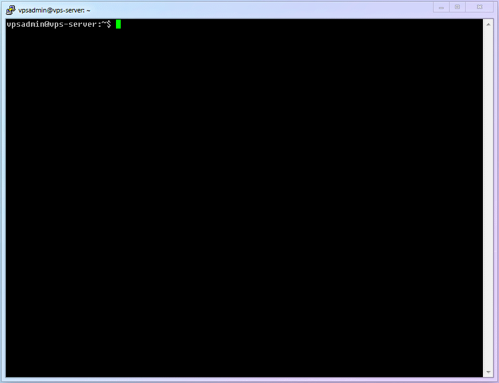

# 【第 6 章】证书管理篇

## 6.1 申请 TLS 证书

接下来我们要做的，是为我们的域名申请一个真实的 TLS 证书，使网站具备标准 TLS 加密的能力及 HTTPS 访问的能力。这就是 Xray 等现阶段安全代理工具确保流量充分加密最重要的工具。

::: warning 注意
请不要轻易使用自签证书。它并没有让操作简单太多，但增加了无谓的风险（如中间人攻击）。
:::

这里我会使用一个叫做 [`acme.sh`](https://github.com/acmesh-official/acme.sh) 的证书管理工具，它简单、轻量、高效，并可完成证书自动更新。

另外，我相信，现在你已经逐渐熟悉了 Linux 的基础操作，所以已经多次出现的命令从本章开始不再重复截图、只做简单的描述。如果实在想不起来怎么用的话，就稍微复习一下前面的章节吧。

## 6.2 安装 `acme.sh`

1. 小小白白 Linux 基础命令：
   | 编号 | 命令名称 | 命令说明 |
   |:--:|:--:|:--:|
   | `cmd-12` | `wget` | 访问（或下载）某个网页文件 |
   | `cmd-13` | `acme.sh` | acme.sh 证书管理相关的命令 |

2. 运行安装脚本

   ```
   $ wget -O -  https://get.acme.sh | sh
   ```

3. 让 `acme.sh` 命令生效

   ```
   $ . .bashrc
   ```

4. 开启 `acme.sh` 的自动升级

   ```
   $ acme.sh --upgrade --auto-upgrade
   ```

5. 到这一步的完整流程如下图：

   

## 6.3 测试证书申请

在正式申请证书之前，我们先用测试命令(`--issue --test`)来验证是否可以成功申请，这样可以避免在本地配置有误时，反复申请证书失败，超过 Let's Encrypt 的频率上限（比如，每小时、每个域名、每个用户失败最多 5 次），导致后面的步骤无法进行。

1. 测试证书申请的命令如下（本文均以 `ECC` 证书为例，因为时至今日，实在没什么理由不用它）：

   ```
   $ acme.sh --issue --test -d 二级域名.你的域名.com -w /home/vpsadmin/www/webpage --keylength ec-256
   ```

   ::: warning 说明
   `ECC`证书的主要优势在于它的 Keysize 更小，意味着同等大小下安全性的提升和加密解密速度的加快。如 ECC-256bit 的强度大约相当于 RSA-3072bit，何乐而不为呢？当然，有人说 ECC 证书握手会明显更快，这我觉得就有些夸张了，因为 RSA 握手也没有太慢，就算有差别应该也是毫秒级，很难直接感知。

   另外，如果有些网站确实需要兼容某些古老设备的，那也还是请按需选择`RSA`证书。
   :::

2. 你最终应该看到类似这样的提示：

   ```log
   [Wed 30 Dec 2022 04:25:12 AM EST] Using ACME_DIRECTORY: https://acme-staging-v02.api.letsencrypt.org/directory
   [Wed 30 Dec 2022 04:25:13 AM EST] Using CA: https://acme-staging-v02.api.letsencrypt.org/directory
   [Wed 30 Dec 2022 04:25:13 AM EST] Create account key ok.
   [Wed 30 Dec 2022 04:25:13 AM EST] Registering account: https://acme-staging-v02.api.letsencrypt.org/directory
   [Wed 30 Dec 2022 04:25:13 AM EST] Registered
   [Wed 30 Dec 2022 04:25:13 AM EST] ACCOUNT_THUMBPRINT='CU6qmPKuRqhyTAIrF4swosR375194z_1ddUlWef8xDc'
   [Wed 30 Dec 2022 04:25:13 AM EST] Creating domain key
   [Wed 30 Dec 2022 04:25:13 AM EST] The domain key is here: /home/vpsadmin/.acme.sh/二级域名.你的域名.com_ecc/二级域名.你的域名.com.key
   [Wed 30 Dec 2022 04:25:13 AM EST] Single domain='二级域名.你的域名.com'
   [Wed 30 Dec 2022 04:25:13 AM EST] Getting domain auth token for each domain
   [Wed 30 Dec 2022 04:25:14 AM EST] Getting webroot for domain='二级域名.你的域名.com'
   [Wed 30 Dec 2022 04:25:14 AM EST] Verifying: 二级域名.你的域名.com
   [Wed 30 Dec 2022 04:25:23 AM EST] Pending
   [Wed 30 Dec 2022 04:25:25 AM EST] Success
   [Wed 30 Dec 2022 04:25:25 AM EST] Verify finished, start to sign.
   [Wed 30 Dec 2022 04:25:25 AM EST] Lets finalize the order.
   [Wed 30 Dec 2022 04:25:25 AM EST] Le_OrderFinalize='https://acme-staging-v02.api.letsencrypt.org/acme/finalize/490205995/7730242871'
   [Wed 30 Dec 2022 04:25:25 AM EST] Downloading cert.
   [Wed 30 Dec 2022 04:25:25 AM EST] Le_LinkCert='https://acme-staging-v02.api.letsencrypt.org/acme/cert/xujss5xt8i38waubafz2xujss5xt8i38waubz2'
   [Wed 30 Dec 2022 15:21:52 AM EST] Cert success.
   --BEGIN CERTIFICAT--
   sxlYqPvWreKgD5b8JyOQX0Yg2MLoRUoDyqVkd31PthIiwzdckoh5eD3JU7ysYBtN
   cTFK4LGOfjqi8Ks87EVJdK9IaSAu7ZC6h5to0eqpJ5PLhaM3e6yJBbHmYA8w1Smp
   wAb3tdoHZ9ttUIm9CrSzvDBt6BBT6GqYdDamMyCYBLooMyDEM4CUFsOzCRrEqqvC
   2mTTEmhvpojo5rhdTSJxibozyNWTGwoTj0v9pTUeQcGqLIzqi4DowjBHD5guwRid
   SjAFnm6JT2xUQgWFm58A1gv1OhbH1TRPUUmtE1nFEN7YiSjI4xgxqAXT3CLD2EUb
   wXlUrO6c75zSsQP4bRMzgOjJUqHtSb6IEqELzt4M7KzL5iCOruCChCo2DZxUwvVX
   tOoaAyQJzCbTqE6aUqwiKi3gVyoxvDP9mI5JdRYzsDL6GVud7EHPnYeMl9ubLZAK
   0vg84mbMP3f6mYM4KRa1cqiyOIcQPT4AzGFYVv4sm049bZQg7sd0Bz9CaFvE7yDA
   1y17XlgCDnsjxl66bqI1vkENN9XT5xeFHONqc18b5fZEKSIvdX7iWPFWp1PyMPpG
   0pMCP1EymZNFxIMJLgbWqExwLWfPc5Ib3PjBaIqhXPnw6sT2MQSxXwDupq1UJVhV
   7E3hQRVlwI4CXi6WLHJMNvNRyyK87gCrLH1bKYsPeRVaz77poWBq49zwBCts6hPY
   IeF4ltGXyANNIOPEi8vy138fRU4LYh81d8FjOtFfJZogMjwhfNvapqxPMsioPlmX
   TnZu0n7setrVNUEfTMHWqPpDgk5MPrWLA4LapqaDfEX4pwnQJLMwMi6s94z165c0
   iMRSKA1yU5zqv8aNsDfPoY4OkSPWs4MaXgRRSLBsUfZ15DwQXPk76kegHIyxWvwF
   tYw9HKR5QCMK66fa0z4aJoFVFLK0IIOGEZOanRFUCnkLUDd3QZ3YU8lEcrj7Uxos
   haiRNICyC6UfsCJ94a8vcNyMosPv3xBLMp19WXgiFYqEFQkntkv1FLRI35fjeJmg
   0fmD9VG9bkzGPHihJgQLRlCHasGf6XrdfkSsODAyCUHUHJ0RzqF4YEZMcxDxzuQ2
   YO7bFwj7S3mUdVPZ6MPasjxdyBjJgEBMch2uy4AhmudXfEBQBye8W6ZI4ztZjLVV
   FmP4SIuaNUmMe20TjR8b9NVC96AhxOanWT3mRROsdokpKQGTJvl27EHH8KuAbUOc
   G6KtPy4wslNZNXWcBy9n63RcWak12r7kAIFn38tZxmlw2WUKoRSMAH64GcDTjRQd
   Am65hBHzvGrj93wEuVNIebvNIsJOlng3HFjpIxVqKGMCIfWIKGDE3YzK3p4LbGZ6
   NZFQWYJLNVf2M9CCJfbEImPYgvctrxl39H6KVYPCw1SAdaj9NneUqmREOQkKoEB0
   x6PmNirbMscHhQPSC0JQaqUgaQFgba1ALmzRYAnYhNb0twkTxWbY7DBkAarxqMIp
   yiLKcBFc5H7dgJCImo7us7aJeftC44uWkPIjw9AKH=
   --END CERTIFICAT--
   [Wed 30 Dec 2022 15:21:52 AM EST] Your cert is in  /home/vpsadmin/.acme.sh/二级域名.你的域名.com_ecc/二级域名.你的域名.com.cer
   [Wed 30 Dec 2022 15:21:52 AM EST] Your cert key is in  /home/vpsadmin/.acme.sh/二级域名.你的域名.com_ecc/二级域名.你的域名.com.key
   [Wed 30 Dec 2022 15:21:52 AM EST] The intermediate CA cert is in  /home/vpsadmin/.acme.sh/二级域名.你的域名.com_ecc/ca.cer
   [Wed 30 Dec 2022 15:21:52 AM EST] And the full chain certs is there:  /home/vpsadmin/.acme.sh/二级域名.你的域名.com_ecc/fullchain.cer
   ```

3. 注意：这里申请的是测试证书，没办法直接用的，只是用来证明你的域名、配置全都正确。仔细观察，你会发现给你发证书的域名是 `https://acme-staging-v02.api.letsencrypt.org`，这个 `staging` 你就理解成【测试服】吧！

4. 如果这一步出错的话，你可以运行下面的命令，来查看详细的申请过程和具体的错误。（看不懂就隐藏掉敏感信息后，去 Xray 群里问吧）

   ```
   $ acme.sh --issue --test -d 二级域名.你的域名.com -w /home/vpsadmin/www/webpage --keylength ec-256 --debug
   ```

   嗯没错，就是在命令的最后加了一个 `--debug` 参数

5. 这一步确定成功之后，就可以申请正式的证书了。（测试证书不需要删除，它会自动被正式证书覆盖）

## 6.4 正式证书申请

1. 申请正式证书的命令如下（即删掉 `--test` 参数，并在最后加入 `--force`参数）：

   ```
   $ acme.sh --issue -d 二级域名.你的域名.com -w /home/vpsadmin/www/webpage --keylength ec-256 --force
   ```

   ::: warning 说明
   `--force` 参数的意思就是，在现有证书到期前，手动（强行）更新证书。上一步我们从“测试服”申请的证书虽然不能直接用，但是它本身是尚未过期的，所以需要用到这个参数。
   :::

2. 你最终应该看到跟上面很像的提示：

   ```log
   vpsadmin@vps-server:~$ acme.sh --issue -d 二级域名.你的域名.com -w /home/vpsadmin/www/webpage --keylength ec-256
   [Wed 30 Dec 2022 15:22:51 AM EST] Using CA: https://acme-v02.api.letsencrypt.org/directory
   [Wed 30 Dec 2022 15:22:51 AM EST] Creating domain key
   [Wed 30 Dec 2022 15:22:51 AM EST] The domain key is here: /home/vpsadmin/.acme.sh/二级域名.你的域名.com_ecc/二级域名.你的域名.com.key
   [Wed 30 Dec 2022 15:22:51 AM EST] Single domain='二级域名.你的域名.com'
   [Wed 30 Dec 2022 15:22:51 AM EST] Getting domain auth token for each domain
   [Wed 30 Dec 2022 15:22:51 AM EST] Getting webroot for domain='二级域名.你的域名.com'
   [Wed 30 Dec 2022 15:22:51 AM EST] Verifying: 二级域名.你的域名.com
   [Wed 30 Dec 2022 15:22:51 AM EST] Pending
   [Wed 30 Dec 2022 15:22:51 AM EST] Success
   [Wed 30 Dec 2022 15:22:51 AM EST] Verify finished, start to sign.
   [Wed 30 Dec 2022 15:22:51 AM EST] Lets finalize the order.
   [Wed 30 Dec 2022 15:22:51 AM EST] Le_OrderFinalize='https://acme-v02.api.letsencrypt.org/acme/finalize/490205996/7730242872'
   [Wed 30 Dec 2022 15:22:51 AM EST] Downloading cert.
   [Wed 30 Dec 2022 15:22:51 AM EST] Le_LinkCert='https://acme-v02.api.letsencrypt.org/acme/cert/vsxvk0oldnuobe51ayxz4dms62sk2dwmw9zhuw'
   [Wed 30 Dec 2022 15:22:51 AM EST] Cert success.
   --BEGIN CERTIFICAT--
   sxlYqPvWreKgD5b8JyOQX0Yg2MLoRUoDyqVkd31PthIiwzdckoh5eD3JU7ysYBtN
   cTFK4LGOfjqi8Ks87EVJdK9IaSAu7ZC6h5to0eqpJ5PLhaM3e6yJBbHmYA8w1Smp
   wAb3tdoHZ9ttUIm9CrSzvDBt6BBT6GqYdDamMyCYBLooMyDEM4CUFsOzCRrEqqvC
   2mTTEmhvpojo5rhdTSJxibozyNWTGwoTj0v9pTUeQcGqLIzqi4DowjBHD5guwRid
   SjAFnm6JT2xUQgWFm58A1gv1OhbH1TRPUUmtE1nFEN7YiSjI4xgxqAXT3CLD2EUb
   wXlUrO6c75zSsQP4bRMzgOjJUqHtSb6IEqELzt4M7KzL5iCOruCChCo2DZxUwvVX
   tOoaAyQJzCbTqE6aUqwiKi3gVyoxvDP9mI5JdRYzsDL6GVud7EHPnYeMl9ubLZAK
   0vg84mbMP3f6mYM4KRa1cqiyOIcQPT4AzGFYVv4sm049bZQg7sd0Bz9CaFvE7yDA
   1y17XlgCDnsjxl66bqI1vkENN9XT5xeFHONqc18b5fZEKSIvdX7iWPFWp1PyMPpG
   0pMCP1EymZNFxIMJLgbWqExwLWfPc5Ib3PjBaIqhXPnw6sT2MQSxXwDupq1UJVhV
   7E3hQRVlwI4CXi6WLHJMNvNRyyK87gCrLH1bKYsPeRVaz77poWBq49zwBCts6hPY
   IeF4ltGXyANNIOPEi8vy138fRU4LYh81d8FjOtFfJZogMjwhfNvapqxPMsioPlmX
   TnZu0n7setrVNUEfTMHWqPpDgk5MPrWLA4LapqaDfEX4pwnQJLMwMi6s94z165c0
   iMRSKA1yU5zqv8aNsDfPoY4OkSPWs4MaXgRRSLBsUfZ15DwQXPk76kegHIyxWvwF
   tYw9HKR5QCMK66fa0z4aJoFVFLK0IIOGEZOanRFUCnkLUDd3QZ3YU8lEcrj7Uxos
   haiRNICyC6UfsCJ94a8vcNyMosPv3xBLMp19WXgiFYqEFQkntkv1FLRI35fjeJmg
   0fmD9VG9bkzGPHihJgQLRlCHasGf6XrdfkSsODAyCUHUHJ0RzqF4YEZMcxDxzuQ2
   YO7bFwj7S3mUdVPZ6MPasjxdyBjJgEBMch2uy4AhmudXfEBQBye8W6ZI4ztZjLVV
   FmP4SIuaNUmMe20TjR8b9NVC96AhxOanWT3mRROsdokpKQGTJvl27EHH8KuAbUOc
   G6KtPy4wslNZNXWcBy9n63RcWak12r7kAIFn38tZxmlw2WUKoRSMAH64GcDTjRQd
   Am65hBHzvGrj93wEuVNIebvNIsJOlng3HFjpIxVqKGMCIfWIKGDE3YzK3p4LbGZ6
   NZFQWYJLNVf2M9CCJfbEImPYgvctrxl39H6KVYPCw1SAdaj9NneUqmREOQkKoEB0
   x6PmNirbMscHhQPSC0JQaqUgaQFgba1ALmzRYAnYhNb0twkTxWbY7DBkAarxqMIp
   yiLKcBFc5H7dgJCImo7us7aJeftC44uWkPM=
   --END CERTIFICAT--
   [Wed 30 Dec 2022 15:22:52 AM EST] Your cert is in  /home/vpsadmin/.acme.sh/二级域名.你的域名.com_ecc/二级域名.你的域名.com.cer
   [Wed 30 Dec 2022 15:22:52 AM EST] Your cert key is in  /home/vpsadmin/.acme.sh/二级域名.你的域名.com_ecc/二级域名.你的域名.com.key
   [Wed 30 Dec 2022 15:22:52 AM EST] The intermediate CA cert is in  /home/vpsadmin/.acme.sh/二级域名.你的域名.com_ecc/ca.cer
   [Wed 30 Dec 2022 15:22:52 AM EST] And the full chain certs is there:  /home/vpsadmin/.acme.sh/二级域名.你的域名.com_ecc/fullchain.cer
   ```

3. 仔细观察，你会发现这次给你发证书的域名是 `https://acme-v02.api.letsencrypt.org`，少了 `staging`，自然就是【正式服】了！

## 6.5 你的进度

至此，Xray 所需要的两个基础设施终于全部就位！千呼万唤始出来的 Xray 马上就要揭开面纱，我们终于要进入最激动人心章节啦！

> ⬛⬛⬛⬛⬛⬛⬜⬜ 75%
