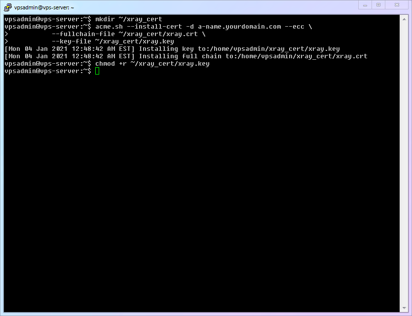
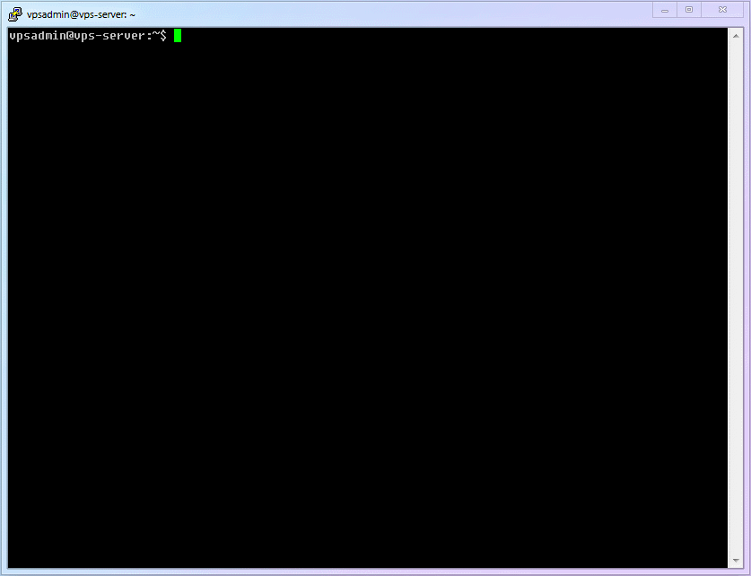
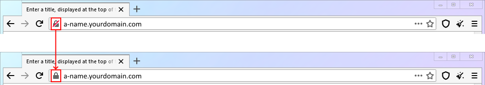

# 【第 7 章】Xray 服务器篇

## 7.1 博观而约取，厚积而薄发

本文撰写过程中，大佬开玩笑的吐槽到：你这教程，居然连载了 6 章都还没到 Xray，不知道的还以为你是“手把手教你建网站”教程呢。（我竟无法反驳.jpg!）

其实这样的结构是我多番思考之后的决定，毕竟只有打好基础，才能在后面事半功倍快速反超。我在群里看到许多新人连`nano`都无法正确使用，也不会用`WinSCP`，远程手写编辑出来的`config.json`自然错误百出，连查错也变得举步维艰。

::: warning
经过了前 6 章的准备，各位已经跟我一起翻越了 Linux 基本操作、VPS 远程管理、网页搭建、域名管理、证书申请等等几座大山。是不是回头看看，觉得其实非常简单呢？现在我们有了如此扎实的准备，接下来安装和配置 Xray
时会有一种【水到渠成】的轻快感觉。
:::

后面要做的事情非常简单：

1. 安装
2. 配置（如安装 TLS 证书、`config.json`）
3. 运行
4. 优化（如更新内核、开启`bbr`、网站`http`访问自动跳转`https`等）

## 7.2 安装 Xray

首先，Xray 的官方载体，就是 [xray-core](https://github.com/XTLS/Xray-core) 开源项目（基于 `MPL 2.0`
开源协议）生成的二进制程序。你把这个二进制放在服务器运行，它就是服务器端；你把它下载到本地电脑运行，它就是客户端。主要区别来源于【配置】。

安装时，直接使用官方安装脚本就很简单直接。它提供了多种安装选项，有兴趣的可以去官方的[安装脚本仓库](https://github.com/XTLS/Xray-install)中看看脚本的说明，**本文使用的是【非 root
用户】安装模式**。

写本文时，安装脚本在使用非 root 账户时有一些小 bug，所以我决定正好把这几步分开操作，可以顺便说明一下 Linux 下的删除命令。

1. 小小白白 Linux 基础命令：

   |   编号   | 命令名称 | 命令说明 |
   | :------: | :------: | :------: |
   | `cmd-14` |   `rm`   | 删除命令 |

2. 将安装脚本下载至本地：

   ```shell
   wget https://github.com/XTLS/Xray-install/raw/main/install-release.sh
   ```

3. 执行安装命令

   ```shell
   sudo bash install-release.sh
   ```

4. 使用完成之后可以删除该脚本

   ```shell
   rm ~/install-release.sh
   ```

   ::: warning
   使用 `rm` 命令删除文件的时候，默认其实就是删除现在所在的文件夹下的文件。但是，**我依然写了完整的路径**： `~/install-release.sh`，这是我使用 `rm` 时的一个安全习惯、也是我把安装分成几步之后想强调一下的内容。如果你听过一些“程序员从删库到跑路”之类的段子，大概就知道为什么了。
   :::

5. 完整流程演示如下：

   

## 7.3 给 Xray 配置 TLS 证书

虽然我们前面已经申请好了 TLS
证书，但是按照 [`acme.sh`的官方说明](https://github.com/acmesh-official/acme.sh/wiki/%E8%AF%B4%E6%98%8E#3-copy%E5%AE%89%E8%A3%85-%E8%AF%81%E4%B9%A6)，申请后的证书不建议直接使用。正确的方法是使用 `--install-cert`
命令安装给需要的程序。我们现在就来把证书安装给 `xray-core` 使用。

1. 为了规避非 root 账户的各种潜在的权限困扰，我们在 vpsadmin 账户下建立一个证书文件夹

   ```shell
   mkdir ~/xray_cert
   ```

2. 使用`acme.sh`的`--install-cert`正确安装（拷贝）证书文件

   ```shell
   acme.sh --install-cert -d 二级域名.你的域名.com --ecc \
               --fullchain-file ~/xray_cert/xray.crt \
               --key-file ~/xray_cert/xray.key
   ```

3. `xray.key`文件默认对其他用户不可读，所以需要赋予其可读性权限

   ```shell
   chmod +r ~/xray_cert/xray.key
   ```

4. 过程比较简单就不放动图了：

   

5. `acme.sh` 会每 60 天检查一次证书并自动更新临期证书。但据我所知是它并不会自动将新证书安装给 `xray-core`，所以我们需要新增一个系统的自动周期任务来完成这一步。

   1. 小小白白 Linux 基础命令：

   |   编号   |   命令名称   |        命令说明        |
   | :------: | :----------: | :--------------------: |
   | `cmd-15` | `crontab -e` | 编辑当前用户的定时任务 |

   2. 建立一个脚本文件（`xray-cert-renew.sh`）

      ```shell
      nano ~/xray_cert/xray-cert-renew.sh
      ```

   3. 把下面的内容复制进去，记得替换你的真实域名，然后保存退出

      ```bash
      #!/bin/bash

      /home/vpsadmin/.acme.sh/acme.sh --install-cert -d a-name.yourdomain.com --ecc --fullchain-file /home/vpsadmin/xray_cert/xray.crt --key-file /home/vpsadmin/xray_cert/xray.key
      echo "Xray Certificates Renewed"

      chmod +r /home/vpsadmin/xray_cert/xray.key
      echo "Read Permission Granted for Private Key"

      sudo systemctl restart xray
      echo "Xray Restarted"
      ```

      ::: warning
      经大家提醒，`acme.sh` 有一个 `reloadcmd` 命令，可以在证书更新时自动执行特定命令，那么就可以指定自动给 `Xray` 安装证书，但因为 `crontab` 是 Linux
      系统中一个非常有用、非常常用的功能，所以本文保留 `crontab` 的方式来更新 `Xray` 证书。（对 `reloadcmd` 感兴趣的同学可以查看 `acme.sh`
      的[官方文档](https://github.com/acmesh-official/acme.sh)）

      另外，录制动图时，脚本中没有加入重启 `Xray` 的命令，是因为 `Xray` 计划支持【证书热更新】功能，即 `Xray` 会自动识别证书更新并重载证书、无需手动重启。待功能加入后，我将适当修改 `config.json`
      开启此设置，并删除脚本中的重启命令。
      :::

   4. 给这个文件增加【可执行】权限

      ```
      chmod +x ~/xray_cert/xray-cert-renew.sh
      ```

   5. 运行 `crontab -e`，添加一个自动任务【每月自动运行一次`xray-cert-renew.sh`】 (注意不要加`sudo`，因为我们增加的是`vpsadmin`
      账户的自动任务。初次运行时会让你选择编辑器，当然是选择熟悉的`nano`啦！)

      ```shell
      crontab -e
      ```

   6. 把下面的内容增加在文件最后，保存退出即可。

      ```
      # 1:00am, 1st day each month, run `xray-cert-renew.sh`
      0 1 1 * *   bash /home/vpsadmin/xray_cert/xray-cert-renew.sh
      ```

   7. 完整流程演示如下：

      

## 7.4 配置 Xray

首先，各种配置都可以参考[官方 VLESS 配置示例](https://github.com/XTLS/Xray-examples)。本文会基于官方示例，配置一个最精简的方式：【单 `VLESS` 协议入站 + `80`
端口回落】，满足大多数场景的最大速度及必要安全。

1.  生成一个合法的 `UUID` 并保存备用（`UUID`可以简单粗暴的理解为像指纹一样几乎不会重复的 ID）

    ```shell
    xray uuid
    ```

2.  建立日志文件及文件夹备用

    1. 小小白白 Linux 基础命令：
       | 编号 | 命令名称 | 命令说明 |
       |:--:|:--:|:--:|
       | `cmd-16` | `touch` | 建立空白文件 |

    2. 在`vpsadmin`的文件夹内建立一个【日志专用文件夹】

       ```shell
       mkdir ~/xray_log
       ```

    3. 生成所需的两个日志文件（访问日志、错误日志）

       ```shell
       touch ~/xray_log/access.log && touch ~/xray_log/error.log
       ```

       ::: warning
       这个位置不是`Xray`标准的日志文件位置，放在这里是避免权限问题对新人的操作带来困扰。当你熟悉之后，建议回归默认位置： `/var/log/xray/access.log`
       和 `/var/log/xray/error.log` 。
       :::

    4. 因为 Xray 默认是 nobody 用户使用，所以我们需要让其他用户也有“写”的权限（`*.log` 就是所有文件后缀是`log`的文件，此时`CLI`界面的效率优势就逐渐出现了）
       ```shell
       chmod a+w ~/xray_log/*.log
       ```

3.  使用`nano`创建`Xray`的配置文件

    ```shell
    sudo nano /usr/local/etc/xray/config.json
    ```

4.  将下面的文件全部复制进去，并将之前生成的`UUID`填入第 61 行 `"id": "",` 之中。（填好之后的样子是 `"id": "uuiduuid-uuid-uuid-uuid-uuiduuiduuid"`
    ），本文的这个配置文件中增加了我的各种啰嗦注解，以方便你理解每一个配置模块的功能是什么。

    ```json
    // REFERENCE:
    // https://github.com/XTLS/Xray-examples
    // https://xtls.github.io/config/
    // 常用的 config 文件，不论服务器端还是客户端，都有 5 个部分。外加小小白解读：
    // ┌─ 1*log 日志设置 - 日志写什么，写哪里（出错时有据可查）
    // ├─ 2_dns DNS-设置 - DNS 怎么查（防 DNS 污染、防偷窥、避免国内外站匹配到国外服务器等）
    // ├─ 3_routing 分流设置 - 流量怎么分类处理（是否过滤广告、是否国内外分流）
    // ├─ 4_inbounds 入站设置 - 什么流量可以流入 Xray
    // └─ 5_outbounds 出站设置 - 流出 Xray 的流量往哪里去
    {
      // 1\_日志设置
      "log": {
        "loglevel": "warning", // 内容从少到多: "none", "error", "warning", "info", "debug"
        "access": "/home/vpsadmin/xray_log/access.log", // 访问记录
        "error": "/home/vpsadmin/xray_log/error.log" // 错误记录
      },
      // 2_DNS 设置
      "dns": {
        "servers": [
          "https+local://1.1.1.1/dns-query", // 首选 1.1.1.1 的 DoH 查询，牺牲速度但可防止 ISP 偷窥
          "localhost"
        ]
      },
      // 3*分流设置
      "routing": {
        "domainStrategy": "IPIfNonMatch",
        "rules": [
          // 3.1 防止服务器本地流转问题：如内网被攻击或滥用、错误的本地回环等
          {
            "type": "field",
            "ip": [
              "geoip:private" // 分流条件：geoip 文件内，名为"private"的规则（本地）
            ],
            "outboundTag": "block" // 分流策略：交给出站"block"处理（黑洞屏蔽）
          },
          {
            // 3.2 防止服务器直连国内
            "type": "field",
            "ip": ["geoip:cn"],
            "outboundTag": "block"
          },
          // 3.3 屏蔽广告
          {
            "type": "field",
            "domain": [
              "geosite:category-ads-all" // 分流条件：geosite 文件内，名为"category-ads-all"的规则（各种广告域名）
            ],
            "outboundTag": "block" // 分流策略：交给出站"block"处理（黑洞屏蔽）
          }
        ]
      },
      // 4*入站设置
      // 4.1 这里只写了一个最简单的 vless+xtls 的入站，因为这是 Xray 最强大的模式。如有其他需要，请根据模版自行添加。
      "inbounds": [
        {
          "port": 443,
          "protocol": "vless",
          "settings": {
            "clients": [
              {
                "id": "", // 填写你的 UUID
                "flow": "xtls-rprx-vision",
                "level": 0,
                "email": "vpsadmin@yourdomain.com"
              }
            ],
            "decryption": "none",
            "fallbacks": [
              {
                "dest": 80 // 默认回落到防探测的代理
              }
            ]
          },
          "streamSettings": {
            "network": "tcp",
            "security": "tls",
            "tlsSettings": {
              "alpn": "http/1.1",
              "certificates": [
                {
                  "certificateFile": "/home/vpsadmin/xray_cert/xray.crt",
                  "keyFile": "/home/vpsadmin/xray_cert/xray.key"
                }
              ]
            }
          }
        }
      ],
      // 5*出站设置
      "outbounds": [
        // 5.1 第一个出站是默认规则，freedom 就是对外直连（vps 已经是外网，所以直连）
        {
          "tag": "direct",
          "protocol": "freedom"
        },
        // 5.2 屏蔽规则，blackhole 协议就是把流量导入到黑洞里（屏蔽）
        {
          "tag": "block",
          "protocol": "blackhole"
        }
      ]
    }
    ```

5) 完整流程演示如下：
   

## 7.5 启动 Xray 服务！！（并查看服务状态）

如果你是跟随本文一步步设置过来，其实就已经避开了最常见**日志文件权限不足**、**证书文件权限不足** 这两个大坑。那么现在运行`Xray`自然应该无比顺利。

1. 输入下面的命令，享受启动`Xray`的历史性时刻吧！！！

```shell
sudo systemctl start xray
```

2. 仅仅`start`我们并不能确定是否成功的开启了 Xray 的服务，要确定它的状态，就要用到下面的命令。

```shell
sudo systemctl status xray

```

看到那个绿色的、令人愉悦的 `active (running)` 了吗？它就是说 `Xray` 已经在正确的运行了

3. 完整流程演示如下：


## 7.6 回顾 `systemd` 进行基本的服务管理

到现在为止，我们已经使用过了`systemctl`相关的`start`, `status`, `reload` 等命令，这些都是基于`systemd`管理模块对 Linux
系统中各种服务进行管理的通用命令。现在正好熟悉一下相关的其他几个命令。

1. 若你需要暂时关闭 `Xray` 的服务，那就用`stop`命令

```shell
sudo systemctl stop xray
```

2. 若你需要重启`Xray`的服务，那就用`restart`命令

```shell
sudo systemctl restart xray
```

3. 若你需要禁用`Xray`的服务（电脑重启后禁止 Xray 自动运行），那就用`disable`命令

```shell
sudo systemctl disable xray
```

4. 若你需要启用`Xray`的服务（电脑重启后确保 Xray 自动运行），那就用`enable`命令

```shell
sudo systemctl enable xray
```

## 7.7 服务器优化之一：开启 BBR

1. 传说中的`BBR`

我相信，你在搜索各种科学上网技术的时候，肯定不止一次的听过`bbr`这个东西，在各种博客添油加醋之下，让人觉得它神乎其神。更有`bbrplus`, `bbr2`, `魔改bbr` 等一大堆衍生品。仿佛神油一般，用了就能野鸡线路变专线。

那么，这东西究竟是什么？它有没有用？又该用哪一个版本呢？

2. 实际的`BBR`

**BBR** = **B**ottleneck **B**andwidth and **R**ound-trip propagation time，是一种 TCP 的**拥塞控制算法**。简单粗暴的理解就是**数据流量的交通管理**
：当公路不再塞车的时候，每辆车自然就能保持较快的车速了。

那么它有没有用呢？一般而言，`有BBR` 和 `没有BBR` 会有可以感知的差别（速度、稳定性、延迟方面都会有一些改善），所以 **【非常建议开启 `BBR`】**。

但开启之后，`BBR` 在 `4.x` 和 `5.x` 之间的差异往往比较微妙、见仁见智，造成体验差别的决定性因素仍然是线路质量。所以 **【不必纠结版本、不必盲目追新、跟随你的发行版更新内核即可】**

3. `bbrplus`, `bbr2`, `魔改bbr` 和其他各种听起来就酷炫的版本是不是更好？

一句话：**不是！不要用这些！这些都为了吸引眼球乱起的名字！**

`BBR` 的更新和发布，都是跟随 Linux 的内核（`Kernel`）进行的。换言之，只要你用的是比较新的内核，就自然会使用到新版`BBR`。

而这些名字看起来很酷炫的东西，说白了就是仍未正式发布的、尚在测试阶段的内核及其对应的`BBR`版本。这些脚本也仅仅就是通过下载预览版的内核（甚至第三方魔改内核）来率先开启而已。

内核的稳定是一台服务器稳定运行的基石。**【BBR 测试版带来的细微性能差异绝对不值得更换不稳定的内核。】** 请选择你所在的 Linux 发行版所支持的最新内核，这样可以最大限度的保持服务器的长期稳定和兼容。

::: warning
所谓魔改`bbr`的【领先】是有非常强的时效性的。比如很多 `bbrplus` 脚本，因为几年来都没有更新，到现在还会把你的内核换成 `4.19`，要知道现在稳定如 Debian 已经是 `5.9`
的时代了，那么这个脚本放在 2018 年 1 月也许领先了一点，到 2018 年 10 月 4.19 正发布时就已经失去了意义，放在现在甚至可以说是完完全全的【降级】和【劣化】
:::

4. `fq`, `fq_codel`, `fq_pie`, `cake`和其他算法哪个好？

一句话：**看不懂的话，请保持`fq`，足够、且不会劣化你的线路**

5. 锐速、Finalspeed、LotServer 和其他“加速工具”

一句话：**不要用这些！把他们丢进历史的垃圾桶吧！**

它能解决的也只有丢包率的问题。不太准确的比喻，就是本来你用一辆车送你的货，有时候车半路就坏了（丢包），用了这些以后，你直接派出 3
份一样的货，让三辆车同时送，只要有一辆没坏就能送到。马路上都是你的车，自然就能把别人挤下去。但可想而知，你挤别人的时候，别人也会来挤你，而整个机房的出口道路一共就那么宽，最终势必就变成集体大堵车了。

::: warning 说明
它们的原理不是算法优化、不是提速、大多数是简单粗暴的**多倍发包**。对于【丢包率非常高】的差线路可能有一点作用，但【对丢包率低的好线路没有任何优化作用，反而会成倍的消耗你的流量】，进而造成服务器和你的邻居不必要的压力。

如果你的线路真的丢包率奇高，真正靠谱的解决方案是【换线路】。
:::

6. 啰嗦了这么多，就是因为围绕 `BBR` 忽悠小白的错误概念和坑人脚本实在是太多了。我希望你们现在对 `BBR` 有了相对清晰的理解。接下来，我们就动手安装最新的 Debian 内核并开启`BBR` 吧！（真的很简单）

1. 给 Debian 10 添加官方 `backports` 源，获取更新的软件库

```shell
sudo nano /etc/apt/sources.list
```

::: warning 说明
本文以 Debian 10 为例，所以使用 `/etc/apt/sources.list` 仍无问题，但如果你并不是根据本文从头开始，或者使用了其他 Linux
发行版，那么建议你建立 `/etc/apt/sources.list.d/` 文件夹，并在这个文件夹内建立自己的配置文件，形如 `/etc/apt/sources.list.d/vpsadmin.list`
，以此保证兼容性，也可避免默认文件在不可预见的情况下被覆盖而导致配置丢失。
:::

2.  然后把下面这一条加在最后，并保存退出。

```
deb http://archive.debian.org/debian buster-backports main
```

3.  刷新软件库并查询 Debian 官方的最新版内核并安装。请务必安装你的 VPS 对应的版本（本文以比较常见的【amd64】为例）。

```shell
sudo apt update && sudo apt -t buster-backports install linux-image-amd64
```

::: warning 注意

如果你的 VPS 支持，可以尝试【云服务器专用内核】`linux-image-cloud-amd64`，优点就是精简、资源占用低，缺点嘛是有同学反馈不支持的系统强行安装会导致无法开机（Kernel 无法识别）。

为了避免无法识别的悲剧，请确保：

- 尝试前做一个系统快照，或者
- 你有 `vnc` 可以救场（并且你知道怎么用）

:::

4.  修改 `kernel` 参数配置文件 `sysctl.conf` 并指定开启 `BBR`

```shell
sudo nano /etc/sysctl.conf
```

::: warning 说明
本文以 Debian 10 为例，所以使用 `/etc/sysctl.conf` 仍无问题，但如果你并不是跟着本文从头开始，或者使用了其他 Linux 发行版，那么建议你建立 `/etc/sysctl.d/`
文件夹，并在这个文件夹内建立自己的配置文件，形如 `/etc/sysctl.d/vpsadmin.conf`，以此保证兼容性，因为部分发行版在 `systemd`
207 版本之后便不再从 `/etc/sysctl.conf` 读取参数。使用自定义配置文件也可避免默认文件在不可预见的情况下被覆盖而导致配置丢失。
:::

5.  把下面的内容添加进去

```
net.core.default_qdisc=fq
net.ipv4.tcp_congestion_control=bbr
```

6.  重启 VPS、使内核更新和`BBR`设置都生效

```shell
sudo reboot
```

7.  完整流程演示如下：

::: tip 啰嗦君
因为我做展示的 VPS 支持云服务器专用内核，所以动图中我用了 `linux-image-cloud-amd64`
。如果你不确定你的 VPS 是否支持，那请务必按照第 3 步的命令，使用常规内核 `linux-image-amd64`。
:::


8.  确认`BBR`开启

如果你想确认 `BBR` 是否正确开启，可以使用下面的命令：

```shell
lsmod | grep bbr
```

此时应该返回这样的结果：

```
tcp_bbr
```

如果你想确认 `fq` 算法是否正确开启，可以使用下面的命令：

```shell
lsmod | grep fq
```

此时应该返回这样的结果：

```
sch_fq
```

## 7.8 服务器优化之二：开启 HTTP 自动跳转 HTTPS

1. 之前我们已经搭建了 `80` 端口的 `http` 网页，并以此申请了 TLS 证书。

但如果你尝试过用浏览器访问我们的这个界面，就会发现 `http` 访问并不会像大多数网站一样自动升级为 `https` 访问。换言之，我们现在的设置下，`http(80)` 和 `https(443)`
之间完全是独立的。如果要解决这个问题，就需要做一些修改。

2. 编辑 Nginx 的配置文件

```shell
sudo nano /etc/nginx/nginx.conf
```

3. 在我们设置过的 80 端口 Server 中加入下面的语句，并保存退出（可同时删除`root`和`index`两行）

```
return 301 https://$http_host$request_uri;
```

4. 在与 `80` 端口同级的位置增加一个本地端口监听来提供网页展示。本文以 `8080` 端口做演示。（可以是任意端口）

```
server {
   listen 127.0.0.1:8080;
   root /home/vpsadmin/www/webpage;
   index index.html;
   add_header Strict-Transport-Security "max-age=63072000" always;
}
```

5. 重启 Nginx 服务

```shell
sudo systemctl restart nginx
```

6. 修改 Xray 的回落设置，将回落从 `80` 端口改为 `8080` 端口。（找到 `"dest": 80`, 并改成 `"dest": 8080`）

```shell
sudo nano /usr/local/etc/xray/config.json
```

7. 重启 `Xray` 服务，即完成了设置

```shell
sudo systemctl restart xray
```

8. 完整流程演示如下：


9. 当你输入 `http://a-name.yourdomain.com`的时候，它应该已经会自动跳转 https 了



## 7.9 服务器优化之三：更丰富的回落

如果你需要更丰富的回落功能，可以参考 [《回落 (fallbacks) 功能简析》](../level-1/fallbacks-lv1/)

## 7.10 你的进度

恭喜！！到这一步，你已经拥有了可以正常科学上网的服务器、同时也有了可以防止主动探测攻击的伪装网站。接下来，只要给你的客户端装上合适的软件，就可以享受顺畅的网络了！

> ⬛⬛⬛⬛⬛⬛⬛⬜ 87.5%

## 7.11 重要勘误

1. 初版中`Xray`配置文件`config.json`文件夹位置错误。若你已经根据之前的位置进行了操作，`Xray`会无法正确启动。故勘误说明于此，请自查，造成不便十分抱歉！

- 正确位置：`/usr/local/etc/xray/config.json`
- 错误位置：`/usr/local/etc/config.json`

受影响章节：

- 7.4 配置`Xray` - 3. 使用`nano`创建`Xray`的配置文件
- 7.8 服务器优化之二 - 6. 修改`Xray`的回落设置

2. 初版中修改`Nginx`配置文件`nginx.conf`时内容错误（网页文件夹位置错误），若你已经根据之前的位置进行了操作，`Nginx`会无法找到正确的网站。请自查，造成不便十分抱歉！

- 正确文件夹位置：`root /home/vpsadmin/www/webpage;`
- 错误文件夹位置：`root /var/www/website/html`

受影响章节：

- 7.8 服务器优化之二 - 4. 在与 `80` 端口同级的位置增加一个本地端口监听来提供网页展示
