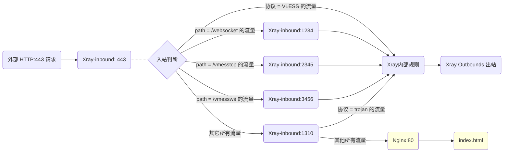

# 回落 (fallbacks) 功能简析

在使用 Xray 的过程中，你一定无数次的听说了【回落】这个功能。本文就稍微说明一下这个功能的逻辑以及使用方式。

## 1. 回顾《小小白白话文》中的回落

如果你用了《小小白白话文》中的[Xray 配置](../level-0/ch07-xray-server.md#_7-4-配置xray)，并完成了[HTTP 自动跳转 HTTPS 优化](../level-0/ch07-xray-server.md#_7-8-服务器优化之二-开启http自动跳转https)，那么你已经有了基于 `VLESS` 协议的简易回落：

```json
{
  "inbounds": [
    {
      "port": 443,
      "protocol": "vless",
      "settings": {
        "clients": [
          // ... ...
        ],
        "decryption": "none",
        "fallbacks": [
          {
            "dest": 8080 // 默认回落到防探测的代理
          }
        ]
      },
      "streamSettings": {
        // ... ...
      }
    }
  ]
}
```

这一段配置用人话要怎么解释呢？

1. **`Xray` 的入站端口 `[inbound port]` 是 `443`**

   即由 `Xray` 负责监听 `443` 端口的 `HTTPS` 流量

2. **`Xray` 的入站协议 `[inbound protocol]` 是 `vless`**

   只有 `vless` 协议的流量才会流入 `Xray` 中做后续处理。

   ::: warning
   **注：** `VLESS` 这个轻量协议开发的初衷就是给 `xray` 及 `v2fly` 等核心引入回落功能、并同时减少冗余校验/加密。（当然，到目前为止，`xray` 中的 `trojan` 协议也已完整支持回落功能。）
   :::

3. **回落目标端口 `[fallback dest]` 是 `8080`**

   `Xray` 接受 `443` 端口的访问流量后，属于 `vless` 协议的流量、由 `Xray` 进行内部处理并转发至出站模块。而其他非 `vless` 协议的流量，则转发至 `8080` 端口。

   ::: warning
   **问：到底是单数还是复数？**

   答：一定有聪明的同学发现，配置文件中，明明是复数 `inbounds`, `fallbacks`，为什么我解释的时候都是单数：`inbound`, `fallback` 呢？

   因为，配置文件中用复数，说明 `xray` 支持 N 个同等级的元素（即 N 个入站，M 个回落等等），上面的示例解析中仅仅是其中一个，所以我用了单数。
   :::

4. **回落给 `8080` 端口的流量，由后续程序处理**

   小小白白话文中的示例，就是 `8080` 端口由 `Nginx` 处理，根据配置找到并展示小熊猫的网页。

5. **总结，小小白白话文示例中的最简单回落，完整数据路线如下：**

   ```mermaid
   graph LR;

   W(外部 HTTP:80 请求) --> N80(HTTP:80)

   subgraph Nginx 外部监听
   N80 -.- N301(301转写) -.- N443(HTTPS:443)
   end

   N443 --> X(Xray 监听 443) .- X1{入站判断}
   X1 --> |接收 VLESS 流量| X2(Xray内部规则)
   X2 --> O(Xray Outbounds 出站)
   X1 ==> |回落 非VLESS 流量| N8080(Nginx:8080)
   N8080:::nginxclass ==> H(index.html)

   H:::nginxclass
   classDef nginxclass fill:#FFFFDE

   ```

## 2. 重新认识回落 (WHAT, HOW `v1`)

基于上面的示例，你应该就可以明白什么是回落（What）和怎么回落（How）了，简单地说就是下面这几个要素：

1. 回落的时间是流量进入 `Xray监听端口` 后
2. 回落的依据是 `协议类型` 等流量特征
3. 回落的目标是某个 `端口`
4. 被回落的流量由监听 `回落端口` 的后续程序接手

## 3. 为什么要回落 (WHY `v1`)

最初，是为了防御 **【主动探测】** (Active Probing)

**主动探测：** 简单粗暴的理解，就是指外部通过发送特定的网络请求，并解读服务器的回应内容，来推测服务器端是否运行了 `xray`, `v2fly`, `shadowsocks` 等代理工具。一旦可以准确认定，则服务器可能受到干扰或阻断。

之所以可以根据服务器回应内容进行解读，就是因为一次完整的数据请求，其实有很多数据交换的步骤，每一个步骤，都会产生一些软件特征。用大白话说就是：

- 正常的网站的回应，一定【会有】类似 `Nginx`, `Apache`, `MySQL` 的 Web 服务、数据库等工具的特征
- 正常的网站的回应，一定【不会有】类似 `xray`, `v2fly`, `shadowsocks` 等代理工具的特征

于是，当我们给 `Xray` 提供了【回落】功能后（如上例，回落给 `Nginx`），面对任何用来探测的请求，产生的结果是：

- 探测流量无法掌握你的 `VLESS` 要素，故都会被回落至 `Nginx`
- 探测流量全都回落进入 `Nginx` ，故 VPS 服务器的回应一定【会有】 `Nginx` 的特征
- 因为 `Xray` 本身不对探测流量做任何回应 ，所以 VPS 的回应一定【不会有】 `Xray` 的特征

至此，【回落】功能就从数据交互逻辑上解决了服务器被 **【主动探测】** 的安全隐患。

## 4. 重新认识【回落の完全体】 (WHAT, WHY, HOW `v2`)

为什么又要再次认识回落呢？ 因为，上面仅仅说清楚了基于“协议”的、抵抗【主动探测】的初版回落。

在 [RPRX](https://github.com/rprx) 不断开发迭代 `VLESS` 协议及 `fallback` 功能的过程中，逐渐发现，回落完全可以更加灵活强大，只要在保证抵抗【主动探测】的前提下，充分利用数据首包中的信息，其实可以做到多元素、多层次的回落。（如 `path`, `alpn` 等）

基于这个开发理念，【回落】功能才逐渐成长为现在的完全体，即完成了 `纯伪装 --> ws分流 --> 多协议多特征分流` 的进化。最终版甚至完全替代了以前要用 Web 服务器、其他工具才能完成的分流的功能。且由于上述的【回落/分流】处理都在首包判断阶段以毫秒级的速度完成、不涉及任何数据操作，所以几乎没有任何过程损耗。

**因此，现在 `Xray` 中【完整体的回落功能】，同时具备下述属性：**

- **安全：** 充分抵御主动探测攻击
- **高效：** 几乎毫无性能损失
- **灵活：** 数据灵活分流、常用端口复用（如 443）

::: tip 啰嗦君
这样多轮介绍虽然略显繁琐，但只有这样层层深入展开，才能充分的说明【回落の完全体】独有的强大！
:::

## 5. 多层回落示例及解读

理解了【回落の完全体】是什么，那就可以动手操作配置多层回落了。其实，项目已经提供了非常完整的示例，即官方模板中的 [VLESS-TCP-XTLS-WHATEVER](https://github.com/XTLS/Xray-examples/blob/main/VLESS-TCP-XTLS-WHATEVER/)。

### 5.1 首先，我将服务器端配置的 443 监听段摘抄如下：

```json
{
  "port": 443,
  "protocol": "vless",
  "settings": {
    "clients": [
      {
        "id": "", // 填写你的 UUID
        "flow": "xtls-rprx-vision",
        "level": 0,
        "email": "love@example.com"
      }
    ],
    "decryption": "none",
    "fallbacks": [
      {
        "dest": 1310, // 默认回落到 Xray 的 Trojan 协议
        "xver": 1
      },
      {
        "path": "/websocket", // 必须换成自定义的 PATH
        "dest": 1234,
        "xver": 1
      },
      {
        "path": "/vmesstcp", // 必须换成自定义的 PATH
        "dest": 2345,
        "xver": 1
      },
      {
        "path": "/vmessws", // 必须换成自定义的 PATH
        "dest": 3456,
        "xver": 1
      }
    ]
  },
  "streamSettings": {
    "network": "tcp",
    "security": "tls",
    "tlsSettings": {
      "alpn": ["http/1.1"],
      "certificates": [
        {
          "certificateFile": "/path/to/fullchain.crt", // 换成你的证书，绝对路径
          "keyFile": "/path/to/private.key" // 换成你的私钥，绝对路径
        }
      ]
    }
  }
}
```

这一段配置用人话要怎么解释呢？

1. **`Xray` 的入站端口 (`inbound port`) 是 `443`**

   即由 `Xray` 负责监听 `443` 端口的 `HTTPS` 流量，并使用 `certificates` 项下设定的 `TLS` 证书来进行验证

2. **`Xray` 的入站协议 (`inbound protocol`) 是 `vless`**

   `vless` 协议流量直接流入 `Xray` 中做后续处理

3. **非 `VLESS` 协议流量有 4 个不同的回落目标：**

   1. `path` 为 `websocket` 的流量，回落给端口 `1234` 后续处理
   2. `path` 为 `vmesstcp` 的流量，回落给端口 `2345` 后续处理
   3. `path` 为 `vmessws` 的流量，回落给端口 `3456` 后续处理
   4. 其它所有流量，回落给端口 `1310` 后续处理

4. **`xver` 为 `1` 表示开启 `proxy protocol` 功能，向后传递来源真实 IP**

5. **上述回落结构如下图所示：**

   ```mermaid
   graph LR;

   W443(外部 HTTP:443 请求) --> X443(Xray-inbound: 443) .- X1{入站判断}
   X1 --> |协议 = VLESS 的流量| X2(Xray内部规则)
   X2 --> O(Xray Outbounds 出站)

   X1 --> |path = /websocket 的流量| X1234(Xray-inbound:1234)
   X1 --> |path = /vmesstcp 的流量| X2345(Xray-inbound:2345)
   X1 --> |path = /vmessws 的流量| X3456(Xray-inbound:3456)
   X1 --> |其它所有流量| X1310(Xray-inbound:1310)

   ```

6. **网页回落不见了！**

   没错，聪明的同学应该发现了，防御【主动探测】的 `nginx回落` 不见了！！！这是为什么呢？会不会不安全？别急，我们继续分析：

### 5.2 后续监听处理的配置段摘抄如下：

1. 后续处理回落至 `1310` 端口的流量，按照下面的配置验证、处理：

   ```json
   {
     "port": 1310,
     "listen": "127.0.0.1",
     "protocol": "trojan",
     "settings": {
       "clients": [
         {
           "password": "", // 填写你的密码
           "level": 0,
           "email": "love@example.com"
         }
       ],
       "fallbacks": [
         {
           "dest": 80 // 或者回落到其它也防探测的代理
         }
       ]
     },
     "streamSettings": {
       "network": "tcp",
       "security": "none",
       "tcpSettings": {
         "acceptProxyProtocol": true
       }
     }
   }
   ```

   看，神奇的事情发生了， `trojan` 协议这里又出现了一个新的 `fallbacks`。前面已经说过，`xray` 中的 `trojan` 协议也具有完整的回落能力，所以，此时 `trojan` 协议可以再次做判断和回落（这也就是传说中的套娃回落了）：

   - 所有 `trojan` 协议的流量，流入 `Xray` 中做后续处理
   - 所有非 `trojan` 协议的流量，转发至 `80` 端口，【主动探测】的防御，完成！

2. 后续处理回落至 `1234` 端口的流量，仔细看！它其实是 `vless+ws`：

   ```json
   {
     "port": 1234,
     "listen": "127.0.0.1",
     "protocol": "vless",
     "settings": {
       "clients": [
         {
           "id": "", // 填写你的 UUID
           "level": 0,
           "email": "love@example.com"
         }
       ],
       "decryption": "none"
     },
     "streamSettings": {
       "network": "ws",
       "security": "none",
       "wsSettings": {
         "acceptProxyProtocol": true, // 提醒：若你用 Nginx/Caddy 等反代 WS，需要删掉这行
         "path": "/websocket" // 必须换成自定义的 PATH，需要和分流的一致
       }
     }
   }
   ```

3. 后续处理回落至 `2345` 端口的流量，仔细看！它其实是 `vmess直连`：

   ```json
   {
     "port": 2345,
     "listen": "127.0.0.1",
     "protocol": "vmess",
     "settings": {
       "clients": [
         {
           "id": "", // 填写你的 UUID
           "level": 0,
           "email": "love@example.com"
         }
       ]
     },
     "streamSettings": {
       "network": "tcp",
       "security": "none",
       "tcpSettings": {
         "acceptProxyProtocol": true,
         "header": {
           "type": "http",
           "request": {
             "path": [
               "/vmesstcp" // 必须换成自定义的 PATH，需要和分流的一致
             ]
           }
         }
       }
     }
   }
   ```

4. 后续处理回落至 `3456` 端口的流量，再仔细看！它其实是是 `vmess+ws(+cdn)`。

   ::: warning 说明
   你没看错，这就是 v2fly 曾经推荐的组合之一，并可完整支持 `CDN`。现已加入完美回落套餐哦！
   :::

   ```json
   {
     "port": 3456,
     "listen": "127.0.0.1",
     "protocol": "vmess",
     "settings": {
       "clients": [
         {
           "id": "", // 填写你的 UUID
           "level": 0,
           "email": "love@example.com"
         }
       ]
     },
     "streamSettings": {
       "network": "ws",
       "security": "none",
       "wsSettings": {
         "acceptProxyProtocol": true, // 提醒：若你用 Nginx/Caddy 等反代 WS，需要删掉这行
         "path": "/vmessws" // 必须换成自定义的 PATH，需要和分流的一致
       }
     }
   }
   ```

5. 至此，我们就能够完整的画出模板的回落路线了：



## 6. 结语

至此，`Xray` 的【回落】功能就介绍完了。希望本文能够对你理解 `Xray` 的强大有所帮助。

## 7. 附加题

我再无耻的留一个附加题：本文详解的 [VLESS-TCP-XTLS-WHATEVER](https://github.com/XTLS/Xray-examples/blob/main/VLESS-TCP-XTLS-WHATEVER/) 模板？是否有可以优化的地方？

提示：HTTP 自动跳转 HTTPS
