# 通过 SNI 回落功能实现伪装与按域名分流

VLESS 是一种很轻的协议，和 Trojan 一样，不对流量进行复杂的加密和混淆，而是大隐隐于市，通过 TLS 协议加密，混杂在其他 HTTPS 流量中，在墙内外穿进穿出。为了更好的伪装以应对主动探测，Fallbacks 回落功能随 VLESS 同时出现。这篇教程将演示如何使用 Xray 中 VLESS 入站协议的回落功能配合 Nginx 或 Caddy 在保证伪装完全的前提下实现按域名分流。

## 应用情景

由于 XTLS，Xray 需要监听 443 端口，这导致如果之前有网站运行在服务器上，那么此时网站无法运行或需要运行在其他端口上，这显然是不合理的。有以下三种方案可以解决这个问题：

- Xray 监听其他常用端口（如 22、3389、8443）

  这个方案是最简单的，但不够完美。

- Nginx 或 HAProxy 监听 443 端口，通过 SNI 分流做 L4 反向代理，实现端口复用

  这个方案比较复杂，需要对 Nginx 或 HAProxy 的使用有一定了解，此处不作过多解释。

- Xray 监听 443 端口，通过 Fallbacks 功能 SNI 分流将网站流量回落到 Nginx 或 Caddy

  这个方案难度适中，也是此教程接下来想要演示的方案。

## SNI 简介

服务器名称指示（英语：**S**erver **N**ame **I**ndication，缩写：**SNI**）是 TLS 的一个扩展协议。熟悉反向代理的朋友都知道，如果想要通过域名将流量代理到正确的内容上，需要以下配置：

```nginx
proxy_set_header Host 主机名;
```

这句的作用是将名为 “Host” 的 HTTP Header 设定为某个主机名。为什么要这样做？一般而言，一台服务器对应一个 IP，但却运行多个网站，访问者通过域名查询到 IP 以访问服务器，那么问题来了，如何确定访问者想要访问的是哪一个网站？这需要“基于名称的虚拟主机”。

当 Web 服务器收到访问请求后，它会查看请求的主机头，使访问者访问正确的网站。然而当 HTTP 协议被 TLS 协议加密后，这种简单的方法就无法实现了。因为 TLS 握手发生在服务器看到任何 HTTP 头之前，因此，服务器不可能使用 HTTP 主机头中的信息来决定呈现哪个证书，更无法决定访问者的访问目标。

SNI 的原理也很简单，它通过让客户端发送主机名作为 TLS 协商的一部分来解决此问题。所以在使用 Nginx 对 HTTPS 协议进行反向代理时，需要在配置中加入 `proxy_ssl_server_name on;`，此时 Nginx 会向被代理的服务器发送 SNI 信息，解决了 HTTPS 协议下虚拟主机失效的问题。另外，使用 SNI 时，即使不指定主机头，也可以正确访问网站。

## 思路



从 443 端口接收到流量后，Xray 会把 TLS 解密后首包长度 < 18、协议版本无效或身份认证失败的流量通过对 name、path、alpn 的匹配转发到 dest 指定的地址。

## 添加 DNS 记录


请按实际情况修改域名和 IP。

## 申请 TLS 证书

由于要对不同前缀的域名进行分流，但一个通配符证书的作用域仅限于两“.”之间（例如：申请 `*.example.com`，`example.com` 和 `*.*.example.com` 并不能使用该证书），故需申请 [SAN](https://zh.wikipedia.org/wiki/%E4%B8%BB%E9%A2%98%E5%A4%87%E7%94%A8%E5%90%8D%E7%A7%B0) 通配符证书。根据 Let's Encrypt 官网信息[^1]，申请通配符证书要求 DNS-01 验证方式，此处演示 NS 记录为 Cloudflare 的域名通过 [acme.sh](https://acme.sh) 申请 Let's Encrypt 的免费 TLS 证书。使用其他域名托管商的申请方法请阅读 [dnsapi · acmesh-official/acme.sh Wiki](https://github.com/acmesh-official/acme.sh/wiki/dnsapi)。

首先需要到 [Cloudflare 面板](https://dash.cloudflare.com/profile/api-tokens)创建 API Token。参数如下：


权限部分至关重要，其他部分任意。

创建完毕后，你会得到一串神秘字符，请将其妥善保管到安全且不会丢失的地方，因为它不再会显示。这串字符就是即将用到的 `CF_Token`。

::: tip 注意
以下操作需要在 root 用户下进行，使用 sudo 会出现错误。
:::

```bash
curl https://get.acme.sh | sh # 安装 acme.sh
export CF_Token="sdfsdfsdfljlbjkljlkjsdfoiwje" # 设定 API Token 变量
acme.sh --issue -d example.com -d *.example.com --dns dns_cf # 使用 DNS-01 验证方式申请证书
mkdir /etc/ssl/xray # 新建证书存放目录
acme.sh --install-cert -d example.com --fullchain-file /etc/ssl/xray/cert.pem --key-file /etc/ssl/xray/privkey.key --reloadcmd "chown nobody:nogroup -R /etc/ssl/xray && systemctl restart xray" # 安装证书到指定目录并设定自动续签生效指令
```

## Xray 配置

```json
{
  "log": {
    "loglevel": "warning"
  },
  "inbounds": [
    {
      "port": 443,
      "protocol": "vless",
      "settings": {
        "clients": [
          {
            "id": "UUID",
            "flow": "xtls-rprx-vision"
          }
        ],
        "decryption": "none",
        "fallbacks": [
          {
            "name": "example.com",
            "path": "/vmessws",
            "dest": 5000,
            "xver": 1
          },
          {
            "dest": 5001,
            "xver": 1
          },
          {
            "alpn": "h2",
            "dest": 5002,
            "xver": 1
          },
          {
            "name": "blog.example.com",
            "dest": 5003,
            "xver": 1
          },
          {
            "name": "blog.example.com",
            "alpn": "h2",
            "dest": 5004,
            "xver": 1
          }
        ]
      },
      "streamSettings": {
        "network": "tcp",
        "security": "tls",
        "tlsSettings": {
          "alpn": ["h2", "http/1.1"],
          "certificates": [
            {
              "certificateFile": "/etc/ssl/xray/cert.pem",
              "keyFile": "/etc/ssl/xray/privkey.key"
            }
          ]
        }
      }
    },
    {
      "listen": "127.0.0.1",
      "port": 5000,
      "protocol": "vmess",
      "settings": {
        "clients": [
          {
            "id": "UUID"
          }
        ]
      },
      "streamSettings": {
        "network": "ws",
        "wsSettings": {
          "acceptProxyProtocol": true,
          "path": "/vmessws"
        }
      }
    }
  ],
  "outbounds": [
    {
      "protocol": "freedom"
    }
  ]
}
```

以上配置针对于 Nginx，以下是需要注意的一些细节。

- 有关 Proxy Protocol

  Proxy Protocol 是 HaProxy 开发的一种旨在解决代理时容易丢失客户端信息问题的协议，常用于链式代理和反向代理。传统的处理方法往往较为复杂且有诸多限制，而 Proxy Protocol 非常简单地在传输数据时附带上原始连接四元组信息的数据包，解决了这个问题。

  凡事皆有利弊，Proxy Protocol 也是如此。

  - 有发送必须有接收，反之亦然
  - 同一端口不能既兼容带 Proxy Protocol 数据的连接又兼容不带数据的连接（如：Nginx 同端口的不同虚拟主机（server），本质是上一条）[^2][^3]

  在遇到异常时，请考虑配置是否符合上述条件。

  此处，我们使用 Proxy Protocol 让被回落到的目标获取到客户端的真实 IP。

  另外，当 Xray 的某个入站配置存在 `"acceptProxyProtocol": true` 时，ReadV 将失效。

- 有关 HTTP/2

  首先，`inbounds.streamSettings.tlsSettings.alpn` 有顺序，应将 `h2` 放前，`http/1.1` 放后，在优先使用 HTTP/2 的同时保证兼容性；反过来会导致 HTTP/2 在协商时变为 HTTP/1.1，成为无效配置。

  在上述配置中，每条回落到 Nginx 的配置都要分成两个。这是因为 h2 是强制 TLS 加密的 HTTP/2 连接，这有益于数据在互联网中传输的安全，但在服务器内部没有必要；而 h2c 是非加密的 HTTP/2 连接，适合该环境。然而，Nginx 不能在同一端口上同时监听 HTTP/1.1 和 h2c，为了解决这个问题，需要在回落中指定 `alpn` 项（是 `fallbacks` 而不是 `tlsSettings` 里面的），以尝试匹配 TLS ALPN 协商结果。

  建议 `alpn` 项只按需用两种填法：[^4]

  - 省略
  - `"h2"`

  如果使用 Caddy 就大可不必如此繁杂了，因为它**可以**在同一端口上同时监听 HTTP/1.1 和 h2c，配置改动如下：

  ```json
  {
    "fallbacks": [
      {
        "name": "example.com",
        "path": "/vmessws",
        "dest": 5000,
        "xver": 1
      },
      {
        "dest": 5001,
        "xver": 1
      },
      {
        "name": "blog.example.com",
        "dest": 5002,
        "xver": 1
      }
    ]
  }
  ```

## Nginx 配置

Nginx 将通过官方源进行安装。

```bash
sudo apt install curl gnupg2 ca-certificates lsb-release
echo "deb [arch=amd64] http://nginx.org/packages/ubuntu `lsb_release -cs` nginx" \
    | sudo tee /etc/apt/sources.list.d/nginx.list
curl -fsSL https://nginx.org/keys/nginx_signing.key | sudo apt-key add -
sudo apt update
sudo apt install nginx
```

删除 `/etc/nginx/conf.d/default.conf` 并创建 `/etc/nginx/conf.d/fallbacks.conf`，内容如下：

```nginx
set_real_ip_from 127.0.0.1;
real_ip_header proxy_protocol;

server {
    listen 127.0.0.1:5001 proxy_protocol default_server;
    listen 127.0.0.1:5002 proxy_protocol default_server http2;

    location / {
        root /srv/http/default;
    }
}

server {
    listen 127.0.0.1:5003 proxy_protocol;
    listen 127.0.0.1:5004 proxy_protocol http2;

    server_name blog.example.com;

    location / {
        root /srv/http/blog.example.com;
    }
}

server {
    listen 80;
    return 301 https://$host$request_uri;
}
```

## Caddy 配置

安装 Caddy 请参阅 [Install — Caddy Documentation](https://caddyserver.com/docs/install)。

为了使 Caddy 能获取到访问者的真实 IP，需要编译带有 Proxy Protocol 模块的 Caddy。建议直接在 Caddy 官网上在线编译。

```bash
sudo curl -o /usr/bin/caddy "https://caddyserver.com/api/download?os=linux&arch=amd64&p=github.com%2Fmastercactapus%2Fcaddy2-proxyprotocol&idempotency=79074247675458"
sudo chmod +x /usr/bin/caddy
```

直接替换即可。

::: tip
建议先通过官网文档安装 Caddy，再替换二进制文件。这样做无需手动设定进程守护。
:::

编辑 `/etc/caddy/Caddyfile`：

```Caddyfile
{
    servers 127.0.0.1:5001 {
        listener_wrappers {
            proxy_protocol
        }
	protocol {
            allow_h2c
        }
    }
    servers 127.0.0.1:5002 {
        listener_wrappers {
            proxy_protocol
        }
	protocol {
            allow_h2c
        }
    }
}

:5001 {
    root * /srv/http/default
    file_server
    log
    bind 127.0.0.1
}

http://blog.example.com:5002 {
    root * /srv/http/blog.example.com
    file_server
    log
    bind 127.0.0.1
}

:80 {
    redir https://{host}{uri} permanent
}
```

## 参考

1. [服务器名称指示 - 维基百科，自由的百科全书](https://zh.wikipedia.org/wiki/%E6%9C%8D%E5%8A%A1%E5%99%A8%E5%90%8D%E7%A7%B0%E6%8C%87%E7%A4%BA)
2. [Home · acmesh-official/acme.sh Wiki](https://github.com/acmesh-official/acme.sh/wiki)
3. [HTTP/2 - 维基百科，自由的百科全书](https://zh.wikipedia.org/wiki/HTTP/2)

## 引用

[^1]: [常见问题 - Let's Encrypt - 免费的 SSL/TLS 证书](https://letsencrypt.org/zh-cn/docs/faq/)
[^2]: [Proxy Protocol - HAProxy Technologies](https://www.haproxy.com/blog/haproxy/proxy-protocol/)
[^3]: [proxy protocol 介绍及 nginx 配置 - 简书](https://www.jianshu.com/p/cc8d592582c9)
[^4]: [v2fly-github-io/vless.md at master · rprx/v2fly-github-io](https://github.com/rprx/v2fly-github-io/blob/master/docs/config/protocols/vless.md)
