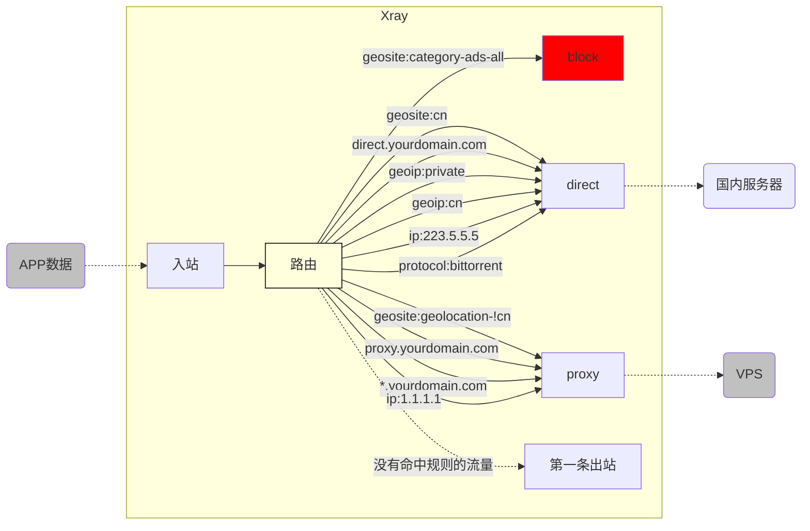

# 路由 (routing) 功能简析（下）

欢迎继续学习 `Xray` 的【路由】功能！

在 [《路由 (routing) 功能简析（上）》](./routing-lv1-part1.md) 中，我们已经对【路由】功能的工作逻辑有了清晰的理解，也基于 `geosite.dat` 文件做了简单的域名分流配置。

如前面所说，域名分流仅仅是【路由】功能的牛刀小试而已。下面就让我们来看看除了域名之外，还什么可以用做分流依据的东西吧！

## 5. 攻城略池 - 多种路由匹配条件

> `[域名], [IP], [协议], etc.`

基于域名的分流，已经可以让我们对网络流量进行基本合理的分流。为什么说【基本合理】呢？

因为【三分天下】虽然是正确的战略方向，但如果只用【域名】来实现这个战略，其实漏洞百出，比如：

1. 我读了《小小白白话文》后，给 VPS 新申请了一个 `proxy.yourdomain.com` 的域名, 我希望它无论如何都代理，`geosite.dat` 里面有吗？
2. 如果我还有个 `direct.yourdomain.com` 的域名，我希望它无论如何都直连， `geosite.dat` 里面有吗？
3. 本机 `127.0.0.1` 的内部流量，是否正确直连了？（比如 `docker` 等）
4. 路由器、本地局域网 `192.168.*.*` 的流量，是否正确直连了？（比如路由器、群晖等）
5. 我的国内 DNS 查询（如 `223.5.5.5`）是否正确直连了？
6. 我的国外 DNS 查询（如 `1.1.1.1`）是否正确代理了？
7. 其他类似国内公共 DNS 一样没有域名、只有 IP 地址的国内网站，是否正确直连了？
8. 其他类似国外公共 DNS 一样没有域名、只有 IP 地址的国外网站，是否正确代理了？
9. BT 下载的流量，虽然来源是国外，但如果通过 VPS 下载很可能导致违规使用被封，这该如何强制直连？
10. ......

我之所以说只用【域名分流】会漏洞百出，是因为 `geosite.dat` 文件内只包含了一部分常用的域名。换言之，仅仅依赖它，则会：

- 无法匹配文件里没有的新域名
- 无法匹配基于 IP 地址的规则
- 无法匹配基于网络协议的规则

::: warning 啰嗦君
那我们来复习一下，当上面这些情况无法匹配时，会发生什么？对了，会触发隐藏路由规则，即【**转发给第一个出站** 】。这其实就是说：

- 当你的第一个出站是 `[direct-out]` 时：**需要直连的都正确了，但需要代理的则都错误**
- 当你的第一个出站是 `[proxy-out-vless]` 时：**需要代理的都正确了，但需要直连的则都错误**
  :::

所以，我们需要一个办法，让我们鱼与熊掌兼得。这样的办法是否存在呢？**当然存在！** 我们需要的只是【域名】之外更多的【**分流判断依据**】而已。

### 5.1 基于指定域名分流：`[domain], [full]` 等

1. 如果需要匹配某个子域名，如 `a-name.yourdomain.com`，我们使用 `full: "a-name.yourdomain.com"`
2. 前面的 `问题1` 和 `问题2`，就可以通过给 `proxy.yourdomain.com` 指定 `[proxy-out-vless]` 出站，给 `direct.yourdomain.com` 指定 `[direct-out]` 出站来解决
3. 如果需要匹配 `yourdomain.com` 的所有子域名，我们使用 `domain: "yourdomain.com"` 实现
4. 上述两个可以成为两个独立的路由规则，达到某些子域名直连，其他子域名代理的配置
5. 另外，`[domain]` 还支持正则表达式等匹配方式。详情请参考 [《基础配置模块 - 路由》文档](../../../config/base/routing/)

上述配置如下：

```json
{
  "routing": {
    "domainStrategy": "AsIs",
    "rules": [
      // 指定子域名直连
      {
        "type": "field",
        "domain": ["full:direct.yourdomain.com"],
        "outboundTag": "direct-out"
      },
      // 指定子域名转发VPS
      {
        "type": "field",
        "domain": ["full:proxy.yourdomain.com"],
        "outboundTag": "proxy-out-vless"
      },
      // 指定泛域名转发VPS
      {
        "type": "field",
        "domain": ["yourdomain.com"],
        "outboundTag": "proxy-out-vless"
      }
    ]
  }
}
```

### 5.2 基于 IP 文件分流：`geoip.dat`

与 `geosite.dat` 规则文件十分类似的，我们还有 `geoip.dat` 这个规则文件，它致力于为用户提供成熟完善的【IP 分类表】。让用户可以简单的通过 `geoip:xxx` 这种格式方便的调用任何子类，定制符合自身需求的路由规则 。

1. 解决前面的 `[问题3], [问题4]`，我们使用 `geoip:private` 类别来指定 `[direct-out]`
2. 解决前面的 `[问题7]`，我们使用 `geoip:cn` 类别来指定 `[direct-out]`
3. 解决前面的 `[问题8]`，由于 `geoip` 中没有【非中国 IP】这个分类（因为这等于要收集全世界的 IP 段），所以我们用隐藏规则代替，也就是将 `[proxy-out-vless]` 放在第一个出站

上述配置如下：

```json
{
  "routing": {
    "domainStrategy": "AsIs",
    "rules": [
      // 本机内部地址、局域网地址直连
      {
        "type": "field",
        "ip": ["geoip:private"],
        "outboundTag": "direct-out"
      },
      // 国内IP集直连
      {
        "type": "field",
        "ip": ["geoip:cn"],
        "outboundTag": "direct-out"
      }
    ]
  }
}
```

### 5.3 基于指定 IP 地址分流

除了使用 `geosite.dat` 核心自然也支持直接使用IP进行路由以满足各种需求。

1. 解决前面的 `[问题5]`，我们使用 `ip: "223.5.5.5"` 来指定 `[direct-out]`
2. 解决前面的 `[问题6]`，我们使用 `ip: "1.1.1.1"` 来指定 `[proxy-out-vless]`

上述配置如下：

```json
{
  "routing": {
    "domainStrategy": "AsIs",
    "rules": [
      // 指定IP地址直连
      {
        "type": "field",
        "ip": ["223.5.5.5"],
        "outboundTag": "direct-out"
      },
      // 指定IP地址转发VPS
      {
        "type": "field",
        "ip": ["1.1.1.1"],
        "outboundTag": "proxy-out-vless"
      }
    ]
  }
}
```

### 5.4 基于协议类型分流：`[protocol]` 等

1. 解决前面的 `[问题9]`，我们使用 `"protocol": ["bittorrent"]` 类别来指定 `[direct-out]`

::: tip
你需要打开入站代理中的 `sniffing` 才能使用此种方式分流。
:::

```json
{
  "routing": {
    "domainStrategy": "AsIs",
    "rules": [
      // 指定 BT 协议直连
      {
        "type": "field",
        "protocol": ["bittorrent"],
        "outboundTag": "direct-out"
      }
    ]
  }
}
```

### 5.5 基于更多条件的分流

到目前位置，我们仍然只讲了【路由功能】分流能力的冰山一角！因为它还支持很多其他的判断条件！我在此简单罗列如下：

本文已经讲过的：

- `inboundTag`
- `domain`
- `ip`
- `protocol`

本文尚未讲到的：

- `port`
- `sourcePort`
- `network`
- `source`
- `user`
- `attrs`

但这些内容实在是过多，全部展开就远远不是 `level-1` 的内容了，所以，需要这些复杂条件的朋友，请仔细阅读 [《基础配置模块 - 路由》文档](../../config/base/routing/) 自学哦！有问题就去 TG 群里面问问吧！

## 6. “霸业初定”：路由规则整体回顾

到现在为止，我们已经累积出了一套战略雄伟、战术精准的路由规则，为了避免混乱，现在就对它进行一次完整的整理和回顾。

::: warning 注意
路由生效的顺序是：【从上往下，依次判断】，所以我一般推荐的规则顺序是：

`[1-block] --> [2-direct] --> [3-proxy] --> [4-first-outbound]`
:::

```json
{
  "routing": {
    "domainStrategy": "AsIs",
    "rules": [
      // [1-block 广告流量屏蔽]
      // 1.1  广告域名集屏蔽
      {
        "type": "field",
        "domain": ["geosite:category-ads-all"],
        "outboundTag": "block"
      },
      // [2-direct 国内流量直连]
      // 2.1 国内域名集、指定子域名直连
      {
        "type": "field",
        "domain": ["geosite:cn", "full:direct.yourdomain.com"],
        "outboundTag": "direct-out"
      },
      // 2.2 本机内部地址+局域网、国内IP、指定IP直连
      {
        "type": "field",
        "ip": ["geoip:private", "geoip:cn", "223.5.5.5"],
        "outboundTag": "direct-out"
      },
      // 2.3 BT协议流量直连
      {
        "type": "field",
        "protocol": ["bittorrent"],
        "outboundTag": "direct-out"
      },
      // [3-proxy 国外流量转发VPS]
      // 3.1 国外域名集、指定子域名、指定泛域名转发VPS
      {
        "type": "field",
        "domain": [
          "geosite:geolocation-!cn",
          "full:proxy.yourdomain.com",
          "yourdomain.com"
        ],
        "outboundTag": "proxy-out-vless"
      },
      // 3.2 指定IP转发VPS
      {
        "type": "field",
        "ip": ["1.1.1.1"],
        "outboundTag": "proxy-out-vless"
      }
      // [4-default-routing 第一条出站]
      // 没有匹配到任何规则的流量，默认使用第一条出站处理
    ]
  }
}
```

此时，路由规则其实变成了：



至于第一条出站是 `[direct-out]` 还是 `[proxy-out-vless]`，这就全看你的需求了。

## 7. 路由配置常见错误

请大家注意看，我上面每一条路由规则，都是一个独立的匹配依据，只有这样才能确保生效。而新人在自定义路由规则时常犯的一个错误就是：**在一条规则内同时匹配了多种不同的匹配依据，造成匹配无效。**

比如，他希望实现的配置是：

1. 自己的 `direct.yourdomain.com` 直连
2. 国内 DNS 查询（如 `223.5.5.5`）直连

### 7.1 错误示范

为了实现上面的目标，他写出了以下路由规则：

```json
{
  "routing": {
    "domainStrategy": "AsIs",
    "rules": [
      {
        "type": "field",
        "ip": ["223.5.5.5"],
        "domain": ["full:direct.yourdomain.com"],
        "outboundTag": "direct-out"
      }
    ]
  }
}
```

你能看出这里面的错误吗？乍一看，似乎是对的？

::: warning 注意
**同一个规则之内，各个依据需要同时成立，才会匹配成功**，逻辑关系是 `和`，而不是 `或`。
:::

换言之，这条规则的意思是：【当你访问的 `目标 = direct.yourdomain.com`, **并且** 同时还满足 `目标 = 223.5.5.5` 时，`Xray` 才会将流量转发给 `[direct-out]` 直连出站】

很显然，一个目标不可能同时等于两个不同的值，所以这不但是一个永远不可能实现的无效规则，更与原本的目标风马牛不相及。

### 7.2 正确示范

正确示范，自然就是将不同的匹配依据独立出来：

```json
{
  "routing": {
    "domainStrategy": "AsIs",
    "rules": [
      {
        "type": "field",
        "ip": ["223.5.5.5"],
        "outboundTag": "direct-out"
      },
      {
        "type": "field",
        "domain": ["full:direct.yourdomain.com"],
        "outboundTag": "direct-out"
      }
    ]
  }
}
```

其实，第 6 点已经是我整理过的规则了，原则就是【相同的匹配依据可以合并，不同的匹配依据保持独立】。

## 8. 明修栈道、暗渡陈仓

> `[domain]` 转化 `[ip]` 的密道：`domainStrategy`

我们在 5.4 中提交了多种流量判断的【依据】，其中一种是域名 `[domain]`、一种是 `[IP]`。

如果你初步了解过 DNS 的运作过程，就会知道，我们对一个域名 `[domain]` 发起访问请求时，其实需要先向 `DNS` 发起请求来解析域名 `[domain]` 对应的 `[IP]`，在得到 `[IP]` 后再向它发起实际请求。

所以，面对入站的一次域名请求，`Xray` 其实有两次机会去判断它的类型。那么，究竟是否要用这两次机会呢？这就是由 `domainStrategy` 这个配置来决定的。它有三个选项：

- `AsIs`
- `IPIfNonMatch`
- `IPOnDemand`

按么我们逐个来解释一下：

### 8.1 域名策略: `"AsIs"`

就是 "As Domain Is"，也就是说 【域名什么样，就什么样，不多折腾】。

简单粗暴理解就是说【仅用 `[domain]` 来匹配】。

::: tip
`AsIs` 的实际意义为 【如原先所示，不加修改】，🍉 老师这里描述的不是很恰当。
:::

这个方式的处理都在 `Xray` 内部完成，没有与外界的数据往来，所以速度最快。它的兜底策略也很清晰：即前面所说的、无法匹配的域名自动转入第一条出站处理。所以，对于常规使用路由功能这最推荐的策略。

### 8.2 域名策略: `"IPIfNonMatch"`

就是 "lookup IP if (there's) no matching rule"，也就是说【如果其他所有规则都匹配不上，那就转化成 `IP` 去匹配 `IP` 规则】。

简单粗暴理解就是说【先把访问目标和其他所有类型规则匹配，如果匹配不上，那就通过 `DNS` 查询转化成 `IP`，再从头和所有规则匹配一次】。

该策略下没有命中任何规则的这一部分域名，会需要再经历 `DNS` 查询过程、以及第二轮规则匹配的过程，其耗时会多于 `AsIs` 策略，所以并不是首选推荐的策略。

### 8.3 域名策略: `"IPOnDemand"`

这里其实说 `Demand IP` 更准确些，也就是说【当匹配时碰到任何基于 IP 的规则，将域名立即解析为 IP 进行匹配】。

简单粗暴理解就是说【只要路由规则中有 `IP` 类规则，那么所有基于域名 `[domain]` 的请求都要解析成 `[IP]` 然后去匹配 `[IP]` 类规则】。

它要对所有首次域名访问进行 `DNS` 解析，所以首次查询比较耗时。虽然由于 `Xray` 中 `DNS` 缓存机制的存在，后续对相同域名的访问速度会重回巅峰，但总体来说也不是首选推荐的策略。

::: warning 啰嗦君
`domainStrategy` 仅对域名生效，不要搞混了哦~
:::

## 9. 思考题

迄今为止，我们都是在【单入站】和【单出站】的基础上，讲解【路由】内部的各种配置逻辑。

但是，如你所知，`Xray` 本身是支持多端口，多协议的。那么，如果我问你：

1. 我希望 `VLESS` 协议将我日常的网页浏览和 APP 流量转发给美国的大流量服务器
2. 我希望 `trojan` 协议将我的所有 Netflix 流量转发给日本的服务器解锁各种二次元
3. 我希望 `shadowsocks` 协议将我所有的游戏流量转发给香港的服务器达到最低的延迟
4. 我希望有一个独立的端口，能够把 `telegram` 的流量全都转发给 VPS
5. 我希望有一个独立的端口，能够把 `bittorrent` 下载流量全都转发给欧洲大盘鸡
6. 我希望......

这些想法，是否能通过【路由】功能配置实现呢？

答案当然是 **【完全可以】** 啦！ 但是这些对于 `level-1` 来说已经超纲了，就留给各位自由的探索吧！

## 10. 结语

至此，`Xray` 的【路由】功能就介绍完了。希望本文能够对你理解 `Xray` 的灵活有所帮助。

## 11. 尾注

- 现在你可以重新阅读一遍 [路由](../../config/routing.md)，看看是否有更加深刻的理解。
- 🍉🍉🍉🍉🍉 :D
