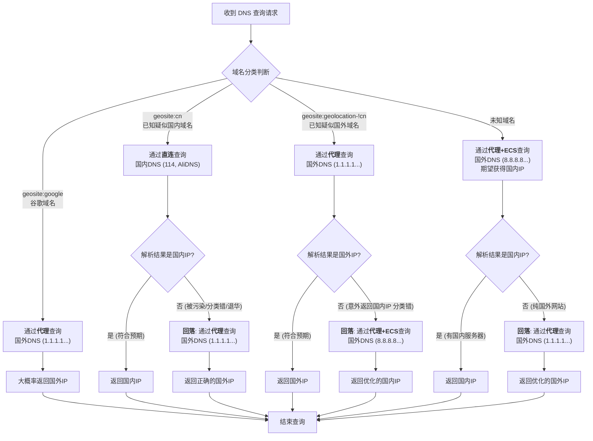

# 用 DNS 实现精准境内外分流

## 常规分流方式以及缺陷

当你尝试手搓代理规则时，必定会有这样的疑问：我该让哪些流量走代理，哪些直连？

答案一般就是黑/白名单。

十几年下来，社区维护了一个庞大的规则列表，先后诞生了许多优秀项目：

- https://github.com/gfwlist/gfwlist
- https://github.com/v2fly/domain-list-community
- https://github.com/Loyalsoldier/v2ray-rules-dat

但它们不可能穷尽所有的网站，具有滞后性，而且做不到 100% 可信。

随便举几个例子：

- geosite:cn 是一个大杂烩，只要和中国有一点关系的都往里装。甚至域名被墙了也没能及时移除。
  如果你仅凭目标域名在其中就走直连是行不通的，比如 ai.ytimg.com、login.corp.google.com 就被墙了迟迟没有移除。
- v2ray-rules-dat 的 [README](https://github.com/Loyalsoldier/v2ray-rules-dat) 写到：Apple、微软、Google CN 的域名同时存在于 geosite:cn 和 geosite:geolocation-!cn 中，但实际上不是这样。(See: [PR#328](https://github.com/Loyalsoldier/v2ray-rules-dat/pull/328))
- 如果域名不在名单里呢？

这无疑给分流带来困扰，如果你的规则更新的不及时，你可能会出现本应走直连的流量被代理、甚至一些网站会打不开的现象。

未知的域名假如在中国有服务器，希望尽可能直连，但一顿操作后遇到了传说中的 [DNS Leak](https://github.com/XTLS/BBS/issues/3#issuecomment-3505661189) 怎么办？

那么有没有什么办法能做到 99.99% 安全又精准的分流呢？

答案是：包的。

## 利用 Xray-core DNS 模块实现精准分流

合理利用 Xray ~~如轮椅般~~强大的内置 DNS 自带的回落、ECS、IP 过滤、打 Tag 等功能，精心调整它们的顺序。如此你便得到了比 geosite cn/!cn 更为精确且实时的 IP 作为分流条件，因为 IP 归属地，特别是 cn 归属地变更频率较低。

在继续阅读本文之前，你需要充分阅读并理解“入门技巧：路由 (routing) 功能简析[上篇](./routing-lv1-part1.md)、[下篇](./routing-lv1-part2.md)”。
与此同时你已经快要把官方配置指南给翻烂了，因此你完全理解了路由和出站中的 domainStrategy、入站中 sniffing 各选项的作用、以及其不同值的组合下产生的行为。

一切就绪？请试着理解下面这段内容：

socks、http 入站时，请求的就是域名，到了路由后，路由中非 AsIs 的 domainStrategy 可以利用内置 DNS 解析出 IP 临时用于路由匹配。到了本地 direct 出站时，出站中非 AsIs 的 domainStrategy 可以利用内置 DNS 再次解析出 IP 用于出站。发往 Xray 服务器的请求只有域名，具体访问哪个 IP 取决于服务器的 direct 出站。

透明代理时情况变得更加复杂，入站 sniffing 开启，且 destOverride 有 [http, tls]：

- 若 routeOnly = false 则请求的 IP 将被抹掉，后面的流程跟 socks 入站一样。
- 若 routeOnly = true 则同时有域名和 IP，到了路由后，可以直接匹配域名和 IP 规则，本地 direct 出站也会用此 IP。发往 Xray 服务器的请求只有 IP，服务器如何处理？再把刚才的流程走一遍。

遇到困难？你需要继续反复阅读官方指南并尝试理解。否则你很难利用到下面示例中 DNS 模块的解析结果来正确分流。

---

#### 例子 1：此配置解析出精准的 CDN 友好的 IP 地址，保证无 DNS Leak 的同时，只要中国有服务器节点就能优先解析出来，非常适合 realIp 透明代理场景。

```json
{
  "dns": {
    "servers": [
      // 防止谷歌人机验证卡住、防止谷歌中国被监控（因为大量三方网站可能加载谷歌字体之类的）
      {
        "address": "1.1.1.1",
        "skipFallback": true,
        "domains": ["geosite:google", "geosite:google-cn"]
      },
      {
        "address": "8.8.8.8",
        "skipFallback": true,
        "domains": ["geosite:google", "geosite:google-cn"],
        "finalQuery": true // 终结查询链
      },
      // 通过直连解析社区认为在中国有节点的域，若非预期结果可能是被墙或退出中国
      // 通过代理解析社区认为在中国有节点的域，供被墙或退出中国时回落
      {
        "tag": "dns-direct",
        "address": "114.114.114.114",
        "skipFallback": true,
        "domains": ["geosite:cn"],
        "expectIPs": ["geoip:cn"]
      },
      {
        "tag": "dns-direct",
        "address": "223.5.5.5",
        "skipFallback": true,
        "domains": ["geosite:cn"],
        "expectIPs": ["geoip:cn"]
      },
      {
        "address": "1.1.1.1",
        "skipFallback": true,
        "domains": ["geosite:cn"]
      },
      {
        "address": "8.8.8.8",
        "skipFallback": true,
        "domains": ["geosite:cn"],
        "finalQuery": true // 终结查询链
      },
      // 通过代理解析社区认为非中国本土的域，若非预期结果则尝试优化直连
      {
        "address": "1.1.1.1",
        "skipFallback": true,
        "domains": ["geosite:geolocation-!cn"],
        "expectIPs": ["geoip:!cn"]
      },
      {
        "address": "8.8.8.8",
        "skipFallback": true,
        "domains": ["geosite:geolocation-!cn"],
        "expectIPs": ["geoip:!cn"]
      },
      {
        "address": "8.8.8.8",
        "clientIp": "222.85.85.85", // 提供你当地ISP的IP地址以获取直连优化的A/AAAA记录
        // 比如你是河南电信，就可以使用荷兰电信DNS
        // 不能保证100%中国CDN友好，因为不是所有权威都支持ECS
        "skipFallback": true,
        "domains": ["geosite:geolocation-!cn"]
      },
      {
        "address": "8.8.4.4",
        "clientIp": "222.85.85.85", // 同上
        "skipFallback": true,
        "domains": ["geosite:geolocation-!cn"],
        "finalQuery": true // 终结查询链
        // 看到这里你可能会有疑惑：这4条规则和上面4条感觉有点冗余？可以精简吗？
        // 其实不然，这是为了追求更极致的速度，以及一些权威DNS不支持ECS
      },
      // 未知域名，中国优先，若非预期结果则尝试优化代理
      {
        "address": "8.8.8.8",
        "clientIp": "222.85.85.85", // 同上
        "expectIPs": ["geoip:cn"]
      },
      {
        "address": "8.8.4.4",
        "clientIp": "222.85.85.85", // 同上
        "expectIPs": ["geoip:cn"]
      },
      "1.1.1.1",
      "8.8.8.8"
    ],
    "tag": "dns-proxy",
    "enableParallelQuery": true // 智能并行：全部并行，智能分组，组内竞速
  },
  "routing": {
    "domainStrategy": "具体取决于你的需求",
    "rules": [
      {
        // 为 DNS 查询本身进行路由
        "inboundTag": ["dns-direct"],
        "outboundTag": "direct"
      },
      {
        // 为 DNS 查询本身进行路由
        "inboundTag": ["dns-proxy"],
        "outboundTag": "proxy"
      }
      // 你的个性化分流规则
      // 对于流媒体解锁等你应用 domain 分流，对于境内外分流你始终应用 ip 来分流
    ]
  }
  // 其它忽略，按需配置...
}
```



你可以根据此配置解析出的 IP 结合域名、或者完全靠 IP 来分流。

realIp 透明代理环境，你甚至可以在保证完全劫持各种渠道的 DNS 后，设置 domainStrategy=AsIs、routeOnly=true 做全程无二次 DNS 解析。

> 注意：上面说的 CDN 友好，境外部分是针对你代理服务器所在位置做的优化，如果你是仅黑名单走代理，而非全部境外流量都走代理，需要自行调整规则中的 ECS。

#### 例子 2：此配置解析出正确，但不保证国外 CDN 友好的地址，保证无 DNS Leak 的同时，只要中国有服务器节点就能优先解析出来，适合 fakeIp 透明代理、socks、http 入站等场景。

```json
{
  "dns": {
    "servers": [
      // 防止谷歌人机验证卡住、防止谷歌中国被监控（因为大量三方网站可能加载谷歌字体之类的）
      {
        "address": "1.1.1.1",
        "skipFallback": true,
        "domains": ["geosite:google", "geosite:google-cn"],
        "finalQuery": true // 终结查询链
      },
      {
        // 我们不完全信任geosite:cn，但如果一个域名已经存在于此列表
        // 就优先试着解析一下，如果返回中国IP代表它没被墙
        // 反之高度疑似被墙，回落到8.8.8.8重新解析，解决可能的DNS污染
        // 优先让它解析的原因是代价极小，走直连只需要十几毫秒
        "tag": "dns-direct",
        "address": "223.5.5.5",
        "skipFallback": true,
        "domains": ["geosite:cn"],
        "expectIPs": ["geoip:cn"]
      },
      {
        // 如果一个域名不存在于geosite:cn，或者是上面的规则回落下来的，就会使用此服务器
        // 这里利用ECS尝试获取中国的A/AAAA记录
        "address": "8.8.8.8",
        "clientIp": "222.85.85.85", // 提供当地ISP的IP地址以获取直连优化的A/AAAA记录
        // 比如你是河南电信，就可以使用荷兰电信DNS
        // 不能保证100%中国CDN友好，因为不是所有权威都支持ECS
        "skipFallback": false
      }
    ],
    "tag": "dns-proxy"
  },
  "routing": {
    "domainStrategy": "必须是非 AsIs，具体取决于你的需求",
    "rules": [
      {
        // 为 DNS 查询本身进行路由
        "inboundTag": ["dns-direct"],
        "outboundTag": "direct"
      },
      {
        // 为 DNS 查询本身进行路由
        "inboundTag": ["dns-proxy"],
        "outboundTag": "proxy"
      }
      // 你的个性化分流规则
      // 对于流媒体解锁等你应用 domain 分流，对于境内外分流你始终应用 ip 来分流
    ]
  }
  // 其它忽略，按需配置...
}
```

此场景下由于发给 Xray 服务器的请求全部都是域名，因此没有必要利用 DNS 反复试探最优结果，只需要快速识别域是否被污染，尽可能解析出中国的 CDN 友好的 IP 即可。

此示例中 DNS 模块解析出的中国 IP 已经是 99% 中国 CDN 友好的，因此你可以在 direct 出站中 `domainStrategy` 设为**非** AsIs 以利用缓存，如果你需要的话；<br>
如果你追求 100% 的中国 CDN 友好，可设为 AsIs 利用操作系统设置的 DNS 再解析一次，额外耗时约 1 ~ 数百毫秒，建议开启乐观缓存以进一步降低延迟。

## 写在后面

已知许多国内无良 App 会探测你的海外出口 IP，并将其和你 GPS 定位、手机号、外卖地址等敏感信息关联起来，并泄露给社工库。~~Big brother is watching u!!!~~

总有人误解这是因为分流导致的，只要改用黑名单模式（仅黑名单网站走代理）就能规避。
实则不然，首先黑名单非常容易投毒，他们可以故意制造诱饵网站提交进去来探测你的海外 IP。

其次只要黑名单中任何一个网站托管在 Cloudflare 甚至都不需要诱饵，试着访问下：https://chatgpt.com/cdn-cgi/trace

聪明的你可能会想到：那我再找一个公共代理套一层不就解决了吗？前提是你要完全信任此代理不留日志不出卖你，并且它被许多你国家的人高强度使用。这样一个海外 IP 在单位时间内与成千上万人产生关联，就没有办法通过海外 IP 倒推出你了。至于这种脏 IP 的烦人验证码问题克服一下就行。

赛博大善人 Cloudflare 的 Warp 不正好完美契合所有特征吗？可惜的是对于托管在 CF 的网站，Warp 并不能完全隐藏你的 IP，它仅对非 CF 服务器有效。

Tor 可以吗？它不太适合日常使用，IP 太脏且出口频繁跳跃许多网站会因此封停你的账号。

因此除非你使用的客户端能按 App 分流（这仅能在手机、电脑上实现）其它任何爬墙方式都会导致你的海外 IP 泄露。

总之我想说的是对于常规爬墙方式，海外 IP 泄露几乎无法避免，如果你需要高级隐私保护，请使用 Tor 等工具。Xray-core 作为抗审查工具侧重于抗阻断帮你穿越防火墙，而在隐私保护的方面能力十分有限。
