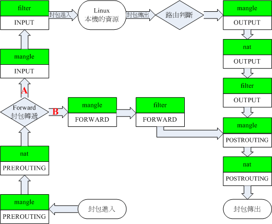

# 透明代理入门

## 什么是透明代理

透明代理简单地说就是不让被代理的设备感觉到自己被代理了。简单地说就是，被代理的设备上不需要运行任何代理软件(比如 Xray、V2RayNG 等)，当你连接上网络时，你的设备已经被代理了。

这也意味着，代理的软件运行在别的地方，比如运行在路由器中，通过路由器上网的设备就自动被代理了。

## 透明代理的实现

透明代理的实现目前主要有两种方式：

### tun2socks

可用 Windows/Linux(包括安卓)实现。因为实现过程比较简单，很少有教程，我这里简单描述一下。

**Windows**

1. 安装 **[Netch](https://github.com/NetchX/Netch/releases)** ，使用模式`[3] [TUN/TAP] 绕过局域网`启动。

2. 开启热点

3. 打开`控制面板`->`网络和 Internet`->`网络和共享中心`->`更改适配器设置`，找到`TAP-Windows Adapter`和`Microsoft Wi-Fi Direct Virtual Adapter`。

4. 鼠标右键点击`TAP-Windows Adapter`，`属性`->`共享`，勾选`允许其他网络用户通过此计算机的 Internet 连接来连接`，在`家庭网络连接`中选择`Microsoft Wi-Fi Direct Virtual Adapter`的那个网络连接，点击确定。

**Android**

1. 配置连接 V2RayNG

2. 开启热点

3. 热点设置 -> 允许热点使用 VPN(部分安卓系统可能没有这个选项)

### iptables/nftables

iptables 与 nftables 实现透明代理的原理相同，下文统一使用 iptables。

基于 iptables 的透明代理实现只能用于 Linux 系统(包括 openwrt/安卓)。由于其比 tun2socks 更高效率以及适合在路由器中配置而广泛使用。

现存的三篇白话文透明代理教程其实讲的都是基于这种方案的透明代理实现，它们是： **[新 V2Ray 白话文指南-透明代理](https://guide.v2fly.org/app/transparent_proxy.html)** 、 **[新 V2Ray 白话文指南-透明代理(TPROXY)](https://guide.v2fly.org/app/tproxy.html)** 、 **[透明代理（TProxy）配置教程](../tproxy.md)** 。其中第一篇是基于 iptables-redirect 模式，已经过时了，不建议使用，仅供参考。第二篇和第三篇讲的都是基于 iptables-tproxy 模式的透明代理实现。

## iptables 实现透明代理原理

Linux 使用`Netfilter`来管理网络，`Netfilter`模型如下：



**假设使用路由器作为网关(即我们平时的上网方式)，那么：**

局域网设备通过路由器访问互联网的流量方向：

`PREROUTING链->FORWARD链->POSTINGROUTING链`

局域网设备访问路由器的流量(如登陆路由器 web 管理界面/ssh 连接路由器/访问路由器的 dns 服务器等)方向：

`PREROUTING链->INPUT链->网关本机`

路由器访问互联网的流量方向：

`网关本机->OUTPUT链->POSTINGROUTING链`

**通过使用 iptables 操控`PREROUTING链`和`OUTPUT链`的流量走向，转发到 Xray，就可以代理局域网设备和网关本机。**

## 透明代理难在哪里

透明代理的难点就在于路由，所谓路由，就是区分哪些流量是直连的，哪些该被代理，所以我个人认为叫做**分流**更加合适。

我们可以把路由由易到难分为以下几个阶段：

1. 代理全部请求

2. 本地局域网 IP/组播 IP 请求直连，其它请求代理

3. 在 2 的基础上直连 Xray 发起的连接请求

4. 在 3 的基础上直连指向中国大陆 IP 的连接请求，并对国内外域名选择国内外 DNS 服务器解析。

上面说的三篇教程，都是在第四阶段。所以新手直接阅读可能显得有点难懂。

## 从零开始一步步实现基于 iptables-tproxy 的透明代理

### 在开始之前，你需要有一定的基础知识：

1. 大概知道什么是 TCP/IP 协议、域名和 DNS 服务器

2. 知道什么是 WAN 口，LAN 口，LAN_IP，WAN_IP 以及 DHCP 服务器。对于旁路由，只有一个网口，这里称其为 LAN 口

3. 对 Linux 系统有最基础的了解(知道怎么运行命令)

4. 能够手写客户端 json 文件配置，至少要能看懂

### 前期准备工作
::: warning
在开始操作前，记得使用 `sysctl -w net.ipv4.ip_forward=1` 打开linux ipv4封包转发
:::
**1. 准备一个运行 Linux 系统的网关**

比如，刷了 OpenWRT 的路由器

**2. 在网关(路由器)准备好 Xray 可执行文件以及配置文件**

配置文件监听 12345 端口，开启 tproxy：

```json
{
  "log": {
    "loglevel": "warning"
  },
  "inbounds": [
    {
      "port": 12345,
      "protocol": "dokodemo-door",
      "settings": {
        "network": "tcp,udp",
        "followRedirect": true
      },
      "streamSettings": {
        "sockopt": {
          "tproxy": "tproxy"
        }
      }
    }
  ],
  "outbounds": [
    {
      你的服务器配置
    }
  ]
}
```

我们由易到难，不写 routing，只写一个 inbound 一个 outbound。

### 首先，我们先试试做到第一阶段

::: warning
如果你不能接受你的机器需要重启，最好先开一个虚拟机进行练习
:::

将所有`PREROUTING链`的流量，都转发到 Xray 中。

运行 Xray，执行以下指令：

```bash
ip rule add fwmark 1 table 100
ip route add local 0.0.0.0/0 dev lo table 100
iptables -t mangle -N XRAY
iptables -t mangle -A XRAY -p tcp -j TPROXY --on-port 12345 --tproxy-mark 1
iptables -t mangle -A XRAY -p udp -j TPROXY --on-port 12345 --tproxy-mark 1
iptables -t mangle -A PREROUTING -j XRAY
```

当你输入完之后，如果你是使用 ssh 连接到网关上的，你会发现 ssh 的连接断开了(不用紧张，断电重启即可恢复)，并且透明代理无法上网；如果你是的网关是虚拟机，你会发现网关本身也无法上网，并且 Xray 日志 access_log 中出现许多源地址为目标地址，目标地址为 WAN_IP 的请求。

理论上网关本机访问公网只会经过`OUTPUT链`和`POSTROUTING链`，为什么操控`PREROUTING链`会导致网关无法上网呢？这是因为网络通讯往往是双向的，虽然网关访问公网 IP 不需要经过`PREROUTING链`，但被访问的服务器向网关返回信息时要经过`PREROUTING链`，且这部分被转发到 Xray 了，因此出现了日志中的反向请求。

我们修改一下规则，源 IP 不是来自局域网的则返回。重启网关，运行 Xray，执行以下指令：

```bash
ip rule add fwmark 1 table 100
ip route add local 0.0.0.0/0 dev lo table 100
iptables -t mangle -N XRAY
# "网关LAN_IP地址段" 通过运行命令"ip address | grep -w "inet" | awk '{print $2}'"获得，是其中的一个
iptables -t mangle -A XRAY ! -s 网关LAN_IP地址段 -j RETURN
iptables -t mangle -A XRAY -p tcp -j TPROXY --on-port 12345 --tproxy-mark 1
iptables -t mangle -A XRAY -p udp -j TPROXY --on-port 12345 --tproxy-mark 1
iptables -t mangle -A PREROUTING -j XRAY
```

然后你会发现，虽然 ssh 连接断开了，但是透明代理已经可用了。只要我们修改系统 dns 为公共 dns，就能正常上网了(因为现在网关访问不了，所以 dns 设置为网关是不行的)。

至此，第一阶段就完成了。之所以无法访问网关，是因为代理规则代理了全部流量，包括访问网关的流量。试想在 VPS 上访问你本地的网关，肯定是访问不了的，所以我们要对这部分流量直连，请看第二阶段：

### 第二阶段

重启网关，运行 Xray，执行以下指令：

```bash
ip rule add fwmark 1 table 100
ip route add local 0.0.0.0/0 dev lo table 100
iptables -t mangle -N XRAY

# 所有目标地址在网关所在网段的请求直连
# 通过运行命令"ip address | grep -w "inet" | awk '{print $2}'"获得，一般来说有多个
iptables -t mangle -A XRAY -d 网关所在网段1 -j RETURN
iptables -t mangle -A XRAY -d 网关所在网段2 -j RETURN
...

# 目标地址为组播IP/E类地址/广播IP的请求直连
iptables -t mangle -A XRAY -d 224.0.0.0/3 -j RETURN

iptables -t mangle -A XRAY -p tcp -j TPROXY --on-port 12345 --tproxy-mark 1
iptables -t mangle -A XRAY -p udp -j TPROXY --on-port 12345 --tproxy-mark 1
iptables -t mangle -A PREROUTING -j XRAY
```

使用这条规则后，上一条规则`iptables -t mangle -A XRAY ! -s 网关LAN_IP地址段 -j RETURN`便成为了多余规则，可以删去。

至此，第二阶段完成。网关已经可以访问，ssh 不会断开。

### 第三阶段

我们平时用的 DNS 一般来自路由器，但这个 iptables 规则只代理了局域网中的设备，却没有代理网关本机，这样返回的 DNS 查询结果可能是错误的或者污染的。

iptables-tproxy 不支持对`OUTPUT链`操作，但是我们可以通过配置`策略路由`，把`OUTPUT链`中相应的包重新路由到`PREROUTING链`上。

```bash
# 添加策略路由: 标记为1的包，走路由表100
ip rule add fwmark 1 table 100
# 添加路由条目到路由表100: 所有包路由到本地
ip route add local 0.0.0.0/0 dev lo table 100
```

通过配置上述`策略路由`，我们只需要在`OUTPUT链`中给包打标记为`1`，相应的包就会路由到网关本机，即`PREROUTING链`上。所以我们就给网关本机需要代理的请求在`OUTPUT链`上标记`1`即可。

如果要代理网关本机发出的的全部请求，就会引入一个问题，Xray 运行在网关，Xray 向代理服务端发送请求，这个请求又被代理了，就形成了回环。

因此要代理网关本机，就要避免回环发生，即代理规则中规避 Xray 请求的流量。

**常见的方法有三种：**

1. 直连目标地址为 VPS 的流量

重启网关，运行 Xray，执行以下指令：

```bash
#代理局域网设备
#继承上一个阶段的成果
ip rule add fwmark 1 table 100
ip route add local 0.0.0.0/0 dev lo table 100
iptables -t mangle -N XRAY
iptables -t mangle -A XRAY -d 网关所在网段1 -j RETURN
iptables -t mangle -A XRAY -d 网关所在网段2 -j RETURN
...
iptables -t mangle -A XRAY -d 224.0.0.0/3 -j RETURN
iptables -t mangle -A XRAY -p tcp -j TPROXY --on-port 12345 --tproxy-mark 1
iptables -t mangle -A XRAY -p udp -j TPROXY --on-port 12345 --tproxy-mark 1
iptables -t mangle -A PREROUTING -j XRAY

#代理网关本机
iptables -t mangle -N XRAY_MASK
iptables -t mangle -A XRAY_MASK -d 网关所在网段1 -j RETURN
iptables -t mangle -A XRAY_MASK -d 网关所在网段2 -j RETURN
...
iptables -t mangle -A XRAY_MASK -d 224.0.0.0/3 -j RETURN
iptables -t mangle -A XRAY_MASK -d VPS公网ip/32 -j RETURN
iptables -t mangle -A XRAY_MASK -j MARK --set-mark 1
iptables -t mangle -A OUTPUT -p tcp -j XRAY_MASK
iptables -t mangle -A OUTPUT -p udp -j XRAY_MASK
```

但是这么配置有个缺点，如果使用 CDN 或者 VPS 很多的话，就不好写规则了。

2. 通过 mark 规避

三个白话文教程都是使用这种方法规避，自行参考，这里不再赘述。

3. 通过 gid 规避(推荐)

参考 **[[透明代理]通过 gid 规避 Xray 流量](../iptables_gid.md)**

这样就完成了第三阶段的代理，也就是平时说的全局代理。但是记得把网关的 DNS 服务器设置为国外的 DNS 服务器，否则可能依然返回被污染的结果。

### 第四阶段

其实，并不是所有人都需要实现第四阶段。全局代理对于大部分情况已经适用。

特别是对于旁路由而言。需要代理时，将网关调成旁路由的 IP，不需要代理时，将网关换回主路由 IP。

至于第四阶段的具体实现，那三篇白话文教程讲的都是。在理解了上面的内容后，再去看那三篇白话文教程，就比较容易理解了。

### 代理 ipv6

上面的规则只对 ipv4 生效，如果还想要代理 ipv6 请求，则使用 ip6tables 命令，用法与 iptables 基本相同。参考 **[[透明代理]通过 gid 规避 Xray 流量#4-设置 iptables 规则](../iptables_gid#4-设置iptables规则.md)**

# iptables 透明代理的其它注意事项

1. 如果作为代理的网关作为主路由，要在`PREROUTING链`规则中加一条`iptables -t mangle -A XRAY ! -s 网关LAN_IP地址段 -j RETURN`，即在第一阶段使用、第二阶段被删除的指令。如果不写，WAN 口中同网段的其它人可以将网关填写成你的 WAN_IP，从而蹭你的透明代理用，还可能带来一定的危险性。

2. **[新 V2Ray 白话文指南-透明代理(TPROXY)#设置网关](https://guide.v2fly.org/app/tproxy.html#设置网关)** 中的第三条说：`手动配置 PC 的网络，将默认网关指向树莓派的地址即 192.168.1.22。此时 PC 应当能正常上网（由于还没设置代理，“正常”是指可以上国内的网站）`。实际上，Ubuntu、CentOS、debian 等系统就算开启了 IP 转发，PC 也不能正常上网，这是正常的。事实上只有 OpenWRT 能做到文中所描述的那样，据 **[@BioniCosmos](https://github.com/BioniCosmos)** 点拨，这是由于一般的 Linux 系统没有 Masquery 规则。

3. **[too many open files 问题](https://guide.v2fly.org/app/tproxy.html#解决-too-many-open-files-问题)** ，解决方法见 **[[透明代理]通过 gid 规避 Xray 流量-配置最大文件大开数&运行 Xray 客户端](../iptables_gid#3-配置最大文件大开数运行xray客户端)**

4. 避免已有连接的包二次通过 TPROXY ,待补充...

5. 主路由、单臂路由与旁路由，待补充...
