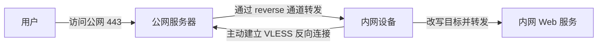
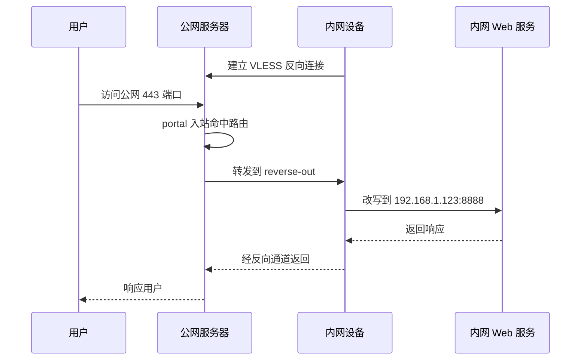
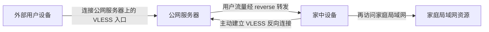
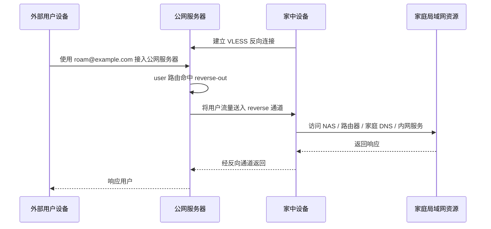

# VLESS 反向代理示例

本文演示如何使用 Xray 的 VLESS 反向代理能力，通过公网服务器把流量送回远程内网。这里给出两种常见用法：

- `入口转发`：远程端口映射，将公网入口端口映射到远程内网 Web 服务；
- `远程回家`：远程内网漫游，用户通过公网服务器中转，回到家里的内网继续访问资源。

## 入口转发

远程端口映射，把公网入口端口映射到远程内网 Web 服务。

### 工作方式

这个模型里有三个角色：

- 用户：访问公网入口；
- 公网服务器：接收流量，并将其转交给反向代理通道；
- 内网设备：主动建立到公网服务器的连接，并在反向通道中接收请求。



可以简单理解为：

1. 内网设备先主动连接到公网服务器。
2. 公网服务器保留这条反向通道。
3. 用户访问公网服务器上的 `443` 入口。
4. 公网服务器把请求通过反向通道送回内网设备。
5. 内网设备再把目标改写到实际 Web 服务。

### 配置思路

VLESS 反向代理的关键点有两个：

- 在公网侧，为某个 VLESS 客户端声明 `reverse.tag`，这样它会表现为一个可路由的出站；
- 在内网侧，为某个 VLESS 出站声明 `reverse.tag`，这样它会主动建立反向连接，并在本地表现为一个可接收流量的入口。

两端的 `reverse.tag` 不要求同名。它们只是各自配置里的本地标识，真正建立对应关系的是同一条反向连接本身。

### 公网服务器配置

下面的示例完成了两件事：

- 在 `8443` 端口提供一个 VLESS 入站，其中一个 `client` 因为带有 `reverse` 因此可以专门给内网设备建立反向连接；
- 在 `443` 端口提供一个 `tunnel` 入站，对外作为 Web 服务入口，并把这个入口收到的流量转发到反向代理通道。

同时要注意，`freedom` 出站必须保留作为占位。否则一旦 `outbounds` 为空，那么 `reverse-out` 将被视为默认出站，导致未命中规则的流量可能错误地进入反向代理通道。

```json
{
  "inbounds": [
    {
      "listen": "0.0.0.0",
      "port": 8443,
      "protocol": "vless",
      "settings": {
        "decryption": "mlkem768x25519plus.native.600s.aCF82eKiK6g0DIbv0_nsjbHC4RyKCc9NRjl-X9lyi0k",
        "clients": [
          {
            "id": "ac04551d-6ebf-4685-86e2-17c12491f7f4",
            "flow": "xtls-rprx-vision",
            "reverse": {
              "tag": "reverse-out"
            }
          }
          // ... 其它普通的 client
        ]
      }
    },
    {
      "listen": "0.0.0.0",
      "port": 443,
      "protocol": "tunnel",
      "tag": "portal"
    }
  ],
  "routing": {
    "rules": [
      {
        "inboundTag": ["portal"],
        "outboundTag": "reverse-out"
      }
    ]
  },
  "outbounds": [
    {
      "protocol": "freedom"
    }
  ]
}
```

### 内网设备配置

内网设备的职责是主动连出，并建立反向通道。这里额外写一组路由，是为了把从 `reverse-in` 进入的流量明确送到指定的 `freedom` 出站，而不是完全依赖默认出站，因为通常你的内网端 Xray 还会承担日常的正向代理功能。

示例里保留了两个 `freedom` 出站：

- 一个普通 `freedom`，作为默认直连出口；<br>
  （假设你有正向代理需求）
- 一个带 `tag` 的 `freedom`，专门用于承接从反向代理入口进来的流量。

假设你的内网 Web 服务监听在 `192.168.1.123:8888`：

- 需要在出站时把目标地址改写到这个内网地址；
- 因为 Xray 存在默认安全策略，还需要在 `finalRules` 里显式放行目标端口。

```json
{
  // 关于正向代理的其它配置略...
  "routing": {
    "rules": [
      {
        "inboundTag": ["reverse-in"],
        "outboundTag": "reverse-direct"
      }
    ]
  },
  "outbounds": [
    {
      "protocol": "freedom"
    },
    {
      "protocol": "freedom",
      "tag": "reverse-direct",
      "settings": {
        "redirect": "192.168.1.123:8888",
        "finalRules": [
          {
            "action": "allow",
            "network": "tcp",
            "ip": "192.168.1.123",
            "port": "8888"
          }
        ]
      }
    },
    {
      "protocol": "vless",
      "settings": {
        "address": "yourserver.com",
        "port": 8443,
        "encryption": "mlkem768x25519plus.native.0rtt.2PcBa3Yz0zBdt4p8-PkJMzx9hIj2Ve-UmrnmZRPnpRk",
        "id": "ac04551d-6ebf-4685-86e2-17c12491f7f4",
        "flow": "xtls-rprx-vision",
        "reverse": {
          "tag": "reverse-in"
        }
      }
    }
  ]
}
```

需要注意的是：

- 公网侧的 `reverse.tag` 会表现为一个出站；
- 内网侧的 `reverse.tag` 会表现为一个入口；
- 它们不必同名，只需要通过同一条反向连接 `ac04551d...` 对应起来；
- 如果你希望内网侧对反向代理进来的流量做更细的控制，可以像上面的示例一样，在 `routing` 中显式指定它该走哪个 `freedom` 出站。
- 内网侧还支持 `sniffing` 并且如果你在 freedom 配置了 `proxyProtocol` 甚至可以让 WebServer 看到真实的访客 IP 这里不做展开。

### 请求流向



这种用法的语义很明确：用户感知到的是“访问公网服务器上的 Web 服务”，而实际处理请求的是远程内网设备上的 Web 服务。

### 多线路与冗余

一个内网设备可以建立多条反向连接，例如分别通过不同网络、不同出口，或者不同入口地址连接到公网服务器。只要公网侧把这些连接都视为同一个反向代理目标，就可以形成冗余线路。

这种方式的好处是：

- 某条线路暂时不可用时，流量仍可走其他线路；
- 公网侧无需为每条线路单独设计一套路由逻辑；
- 对内网穿透场景来说，更方便做链路冗余。

### 安全建议

- 公网服务器务必保留明确的默认出站，根据你的实际需求可以是 `freedom` 或 `blackhole` 等，避免未命中路由的流量误入反向代理；
- 示例配置偏重说明原理，真实公网环境中通常还需要结合更完整的传输与伪装方案。

## 远程回家

远程内网漫游，用户通过公网服务器中转，回到家里的内网继续访问资源。

### 场景说明

这一部分不是把某个公网端口暴露给外部访问，而是让用户先连接公网服务器上的 VLESS，再借助已经建立好的反向通道，把这个用户的流量继续送回家里的内网设备处理。

这种用法更接近：

- 在外漫游时访问家里的局域网资源；
- 把特定用户的出口放回家里；
- 通过公网服务器中转，回到家庭网络继续访问 NAS、路由器面板、家庭 DNS 或其他内网服务。



### 配置思路

和第一篇相比，这里最大的区别不在于反向连接本身，而在于公网侧的路由目标：

- 第一篇是 `inboundTag -> reverse-out`，把某个入口端口映射回内网；
- 第二篇是 `user -> reverse-out`，把某个用户的代理流量交给内网设备继续处理。

也就是说，公网服务器在这里更像一个中转站。用户并不是直接“访问公网端口映射到的服务”，而是“先接入公网服务器上的 VLESS 入口，再从家里的设备继续出发”。

### 公网服务器配置

这个示例里：

- 第一个 UUID 仍然用于家中设备建立反向连接；
- 第二个 UUID 用于外部用户接入公网服务器；
- 路由根据 `email` 把该用户的流量转发到 `reverse-out`。

```json
{
  "inbounds": [
    {
      "listen": "0.0.0.0",
      "port": 8443,
      "protocol": "vless",
      "settings": {
        "decryption": "mlkem768x25519plus.native.600s.aCF82eKiK6g0DIbv0_nsjbHC4RyKCc9NRjl-X9lyi0k",
        "clients": [
          {
            "id": "ac04551d-6ebf-4685-86e2-17c12491f7f4",
            "flow": "xtls-rprx-vision",
            "reverse": {
              "tag": "reverse-out"
            }
          },
          {
            "id": "e8758aff-d830-4d08-a59e-271df65b995a",
            "flow": "xtls-rprx-vision",
            "email": "roam@example.com"
          }
        ]
      }
    }
  ],
  "routing": {
    "rules": [
      {
        "user": ["roam@example.com"],
        "outboundTag": "reverse-out"
      }
    ]
  },
  "outbounds": [
    {
      "protocol": "freedom"
    }
  ]
}
```

### 家中设备配置

家中设备依然要主动连接公网服务器建立反向通道。和第一篇不同，这次它不是把流量统一改写到一个固定 Web 服务，而是把来自 `reverse-in` 的流量统一交给家里的直连出口处理。

下面这个示例假设：

- 家庭局域网网段为 `192.168.1.0/24`；
- 用户设备侧已经负责决定哪些流量需要“回家”；
- 家中设备这一侧只负责承接这些流量，并交给家庭网络继续处理。

```json
{
  "routing": {
    "rules": [
      {
        "inboundTag": ["reverse-in"],
        "outboundTag": "home-direct"
      }
    ]
  },
  "outbounds": [
    {
      "protocol": "freedom"
    },
    {
      "protocol": "freedom",
      "tag": "home-direct",
      "settings": {
        "finalRules": [
          {
            "action": "allow",
            "network": "tcp,udp",
            "ip": ["192.168.1.0/24"]
          }
        ]
      }
    },
    {
      "protocol": "vless",
      "settings": {
        "address": "yourserver.com",
        "port": 8443,
        "encryption": "mlkem768x25519plus.native.0rtt.2PcBa3Yz0zBdt4p8-PkJMzx9hIj2Ve-UmrnmZRPnpRk",
        "id": "ac04551d-6ebf-4685-86e2-17c12491f7f4",
        "flow": "xtls-rprx-vision",
        "reverse": {
          "tag": "reverse-in"
        }
      }
    }
  ]
}
```

上面这组规则的含义是：

- 只要流量是从 `reverse-in` 进入的，就转给 `home-direct`；
- 因为 Xray 存在默认安全策略，需要用 `finalRules` 显式放通家里内网。如果你只是想访问家里 NAS 那么建议你不要像示例配置那样放通全部 IP，而是按实际需要放通指定 IP 和 Port。

### 用户设备配置

用户设备这一侧不建议默认“全量回家”，更常见的做法是只把访问家庭资源的流量拨回去，其余流量仍然本地直连。下面给出一套和上面家中设备配置对应的示例。假设：

- 用户只想访问家里的 `192.168.1.0/24` 网段；
- 其他流量继续本地直连。

```json
{
  "routing": {
    "rules": [
      {
        "ip": ["192.168.1.0/24"],
        "outboundTag": "roam-home"
      }
    ]
  },
  "outbounds": [
    {
      "protocol": "freedom"
    },
    {
      "protocol": "vless",
      "tag": "roam-home",
      "settings": {
        "address": "yourserver.com",
        "port": 8443,
        "encryption": "mlkem768x25519plus.native.0rtt.2PcBa3Yz0zBdt4p8-PkJMzx9hIj2Ve-UmrnmZRPnpRk",
        "id": "e8758aff-d830-4d08-a59e-271df65b995a",
        "flow": "xtls-rprx-vision"
      }
    }
  ]
}
```

上面这组规则的含义是：

- 发往 `192.168.1.0/24` 的流量走 `roam-home`；
- 其他流量因为没有命中规则，继续走默认的 `freedom`，也就是本地直连。

这样用户看起来就像“只把访问家里资源的那部分流量拨回家”，而不是把所有上网流量都先绕到公网服务器再回家中转。

### 请求流向



### 这种用法和第一篇的区别

- 第一篇是“把公网一个入口端口映射到远程内网某个固定服务”，无需额外身份验证，全世界谁都可以访问此服务；
- 第二篇是“让某个用户先拨入公网的 Xray 服务器，再借道反向代理回家继续访问”；
- 第一篇更像远程端口映射，也称内网穿透；
- 第二篇更像远程漫游或轻量异地组网。

### 安全建议

- 如果有多个漫游用户，建议每个用户使用独立 UUID 或独立标识；
- 示例配置为追求简化仅用了 VLESS-enc 实际使用时可能需要使用 REALITY/XHTTP 等伪装流量。

## 小结

VLESS 反向代理至少可以覆盖两类场景：

- 把公网入口端口映射到远程内网固定服务；
- 让用户接入公网服务器后再通过反向通道漫游回家。

两者使用的是同一套反向连接机制，区别主要在公网侧如何路由流量，以及内网侧如何继续处理这些流量。理解这一点之后，就可以按自己的场景在“端口映射”和“远程漫游”之间自由扩展。
