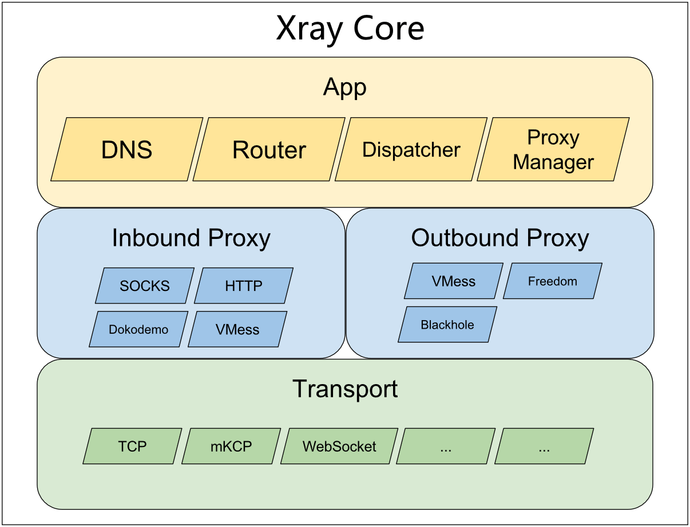

# Design Objectives

- Xray Kernel provides a platform that supports essential network proxy functions and can be developed upon to provide a better user experience.
- Cross-platform is the primary principle to reduce the cost of secondary development.

## Architecture

The kernel is divided into three layers: the application layer, the proxy layer, and the transport layer.

Each layer contains several modules, which are independent of each other. Modules of the same type can be seamlessly replaced.

### Application Layer

The application layer contains some commonly used functions in proxy layers, which are abstracted for reuse in different proxy modules.

The modules at the application layer should be implemented purely in software and should not be dependent on hardware or platform-related technologies.

List of Important Modules:

- Dispatcher: Used to transfer data received by the inbound agent to the outbound agent;
- Router: Routing module, see [Routing Configuration](../../config/routing.md) for details;
- DNS: Built-in DNS server module;
- Proxy Manager: Proxy manager;

### Proxy Layer

The proxy layer is divided into two parts: Inbound Proxy and Outbound Proxy.

The two parts are independent of each other, where the inbound proxy does not rely on a specific outbound proxy, and vice versa.

#### Inbound Proxy

- Implement the [proxy.Inbound](https://github.com/xtls/Xray-core/blob/main/proxy/proxy.go) interface;

#### Outbound Proxy

- Implement the [proxy.Outbound](https://github.com/xtls/Xray-core/blob/main/proxy/proxy.go) interface;

### Transport Layer

The transport layer provides a set of tools and modules related to network data transmission.
