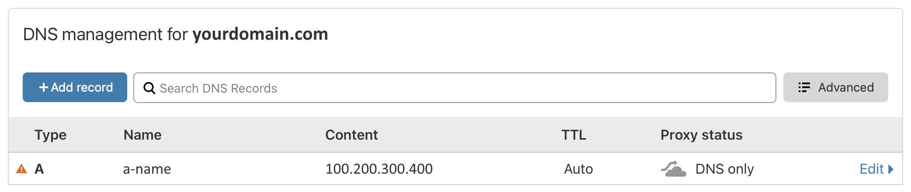

# [Chapter 2] Prerequisite and preparations

This chapter is rather special because it involves monetary transactions. This article takes a neutral stance on the project and does not make specific recommendations. What I can do is to tell you what you need to prepare.

## 2.1 Acquiring a VPS

You need to obtain a healthy VPS with an unblocked IP, and perform the following basic preparations in the management console:

1. Install Debian 10 64 bit Operating System on your VPS.
2. Note down the IP address of VPS  (this article will use `"100.200.300.400"` as an example, which is an intentionally incorrect and illegal IP address. Please replace it with your real IP address).
3. Note down the SSH remote login port of VPS.
4. Note down the username and password for SSH remote login.

Buying a VPS is a relatively complex matter. It is recommended to first learn the relevant knowledge and choose one that suits your own economic ability and network requirements. In addition, you can choose to take advantage of some benefits offered by tech giants (such as permanent free or limited-time free packages offered by Oracle Cloud Infrastructure and Google Cloud Platform). In any case, you must act within your means.

:::tip Explanation
Regarding the choice of Debian 10 as the operating system, let me elaborate a bit: No matter what you have heard online, no matter which guru has told you that XXX version of Linux is better or XXX version of Linux is more powerful, these sectarian disputes have **nothing to do with you right now**! Using Debian 10 is enough to optimize your VPS server for security, stability, and performance (such as using cloud-optimized kernel, timely support of BBR, etc.). After you become familiar with Linux, you can try other Linux distributions.
:::

## 2.2 Obtaining a Desired Domain Name

You need to obtain a domain name and add an A record in the DNS settings, pointing to the IP address of your VPS.

1. Please choose a reliable international domain name service provider. Choose some common domain name suffixes, and make sure not to use the `.cn` suffix.
2. In the DNS settings, add an A record pointing to the IP address of your VPS (the name of the A record can be anything, and in this article, it will be represented by `"a-name"`). The complete domain name will be represented by `"subdomain.yourdomain.com"` or `"a-name.yourdomain.com"`. The effect is as shown in the picture below:

::: tip
This is **not** a real usable website. Please replace it with your real website URL.
:::

## 2.3 Software you need to install on your local computer

1. SSH remote login tool

- Windows: [PuTTY](https://www.chiark.greenend.org.uk/~sgtatham/putty/latest.html)
  - macOS/Linux: Terminal

2. Remote file copying tool

- Windows: [WinSCP](https://winscp.net/eng/index.php)
  - macOS/Linux: Terminal

3. Reliable text editor
   - Windows/macOS/Linux: [VSCode](https://code.visualstudio.com)

## 2.4 Your Progress

If you have all the raw materials ready as mentioned above, you have already obtained the key to unlocking the door to a new world. So, what are you waiting for? Let's quickly move on to the next chapter and step through this door!

> ⬛⬛⬜⬜⬜⬜⬜⬜ 25%
