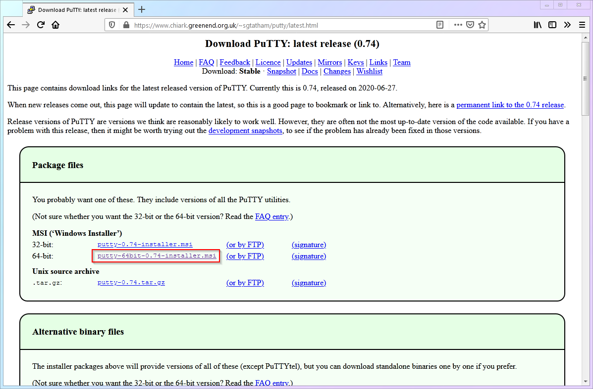
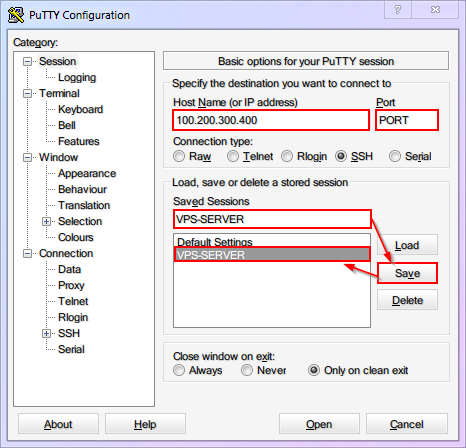
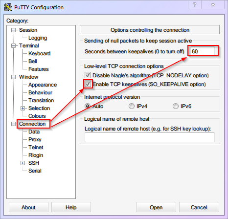
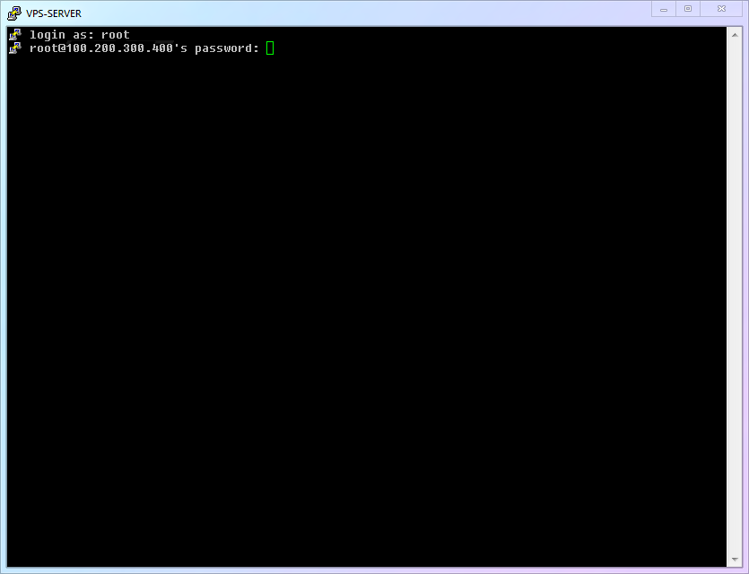
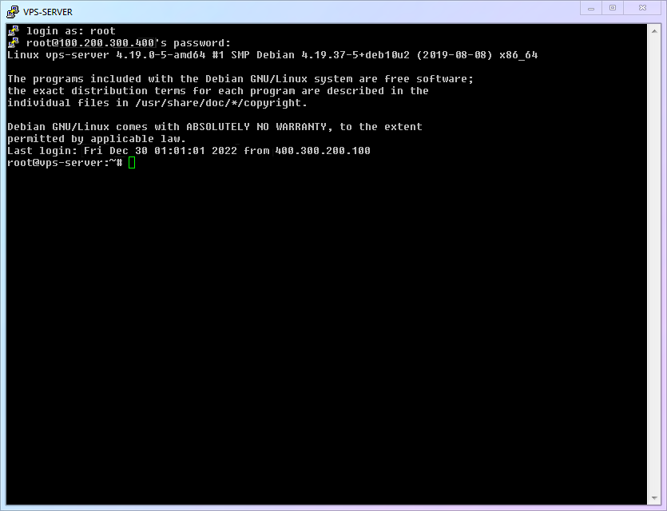
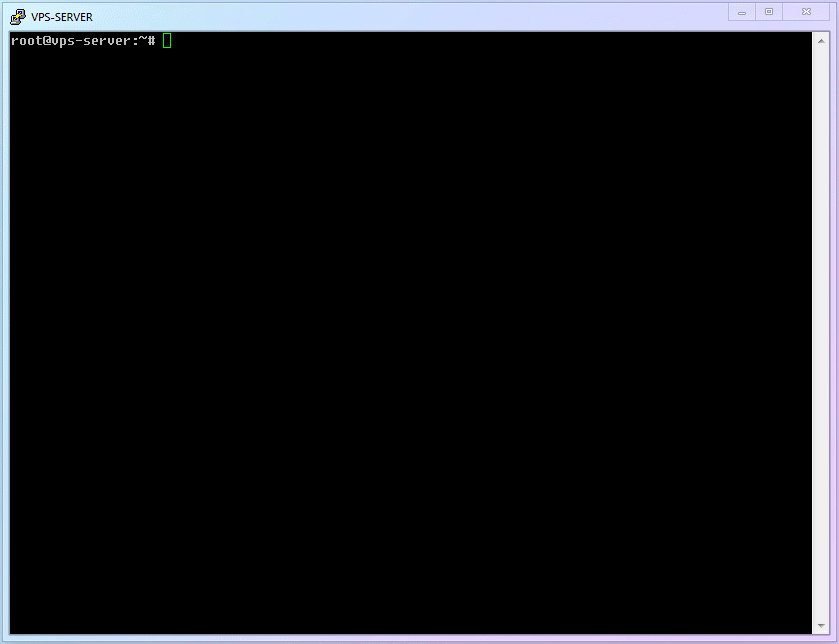

# [Chapter 3] Remote Login

## 3.1 Remote Login to VPS (PuTTY)

First of all, considering that the user base of Windows is the largest among the zero-based population, this article uses Windows as an example for demonstration.

Secondly, although PowerShell and WSL after Windows 10 can also achieve a good SSH operation experience, not all versions of Windows have the latest components. Therefore, this article uses the classic PuTTY as an example to provide a detailed explanation of SSH remote login operation. (If you use other tools, the operations after the SSH login are the same.)

Follow me step by step and let's start the operation.

1. Go to the [official website](https://www.chiark.greenend.org.uk/~sgtatham/putty/latest.html) of PuTTY and download the version that suits your operating system (this article uses the 64-bit version as an example).



2. After installation and running, you will see the main interface of PuTTY. Now please take out your notebook from the previous chapter where you wrote down the **IP address (VPS IP)** and **port (VPS PORT)** of your VPS in the corresponding positions of the following figure. In order to save time and avoid repeatedly entering these details in the future, we can save the session (Saved Sessions), and simply load it in the future with one click.



3. I suggest setting `keepalive` to `60` seconds in the `Connection` to prevent SSH from automatically disconnecting after a period of inactivity. Be sure to save the settings again.



::: warning Attention
Any update to the PuTTY configuration needs to be manually saved to the session again. Otherwise, it will be lost after closing.
:::

4. Click on Open to enter the SSH connection window, then enter the username and password corresponding to the following figure to establish a connection with your VPS remote host. (This article assumes that the default username is `root`. Also, when entering a password in the Linux system, there will be no prompt like `******`, which can avoid password length leakage. It's not that your keyboard is broken!)



## 3.2 Successfully Logging in SSH! Introduction to Command Line Interface!

1. If you have filled in your information correctly, you will see a similar interface as the picture below, indicating that you have successfully logged in:



This interface is equivalent to the "desktop" of a remote server, but it does not have familiar icons and a mouse, nor does it have colorful graphics. Instead, all you see is simple text. This is the "**Command Line Interface**" - shortened as `CLI`.

All the following operations require you to act like a hacker in a movie and complete them in this command-line interface. Maybe you will feel unfamiliar, but please believe me, using the command-line interface is neither scary nor mysterious. In the end, it just turns your familiar mouse operations into textual commands, **you say it, it does it**.

2. Now, you can observe and familiarize yourself with the command line environment a little bit. This interface has actually provided you with some useful information, such as the system kernel version (e.g. `4.19.37-5` in the picture), last login time and IP address. Of course, depending on the VPS, the interface you see may be slightly different.

3. Please pay attention to the line at the bottom of the command line, to the left of the flashing cursor, there is a string of characters. The one shown in the figure is `root@vps-server:~#`. How to understand this string? It's very simple:

- The current user is `root`
- The server where `root` is located is `vps-server`
- The current directory where `root` is located is `~`
- After `#` is the place where you can input commands.

The first two are pretty straightforward, no need to explain further. The third one is about the folder system in Linux. You don't need to go too deep into it for now. Just know that "`~`" represents **the home directory of the current user**. As for the fourth one, the prompt symbol "`#`", you don't need to worry about it either. Just know that in future articles, there will be some commands that you need to input, and they will be preceded by "`#`" or "`$`" to indicate **where you should input the command**. (So when you copy the command, **just copy the content after the prompt symbol** and don't copy the prompt symbol itself.)

## 3.3 Updating software on Linux for the first time!

1. Just like your phone, whether it's Android or iPhone, in order to keep your apps up-to-date (to get security patches and new features), you will occasionally receive update notifications from the app store, telling you how many apps need to be updated. Linux systems also have a similar update mechanism that works logically. So as long as you know how to update phone apps, you can learn how to update Linux software!

2. In Linux, each application is called a "package". The program that manages the applications is naturally called a "package manager". You can use it to install, update, and uninstall various software, and even update the Linux system itself. Package managers in Linux are very powerful, but we won't go into details here. For now, you only need to know that the package manager for the Debian system is called `apt`. Next, we will first use `apt` to do a comprehensive update of the software to familiarize you with its basic operations.

3. Tiny White Linux Basic Commands:

|  Number  | Command Name  |   Command Description    |
| :------: | :-----------: | :----------------------: |
| `cmd-01` | `apt update`  |  Query software updates  |
| `cmd-02` | `apt upgrade` | Perform software updates |

4. Now, please enter the first command to get update information.

```shell
apt update
```

This is a command used in a Linux terminal to update the package list from the repositories configured on the system.

5. Then enter the second command, and when asked if you want to continue installing `(Y/n)`, type `y` and press enter to confirm and start the installation.

```shell
apt upgrade
```

This is a command in the shell terminal to upgrade the installed packages on a Debian or Ubuntu Linux system.

6. The complete demonstration of the process is as follows:



## 3.4 Your Progress

**Congratulations on taking another solid step!** Now, you can log in to your remote server via SSH! After logging in, besides upgrading the software, what else should you do? Please enter the next chapter to find out!

> ⬛⬛⬛⬜⬜⬜⬜⬜ 37.5%
