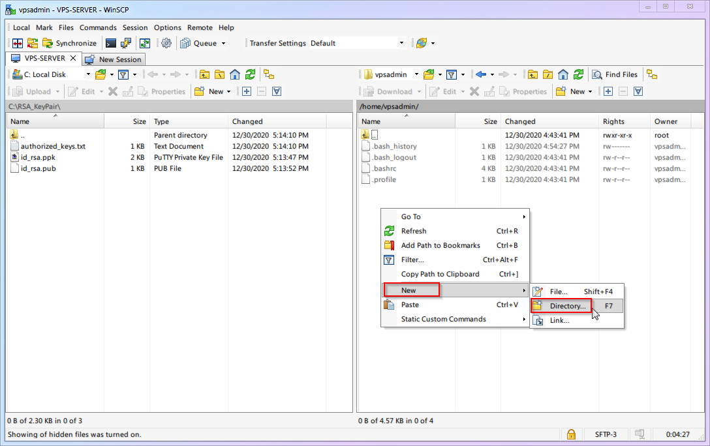

# [Chapter 4] Security Protection

## 4.1 Why Security Protection is Necessary

Security protection for Linux servers is a vast and complex topic. Countless websites, apps, services, and even offline infrastructure are built upon the foundation of Linux. Behind this lies enormous economic interest and commercial value, which naturally implies that the black/gray market has a huge motivation to attack. However, these services are so critical that major security vulnerabilities simply cannot be allowed. Consequently, countless operations professionals strive on the battlefield of security offense and defense, allowing everyone to enjoy a basically stable modern digital life.

Now that you own a VPS and will be opening up its data access channels to achieve traffic forwarding, you have effectively placed yourself on the front lines of this security battlefield, facing all risks directly. However, due to a lack of knowledge and information, newcomers often view security issues with polarized attitudes: they either feel it's trivial and has nothing to do with them, or they feel the weight is unbearable and live in constant fear.

* **For the former**, my advice is: No security matter is too small. Try to research security information as much as possible to avoid regretting it only after you have suffered a loss.
* **For the latter**, my advice is: Don't panic. Our servers generally don't hold high value and won't attract high-level targeted attacks. We mostly face malicious scanning and login attempts by automated scripts. Just follow this article to implement basic protections.

## 4.2 What Exactly Are the Specific Risks?

Just as we configured in the "Remote Login" chapter, anyone only needs to know four elements—**[IP Address] + [Port] + [Username] + [Password]**—to log into your VPS server. Obviously, the security of these four elements is the baseline we need to protect. Let's analyze them one by one:

1. **[IP Address]**: Malicious scripts randomly attempt and scan IP ranges. You can simply consider this public information; it cannot be hidden.
2. **[Port]**: If using the default port, then **[Port = `22`]**.
3. **[Username]**: If using the default user, then **[Username = `root`]**.
4. **[Password]**: There is no default password; it is definitely randomly generated by the VPS backend or set by you. This means if your server uses default settings, three of the four elements are already known. The security of your entire server relies entirely on a small string of passwords. Here are a few scenarios:
    * If you use the random password generated by the VPS panel, it usually contains a dozen mixed-case letters and symbols, which is relatively safe.
    * If, for the sake of memory, you changed the password to something ultra-weak like `123456`, cracking your VPS server would be effortless.
    * If, for the sake of memory, you changed the password to something complex but used elsewhere, it is essentially unsafe. You must understand that hackers have "cheat sheets," such as **Password Dictionaries**, containing tens of thousands to millions of leaked real passwords.

5. **But you must understand**, no hacker is actually sitting in front of a computer trying your password one by one. All attack attempts are carried out automatically by malicious scripts working 24/7. Perhaps while you are sound asleep, your server is enduring round after round of impacts.

    Once the password is successfully brute-forced, it means all your four elements are mastered by the attacker. The malicious script will quickly log in, obtain the highest `root` control of the server, install/deploy its malicious services, and then use your server to do various bad things 24 hours a day (such as mining, spreading viruses, sending spam/phishing emails, acting as a BT relay, or even becoming a public node for the dark web, etc.). If the malicious script is restrained, it can be quite stealthy. Since newcomers generally don't observe VPS login records, process changes, CPU usage, or traffic changes, it is difficult to discover that you have been hacked until your VPS provider bans your account or you receive a lawyer's letter.

6. **Don't forget**, you likely used real payment information to obtain the VPS, and you leave your IP address when logging into various websites and social platforms. These are directly or indirectly related to your identity. **Once these bad things happen, they will inevitably be linked to you.**

## 4.3 What Security Protections Will We Implement?

Based on the analysis above, what we need to do is naturally strengthen the **[Port]**, **[Username]**, and **[Password]** elements to reduce the risk of being breached:

1. **[Port]**: Change the SSH remote login port to a **[Non-22 Port]** (Section 4.4).
2. **[Username]**: Create a **[Non-root]** new user and disable root SSH remote login (Sections 4.5, 4.6).
3. **[Password]**: Enable SSH RSA key authentication and disable password authentication (Section 4.7).

Remember to follow the order so you don't lock yourself out.

## 4.4 Change SSH Remote Login Port to Non-22 Port

Now, let's solve the **[Port = `22`]** issue. (Note: Some VPS providers already use a non-22 port by default. You can skip this step or follow along to change it to another port).

1. **Newbie Linux Basic Commands:**

    | ID | Command Name | Command Description |
    | :---: | :---: | :---: |
    | `cmd-03` | `nano` | Text Editor |
    | `cmd-04` | `systemctl restart` | Restart a specific service |

2. **Newbie Linux Basic Configuration Files:**

    | ID | Config File Location | File Description |
    | :---: | :---: | :---: |
    | `conf-01` | `/etc/ssh/sshd_config` | SSH Remote Login Program Settings |

3. The first thing we need to do is **[Use the `nano` text editor to open the `SSH Remote Login Program Settings`]**. In Windows, you would "find the file and double-click it." What about in Linux? Look at the command description above; isn't it simple? That's right, it is:

    ```shell
    nano /etc/ssh/sshd_config
    ```

4. After the file opens, you enter the `nano` interface. Observe briefly, and you'll find that it displays important shortcut keys at the bottom of the screen (in the red box below). It's like an open-book exam; no need for rote memorization. Isn't that thoughtful?

    

5. The second thing we need to do is **[Find `Port` in the opened file and modify its port number]**. The number after `Port` is the SSH port. It is generally recommended to change it to an integer greater than `1024` and less than `65535` (this article uses `9753` as an example). Combining with `nano` shortcuts, how should we operate? As expected, you got it right again!
    * Use `ctrl+w` to enter search mode, then type `Port 22` and hit Enter.
    * Delete `22` and change it to `9753`.
    * **Note:** If the line starts with a `#`, it means this line is **[Not Effective]** (commented out). You can write a new one without `#` at the end of the file like I did, or just delete the `#`.

    ::: warning
    Using `9753` as an example in this article means that with the release of this article, this port will become a minor characteristic. It might be prioritized by attackers or interfered with/blocked by the GFW. Therefore, I strongly suggest you use a different port number you come up with yourself. After all, you have over 60,000 ports to choose from freely.
    :::

6. The third thing we need to do is **[Save the file and exit]**.
    * If you observed carefully in step 3, you'd notice that save isn't the common `ctrl+s`.
    * **Correct Shortcuts:** Save is `ctrl+o` + `Enter`, Exit is `ctrl+x`.
    * **(Some Operating Systems)** Add a firewall rule for the new SSH port; otherwise, you won't be able to login via SSH after the instance restarts.
    * Example for Ubuntu `ufw`:

    ```shell
    sudo ufw allow 9753/tcp
    ```

7. The final thing to do is **[Restart the SSH service to make changes take effect]**:

    ```shell
    systemctl restart ssh
    ```

    *Then try to open a new session in your SSH software to see if you can connect. If there are issues, you can modify the configuration via the old SSH session (the SSH session that was already open when sshd restarted will not be closed).*

8. Full process demonstration:

    

9. **Modify PuTTY Configuration**

    Now that the new port is effective, you must use `9753` the next time you log in with PuTTY. So, please go to PuTTY settings, change the port number, and **Save Session**. You know where to change it, right? (If not, re-read the previous content!)

## 4.5 Create a Non-root New User

Step two, let's solve the **[Username = `root`]** issue.

First, you need to understand that `root` in a Linux system is not just a simple administrator account. It is the **foundation** of the entire system, the master, the supreme god. Once the `root` account has a security issue, the entire system is at the mercy of others with nowhere to run. So follow me to operate:

1. **Newbie Linux Basic Commands:**

    | ID | Command Name | Command Description |
    | :---: | :---: | :---: |
    | `cmd-05` | `adduser` | Add a user to the system |
    | `cmd-06` | `apt install` | Install specific software |
    | `cmd-07` | `visudo` | Dedicated editor for modifying sudo permissions |

2. The first thing to do is **[Add a new user and set a login password]**. You can name it whatever you want; I will use `vpsadmin` as an example:

    ```shell
    adduser vpsadmin
    ```

    After executing the command, follow the prompts. **Be sure to set a user password** (don't forget that you won't see `******` when typing the password). Afterward, the system will ask for some additional user info; you can ignore these and just keep hitting Enter.

    

    ::: warning
    Using `vpsadmin` as an example means this username will also become a minor characteristic upon this article's release. Like the port, I strongly suggest you use a different username you create yourself.
    :::

3. Full process demonstration:

    

4. The second thing to do is **[Install the `sudo` function]** (`sudo` allows a standard account to temporarily gain the power of `root` at critical moments to save the world).

    ```shell
    apt update && apt install sudo
    ```

    Smart users may have noticed this line is actually two commands. The first half `apt update` you've seen and used before; it refreshes software version info. The latter `apt install` is the **[Install Command]**. Joined by `&&`, it means [Refresh available software, AND THEN install the latest version of the `sudo` program].

5. The third thing to do is **[Add the `vpsadmin` user to the `sudo` list, granting them eligibility to borrow `root` powers]**.

    ```shell
    visudo
    ```

    Under `User Privilege Specification`, add a line: `vpsadmin ALL=(ALL) NOPASSWD: ALL`.

    ::: warning
    I want to specifically explain the `NOPASSWD` setting. It means the `vpsadmin` user does not need to enter an extra password when using `root` privileges. **This is contrary to general security advice.** The reason I recommend this is that many newcomers ignore danger and persist in using the `root` account simply because they find repeatedly entering passwords annoying. Weighing the lesser of two evils, I believe **[The risk of using the `root` user directly]** is greater than **[The risk of not entering a password when using `sudo`]**, hence the recommendation.

    If you prefer to follow tradition and enter a password every time you use `sudo`, change that line to `vpsadmin ALL=(ALL:ALL) ALL`.
    :::

6. Full process demonstration:

    

## 4.6 Disable Root SSH Remote Login

1. Now you are getting familiar with Linux, so let's have you think: what is the first thing we need to do? Correct, it is still **[Use the `nano` editor to open `SSH Remote Login Program Settings`]**. What? Can't remember how? Go review the content above and come back! ... Correct Answer:

    ```shell
    nano /etc/ssh/sshd_config
    ```

2. Find the `PermitRootLogin Yes` item, and change its setting to `no`. Remember how? ... Correct Answer:
    * Use `ctrl+w` to enter search mode, type `PermitRootLogin`, and Enter.
    * Delete `yes` and change it to `no`.

3. Save the file and exit. Remember how? ... Correct Answer:
    * Save is `ctrl+o`, then `Enter` to confirm.
    * Exit is `ctrl+x`.

4. Restart the SSH service to make changes take effect. Remember... Never mind, here is the answer:

    ```shell
    systemctl restart ssh
    ```

5. Full process demonstration:

    

6. Next time you log in via PuTTY, the `root` user will no longer connect; you must switch the username to `vpsadmin`! For convenience, set `vpsadmin` as the default login username in PuTTY. (Nagging Note: Don't forget to Save Session).

    

## 4.7 Use RSA Key Login and Disable Password Login

Step three, let's solve the problem of the **[Password]** potentially being brute-forced.

As mentioned earlier, hackers don't stupidly try every combination; they use cheat methods like "password dictionaries." Unless you use a randomly generated ultra-long password (via 1Password, macOS Keychain, etc.), you are easily vulnerable.

While ultra-long random passwords improve security, they are basically impossible to memorize and tedious to type manually. To solve this dilemma, we can abandon **[Password Authentication]** and switch to the more secure **[Key Authentication]**.

**[Key Authentication]** involves generating a **[Pair]** of related key files (Public Key and Private Key). You upload the **[Public Key]** to the VPS. Every time you log in, SSH matches the **[Public Key]** with the **[Private Key]**. If the validation confirms it is the correct **[Key Pair]**, authentication passes. (In other words, you don't need to remember or type complex passwords; you just need to protect the **[Private Key]** file from leaking).

::: warning
This article uses `RSA` keys as an example because `RSA` has a long history of support across various devices and SSH clients, and it currently provides sufficient security. However, it is by no means the only choice.

Other common keys include:

* `DSA` - Mathematically proven insecure. Never use it.
* `ECDSA` - Small key size, high security, but its algorithm is suspected of having an NSA backdoor. If you have things on your VPS the NSA cares about, don't use it.
* `Ed25519` - An algorithm very similar to `ECDSA` with similar performance benefits. Its documentation is fully public, so it is generally considered backdoor-free.

Therefore, if your devices and software support it, I recommend prioritizing `Ed25519` keys.
:::

Now, let's configure **[Key Authentication]**!

1. Run `PuTTYgen` (PuTTY Key Generator). Location: `Start Menu` --> `All Programs` --> `PuTTY (64-bit)` --> `PuTTYgen`.
    1. Click `Generate` to start (move your mouse randomly in the blank area to increase randomness).

        

    ::: warning
    The image uses a `2048` bit `RSA` key as an example. However, to achieve security equivalent to `ECDSA/Ed25519` `256` bit keys, you need to use a `3072` bit `RSA` key (change the number in the bottom right to `3072`).
    :::

    1. You can set a password for the private key to add a layer of security.
    2. Click `Save public key` to save the public key, name it `id_rsa.pub`.
    3. Click `Save private key` to save the private key, name it `id_rsa` (PuTTY private keys come with a `.ppk` extension).
    4. **Most Importantly:** Scroll down and copy **all** the content in the red box above, save it as a file named `authorized_keys`. (Saving with vscode might default to a `.txt` extension; that's fine, we will remove the extension when uploading to VPS).

    

2. **Upload the public key to the `vpsadmin` user on the VPS.**
    1. This step requires `WinSCP` which we prepared earlier.
    2. Download and install from the [official site](https://winscp.net/eng/index.php). It will prompt you to import PuTTY settings; do it!

        

    3. If it doesn't prompt or you installed it earlier, configure it as shown below.

        

    4. The left directory in WinSCP is your local computer; locate the folder where your keys are.
    5. The right directory in WinSCP is the VPS. Default is `/home/vpsadmin/`. Click `X hidden` in the bottom right to show hidden files.

        

    6. Right-click on the right side (VPS) and create a new folder named `.ssh` (Note the dot `.`).

        

    7. Upload the **[Public Key]** `authorized_keys` into the `.ssh` folder.

        

    8. During upload (or after), rename `authorized_keys.txt` to `authorized_keys` (remove the `.txt` extension).

        

    9. Full process demonstration:

        

3. **Configure VPS to Enable RSA Key Login and Disable Password Login.**
    1. **Newbie Linux Basic Commands:**

        | ID | Command Name | Command Description |
        | :---: | :---: | :---: |
        | `cmd-08` | `sudo` | Run a command with `root` privileges |
        | `cmd-09` | `chmod` | Change permissions of target file/folder |

    2. Remote SSH into your VPS (PuTTY).
    3. Change permissions of `authorized_keys` to `600` (Read/Write for owner only).

        ```shell
        chmod 600 ~/.ssh/authorized_keys
        ```

    4. Modify SSH Configuration. We've done this many times, but now we are the normal user `vpsadmin`, not the omnipotent `root`. We don't have permission to edit SSH config directly. We need the `sudo` command:

        ```shell
        sudo nano /etc/ssh/sshd_config
        ```

    5. Find (`ctrl+w`) `PasswordAuthentication` and change it to `no`.
    6. Find (`ctrl+w`) `PubkeyAuthentication` and change it to `yes`. Save (`ctrl+o`) and Exit (`ctrl+x`).
    7. Restart SSH service. (Nagging Note: Don't forget you need `sudo` for permission now).

        ```shell
        sudo systemctl restart ssh
        ```

    8. Full process follows:

        

4. **Configure PuTTY to use the Private Key.**
    The VPS side has the public key. Now specify the private key location for PuTTY to use during login (Nagging Note: Don't forget to Save Session).

    

5. At this point, **[Key Login]** is enabled, **[Password Authentication]** is disabled, and PuTTY has the default username and private key saved. In the future, just load the `VPS-SERVER` config in PuTTY and click `Open` for one-click login.

    If you set a password for your private key, you will need to enter that passphrase to unlock the key when logging in, as shown below:

    

6. Don't forget to configure the key for `WinSCP` as well, otherwise, you won't be able to log in to transfer files later:

    

::: warning
Any software that needs to log in via SSH will now require key authentication. There are too many software options to show individually, so please configure them yourself according to your needs.
:::

## 4.8 Your Progress

Up to this point, your VPS has completed the basic security guarantees for the three elements: **[Port]**, **[Username]**, and **[Password]**. While far from impregnable, common malicious scripts should no longer be able to harm you!

Now we finally have a secure system foundation. In the next chapter, we can start gradually installing and configuring the infrastructure required for Xray! (What infrastructure? A webpage, a certificate).

> ⬛⬛⬛⬛⬜⬜⬜⬜ 50%
