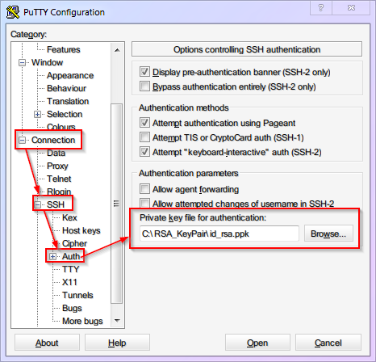
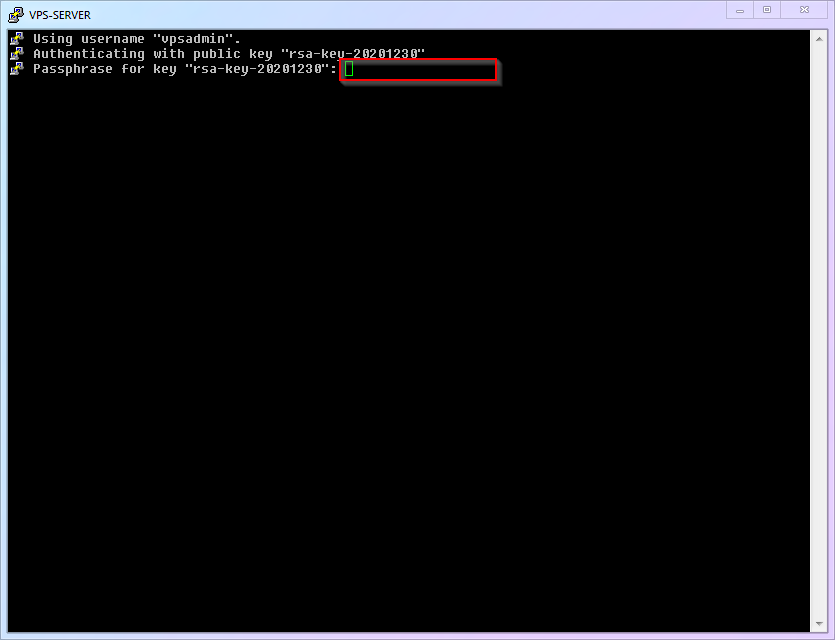

# [Chapter 4] Security and Protection

## 4.1 Why Do We Need Security Protection?

Security protection for Linux servers is a complex and huge subject. Countless websites, apps, services, and even offline infrastructure are built on the foundation of Linux, which involves huge economic benefits and commercial value. This also means that there is a huge motivation for black and gray industries to launch attacks. However, these services are so important that major security vulnerabilities are not allowed. Therefore, countless operation and maintenance professionals are working hard on the battlefield of security attacks and defense, which enables us to enjoy a basic stable modern digital life.

Now, you have a VPS and will open its data access channel to achieve the goal of traffic forwarding, which means you are now on the front line of the security battle and face all risks. However, at the same time, newcomers tend to have a polarized view of security issues due to lack of knowledge and information: either they feel it is as light as a feather and has nothing to do with them, or they feel it is as heavy as Mount Tai and feel anxious all day long.

- For the former, my suggestion is: safety is of utmost importance. Try to gather more information on safety issues to avoid regretting after experiencing losses.

- For the latter, my suggestion is: don't worry too much, our servers still don't have too much value and generally won't attract high-level attacks. The basic threats we need to face are mostly malicious scans and login attempts from some automated scripts. Just follow this article to do some basic protection.

## 4.2 What are the specific risks

Just like the configuration we did in the "Remote Login" section, anyone who knows the four elements of [IP address] + [port] + [username] + [password] can log in to your VPS server. So obviously, the security of these four elements is the bottom line that we need to protect. Let's analyze them one by one:

1. [IP Address]: Malicious scripts randomly attempt to scan IP ranges, which can be regarded as public information and cannot be hidden.

2. [Port]: If you are using the default port, then [Port = `22`].

3. [Username]: If using the default user, then [Username = `root`]

4. [Password]: There is no default value for the password. It must be randomly generated by the VPS backend or set by you. In other words, if all the settings of your server are default, then three of the four elements are already known. Therefore, the security of your entire server relies on a small password. In this case, there are several situations:

- If you use a VPS management background to generate passwords randomly, it usually contains random uppercase and lowercase letters, symbols, and is relatively secure.

- If you changed your password to something super weak like `123456` just for the sake of easy memorization, hacking into your VPS server would be a piece of cake.

- If you change your password to a more complex one that you have used elsewhere just for the sake of easy memory, it is not really safe. You should understand that hackers have cheats in their hands, such as `password tables`, which contain tens of thousands, hundreds of thousands, millions, or even more real leaked passwords.

5. But you should understand that no hacker really sits in front of a computer and tries your password repeatedly. All attack attempts are carried out automatically by malicious scripts, which work tirelessly for 24 hours. Perhaps while you are sleeping soundly every night, your server is enduring round after round of attacks.

Once the password is successfully cracked, it means that all four of your elements have been mastered by the attacker. The malicious script will quickly log in to the server, obtain the highest `root` control of the server, install and deploy its malicious services, and then use your server to do all kinds of bad things 24 hours a day (such as mining, spreading viruses, sending spam emails, fraudulent emails, acting as a BT relay, and even dark web public nodes, and so on). If the malicious script is relatively restrained, it can actually achieve considerable concealment. Generally, newcomers will not observe and pay attention to indicators such as login records, process changes, CPU usage changes, and traffic changes of the VPS, so it is difficult for you to discover that you have been hacked. Until your VPS service provider blocks your account or you receive a lawyer's letter.

6. Don't forget that when you obtain a VPS, you probably need to use your real payment information, and when you log in to various websites and social platforms, your IP address will also be recorded, which has a direct or indirect relationship with your identity. Therefore, once these bad things happen, they will inevitably be associated with you.

## 4.3 What security measures do we need to take

Based on the above analysis, what we need to do is to strengthen the three elements of [port], [username], and [password] to reduce the risk of being hacked.

1. [Port]: Modify the SSH remote login port to a [non-22 port] (4.4).
2. [Username]: Create a [non-root] new user and disable root user SSH remote login (4.5, 4.6).
3. [Password]: Enable RSA key verification for SSH login and disable password verification login (4.7).

Remember to follow the order and don't lock yourself out.

## 4.4 Change the SSH Remote Login Port to a Non-22 Port

Now, let's solve the problem of "port = `22`". (Note: some VPS service providers have non-22 ports set as default, so you can ignore this step if that's the case. Of course, you can also follow this article to change it to another port.)

1. Basic commands of Little White Linux:

|    ID    |    Command Name     |    Description    |
| :------: | :-----------------: | :---------------: |
| `cmd-03` |       `nano`        |    Text editor    |
| `cmd-04` | `systemctl restart` | Restart a service |

2. Basic Configuration Files of Little White Linux

|  Number   | Configuration File Location |         File Description          |
| :-------: | :-------------------------: | :-------------------------------: |
| `conf-01` |   `/etc/ssh/sshd_config`    | SSH Remote Login Program Settings |

3. The first thing we need to do, of course, is to [open the SSH remote login program settings with the text editor `nano`]. In Windows, you will [find the file and double-click] it. What should you do in Linux? Take a close look at the command instructions above, isn't it simple? Yes, it is:

```shell
nano /etc/ssh/sshd_config
```

This is a command in the shell terminal to open the `sshd_config` file located in the `/etc/ssh/` directory using the `nano` text editor.

4. Once the file is opened, you will enter the interface of `nano`. After observing for a while, you will find that it displays important shortcut keys at the bottom of the screen (enclosed in a red box in the figure below). You can take the exam directly without memorizing them, which is very user-friendly, isn't it?


5. The second thing we need to do is to **find the `Port` item in the opened file and modify its port**. The number after `Port` is the SSH port. It is generally recommended to change it to an integer greater than `1024` and less than `65535` (this article takes `9753` as an example). Please think about how to operate it with the shortcut keys of `nano`. You are right again! It is:

- Use `ctrl+w` to enter search mode, then type `Port 22` and press Enter
- Delete `22` and replace it with `9753`
- Note: If this line starts with `#`, it means that this line is [commented out] and [does not take effect]. You can write a new line at the end of the file without `#`, or delete the `#` to enable this line.

::: warning
This article uses `9753` as an example, which means that with the release of this article, this port will become a feature that may be prioritized or blocked by attackers or the Great Firewall of China. Therefore, I strongly recommend that you use another port that you come up with yourself, after all, you have over 60,000 ports to choose from freely.
:::

6. The third thing we need to do is to [save the file and exit].

- If you observed carefully in step 3, you would have noticed that saving is not done by the common `ctrl+s`.
- The correct shortcut keys: save is `ctrl+o` + `enter`, and exit is `ctrl+x`.
- (For some operating systems) Add a firewall rule to set the new SSH port, otherwise, you won't be able to log in via SSH after the instance restarts.
- For example, on Ubuntu using ufw.

```shell
sudo ufw allow 9753/tcp
```

7. The last thing we need to do is to [restart the SSH service to make the changes take effect].

```shell
systemctl restart ssh
```

Then you can try opening a new session in your SSH software to check if you can connect. If there are any issues, you can modify the configuration through the old SSH session (SSH connections that are already open will not be closed when restarting sshd).

8. The complete process demonstration is as follows:


9. Modify PuTTY Configuration

"Now that the new port is in effect, you will need to use `9753` the next time you log in with PuTTY. So please go to the PuTTY settings to change the port number and save the session. Well, you should know where to change it, right? (If you don't know, you need to reread the previous content!)"

## 4.5 Creating a New User Without Root Access

In the second step, let's solve the issue of the username being `root`.

Firstly, you need to understand that `root` in Linux system is not just a simple administrator account. It is the foundation of the entire system, the ruler and the supreme god of the system. Once the `root` account has security issues, the entire system will be vulnerable and there will be nowhere to hide. So, let's follow me to carry out the operations:

1. Little White Linux Basic Commands:

|  Number  | Command Name  |                Command Description                |
| :------: | :-----------: | :-----------------------------------------------: |
| `cmd-05` |   `adduser`   |            Add new user to the system             |
| `cmd-06` | `apt install` |            Install a software package             |
| `cmd-07` |   `visudo`    | Special editor to modify sudo permission settings |

2. The first thing we need to do is to [add a new user and set a login password]. You can choose any name you want, here I will use `vpsadmin` as an example:

```shell
adduser vpsadmin
```

This is a command in the shell terminal to add a new user named "vpsadmin".

After executing the command, follow the prompts to operate. Be sure to set a user password (remember that you won't see `******` when setting the password). Afterwards, the system will ask you for some additional user information, which can be ignored by pressing Enter all the way.


::: warning
This article takes "vpsadmin" as an example, which means that with the release of this article, this username will also become a significant feature, and may be the first choice for attackers to try. Therefore, just like ports, I strongly recommend that you use another username that you come up with yourself.
:::

3. The complete process demonstration is as follows:


4. The second thing we need to do is to install the `sudo` function (which allows ordinary accounts to temporarily obtain the power of `root` at critical moments and unleash their full power to save the world).

```shell
apt update && apt install sudo
```

This is a shell command to update the package list and install the "sudo" package.

You may have noticed that this command actually consists of two commands. The first half, `apt update`, you have seen and used before, is to refresh the software version information on the server. The latter half, `apt install`, is the installation command that will be used this time. The two commands are connected together to instruct the system to refresh the latest available software and then install the latest version of the `sudo` program. `&&` is used to link the two commands together for execution.

5. The third thing we need to do is to add the `vpsadmin` user to the `sudo` list, so that they have the privilege to borrow the power of `root`.

```shell
visudo
```

(Note: `visudo` is a command used in Linux/Unix systems to edit the sudoers file, which specifies which users or groups are allowed to run certain commands with administrative privileges.)

Simply add the following line under `User Privilege Specification`: `vpsadmin ALL=(ALL) NOPASSWD: ALL`.

::: warning
I want to specifically explain the setting of `NOPASSWD`. It means that when the `vpsadmin` user temporarily uses the `root` permission, no additional password needs to be entered. This is contrary to general security recommendations. The reason why I recommend this is that many newcomers insist on using the `root` account because they feel relaxed when using `root` without repeatedly entering passwords. "Choosing the lesser of two evils," I believe that the risk of [directly using the `root` user] is greater than the risk of [not entering a password when using `sudo`], so I made the above suggestion.

If you want to follow the traditional practice and enter a password every time you use `sudo`, then you can change this line to `vpsadmin ALL=(ALL:ALL) ALL`.

6. The complete process demonstration is as follows:


## 4.6 Disabling SSH Remote Login for Root User

1. Now that you're gradually getting familiar with Linux, it's time for you to think. What's the first thing we need to do? That's right, it's still to use the `nano` editor to open the `SSH remote login program settings`. What? You can't remember how to do it? Then go back and review the content above and come back! ............ Correct answer:

```shell
nano /etc/ssh/sshd_config
```

This is a command line instruction to open and edit the `sshd_config` file located at `/etc/ssh/` using the `nano` text editor.

2. Find the line `PermitRootLogin Yes`, and change the value after it to `no`. Do you remember how to do it? ............ Correct answer:

- Use `ctrl+w` to enter search mode, then enter `PermitRootLogin` and press enter.
- Delete `yes` and change it to `no`.

3. Save the file and exit. Do you remember how to do it? ............ Correct answer: N/A (The correct answer is not provided in the given text.)

- Save is `ctrl+o`, then press `Enter` to confirm.
- Exit is `ctrl+x`.

4. Restart the ssh service to make the changes take effect. Do you remember...? Never mind, let's just reveal the correct answer:

```shell
systemctl restart ssh
```

(This is a Linux shell command to restart the SSH service.)

5. The complete process is demonstrated as follows:


6. Next time you log in remotely via SSH using PuTTY, you will no longer be able to connect as the `root` user. You will need to use the username `vpsadmin` instead. For convenience, you can set `vpsadmin` as the default login username in PuTTY. (Tip: Don't forget to save the session.)


## 4.7 Login with RSA Key and Disable Password Login

In the third step, we will solve the problem of the password being cracked.

As mentioned earlier, hackers are not foolish enough to crack your password by brute force, but rather they use cheating methods such as "password tables". Unless you use a randomly generated super long password (such as with 1Password, or macOS keychain and other password management tools), it's easy to fall victim to this.

Although a very long random password can improve security, it is usually difficult to remember and manually enter, which can also lead to mistakes. To solve this problem, we can simply abandon the "password verification" method and switch to a more secure "key verification" method.

The so-called "key authentication" refers to generating a pair of related key files (public key and private key), uploading the "public key" to the VPS for backup. Each time you log in, SSH will match the "public key" and "private key". If the verification is correct, the "key pair" will be verified and the authentication will pass. (In other words, you don't need to remember and enter complex passwords, just protect the "private key" file from being leaked.)

::: warning
This article uses `RSA` keys as an example because `RSA` keys have a long history of support in various devices and `SSH` clients and can still provide sufficient security. However, it is not the only choice available.

Other common keys include:

- `DSA` - It has been mathematically proven to be insecure, so never use it.
- `ECDSA` - It has high security with small keys, but its algorithm is suspected to have a backdoor by the NSA. If there is something on your VPS that is worth the attention of the NSA, do not use it.
- `Ed25519` - This is an algorithm that is very similar to `ECDSA`, and it has similar performance advantages. At the same time, all of its documentation is public, so it is generally considered to be free of backdoors.

So, if your device and software both support it, I recommend choosing `Ed25519` keys as a priority.
:::

Now let's configure the [Key Authentication]!

1. Run `PuTTYgen` (PuTTY Key Generator). The location is `Start Menu` --> `All Programs` --> `PuTTY (64-bit)` --> `PuTTYgen`.

1. Click on `Generate` to start the generation process (move the mouse randomly in the blank area of the interface to add random numbers).


::: warning
The example in this image is based on a `2048`-bit `RSA` key. However, in reality, if you want to achieve the same level of security as a `256`-bit key for `EDCSA/Ed25519`, you need to use a `3072`-bit `RSA` key. (i.e., change the number in the bottom right corner to `3072`)
:::

2. You can add a password to your private key to increase security.
3. Click on `Save public key` to save the public key with the file name `id_rsa.pub`.
4. Click on `Save private key` to save the private key with the file name `id_rsa` (PuTTY private keys come with the `.ppk` extension).
5. Most importantly, copy and save all the content inside the red box below by scrolling down, with the file name `authorized_keys`. (If you save it using vscode, it will be saved as a text file with a `.txt` extension, which is fine. We will remove the extension when uploading it to VPS later.)


2. Upload the public key to the "vpsadmin" user on the VPS.

1, This step requires the use of the previously prepared `WinSCP`.

2, Go to the [official website](https://winscp.net/eng/index.php) to download and install. It will prompt you to import PuTTY settings, and of course, you can import them with one click!


3, If there is no prompt for import or you have already installed it in advance, configure it according to the following figure.


4, The directory on the left side of WinSCP is the folder and files on your local computer. Please locate the folder where the key is stored.

5, The directory on the right side of WinSCP is the folder and files on the VPS server, which are located in the `/home/vpsadmin/` folder by default. To display hidden files, please click on `X hidden` in the lower right corner.


6, Right-click on the right side (in VPS) and create a new folder named `.ssh` (note the period at the beginning).


7, Upload the [public key] `authorized_keys` to the `.ssh` folder.


8, When uploading, rename the [public key] from `authorized_keys.txt` to `authorized_keys` (remove the `.txt` extension).


9, The complete process demonstration is as follows:


3. Enable RSA key authentication for SSH login and disable password authentication login on the VPS side.

- Basic Linux Commands:
  | Number | Command | Description |
  | :------: | :-----: | :-----------------------------------------------: |
  | `cmd-08` | `sudo` | Run a command with `root` privileges |
  | `cmd-09` | `chmod` | Change the permissions of a target file/directory |
- SSH remote connection to VPS (PuTTY)
- Change the permission of the `authorized_keys` file to `600` (only the owner can read and write).

```shell
chmod 600 ~/.ssh/authorized_keys
```

This is a command in shell script to change the permissions of the `authorized_keys` file to `600` for the current user's SSH directory (`~/.ssh/`).

4. Modify SSH configuration. We have used this many times, but now that we have changed from the almighty `root` to the ordinary user `vpsadmin`, we do not have the permission to edit SSH configuration directly. At this time, we need to use the `sudo` command:

```shell
sudo nano /etc/ssh/sshd_config
```

(This is a command in the shell/terminal to open the sshd_config file located in the /etc/ssh/ directory with the sudo privilege using the nano text editor.)

5. Find (`ctrl+w`) `PasswordAuthentication` and change it to `no`.

6. Find (`ctrl+w`) `PubkeyAuthentication`, change it to `yes`, then save (`ctrl+o`) and exit (`ctrl+x`).

7. Restart the SSH service. (Note: Don't forget to use `sudo` to gain permission.)

```shell
sudo systemctl restart ssh
```

This is a command in the shell terminal to restart the SSH service with root privileges using the `systemctl` command.

8. The complete process is as follows:


4. The public key has been set up on the VPS end. Now we need to specify the private key location for PuTTY to use when logging in. (Reminder: Don't forget to save the session.)



5. Now, the [Key-based login] has been successfully enabled, [Password authentication] has been successfully disabled, and the default login username and private key have been saved for PuTTY. In the future, when using PuTTY to log in, simply load the `VPS-SERVER` configuration, click `Open`, and you can log in with just one click.

If you have set a password for your private key, you need to enter this password to use the key when logging in, as shown in the following figure:



6. Don't forget to set the corresponding key for `WinSCP`, otherwise you won't be able to log in when you want to transfer files later.


::: warning
Any software that requires SSH login needs key verification. As there are too many software, it is impossible to show them one by one. Please set it up according to your needs.
:::

## 4.8 Your Progress

Up to this point, your VPS has completed the basic security measures of [port], [username], and [password]. Although it is not completely impregnable, most malicious scripts should no longer be able to harm you.

Now that we finally have a secure system foundation, in the next chapter, we can start step by step to install and configure the infrastructure that Xray needs! (What infrastructure? A web page, a certificate)

> ⬛⬛⬛⬛⬜⬜⬜⬜ 50%
