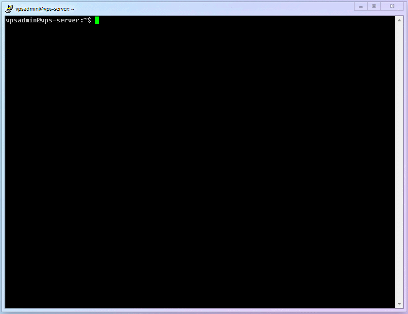

# Chapter 5: Website Building

## 5.1 Why should you create a website?

Some newcomers may be confused: why do I need to build a website for securing an open digital environment? I don't know how to code! Isn't it very complicated?

First, let's answer the first question. The reasons for building a website are:

1. Apply for a legitimate TLS certificate (very important)
2. Provide reasonable fallback to prevent active probing attacks and improve security
3. Set up a camouflage site (such as a blog, private cloud storage, multimedia site, game site, etc.) with a reasonable frontend when directly accessed, making traffic usage look more legitimate.

Now let's answer the second question:

1. As a demonstration, this article uses only the simplest "single-file HTML page + Nginx" setup to achieve the above objectives, so it is **very easy**.
2. This website can not only be used for camouflage but also for real development and growth. The complexity depends entirely on you.
3. For the goals of "camouflage" and "website operation", uniqueness and personalization are needed. Students who need this can search and learn by themselves. This content has completely deviated from scientific online access, so this article will not go into depth.

## 5.2 Log in to VPS, install and run Nginx

1. Here we use commands that have been explained in detail before, so they won't be repeated. If you don't understand, please refer to the previous chapters.

   ```shell
   sudo apt update && sudo apt install nginx
   ```

2. After completion, Nginx will automatically run. Open the browser on Windows and enter `http://100.200.300.400:80`. If you see the interface shown below, it means Nginx is running normally.

   

## 5.3 Create the simplest web page

1. Basic Linux commands for beginners:
   | No. | Command Name | Command Description |
   | :------: | :----------------: | :-----------------------: |
   | `cmd-10` | `mkdir` | Create a new folder |
   | `cmd-11` | `systemctl reload` | Reload a specific service |

2. Basic Linux configuration files for beginners:
   | No. | Configuration File Location | File Description |
   | :-------: | :-------------------------: | :--------------------: |
   | `conf-02` | `/etc/nginx/nginx.conf` | Nginx program settings |

3. Create a dedicated folder `/home/vpsadmin/www/webpage/` for the website and create the web page file `index.html`
   ```shell
   mkdir -p ~/www/webpage/ && nano ~/www/webpage/index.html
   ```

::: warning
If you are not using the username `vpsadmin`, please be sure to understand the meaning of the "~" symbol in this command (this is related to Step 5 content):

- If it is a **non-root user**, "~" is equivalent to `/home/username`
- If it is a **root user**, "~" is equivalent to `/root`
  :::

4. Copy the entire content below, save (`ctrl+o`) and exit (`ctrl+x`).

   ```html
   <html lang="">
     <!-- Text between angle brackets is an HTML tag and is not displayed.
           Most tags, such as the HTML and /HTML tags that surround the contents of
           a page, come in pairs; some tags, like HR, for a horizontal rule, stand
           alone. Comments, such as the text you're reading, are not displayed when
           the Web page is shown. The information between the HEAD and /HEAD tags is
           not displayed. The information between the BODY and /BODY tags is displayed.-->
     <head>
       <title>Enter a title, displayed at the top of the window.</title>
     </head>
     <!-- The information between the BODY and /BODY tags is displayed.-->
     <body>
       <h1>Enter the main heading, usually the same as the title.</h1>
       <p>Be <b>bold</b> in stating your key points. Put them in a list:</p>
       <ul>
         <li>The first item in your list</li>
         <li>The second item; <i>italicize</i> key words</li>
       </ul>
       <p>Improve your image by including an image.</p>
       <p>
         
       </p>
       <p>
         Add a link to your favorite
         <a href="https://www.dummies.com/">Web site</a>. Break up your page
         with a horizontal rule or two.
       </p>
       <hr />
       <p>
         Finally, link to <a href="page2.html">another page</a> in your own Web
         site.
       </p>
       <!-- And add a copyright notice.-->
       <p>© Wiley Publishing, 2011</p>
     </body>
   </html>
   ```

5. Modify `nginx.conf` and restart the `Nginx` service, directing the http access on port 80 to the newly created `html` page.

   1. Modify `nginx.conf`.

      ```shell
      sudo nano /etc/nginx/nginx.conf
      ```

   2. Add the following content inside`http{}`, then save (`ctrl+o`) and exit (`ctrl+x`). (Remember to replace the domain name with the real domain name you prepared earlier, including the subdomain)

      ```
              server {
                      listen 80;
                      server_name subdomain.your_domain.com;
                      root /home/vpsadmin/www/webpage;
                      index index.html;
              }
      ```

      ::: warning Be extra careful!
      As mentioned in Step 3 of section 5.3, make sure to change `/home/vpsadmin/www/webpage` to your actual file path.
      :::

   3. Make `nginx` reload the configuration to take effect.

      ```shell
      sudo systemctl reload nginx
      ```

   4. The complete setup process is as follows:

      

   5. Now, if you visit `http://subdomain.your_domain.com`, you should see this page, indicating success:

      

## 5.4 Common error explanations

First of all, if you follow the instructions in the article step by step and are careful enough, you will definitely not encounter any errors. So, I don't intend to change how this article is written.

Then why do some students still get stuck at this step, and the web page just won't open? There are basically two words: **carelessness**. Because there are only two possible issues with the configuration here, and there are only two reasons for them.

I. Two types of issues:

- In `nginx.conf`, the `/home/vpsadmin/www/webpage` does not match the actual file path; `nginx` cannot find the file
- The path is correct, but `nginx` doesn't have permission to access it

II. Two reasons:

- Use a **non-root user** but still directly copy the commands in the text without modification. (This is basically like copying the name of another student when copying answers)
- Insist on using a **root user**

If you encounter any errors, please carefully review the explanations in Steps 3 and 5-2 of Section 5.3.

::: warning
In the early stages of this article, a lot of space has been devoted to explaining the importance of using a **non-root user** for security, and the entire article is written based on this premise. So, issues caused by using a **root user** are not within the scope of this article.

But I believe that students who persist in using the `root` user should have their own opinions, strong hands-on ability, or have a certain foundation in Linux. I have already explained the crux of the problem, and I believe you can solve it on your own.

## 5.5 Your Progress

So far, Xray's first infrastructure [webpage] has been established. Let's now move on to the second infrastructure [certificate]!

> ⬛⬛⬛⬛⬛⬜⬜⬜ 62.5%
