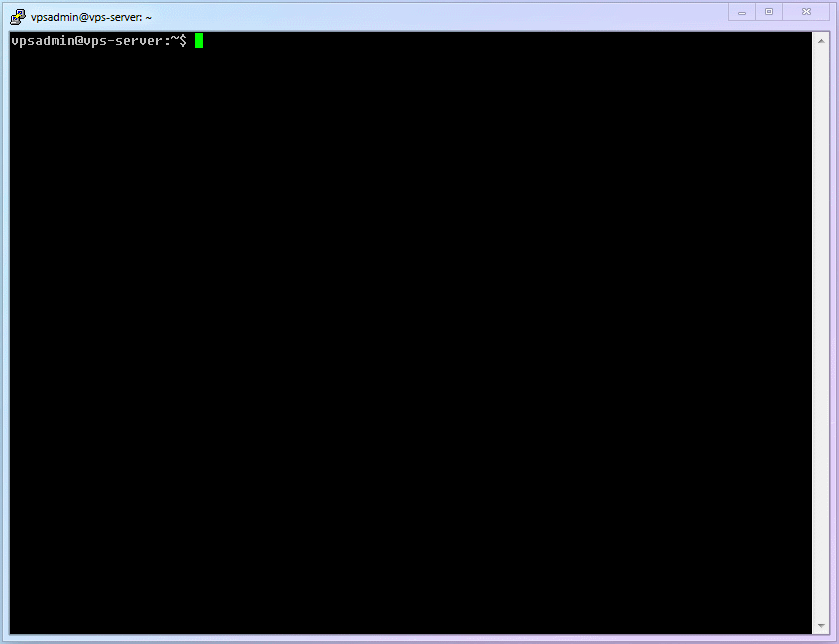

# [Chapter 6] Certificate Management

## 6.1 Applying for a TLS Certificate

Next, we need to apply for a real TLS certificate for our domain name, so that the website has the ability to encrypt with standard TLS and the ability to access via HTTPS. This is the most important tool for Xray and other current security proxy tools to ensure fully encrypted traffic.

::: warning
Please do not use self-signed certificates lightly. It does not make the operation much simpler, but adds unnecessary risks (such as man-in-the-middle attacks).
:::

Here, I will use a certificate management tool called [`acme.sh`](https://github.com/acmesh-official/acme.sh), which is simple, lightweight, efficient, and capable of automatically updating certificates.

In addition, I believe that you have gradually become familiar with the basic operations of Linux. Therefore, from this chapter on, commands that have appeared multiple times will no longer have screenshots and will only be briefly described. If you really can't remember how to use them, just review the previous chapters.

## 6.2 Install `acme.sh`

1. Basic Linux commands for beginners:
   | Number | Command | Description |
   | :------: | :-------: | :------------------------------------------------: |
   | `cmd-12` | `wget` | Retrieve (or download) a webpage file |
   | `cmd-13` | `acme.sh` | Commands related to acme.sh certificate management |

2. Run the installation script.

```shell
wget -O - https://get.acme.sh | sh
```

3. Make the `acme.sh` command effective.

```shell
. .bashrc
```

(Note: This command is used to source (load) the `.bashrc` file in the shell environment.)

4. Enable `acme.sh` automatic upgrade.

```shell
acme.sh --upgrade --auto-upgrade
```

5. The complete process up to this point is shown in the following diagram:



## 6.3 Testing Certificate Application

Before officially applying for the certificate, we use the testing command (`--issue --test`) to verify if the application can be successfully submitted. This can avoid repeated failures in applying for a certificate due to incorrect local configuration, exceeding the frequency limit of Let's Encrypt (such as a maximum of 5 failures per hour, per domain, or per user), which may prevent the subsequent steps from being carried out.

1. The command to apply for a test certificate is as follows (this article uses ECC certificate as an example, because there is really no reason not to use it nowadays):

```shell
acme.sh --issue --server letsencrypt --test -d subdomain.yourdomain.com -w /home/vpsadmin/www/webpage --keylength ec-256
```

(Note: This is a command in shell script for obtaining SSL certificate from Let's Encrypt CA using ACME protocol. It specifies the test server, the subdomain for which the certificate is requested, the webroot directory of the subdomain, and the key length to use for the certificate.)

::: warning Explanation
The main advantage of the `ECC` certificate is that its `Keysize` is smaller, which means that security is improved and encryption and decryption speed is faster for the same size. Why not choose ECC-256bit, which is approximately equivalent to RSA-3072bit in strength? Of course, some people say that the ECC certificate handshake is significantly faster, which I think is a bit exaggerated, because RSA handshake is not too slow either. Even if there is a difference, it should be in milliseconds and difficult to perceive directly.

In addition, if some websites do need to be compatible with certain old devices, please still choose RSA certificates according to your needs.

2. You should eventually see a prompt similar to this:

````log
[Wed 30 Dec 2022 04:25:12 AM EST] Using ACME_DIRECTORY: https://acme-staging-v02.api.letsencrypt.org/directory
[Wed 30 Dec 2022 04:25:13 AM EST] Using CA: https://acme-staging-v02.api.letsencrypt.org/directory
[Wed 30 Dec 2022 04:25:13 AM EST] Create account key ok.
[Wed 30 Dec 2022 04:25:13 AM EST] Registering account: https://acme-staging-v02.api.letsencrypt.org/directory
[Wed 30 Dec 2022 04:25:13 AM EST] Registered
[Wed 30 Dec 2022 04:25:13 AM EST] ACCOUNT_THUMBPRINT='CU6qmPKuRqhyTAIrF4swosR375194z_1ddUlWef8xDc'
[Wed 30 Dec 2022 04:25:13 AM EST] Creating domain key
[Wed 30 Dec 2022 04:25:13 AM EST] The domain key is here: /home/vpsadmin/.acme.sh/subdomain.yourdomain.com_ecc/subdomain.yourdomain.com.key
[Wed 30 Dec 2022 04:25:13 AM EST] Single domain='subdomain.yourdomain.com'
[Wed 30 Dec 2022 04:25:13 AM EST] Getting domain auth token for each domain
[Wed 30 Dec 2022 04:25:14 AM EST] Getting webroot for domain='subdomain.yourdomain.com'
[Wed 30 Dec 2022 04:25:14 AM EST] Verifying: subdomain.yourdomain.com
[Wed 30 Dec 2022 04:25:23 AM EST] Pending
[Wed 30 Dec 2022 04:25:25 AM EST] Success
[Wed 30 Dec 2022 04:25:25 AM EST] Verify finished, start to sign.
[Wed 30 Dec 2022 04:25:25 AM EST] Lets finalize the order.
[Wed 30 Dec 2022 04:25:25 AM EST] Le_OrderFinalize='https://acme-staging-v02.api.letsencrypt.org/acme/finalize/490205995/7730242871'
[Wed 30 Dec 2022 04:25:25 AM EST] Downloading cert.
[Wed 30 Dec 2022 04:25:25 AM EST] Le_LinkCert='https://acme-staging-v02.api.letsencrypt.org/acme/cert/xujss5xt8i38waubafz2xujss5xt8i38waubz2'
[Wed 30 Dec 2022 15:21:52 AM EST] Cert success.
--BEGIN CERTIFICAT--
sxlYqPvWreKgD5b8JyOQX0Yg2MLoRUoDyqVkd31PthIiwzdckoh5eD3JU7ysYBtN
cTFK4LGOfjqi8Ks87EVJdK9IaSAu7ZC6h5to0eqpJ5PLhaM3e6yJBbHmYA8w1Smp
wAb3tdoHZ9ttUIm9CrSzvDBt6BBT6GqYdDamMyCYBLooMyDEM4CUFsOzCRrEqqvC
2mTTEmhvpojo5rhdTSJxibozyNWTGwoTj0v9pTUeQcGqLIzqi4DowjBHD5guwRid
SjAFnm6JT2xUQgWFm58A1gv1OhbH1TRPUUmtE1nFEN7YiSjI4xgxqAXT3CLD2EUb
wXlUrO6c75zSsQP4bRMzgOjJUqHtSb6IEqELzt4M7KzL5iCOruCChCo2DZxUwvVX
tOoaAyQJzCbTqE6aUqwiKi3gVyoxvDP9mI5JdRYzsDL6GVud7EHPnYeMl9ubLZAK
0vg84mbMP3f6mYM4KRa1cqiyOIcQPT4AzGFYVv4sm049bZQg7sd0Bz9CaFvE7yDA
1y17XlgCDnsjxl66bqI1vkENN9XT5xeFHONqc18b5fZEKSIvdX7iWPFWp1PyMPpG
0pMCP1EymZNFxIMJLgbWqExwLWfPc5Ib3PjBaIqhXPnw6sT2MQSxXwDupq1UJVhV
7E3hQRVlwI4CXi6WLHJMNvNRyyK87gCrLH1bKYsPeRVaz77poWBq49zwBCts6hPY
IeF4ltGXyANNIOPEi8vy138fRU4LYh81d8FjOtFfJZogMjwhfNvapqxPMsioPlmX
TnZu0n7setrVNUEfTMHWqPpDgk5MPrWLA4LapqaDfEX4pwnQJLMwMi6s94z165c0
iMRSKA1yU5zqv8aNsDfPoY4OkSPWs4MaXgRRSLBsUfZ15DwQXPk76kegHIyxWvwF
tYw9HKR5QCMK66fa0z4aJoFVFLK0IIOGEZOanRFUCnkLUDd3QZ3YU8lEcrj7Uxos
haiRNICyC6UfsCJ94a8vcNyMosPv3xBLMp19WXgiFYqEFQkntkv1FLRI35fjeJmg
0fmD9VG9bkzGPHihJgQLRlCHasGf6XrdfkSsODAyCUHUHJ0RzqF4YEZMcxDxzuQ2
YO7bFwj7S3mUdVPZ6MPasjxdyBjJgEBMch2uy4AhmudXfEBQBye8W6ZI4ztZjLVV
FmP4SIuaNUmMe20TjR8b9NVC96AhxOanWT3mRROsdokpKQGTJvl27EHH8KuAbUOc
G6KtPy4wslNZNXWcBy9n63RcWak12r7kAIFn38tZxmlw2WUKoRSMAH64GcDTjRQd
Am65hBHzvGrj93wEuVNIebvNIsJOlng3HFjpIxVqKGMCIfWIKGDE3YzK3p4LbGZ6
NZFQWYJLNVf2M9CCJfbEImPYgvctrxl39H6KVYPCw1SAdaj9NneUqmREOQkKoEB0
x6PmNirbMscHhQPSC0JQaqUgaQFgba1ALmzRYAnYhNb0twkTxWbY7DBkAarxqMIp
yiLKcBFc5H7dgJCImo7us7aJeftC44uWkPIjw9AKH=
--END CERTIFICAT--
[Wed 30 Dec 2022 15:21:52 AM

3. Note: The certificate applied for here is a test certificate, which cannot be used directly. It is only used to prove that your domain and configuration are correct. If you observe carefully, you will find that the domain that issues the certificate to you is `https://acme-staging-v02.api.letsencrypt.org`, and this `staging` can be understood as a "test server"!

4. If this step goes wrong, you can run the following command to check the detailed application process and specific errors. If you don't understand, you can hide sensitive information and ask in the Xray group.

```shell
acme.sh --issue --server letsencrypt --test -d subdomain.yourdomain.com -w /home/vpsadmin/www/webpage --keylength ec-256 --debug
````

(Note: This command is written in Chinese characters, therefore I have translated it into English. The command is used to issue SSL/TLS certificates using acme.sh client with Let's Encrypt CA in test mode for a subdomain of your domain with the specified webroot path, key length and in debug mode.)

Hmm, that's right. Just added a `--debug` parameter at the end of the command.

5. Once this step is confirmed to be successful, you can apply for the formal certificate. (The test certificate does not need to be deleted, as it will be automatically replaced by the formal certificate.)

## 6.4 Application for Official Certification

1. The command for applying for an official certificate is as follows (i.e., remove the `--test` parameter and add the `--force` parameter at the end):

```shell
acme.sh --set-default-ca --server letsencrypt
```

This is a command in the shell language. It sets the default Certificate Authority (CA) to Let's Encrypt by using the `acme.sh` script.

```shell
acme.sh --issue -d subdomain.yourdomain.com -w /home/vpsadmin/www/webpage --keylength ec-256 --force
```

(Note: This is a command written in shell script that requests a SSL certificate from ACME server using the ACME client "acme.sh". It specifies the subdomain of the domain name, the web root directory of the website, the key length, and forces the re-issuance of the certificate.)

::: warning Explanation
The meaning of the `--force` parameter is to manually (forcefully) update the certificate before the existing certificate expires. Although the certificate we applied for from the "test server" in the previous step cannot be used directly, it has not expired yet, so this parameter is needed.
:::

2. You should eventually see a prompt that looks similar to the one above.

```log
vpsadmin@vps-server:~$ acme.sh --issue -d subdomain.yourdomain.com -w /home/vpsadmin/www/webpage --keylength ec-256
[Wed 30 Dec 2022 15:22:51 AM EST] Using CA: https://acme-v02.api.letsencrypt.org/directory
[Wed 30 Dec 2022 15:22:51 AM EST] Creating domain key
[Wed 30 Dec 2022 15:22:51 AM EST] The domain key is here: /home/vpsadmin/.acme.sh/subdomain.yourdomain.com_ecc/subdomain.yourdomain.com.key
[Wed 30 Dec 2022 15:22:51 AM EST] Single domain='subdomain.yourdomain.com'
[Wed 30 Dec 2022 15:22:51 AM EST] Getting domain auth token for each domain
[Wed 30 Dec 2022 15:22:51 AM EST] Getting webroot for domain='subdomain.yourdomain.com'
[Wed 30 Dec 2022 15:22:51 AM EST] Verifying: subdomain.yourdomain.com
[Wed 30 Dec 2022 15:22:51 AM EST] Pending
[Wed 30 Dec 2022 15:22:51 AM EST] Success
[Wed 30 Dec 2022 15:22:51 AM EST] Verify finished, start to sign.
[Wed 30 Dec 2022 15:22:51 AM EST] Lets finalize the order.
[Wed 30 Dec 2022 15:22:51 AM EST] Le_OrderFinalize='https://acme-v02.api.letsencrypt.org/acme/finalize/490205996/7730242872'
[Wed 30 Dec 2022 15:22:51 AM EST] Downloading cert.
[Wed 30 Dec 2022 15:22:51 AM EST] Le_LinkCert='https://acme-v02.api.letsencrypt.org/acme/cert/vsxvk0oldnuobe51ayxz4dms62sk2dwmw9zhuw'
[Wed 30 Dec 2022 15:22:51 AM EST] Cert success.
--BEGIN CERTIFICAT--
sxlYqPvWreKgD5b8JyOQX0Yg2MLoRUoDyqVkd31PthIiwzdckoh5eD3JU7ysYBtN
cTFK4LGOfjqi8Ks87EVJdK9IaSAu7ZC6h5to0eqpJ5PLhaM3e6yJBbHmYA8w1Smp
wAb3tdoHZ9ttUIm9CrSzvDBt6BBT6GqYdDamMyCYBLooMyDEM4CUFsOzCRrEqqvC
2mTTEmhvpojo5rhdTSJxibozyNWTGwoTj0v9pTUeQcGqLIzqi4DowjBHD5guwRid
SjAFnm6JT2xUQgWFm58A1gv1OhbH1TRPUUmtE1nFEN7YiSjI4xgxqAXT3CLD2EUb
wXlUrO6c75zSsQP4bRMzgOjJUqHtSb6IEqELzt4M7KzL5iCOruCChCo2DZxUwvVX
tOoaAyQJzCbTqE6aUqwiKi3gVyoxvDP9mI5JdRYzsDL6GVud7EHPnYeMl9ubLZAK
0vg84mbMP3f6mYM4KRa1cqiyOIcQPT4AzGFYVv4sm049bZQg7sd0Bz9CaFvE7yDA
1y17XlgCDnsjxl66bqI1vkENN9XT5xeFHONqc18b5fZEKSIvdX7iWPFWp1PyMPpG
0pMCP1EymZNFxIMJLgbWqExwLWfPc5Ib3PjBaIqhXPnw6sT2MQSxXwDupq1UJVhV
7E3hQRVlwI4CXi6WLHJMNvNRyyK87gCrLH1bKYsPeRVaz77poWBq49zwBCts6hPY
IeF4ltGXyANNIOPEi8vy138fRU4LYh81d8FjOtFfJZogMjwhfNvapqxPMsioPlmX
TnZu0n7setrVNUEfTMHWqPpDgk5MPrWLA4LapqaDfEX4pwnQJLMwMi6s94z165c0
iMRSKA1yU5zqv8aNsDfPoY4OkSPWs4MaXgRRSLBsUfZ15DwQXPk76kegHIyxWvwF
tYw9HKR5QCMK66fa0z4aJoFVFLK0IIOGEZOanRFUCnkLUDd3QZ3YU8lEcrj7Uxos
haiRNICyC6UfsCJ94a8vcNyMosPv3xBLMp19WXgiFYqEFQkntkv1FLRI35fjeJmg
0fmD9VG9bkzGPHihJgQLRlCHasGf6XrdfkSsODAyCUHUHJ0RzqF4YEZMcxDxzuQ2
YO7bFwj7S3mUdVPZ6MPasjxdyBjJgEBMch2uy4AhmudXfEBQBye8W6ZI4ztZjLVV
FmP4SIuaNUmMe20TjR8b9NVC96AhxOanWT3mRROsdokpKQGTJvl27EHH8KuAbUOc
G6KtPy4wslNZNXWcBy9n63RcWak12r7kAIFn38tZxmlw2WUKoRSMAH64GcDTjRQd
Am65hBHzvGrj93wEuVNIebvNIsJOlng3HFjpIxVqKGMCIfWIKGDE3YzK3p4LbGZ6
NZFQWYJLNVf2M9CCJfbEImPYgvctrxl39H6KVYPCw1SAdaj9NneUqmREOQkKoEB0
x6PmNirbMscHhQPSC0JQaqUgaQFgba1ALmzRYAnYhNb0twkTxWbY7DBkAarxqMIp
yiLKcBFc5H7dgJCImo7us7aJeftC44uWkPM=
--END CERTIFICAT--
[Wed 30 Dec 2022 15:22:52 AM EST] Your cert is in /home/vpsadmin/.acme.sh/subdomain.yourdomain.com_ecc/subdomain.yourdomain.com.cer
[Wed 30 Dec 2022 15:22:52 AM EST] Your cert key is in /home/vpsadmin/.acme.sh/subdomain.yourdomain.com_ecc/subdomain.yourdomain.com.key
[Wed 30 Dec 2022 15:22:52 AM EST] The intermediate CA cert is in /home/vpsadmin/.acme.sh/subdomain.yourdomain.com_ecc/ca.cer
[Wed 30 Dec 2022 15:22:52 AM EST] And the full chain certs is there: /home/vpsadmin/.acme.sh/subdomain.yourdomain.com_ecc/fullchain.cer
```

3. If you observe carefully, you will find that the domain name that issues the certificate to you this time is `https://acme-v02.api.letsencrypt.org`, which lacks the word `staging`. Therefore, this is the [Production Environment]!

## 6.5 Certificate Installation

1. After completing the certificate application, it needs to be installed to a specified location and referenced in the configuration file to take effect:

```shell
vpsadmin@vps-server:~$ acme.sh --installcert -d subdomain.yourdomain.com --cert-file /path/to/install/cert.crt --key-file /path/to/install/cert.key --fullchain-file /path/to/install/fullchain.crt --ecc
[Mon 14 Feb 2022 03:00:25 PM CST] Installing cert to: /etc/xray/cert/cert.crt
[Mon 14 Feb 2022 03:00:25 PM CST] Installing key to: /etc/xray/cert/cert.key
[Mon 14 Feb 2022 03:00:25 PM CST] Installing full chain to: /etc/xray/cert/fullchain.crt
```

(Note: This is a shell command for installing a SSL certificate using acme.sh. The command is specifying the domain, file paths for the certificate, private key, and full chain, as well as indicating that an ECC certificate should be used.)

## 6.6 Your Progress

At this point, the two basic infrastructures required by Xray are finally in place! Xray, which has been eagerly awaited, is about to be revealed, and we are finally about to enter the most exciting chapter!

> ⬛⬛⬛⬛⬛⬛⬜⬜ 75%
