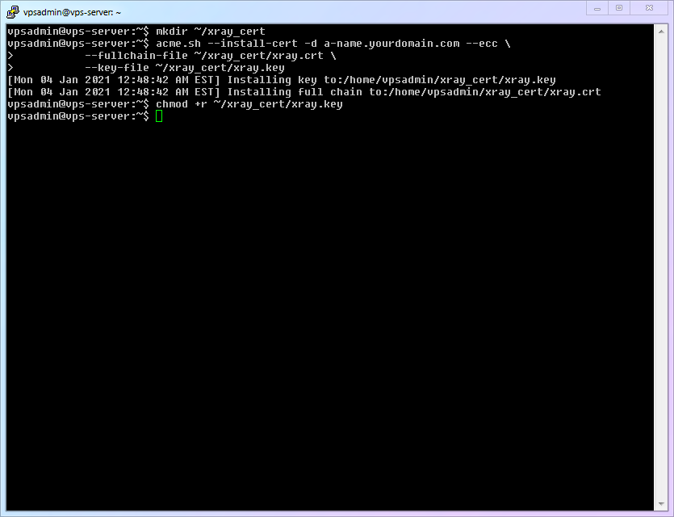
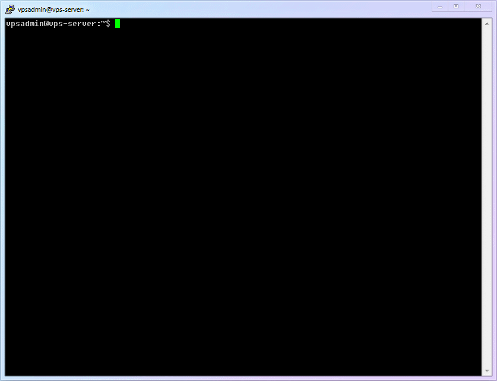
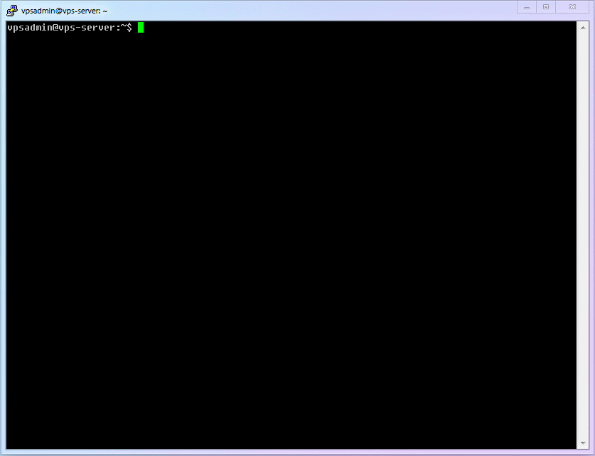
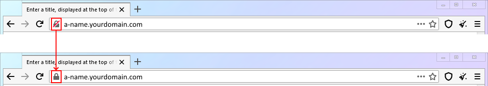

# [Chapter 7] Xray Server Guide

## 7.1 Extensive Preparation, Effortless Execution

During the writing of this article, a pro jokingly complained to me: "Your tutorial has been running for 6 chapters and still hasn't reached Xray? People who don't know better might think this is a 'Build Your Own Website' tutorial." (I couldn't even refute that.jpg!)

Actually, this structure was a decision made after much deliberation. Only by laying a solid foundation can you achieve twice the result with half the effort later on and overtake others quickly. I've seen many newcomers in groups who can't even use `nano` correctly, don't know how to use `WinSCP`, and naturally, the `config.json` they hand-edit remotely is full of errors, making debugging a struggle.

::: warning
After the preparations in the first 6 chapters, we have climbed over several mountains together: Basic Linux operations, VPS remote management, website setup, domain management, certificate application, etc. Looking back, doesn't it seem quite simple? Now that we have such solid preparation, the upcoming installation and configuration of Xray will feel completely natural and effortless.
:::

What needs to be done next is very simple:

1.  Installation
2.  Configuration (e.g., installing TLS certificates, `config.json`)
3.  Running
4.  Optimization (e.g., updating the kernel, enabling `bbr`, auto-redirecting `http` to `https`, etc.)

## 7.2 Installing Xray

First, the official carrier of Xray is the binary program generated by the [xray-core](https://github.com/XTLS/Xray-core) open-source project (based on the `MPL 2.0` open-source license). If you run this binary on a server, it is the server-side; if you download it to your local computer and run it, it is the client-side. The main difference lies in the [Configuration].

For installation, using the official installation script is simple and direct. It provides multiple installation options. Interested users can check the script instructions in the official [installation script repository](https://github.com/XTLS/Xray-install). **This article uses the [Non-root User] installation mode.**

At the time of writing, the installation script has a few small bugs when using a non-root account, so I decided to separate these steps. This also serves as a good opportunity to explain the delete command in Linux.

1.  Linux 101 - Basic Commands:

    |  Number  | Command Name | Command Description |
    | :------: | :----------: | :-----------------: |
    | `cmd-14` |     `rm`     |   Delete command    |

2.  Download the installation script locally:

    ```shell
    wget https://github.com/XTLS/Xray-install/raw/main/install-release.sh
    ```

3.  Execute the installation command:

    ```shell
    sudo bash install-release.sh
    ```

4.  After use, you can delete the script:

    ```shell
    rm ~/install-release.sh
    ```

    ::: warning
    When using the `rm` command to delete a file, it defaults to deleting the file in the current folder. However, **I still wrote the full path**: `~/install-release.sh`. This is a safety habit of mine when using `rm`, and it is also something I wanted to emphasize by breaking the installation into steps. If you've heard jokes about "programmers deleting the database and running away," you probably understand why.
    :::

5.  The complete process demonstration is as follows:

    

## 7.3 Configuring TLS Certificates for Xray

Although we have already applied for TLS certificates earlier, according to the [official documentation of `acme.sh`](https://github.com/acmesh-official/acme.sh/wiki/%E8%AF%B4%E6%98%8E#3-copy%E5%AE%89%E8%A3%85-%E8%AF%81%E4%B9%A6), it is not recommended to use the applied certificates directly. The correct method is to use the `--install-cert` command to install them for the required program. Now, let's install the certificate for `xray-core` to use.

1.  To avoid various potential permission issues with non-root accounts, we create a certificate folder under the vpsadmin account.

    ```shell
    mkdir ~/xray_cert
    ```

2.  Use `acme.sh`'s `--install-cert` to correctly install (copy) the certificate files.

    ```shell
    acme.sh --install-cert -d subdomain.yourdomain.com --ecc \
                --fullchain-file ~/xray_cert/xray.crt \
                --key-file ~/xray_cert/xray.key
    ```

3.  The `xray.key` file is not readable by other users by default, so we need to grant it read permissions.

    ```shell
    chmod +r ~/xray_cert/xray.key
    ```

4.  The process is simple, so no GIF is provided:

    

5.  `acme.sh` checks the certificate every 60 days and automatically renews it if it's close to expiration. However, as far as I know, it does not automatically install the new certificate to `xray-core`, so we need to add a system automatic periodic task to complete this step.
    1.  Linux 101 - Basic Commands:

    |  Number  | Command Name |           Command Description           |
    | :------: | :----------: | :-------------------------------------: |
    | `cmd-15` | `crontab -e` | Edit the current user's scheduled tasks |
    2.  Create a script file (`xray-cert-renew.sh`):

        ```shell
        nano ~/xray_cert/xray-cert-renew.sh
        ```

    3.  Copy the content below into it, remembering to replace it with your real domain name, then save and exit.

        ```bash
        #!/bin/bash

        /home/vpsadmin/.acme.sh/acme.sh --install-cert -d a-name.yourdomain.com --ecc --fullchain-file /home/vpsadmin/xray_cert/xray.crt --key-file /home/vpsadmin/xray_cert/xray.key
        echo "Xray Certificates Renewed"

        chmod +r /home/vpsadmin/xray_cert/xray.key
        echo "Read Permission Granted for Private Key"

        sudo systemctl restart xray
        echo "Xray Restarted"
        ```

        ::: warning
        As pointed out by others, `acme.sh` has a `reloadcmd` command that can automatically execute specific commands when the certificate is updated. This could be used to automatically install certificates for `Xray`. However, since `crontab` is a very useful and common function in Linux systems, this article retains the `crontab` method for updating `Xray` certificates. (Those interested in `reloadcmd` can check the [official documentation](https://github.com/acmesh-official/acme.sh) of `acme.sh`).

        Additionally, in the GIF recording, the script did not include the `Xray` restart command because `Xray` plans to support [Certificate Hot Reload], meaning `Xray` will automatically recognize certificate updates and reload them without a manual restart. Once this feature is added, I will modify `config.json` appropriately to enable this setting and remove the restart command from the script.
        :::

    4.  Add [Executable] permission to this file.

        ```shell
        chmod +x ~/xray_cert/xray-cert-renew.sh
        ```

    5.  Run `crontab -e` to add an automatic task [Run `xray-cert-renew.sh` automatically once a month] (Note: do not add `sudo`, because we are adding the automatic task for the `vpsadmin` account. When running for the first time, it will ask you to choose an editor; choose the familiar `nano`!).

        ```shell
        crontab -e
        ```

    6.  Add the following content to the end of the file, save, and exit.

        ```
        # 1:00am, 1st day each month, run `xray-cert-renew.sh`
        0 1 1 * * bash /home/vpsadmin/xray_cert/xray-cert-renew.sh
        ```

    7.  The complete process demonstration is as follows:

        

## 7.4 Configuring Xray

First, various configurations can refer to the [official VLESS configuration examples](https://github.com/XTLS/Xray-examples). This article will configure a most streamlined method based on the official examples: [Single `VLESS` protocol inbound + Port `80` fallback], satisfying maximum speed and necessary security for most scenarios.

1.  Generate a valid `UUID` and save it for later use (`UUID` can be simply understood as an ID, like a fingerprint, that almost never repeats).

    ```shell
    xray uuid
    ```

2.  Create log files and folders for later use.
    1.  Linux 101 - Basic Commands:

        |  Number  | Command Name | Command Description |
        | :------: | :----------: | :-----------------: |
        | `cmd-16` |   `touch`    | Create a blank file |

    2.  Create a [Log Dedicated Folder] inside the `vpsadmin` folder.

        ```shell
        mkdir ~/xray_log
        ```

    3.  Generate the two required log files (access log, error log).

        ```shell
        touch ~/xray_log/access.log && touch ~/xray_log/error.log
        ```

        ::: warning
        This location is not the standard `Xray` log file location. Placing it here is to avoid permission issues causing trouble for newcomers. Once you are familiar with it, it is recommended to revert to the default location: `/var/log/xray/access.log` and `/var/log/xray/error.log`.
        :::

    4.  Since Xray defaults to running as the `nobody` user, we need to allow other users to have "write" permissions (`*.log` means all files with the `log` suffix; the efficiency advantage of the `CLI` interface gradually appears here).

        ```shell
        chmod a+w ~/xray_log/*.log
        ```

3.  Use `nano` to create the `Xray` configuration file.

    ```shell
    sudo nano /usr/local/etc/xray/config.json
    ```

4.  Copy the entire file below into it, and fill in the previously generated `UUID` into line 61 `"id": "",`. (After filling it in, it looks like `"id": "uuiduuid-uuid-uuid-uuid-uuiduuiduuid"`). I have added various verbose annotations to this configuration file in this article to help you understand the function of each configuration module.

    ```json
    // REFERENCE:
    // https://github.com/XTLS/Xray-examples
    // https://xtls.github.io/config/
    // Common config files, whether server or client, have 5 parts. Plus newbie interpretation:
    // ┌─ 1*log Log Settings - What to write, where to write (evidence available when errors occur)
    // ├─ 2_dns DNS Settings - How to query DNS (prevent DNS pollution, prevent snooping, avoid matching domestic sites to foreign servers, etc.)
    // ├─ 3_routing Routing Settings - How to classify and process traffic (whether to filter ads, split domestic/international traffic)
    // ├─ 4_inbounds Inbound Settings - What traffic can flow into Xray
    // └─ 5_outbounds Outbound Settings - Where the traffic flowing out of Xray goes
    {
      // 1_Log Settings
      "log": {
        "loglevel": "warning", // Content from least to most: "none", "error", "warning", "info", "debug"
        "access": "/home/vpsadmin/xray_log/access.log", // Access record
        "error": "/home/vpsadmin/xray_log/error.log" // Error record
      },
      // 2_DNS Settings
      "dns": {
        "servers": [
          "https+local://1.1.1.1/dns-query", // Prefer 1.1.1.1 DoH query, sacrifices speed but prevents ISP snooping
          "localhost"
        ]
      },
      // 3_Routing Settings
      "routing": {
        "domainStrategy": "IPIfNonMatch",
        "rules": [
          // 3.1 Prevent local server loop issues: e.g., intranet attacks or abuse, wrong local loops, etc.
          {
            "ip": [
              "geoip:private" // Routing condition: rules named "private" in the geoip file (local)
            ],
            "outboundTag": "block" // Routing strategy: hand over to outbound "block" processing (blackhole blocking)
          },
          {
            // 3.2 Prevent server from directly connecting to domestic (CN) IPs
            "ip": ["geoip:cn"],
            "outboundTag": "block"
          },
          // 3.3 Block Ads
          {
            "domain": [
              "geosite:category-ads-all" // Routing condition: rules named "category-ads-all" in the geosite file (various ad domains)
            ],
            "outboundTag": "block" // Routing strategy: hand over to outbound "block" processing (blackhole blocking)
          }
        ]
      },
      // 4_Inbound Settings
      // 4.1 Here only one simplest vless+xtls inbound is written, because this is Xray's most powerful mode. If needed, please add others based on templates.
      "inbounds": [
        {
          "port": 443,
          "protocol": "vless",
          "settings": {
            "clients": [
              {
                "id": "", // Fill in your UUID
                "flow": "xtls-rprx-vision",
                "level": 0,
                "email": "vpsadmin@yourdomain.com"
              }
            ],
            "decryption": "none",
            "fallbacks": [
              {
                "dest": 80 // Default fallback to the probe-resistant proxy
              }
            ]
          },
          "streamSettings": {
            "network": "tcp",
            "security": "tls",
            "tlsSettings": {
              "alpn": "http/1.1",
              "certificates": [
                {
                  "certificateFile": "/home/vpsadmin/xray_cert/xray.crt",
                  "keyFile": "/home/vpsadmin/xray_cert/xray.key"
                }
              ]
            }
          }
        }
      ],
      // 5_Outbound Settings
      "outbounds": [
        // 5.1 The first outbound is the default rule, freedom is direct connection (VPS is already on the external network, so direct connection)
        {
          "tag": "direct",
          "protocol": "freedom"
        },
        // 5.2 Blocking rule, blackhole protocol sends traffic into a black hole (blocking)
        {
          "tag": "block",
          "protocol": "blackhole"
        }
      ]
    }
    ```

5) The complete process demonstration is as follows:
   

## 7.5 Start Xray Service!! (And check service status)

If you have followed this article step by step, you have actually avoided the most common pitfalls of **insufficient log file permissions** and **insufficient certificate file permissions**. So now, running `Xray` should naturally be incredibly smooth.

1.  Enter the command below and enjoy the historic moment of starting `Xray`!!!

    ```shell
    sudo systemctl start xray
    ```

2.  Just `start` doesn't confirm if we have successfully opened the Xray service. To determine its status, use the following command.

    ```shell
    sudo systemctl status xray
    ```

    See that green, delightful `active (running)`? It says `Xray` is running correctly.

3.  The complete process demonstration is as follows:

    

## 7.6 Reviewing `systemd` for Basic Service Management

So far, we have used `systemctl` related commands like `start`, `status`, `reload`, etc. These are general commands for managing various services in the Linux system based on the `systemd` management module. Now is a good time to familiarize yourself with a few other related commands.

1.  If you need to temporarily stop the `Xray` service, use the `stop` command:

    ```shell
    sudo systemctl stop xray
    ```

2.  If you need to restart the `Xray` service, use the `restart` command:

    ```shell
    sudo systemctl restart xray
    ```

3.  If you need to disable the `Xray` service (prevent Xray from running automatically after computer restart), use the `disable` command:

    ```shell
    sudo systemctl disable xray
    ```

4.  If you need to enable the `Xray` service (ensure Xray runs automatically after computer restart), use the `enable` command:

    ```shell
    sudo systemctl enable xray
    ```

## 7.7 Server Optimization 1: Enable BBR

1.  The Legendary `BBR`

    I believe that when you search for various scientific internet access technologies (censorship circumvention), you must have heard of `bbr` more than once. Under the embellishment of various blogs, it seems miraculous. There are also a bunch of derivatives like `bbrplus`, `bbr2`, `modified bbr`, etc., as if they were magic oils that can turn a cheap line into a dedicated line.

    So, what exactly is this thing? Is it useful? And which version should be used?

2.  The Actual `BBR`

    **BBR** = **B**ottleneck **B**andwidth and **R**ound-trip propagation time. It is a TCP **congestion control algorithm**. To understand it simply and crudely, it is **traffic management for data**: when the highway is not jammed, every car can naturally maintain a faster speed.

    So is it useful? Generally speaking, there is a perceptible difference between `With BBR` and `Without BBR` (improvements in speed, stability, and latency), so **[It is highly recommended to enable `BBR`]**.

    However, after enabling it, the difference between `BBR` in `4.x` and `5.x` is often subtle and subjective. The decisive factor causing the experience difference is still the line quality. So **[Do not obsess over versions, do not blindly chase the new, just follow your distribution's kernel updates]**.

3.  Are `bbrplus`, `bbr2`, `modified bbr` and other versions with cool-sounding names better?

    In one word: **No! Don't use these! These are names made up just to attract attention!**

    The update and release of `BBR` follow the Linux kernel (`Kernel`). In other words, as long as you use a relatively new kernel, you will naturally use the new version of `BBR`.

    And those things with cool names are essentially unreleased kernels still in the testing phase and their corresponding `BBR` versions. These scripts merely enable them by downloading preview kernels (or even third-party modified kernels).

    Kernel stability is the cornerstone of a stable server operation. **[The subtle performance difference brought by the BBR beta version is absolutely not worth swapping for an unstable kernel.]** Please choose the latest kernel supported by your Linux distribution, which maximizes the long-term stability and compatibility of the server.

    ::: warning
    The so-called "lead" of modified `bbr` has a very strong timeliness. For example, many `bbrplus` scripts have not been updated for several years, and even now they will replace your kernel with `4.19`. You should know that stable distributions like Debian are already in the `5.9` era. So maybe this script was a little ahead in January 2018, but by October 2018 when 4.19 was officially released, it had lost its meaning. Putting it in use now can even be considered a complete [Downgrade] and [Degradation].
    :::

4.  Which algorithm is better: `fq`, `fq_codel`, `fq_pie`, `cake` or others?

    In one word: **If you don't understand, please keep `fq`. It is sufficient and will not degrade your line.**

5.  RuiSu (ServerSpeeder), Finalspeed, LotServer, and other "Acceleration Tools"

    In one word: **Do not use these! Throw them into the trash bin of history!**

    The only problem they can solve is the packet loss rate. To use an imprecise analogy: originally you used one car to deliver your goods, sometimes the car broke down halfway (packet loss). After using these, you directly send out 3 identical copies of the goods, letting three cars deliver at the same time. As long as one doesn't break down, it gets delivered. The road is full of your cars, so naturally, you squeeze others out. But predictably, when you squeeze others, others will also squeeze you. The exit road of the entire computer room is only so wide, and eventually, it is bound to turn into a massive collective traffic jam.

    ::: warning Note
    Their principle is not algorithm optimization or speed boosting; most are simple and crude **multi-packet sending**. For poor lines with [very high packet loss rates], they might have some effect, but for good lines with low packet loss rates, [they have no optimization effect, and instead will multiply your traffic consumption], thereby causing unnecessary pressure on the server and your neighbors.

    If your line really has a ridiculously high packet loss rate, the truly reliable solution is to [Change the Line].
    :::

6.  I've been rambling so much because there are too many misconceptions and pitfall scripts fooling newbies surrounding `BBR`. I hope you now have a relatively clear understanding of `BBR`. Next, let's install the latest Debian kernel and enable `BBR`! (It's really simple)

7.  Add the official `backports` source to Debian 10 to get updated software libraries.

    ```shell
    sudo nano /etc/apt/sources.list
    ```

    ::: warning Note
    This article takes Debian 10 as an example, so using `/etc/apt/sources.list` is fine. However, if you are not starting from scratch following this article, or are using another Linux distribution, I suggest you create a `/etc/apt/sources.list.d/` folder and create your own configuration file inside this folder, like `/etc/apt/sources.list.d/vpsadmin.list`. This ensures compatibility and avoids configuration loss caused by default files being overwritten in unforeseen circumstances.
    :::

8.  Then add the following line at the end, save, and exit.

    ```
    deb [http://archive.debian.org/debian](http://archive.debian.org/debian) buster-backports main
    ```

9.  Refresh the software library, query the latest official Debian kernel, and install it. Please be sure to install the version corresponding to your VPS (this article uses the common [amd64] as an example).

    ```shell
    sudo apt update && sudo apt -t buster-backports install linux-image-amd64
    ```

    ::: warning Attention
    If your VPS supports it, you can try the [Cloud Server Dedicated Kernel] `linux-image-cloud-amd64`. The advantage is that it is streamlined and uses fewer resources. The downside is that some students reported that forcing installation on unsupported systems leads to boot failure (Kernel cannot be recognized).

    To avoid the tragedy of being unable to recognize the kernel, please ensure:
    - Take a system snapshot before trying, or
    - You have `vnc` to save the situation (and you know how to use it)
      :::

10. Modify the `kernel` parameter configuration file `sysctl.conf` and specify enabling `BBR`.

    ```shell
    sudo nano /etc/sysctl.conf
    ```

    ::: warning Note
    This article takes Debian 10 as an example, so using `/etc/sysctl.conf` is fine. However, if you are not starting from scratch following this article, or are using another Linux distribution, I suggest you create a `/etc/sysctl.d/` folder and create your own configuration file inside this folder, like `/etc/sysctl.d/vpsadmin.conf`. This ensures compatibility because some distributions no longer read parameters from `/etc/sysctl.conf` after `systemd` version 207. Using a custom configuration file also avoids configuration loss caused by default files being overwritten in unforeseen circumstances.
    :::

11. Add the following content into it:

    ```
    net.core.default_qdisc=fq
    net.ipv4.tcp_congestion_control=bbr
    ```

12. Reboot the VPS to make the kernel update and `BBR` settings take effect.

    ```shell
    sudo reboot
    ```

13. The complete process demonstration is as follows:

    ::: tip Mr. Verbose
    Because the VPS I used for the demonstration supports the cloud server dedicated kernel, I used `linux-image-cloud-amd64` in the GIF. If you are not sure if your VPS supports it, please be sure to follow the command in step 3 and use the regular kernel `linux-image-amd64`.
    :::

    

14. Confirm `BBR` is enabled

    If you want to confirm if `BBR` is enabled correctly, you can use the following command:

    ```shell
    lsmod | grep bbr
    ```

    It should return a result like this:

    ```
    tcp_bbr
    ```

    If you want to confirm if the `fq` algorithm is enabled correctly, you can use the following command:

    ```shell
    lsmod | grep fq
    ```

    It should return a result like this:

    ```
    sch_fq
    ```

## 7.8 Server Optimization 2: Enable Auto-Redirect from HTTP to HTTPS

1.  We previously set up an `http` webpage on port `80` and used it to apply for a TLS certificate.

    But if you tried to access our interface using a browser, you would find that `http` access does not automatically upgrade to `https` access like most websites. In other words, under our current settings, `http(80)` and `https(443)` are completely independent. To solve this problem, some modifications are needed.

2.  Edit the Nginx configuration file.

    ```shell
    sudo nano /etc/nginx/nginx.conf
    ```

3.  Add the following statement to the Server block listening on port 80 that we set up, then save and exit (you can also delete the `root` and `index` lines):

    ```
    return 301 https://$http_host$request_uri;
    ```

4.  Add a local port listener at the same level as port `80` to provide webpage display. This article uses port `8080` for demonstration. (It can be any port).

    ```
    server {
       listen 127.0.0.1:8080;
       root /home/vpsadmin/www/webpage;
       index index.html;
       add_header Strict-Transport-Security "max-age=63072000" always;
    }
    ```

5.  Restart the Nginx service.

    ```shell
    sudo systemctl restart nginx
    ```

6.  Modify the Xray fallback setting, changing the fallback from port `80` to port `8080`. (Find `"dest": 80` and change it to `"dest": 8080`).

    ```shell
    sudo nano /usr/local/etc/xray/config.json
    ```

7.  Restart the `Xray` service to complete the setup.

    ```shell
    sudo systemctl restart xray
    ```

8.  The complete process demonstration is as follows:

    

9.  When you enter `http://a-name.yourdomain.com`, it should now automatically redirect to https.

    

## 7.9 Server Optimization 3: Richer Fallbacks

If you need richer fallback functionality, you can refer to [《Fallbacks (fallbacks) Feature Analysis》](../level-1/fallbacks-lv1.md)

## 7.10 Your Progress

Congratulations!! At this step, you already possess a server capable of proper scientific internet access (censorship circumvention), and also a camouflage website that prevents active probing attacks. Next, just install the appropriate software on your client, and you can enjoy a smooth network!

> ⬛⬛⬛⬛⬛⬛⬛⬜ 87.5%

## 7.11 Important Errata

1.  In the first edition, the `Xray` configuration file `config.json` folder location was incorrect. If you operated according to the previous location, `Xray` would not start correctly. Therefore, the correction is explained here. Please check yourself. Sorry for the inconvenience!
    - Correct location: `/usr/local/etc/xray/config.json`
    - Incorrect location: `/usr/local/etc/config.json`

    Affected sections:
    - 7.4 Configuring `Xray` - 3. Use `nano` to create the `Xray` configuration file
    - 7.8 Server Optimization 2 - 6. Modify `Xray`'s fallback settings

2.  In the first edition, when modifying the `Nginx` configuration file `nginx.conf`, the content was incorrect (webpage folder location error). If you operated according to the previous location, `Nginx` would not find the correct website. Please check yourself. Sorry for the inconvenience!
    - Correct folder location: `root /home/vpsadmin/www/webpage;`
    - Incorrect folder location: `root /var/www/website/html`

    Affected sections:
    - 7.8 Server Optimization 2 - 4. Add a local port listener at the same level as port `80` to provide webpage display
