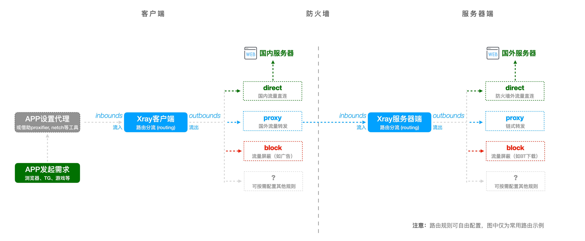

# 【第 8 章】Xray 客户端篇

## 8.1 Xray 的工作原理简述

要正确的配置和使用`Xray`，就需要正确的理解其工作原理，对于新人，可以先看看下面简化的示意图（省略了许多复杂的设置）：



这其中的关键点是：

1. APP 要主动或借助转发工具，将数据【流入(`inbounds`)】`Xray` 客户端

2. 流量进入客户端后，会被【客户端路由(`routing`)】按规则处理后，向不同方向【流出`(outbounds)`】`Xray` 客户端。比如：

   1. 国内流量直连（`direct`）
   2. 国外流量转发 VPS（`proxy`）
   3. 广告流量屏蔽（`block`）

3. 向 VPS 转发的国外流量，会跨过防火墙，【流入(`inbounds`)】 `Xray` 服务器端

4. 流量进入服务器端后，与客户端一样，会被【服务器端路由(`routing`)】按规则处理后，向不同方向【流出`(outbounds)`】：
   1. 因为已经在防火墙之外，所以流量默认直连，你就可以访问到不存在网站们了（`direct`）
   2. 如果需要在不同的 VPS 之间做链式转发，就可以继续配置转发规则（`proxy`）
   3. 你可以在服务器端继续禁用各种你想禁用的流量，如广告、BT 下载等（`block`）

:::warning 注意

请务必记得，`Xray` 的路由配置非常灵活，上面的说明只是无限可能性中的一种。

借助 `geosite.dat` 和 `geoip.dat` 这两个文件，可以很灵活的从【域名】和【IP】这两个角度、不留死角的控制流量流出的方向。这比曾经单一笼统的 `GFWList` 强大很多很多，可以做到非常细致的微调：比如可以指定 Apple 域名直连或转发、指定亚马逊域名代理或转发，百度的域名屏蔽等等。。。）

现在，[《路由 (routing) 功能简析》](../level-1/routing-lv1-part1.md) 已经上线，我建议对路由功能有兴趣的同学，先继续跟着本文完成客户端的基础配置，之后再去这里详细学习。
:::

## 8.2 客户端与服务器端正确连接

现在你已经理解了 `Xray` 的工作原理，那么接下来的配置，其实就是【告诉你的客户端如何连接 VPS 服务器】。这和你已经很熟悉的、告诉`PuTTY`如何远程连接服务器是一样的。只不过 Xray 连接时的要素不止是【IP 地址】+【端口】+【用户名】+【密码】这四要素了。

实际上，`Xray`的连接要素是由不同的[协议](../../config/inbounds/)决定的。本文在第 7 章的配置文件 `config.json` 里，我们使用 `Xray` 下独特而强大的 `VLESS` 协议 + `XTLS` 流控。所以看看那个配置文件的内容就能知道，这个协议组合的连接要素有：

- 服务器【地址】: `a-name.yourdomain.com`
- 服务器【端口】: `443`
- 连接的【协议】: `vless`
- 连接的【流控】: `xtls-rprx-vision` (vision 模式适合全平台)
- 连接的【验证】: `uuiduuid-uuid-uuid-uuiduuiduuid`
- 连接的【安全】: `"allowInsecure": false`

鉴于新人一般都会使用手机 APP 或者电脑的 GUI 客户端，我就把常用的客户端罗列在下面。每个客户端都有自己独特的配置界面，逐一截图展示并不现实，所以请你务必仔细阅读这些客户端的说明、然后把上述要素填入合适的地方即可。

:::warning 注意
许多工具其实是同时支持 `xray-core` 和 `v2fly-core` 的，但默认内置的不一定是哪个，所以别忘记检查一下是否是你想要的那个在工作哦！
:::

- **v2rayN - 适用于 Windows 平台**

  - 请从它的[GitHub 仓库 Release 页面](https://github.com/2dust/v2rayN/releases)获取最新版
  - 请根据该客户端的说明进行设置

- **v2rayNG - 适用于 Android 平台**

  - 请从它的[GitHub 仓库 Release 页面](https://github.com/2dust/v2rayNG/releases)获取最新版
  - 请根据该客户端的说明进行设置

- **Shadowrocket - 适用于 iOS, 基于苹果 M 芯片的 macOS**

  - 你需要注册一个【非中国区】的 iCloud 账户
  - 你需要通过 App Store 搜索并购买
  - 请根据该客户端的说明进行设置

- **Qv2ray - 跨平台图形界面，适用于 Linux, Windows, macOS**

  - 请从它的[GitHub 仓库 Release 页面](https://github.com/Qv2ray/Qv2ray/releases)获取最新版（还可以从它的[GitHub 自动构建仓库](https://github.com/Qv2ray/Qv2ray/actions)寻找更新的版本）
  - 请从它的[项目主页](https://qv2ray.net/)学习文档
  - 请根据该客户端的说明进行设置

- **V2RayXS - 基于 V2RayX 开发的一款使用 xray-core 的 macOS 客户端**
  - 请从它的 [GitHub 仓库 Release 页面](https://github.com/tzmax/v2rayXS/releases) 获取最新版
  - 支持一键导入 [VMessAEAD / VLESS 分享链接标准提案](https://github.com/XTLS/Xray-core/issues/91) 为标准的分享链接
  - 请根据该客户端的说明进行设置

到这一步，你的全套配置就已经可以正常使用啦！

## 8.3 附加题 1：在 PC 端手工配置 `xray-core`

虽然到上面一步已经可以结束了，但是如果你是个好奇心强、记忆力好的的同学，一定会想起来我在上一章说过，你把`xray-core` 的二进制文件“放在服务器运行，它就是服务器端；你把它下载到本地电脑运行，它就是客户端。” 那究竟要怎样直接使用 `xray-core` 做客户端呢？

为了回答这个问题，我加入了附加题章节，有一点点超纲，有一点点麻烦，但费这个笔墨是因为这个方式有它的优势：

- 第一时间获得最新版而无需等待 APP 升级适配

- 灵活自由的路由配置能力（当然 GUI 客户端中 Qv2ray 的高级路由编辑器非常强大，也可以完整实现 xray-core 的路由配置功能）

- 节约系统资源 （GUI 界面一定会有资源消耗，消耗的多少则取决于客户端的实现）

它的劣势应该就是【需要手写配置文件】有点麻烦了。但其实，你想想，服务器上你已经成功的写过一次了，现在又有什么区别呢？接下来，还是老样子，我们分解一下步骤：

1. 首先请从 Xray 官方的 [GitHub 仓库 Release 页面](https://github.com/XTLS/Xray-core/releases) 获取对应平台的版本，并解压缩到合适的文件夹
2. 在合适的文件夹建立空白配置文件：`config.json` （自己常用平台下新建文件大家肯定都会，这就真不用啰嗦了）
3. 至于什么是“合适的文件夹”？这就取决于具体的平台了~
4. 填写客户端配置

   - 我就以 `8.1` 原理说明里展示的基本三类分流（国内流量直连、国际流量转发 VPS、广告流量屏蔽），结合 `8.2` 的连接要素，写成一个配置文件
   - 请将 `uuid` 替换成与你服务器一致的 `uuid`
   - 请将 `address` 替换成你的真实域名
   - 请将 `serverName` 替换成你的真实域名
   - 各个配置模块的说明我都已经（很啰嗦的）放在对应的配置点上了

   ```json
   // REFERENCE:
   // https://github.com/XTLS/Xray-examples
   // https://xtls.github.io/config/

   // 常用的config文件，不论服务器端还是客户端，都有5个部分。外加小小白解读：
   // ┌─ 1_log          日志设置 - 日志写什么，写哪里（出错时有据可查）
   // ├─ 2_dns          DNS-设置 - DNS怎么查（防DNS污染、防偷窥、避免国内外站匹配到国外服务器等）
   // ├─ 3_routing      分流设置 - 流量怎么分类处理（是否过滤广告、是否国内外分流）
   // ├─ 4_inbounds     入站设置 - 什么流量可以流入Xray
   // └─ 5_outbounds    出站设置 - 流出Xray的流量往哪里去

   {
     // 1_日志设置
     // 注意，本例中我默认注释掉了日志文件，因为windows, macOS, Linux 需要写不同的路径，请自行配置
     "log": {
       // "access": "/home/local/xray_log/access.log",    // 访问记录
       // "error": "/home/local/xray_log/error.log",    // 错误记录
       "loglevel": "warning" // 内容从少到多: "none", "error", "warning", "info", "debug"
     },

     // 2_DNS设置
     "dns": {
       "servers": [
         // 2.1 国外域名使用国外DNS查询
         {
           "address": "1.1.1.1",
           "domains": ["geosite:geolocation-!cn"]
         },
         // 2.2 国内域名使用国内DNS查询，并期待返回国内的IP，若不是国内IP则舍弃，用下一个查询
         {
           "address": "223.5.5.5",
           "domains": ["geosite:cn"],
           "expectIPs": ["geoip:cn"]
         },
         // 2.3 作为2.2的备份，对国内网站进行二次查询
         {
           "address": "114.114.114.114",
           "domains": ["geosite:cn"]
         },
         // 2.4 最后的备份，上面全部失败时，用本机DNS查询
         "localhost"
       ]
     },

     // 3_分流设置
     // 所谓分流，就是将符合否个条件的流量，用指定`tag`的出站协议去处理（对应配置的5.x内容）
     "routing": {
       "domainStrategy": "IPIfNonMatch",
       "rules": [
         // 3.1 广告域名屏蔽
         {
           "type": "field",
           "domain": ["geosite:category-ads-all"],
           "outboundTag": "block"
         },
         // 3.2 国内域名直连
         {
           "type": "field",
           "domain": ["geosite:cn"],
           "outboundTag": "direct"
         },
         // 3.3 国外域名代理
         {
           "type": "field",
           "domain": ["geosite:geolocation-!cn"],
           "outboundTag": "proxy"
         },
         // 3.4 走国内"223.5.5.5"的DNS查询流量分流走direct出站
         {
           "type": "field",
           "ip": ["223.5.5.5"],
           "outboundTag": "direct"
         },
         // 3.5 国内IP直连
         {
           "type": "field",
           "ip": ["geoip:cn", "geoip:private"],
           "outboundTag": "direct"
         }
         // 3.6 默认规则
         // 在Xray中，任何不符合上述路由规则的流量，都会默认使用【第一个outbound（5.1）】的设置，所以一定要把转发VPS的outbound放第一个
       ]
     },

     // 4_入站设置
     "inbounds": [
       // 4.1 一般都默认使用socks5协议作本地转发
       {
         "tag": "socks-in",
         "protocol": "socks",
         "listen": "127.0.0.1", // 这个是通过socks5协议做本地转发的地址
         "port": 10800, // 这个是通过socks5协议做本地转发的端口
         "settings": {
           "udp": true
         }
       },
       // 4.2 有少数APP不兼容socks协议，需要用http协议做转发，则可以用下面的端口
       {
         "tag": "http-in",
         "protocol": "http",
         "listen": "127.0.0.1", // 这个是通过http协议做本地转发的地址
         "port": 10801 // 这个是通过http协议做本地转发的端口
       }
     ],

     // 5_出站设置
     "outbounds": [
       // 5.1 默认转发VPS
       // 一定放在第一个，在routing 3.6 里面已经说明了，这等于是默认规则，所有不符合任何规则的流量都走这个
       {
         "tag": "proxy",
         "protocol": "vless",
         "settings": {
           "vnext": [
             {
               "address": "a-name.yourdomain.com", // 替换成你的真实域名
               "port": 443,
               "users": [
                 {
                   "id": "uuiduuid-uuid-uuid-uuid-uuiduuiduuid", // 和服务器端的一致
                   "flow": "xtls-rprx-vision",
                   "encryption": "none",
                   "level": 0
                 }
               ]
             }
           ]
         },
         "streamSettings": {
           "network": "tcp",
           "security": "tls",
           "tlsSettings": {
             "serverName": "a-name.yourdomain.com", // 替换成你的真实域名
             "allowInsecure": false, // 禁止不安全证书
             "fingerprint": "chrome" // 通过 uTLS 库 模拟 Chrome / Firefox / Safari 或随机生成的指纹
           }
         }
       },
       // 5.2 用`freedom`协议直连出站，即当routing中指定'direct'流出时，调用这个协议做处理
       {
         "tag": "direct",
         "protocol": "freedom"
       },
       // 5.3 用`blackhole`协议屏蔽流量，即当routing中指定'block'时，调用这个协议做处理
       {
         "tag": "block",
         "protocol": "blackhole"
       }
     ]
   }
   ```

## 8.4 附加题 2：在 PC 端手工运行 `xray-core`

写好了配置文件该，要怎么让 `xray-core` 运行起来呢？双击好像并没有反应啊？

首先，你要找到电脑上的【命令行界面】。

1. Linux 桌面、macOS 系统的同学肯定已经比较熟悉了，搜索 `Console` 或者 `Terminal` 就可以
2. Windows 就可以搜索使用 `Cmd` 或者 `Powershell` 等程序（WSL 的同学你坐下，你的 `Console` 当然也可以）

其次，我们要做的事情是【让 `xray` 找到并读取配置文件 `config.json`，然后运行】，所以：

1. 在 Windows 下，假设你的 `Xray` 程序位置是 `C:\Xray-windows-64\xray.exe`，配置文件位置是`C:\Xray-windows-64\config.json`，那么正确的启动命令就是：

   ```shell
   C:\Xray-windows-64\xray.exe -c C:\Xray-windows-64\config.json
   ```

   :::tip 说明
   这里的 `-c` 就是指定配置文件路径的参数，告诉 `xray` 去后面的位置找配置文件
   :::

2. 相似的，在 Linux 和 macOS 下，假设你的 `Xray` 程序位置是 `/usr/local/bin/xray`，配置文件位置是`/usr/local/etc/xray/config.json`，那么正确的启动命令就是

   ```shell
   /usr/local/bin/xray -c /usr/local/etc/xray/config.json
   ```

   :::tip 说明
   每个系统都有系统路径变量，所以写 `Xray` 程序时不一定要写绝对路径。但是写了肯定没错，所以我就如此演示了。
   :::

## 8.5 附加题 3：在 PC 端开机自动运行 `xray-core`

如果你真的尝试了手动运行 `xray-core`，你一定会发现这个方式还有点小问题：

1. 每次运行 `Xray` 都要出现一个黑乎乎的窗口，很丑
2. 不能开机自动运行，每次都要手工输入，十分不方便

我可以肯定的告诉你：**完全可以解决**。但是具体的解决方式，就当作课外作业留给大家吧！（友情提示，文档站的问答区有线索哦）

## 8.6 圆满完成！

我相信，有耐心看到这里的同学，都是兼具好奇心和行动力的学习派！我现在要郑重的恭喜你，因为到了这里，你已经完完整整的【**从第一条命令开始，完成了 VPS 服务器部署，并成功的在客户端配置使用 Xray**】了！这毫无疑问是一个巨大的胜利！

我相信，你现在一定对`Linux`不再恐惧，对`Xray`不再陌生了吧！

**至此，小小白白话文圆满结束！**

> ⬛⬛⬛⬛⬛⬛⬛⬛ 100%

## 8.7 TO INFINITY AND BEYOND!

**但现在你看到的，远远不是 Xray 的全貌。**

`Xray`是一个强大而丰富的网络工具集合，平台化的提供了众多模块，可以像瑞士军刀一样，通过灵活的配置组合解决各种不同的问题。而本文，仅仅蜻蜓点水的用了**最简单**、**最直观**的配置来做**基础演示**。

如果你觉得现在已经完全够用了，那就好好的享受它给你带来的信息自由。但如果你的好奇心依然不能停歇，那就去继续挖掘它无限的可能性吧！

需要更多信息，可以到这里寻找：

1. [xtls.github.io](https://xtls.github.io/) - 官方文档站
2. [官方 Telegram 群组](https://t.me/projectXray) - 活跃而友善的官方讨论社区


:::tip 不算后记的后记

希望我陪你走过的这一段小小的旅程，可以成为你网络生活中的一份小小助力。

这篇文章里的工具和信息难免会一点点的陈旧过时，但你一定会逐渐成长为大佬。未来的某个时间，若你能偶尔想起这篇教程、想起我写下本文的初衷，那我衷心希望你能够薪火相传、把最新的知识分享给后来人，让这一份小小的助力在社区里坚定的传递下去。

这是个大雪封山乌云密布的世界，人们孤独的走在各自的路上试图寻找阳光，如果大家偶尔交汇时不能守望相助互相鼓励，那最终剩下的，恐怕只有【千山鸟飞绝 万径人踪灭】的凄凉了吧。
:::
