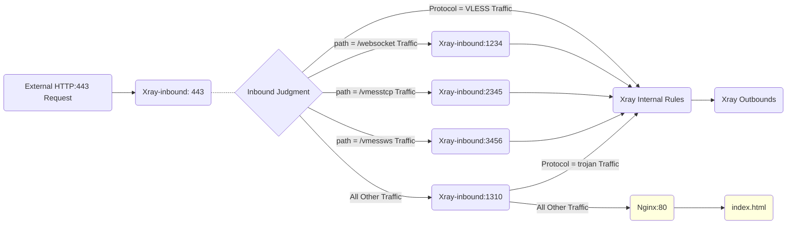

# A Brief Analysis of Fallbacks

In the process of using Xray, you must have heard about the **[Fallback]** function countless times. This article will briefly explain the logic and usage of this function.

## 1. Reviewing Fallbacks in the "Beginner's Guide"

If you used the [Xray Configuration](../level-0/ch07-xray-server.md#_7-4-configuration-xray) from the *Beginner's Guide* and completed the [HTTP to HTTPS Redirection Optimization](../level-0/ch07-xray-server.md#_7-8-server-optimization-part-2-enable-http-automatic-jump-to-https), then you already have a simple fallback based on the `VLESS` protocol:

```json
{
  "inbounds": [
    {
      "port": 443,
      "protocol": "vless",
      "settings": {
        "clients": [
          // ... ...
        ],
        "decryption": "none",
        "fallbacks": [
          {
            "dest": 8080 // Default fallback to the probe-resistant proxy/service
          }
        ]
      },
      "streamSettings": {
        // ... ...
      }
    }
  ]
}
```

How do we explain this configuration in plain language?

1. **Xray's `[inbound port]` is `443`**

    This means `Xray` is responsible for listening to `HTTPS` traffic on port `443`.

2. **Xray's `[inbound protocol]` is `vless`**

    Only traffic using the `vless` protocol will flow into `Xray` for further processing.

    ::: warning
    **Note:** The `VLESS` lightweight protocol was originally developed to introduce the fallback function to cores like `xray` and `v2fly`, while reducing redundant verification/encryption. (Of course, as of now, the `trojan` protocol in `xray` also fully supports the fallback function.)
    :::

3. **The `[fallback dest]` is `8080`**

    After `Xray` accepts traffic on port `443`, traffic belonging to the `vless` protocol is processed internally by `Xray` and forwarded to the outbound module. Traffic that is *not* `vless` protocol is forwarded to port `8080`.

    ::: warning
    **Q: Is it singular or plural?**

    A: Some sharp students may have noticed that in the configuration file, the keys are plural (`inbounds`, `fallbacks`), but when I explain them, I use the singular (`inbound`, `fallback`). Why?

    Because the plural form in the configuration file indicates that `xray` supports N elements of the same level (i.e., N inbounds, M fallbacks, etc.). In the example analysis above, we are referring to just one of them, so I used the singular.
    :::

4. **Traffic falling back to port `8080` is handled by a subsequent program**

    In the example from the *Beginner's Guide*, port `8080` is handled by `Nginx`, which finds and displays the Red Panda webpage based on its configuration.

5. **Summary: The complete data route for the simplest fallback in the Beginner's Guide is as follows:**

    ```mermaid
    graph LR;

    W(External HTTP:80 Request) --> N80(HTTP:80)

    subgraph Nginx External Listener
    N80 -.- N301(301 Redirect) -.- N443(HTTPS:443)
    end

    N443 --> X(Xray Listener 443) .- X1{Inbound Judgment}
    X1 --> |Receive VLESS Traffic| X2(Xray Internal Rules)
    X2 --> O(Xray Outbounds)
    X1 ==> |Fallback Non-VLESS Traffic| N8080(Nginx:8080)
    N8080:::nginxclass ==> H(index.html)

    H:::nginxclass
    classDef nginxclass fill:#FFFFDE

    ```

## 2. Re-understanding Fallbacks (WHAT, HOW `v1`)

Based on the example above, you should understand what a fallback is (What) and how it works (How). Simply put, it involves these elements:

1. The **Time** of fallback is after traffic enters the `Xray Listening Port`.
2. The **Basis** for fallback is traffic characteristics like `Protocol Type`.
3. The **Target** of fallback is a specific `Port`.
4. The traffic being fallen back is taken over by a subsequent program listening on the `Fallback Port`.

## 3. Why Use Fallbacks (WHY `v1`)

Initially, it was to defend against **[Active Probing]**.

**Active Probing:** To put it simply and crudely, this refers to external parties sending specific network requests and interpreting the server's response to guess whether the server is running proxy tools like `xray`, `v2fly`, or `shadowsocks`. Once accurately identified, the server may be interfered with or blocked.

The reason interpretation is possible based on server responses is that a complete data request involves many steps of data exchange, and each step produces certain software signatures. In plain English:

- A normal website response will definitely **[HAVE]** signatures of Web services/databases like `Nginx`, `Apache`, `MySQL`, etc.
- A normal website response will definitely **[NOT HAVE]** signatures of proxy tools like `xray`, `v2fly`, `shadowsocks`, etc.

Therefore, when we provide the **[Fallback]** function to `Xray` (as in the example above, falling back to `Nginx`), the result when facing any probing request is:

- Probing traffic cannot master your `VLESS` secrets/elements, so it will all fall back to `Nginx`.
- Since probing traffic falls back into `Nginx`, the VPS server's response will definitely **[HAVE]** `Nginx` signatures.
- Because `Xray` itself does not respond to probing traffic, the VPS response will definitely **[NOT HAVE]** `Xray` signatures.

Thus, the **[Fallback]** function solves the security risk of the server being **[Actively Probed]** from the logic of data interaction.

## 4. Re-understanding the [Perfect Form of Fallback] (WHAT, WHY, HOW `v2`)

Why do we need to understand fallbacks again? Because the above only explains the initial version of fallbacks based on "protocols" for resisting [Active Probing].

During the continuous development and iteration of the `VLESS` protocol and `fallback` function by [RPRX](https://github.com/rprx), it was discovered that fallbacks could be much more flexible and powerful. As long as the premise of resisting [Active Probing] is met, by fully utilizing the information in the first data packet, multi-element and multi-level fallbacks (such as `path`, `alpn`, etc.) can be achieved.

Based on this development philosophy, the **[Fallback]** function has gradually grown into its current "Perfect Form," completing the evolution from `Pure Camouflage --> WS Shunting --> Multi-protocol Multi-feature Shunting`. The final version has even completely replaced the shunting functions that previously required Web servers or other tools. Moreover, since the aforementioned [Fallback/Shunting] processing is completed at the first packet judgment stage with millisecond-level speed and does not involve any data manipulation, there is almost no process loss.

**Therefore, the [Complete Fallback Function] in `Xray` now possesses the following attributes:**

- **Secure:** Fully resists active probing attacks.
- **Efficient:** Almost zero performance loss.
- **Flexible:** Flexible data shunting, reuse of common ports (like 443).

::: tip Mr. Wordy
Although explaining it in multiple rounds seems tedious, only by peeling it back layer by layer can we fully demonstrate the unique power of the [Perfect Form of Fallback]!
:::

## 5. Multi-layer Fallback Example and Interpretation

Now that you understand what the [Perfect Form of Fallback] is, you can get your hands dirty configuring multi-layer fallbacks.

### 5.1 First, I will extract the server-side configuration for port 443 as follows

```json
{
  "port": 443,
  "protocol": "vless",
  "settings": {
    "clients": [
      {
        "id": "", // Fill in your UUID
        "flow": "xtls-rprx-vision",
        "level": 0,
        "email": "love@example.com"
      }
    ],
    "decryption": "none",
    "fallbacks": [
      {
        "dest": 1310, // Default fallback to Xray's Trojan protocol
        "xver": 1
      },
      {
        "path": "/websocket", // Must be changed to your custom PATH
        "dest": 1234,
        "xver": 1
      },
      {
        "path": "/vmesstcp", // Must be changed to your custom PATH
        "dest": 2345,
        "xver": 1
      },
      {
        "path": "/vmessws", // Must be changed to your custom PATH
        "dest": 3456,
        "xver": 1
      }
    ]
  },
  "streamSettings": {
    "network": "tcp",
    "security": "tls",
    "tlsSettings": {
      "alpn": ["http/1.1"],
      "certificates": [
        {
          "certificateFile": "/path/to/fullchain.crt", // Absolute path to your certificate
          "keyFile": "/path/to/private.key" // Absolute path to your private key
        }
      ]
    }
  }
}
```

How do we explain this configuration in plain language?

1. **Xray's `[inbound port]` is `443`**

    This means `Xray` is responsible for listening to `HTTPS` traffic on port `443` and uses the `TLS` certificate set under `certificates` for verification.

2. **Xray's `[inbound protocol]` is `vless`**

    `vless` protocol traffic flows directly into `Xray` for subsequent processing.

3. **Non-`VLESS` protocol traffic has 4 different fallback targets:**
    1. Traffic with `path` as `/websocket` falls back to port `1234` for processing.
    2. Traffic with `path` as `/vmesstcp` falls back to port `2345` for processing.
    3. Traffic with `path` as `/vmessws` falls back to port `3456` for processing.
    4. All other traffic falls back to port `1310` for processing.

4. **`xver` set to `1` means enabling the `proxy protocol` function to pass the real source IP backwards.**

5. **The fallback structure described above is shown in the diagram below:**

    ```mermaid
    graph LR;

    W443(External HTTP:443 Request) --> X443(Xray-inbound: 443) .- X1{Inbound Judgment}
    X1 --> |Protocol = VLESS Traffic| X2(Xray Internal Rules)
    X2 --> O(Xray Outbounds)

    X1 --> |path = /websocket Traffic| X1234(Xray-inbound:1234)
    X1 --> |path = /vmesstcp Traffic| X2345(Xray-inbound:2345)
    X1 --> |path = /vmessws Traffic| X3456(Xray-inbound:3456)
    X1 --> |All Other Traffic| X1310(Xray-inbound:1310)

    ```

6. **The Web Page Fallback is missing!**

    That's right, clever students must have noticed that the `nginx fallback` for defending against [Active Probing] is gone!!! Why is that? Is it insecure? Don't worry, let's continue analyzing:

### 5.2 The configuration segments for subsequent listening processing are as follows

1. Traffic falling back to port `1310` is verified and processed according to the configuration below:

    ```json
    {
      "port": 1310,
      "listen": "127.0.0.1",
      "protocol": "trojan",
      "settings": {
        "clients": [
          {
            "password": "", // Fill in your password
            "level": 0,
            "email": "love@example.com"
          }
        ],
        "fallbacks": [
          {
            "dest": 80 // Or fallback to another probe-resistant proxy
          }
        ]
      },
      "streamSettings": {
        "network": "tcp",
        "security": "none",
        "tcpSettings": {
          "acceptProxyProtocol": true
        }
      }
    }
    ```

    Look, something magical happened. A new `fallbacks` section appeared here in the `trojan` protocol. As mentioned before, the `trojan` protocol in `xray` also has full fallback capabilities. So, at this point, the `trojan` protocol can perform judgment and fallback again (this is the legendary "Nested/Matryoshka" fallback):
    - All `trojan` protocol traffic flows into `Xray` for subsequent processing.
    - All non-`trojan` protocol traffic is forwarded to port `80`. The defense against [Active Probing] is complete!

2. Traffic falling back to port `1234`. Look closely! It is actually `vless+ws`:

    ```json
    {
      "port": 1234,
      "listen": "127.0.0.1",
      "protocol": "vless",
      "settings": {
        "clients": [
          {
            "id": "", // Fill in your UUID
            "level": 0,
            "email": "love@example.com"
          }
        ],
        "decryption": "none"
      },
      "streamSettings": {
        "network": "ws",
        "security": "none",
        "wsSettings": {
          "acceptProxyProtocol": true, // Reminder: Delete this line if using Nginx/Caddy to reverse proxy WS
          "path": "/websocket" // Must be changed to custom PATH, matching the shunting path
        }
      }
    }
    ```

3. Traffic falling back to port `2345`. Look closely! It is actually `vmess direct connection`:

    ```json
    {
      "port": 2345,
      "listen": "127.0.0.1",
      "protocol": "vmess",
      "settings": {
        "clients": [
          {
            "id": "", // Fill in your UUID
            "level": 0,
            "email": "love@example.com"
          }
        ]
      },
      "streamSettings": {
        "network": "tcp",
        "security": "none",
        "tcpSettings": {
          "acceptProxyProtocol": true,
          "header": {
            "type": "http",
            "request": {
              "path": [
                "/vmesstcp" // Must be changed to custom PATH, matching the shunting path
              ]
            }
          }
        }
      }
    }
    ```

4. Traffic falling back to port `3456`. Look closely again! It is actually `vmess+ws(+cdn)`.

    ::: warning Explanation
    You read that right. This is one of the combinations previously recommended by v2fly, and it fully supports `CDN`. It is now included in the perfect fallback package!
    :::

    ```json
    {
      "port": 3456,
      "listen": "127.0.0.1",
      "protocol": "vmess",
      "settings": {
        "clients": [
          {
            "id": "", // Fill in your UUID
            "level": 0,
            "email": "love@example.com"
          }
        ]
      },
      "streamSettings": {
        "network": "ws",
        "security": "none",
        "wsSettings": {
          "acceptProxyProtocol": true, // Reminder: Delete this line if using Nginx/Caddy to reverse proxy WS
          "path": "/vmessws" // Must be changed to custom PATH, matching the shunting path
        }
      }
    }
    ```

5. **With this, we can draw the complete fallback route for the template:**



## 6. Conclusion

This concludes the introduction to `Xray`'s **[Fallback]** function. I hope this article helps you understand the power of `Xray`.

## 7. Bonus Question

I will shamelessly leave a bonus question: Is there any room for optimization in the [VLESS-TCP-XTLS-WHATEVER](https://github.com/XTLS/Xray-examples/blob/main/VLESS-TCP-XTLS-WHATEVER/) template detailed in this article?

Hint: HTTP automatic redirection to HTTPS.
