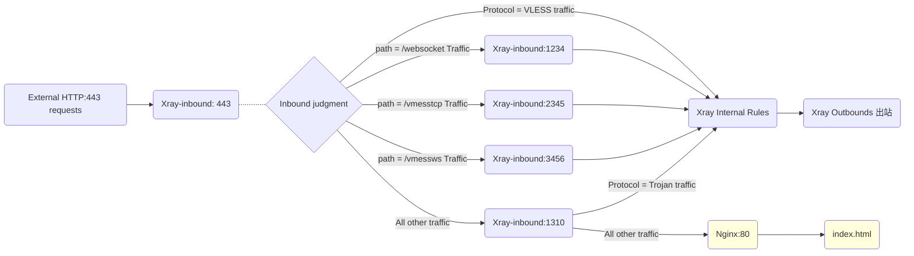

# Fallbacks

When using Xray, you must have heard of the "Fallback" function countless times. This article will briefly explain the logic and usage of this function.

## 1. Review the fallback in "Little White Vernacular"

If you used the [Xray configuration](../level-0/ch07-xray-server.md#_7-4-Configure xray) in "Little White Vernacular" and completed the [HTTP automatic redirection to HTTPS optimization](../level-0/ch07-xray-server.md#_7-8-Server optimization 2-Enable http automatic redirection to https), then you already have a simple fallback based on the `VLESS` protocol:

```json
{
  "inbounds": [
    {
      "port": 443,
      "protocol": "vless",
      "settings": {
        "clients": [
          // ... ...
        ],
        "decryption": "none",
        "fallbacks": [
          {
            "dest": 8080 // Fallback to anti-detection proxy by default
          }
        ]
      },
      "streamSettings": {
        // ... ...
      }
    }
  ]
}
```

How do you explain this configuration in human terms?

1. **The inbound port of `Xray` is `443`**  

   This means `Xray` listens for `HTTPS` traffic on port `443`.  

2. **The inbound protocol of `Xray` is `vless`**  

   Only traffic using the `vless` protocol will flow into `Xray` for further processing.  

   ::: warning  
   **Note:** The lightweight `VLESS` protocol was originally developed to introduce fallback functionality for cores like `xray` and `v2fly`, while reducing redundant validation/encryption. (As of now, the `trojan` protocol in `xray` also fully supports fallback functionality.)  
   :::
   
4. **The fallback destination port is `8080`**  

   After `Xray` receives traffic on port `443`, traffic using the `vless` protocol is processed internally by `Xray` and forwarded to the outbound module. Other non-`vless` traffic is forwarded to port `8080`.  

   ::: warning  
   **Question: Singular or plural?**  

   **Answer:** Some sharp-eyed readers may notice that the config file uses plural forms like `inbounds` and `fallbacks`, but my explanations use singular forms like `inbound` and `fallback`. Why?  

   The plural forms in the config file indicate that `xray` supports multiple elements of the same type (e.g., N inbound rules, M fallback rules, etc.). The examples above only describe one of these elements, so I used singular forms.  
   :::
   
6. **Traffic forwarded to port `8080` is handled by subsequent programs**  

   In the example from the guide, traffic on port `8080` is handled by `Nginx`, which locates and displays the little panda's webpage based on its configuration.  

7. **In summary, the complete data flow for the simplest fallback in the example is as follows:**  
   ```mermaid
   graph LR;

   W(External HTTP:80 Request) --> N80 (HTTP:80)
   

   subgraph Nginx External monitoring
   N80 -.- N301(301 Redirect) -.- N443(HTTPS:443)
   end

   N443 --> X(Xray monitor 443) .- X1{Inbound judgment}
   X1 --> |Receiving VLESS traffic| X2(Xray Internal Rules)
   X2 --> O(Xray Outbounds output)
   X1 ==> |Falling back non-VLESS traffic| N8080(Nginx:8080)
   N8080:::nginxclass ==> H(index.html)

   H:::nginxclass
   classDef nginxclass fill:#FFFFDE

   ```

## 2. Re-understanding of fallback (WHAT, HOW `v1`)

Based on the above examples, you should be able to understand what fallback is (What) and how to fallback (How). In short, it is the following elements:

1. The fallback time is when the traffic enters the `Xray listening port`
2. The fallback is based on traffic characteristics such as `protocol type`
3. The fallback target is a certain `port`
4. The fallen traffic is taken over by the subsequent program that listens to the `fallback port`


## 3. Why do we need to fall back (WHY `v1`)

Initially, it was to defend **【Active Probing】**

**Active detection:** In simple terms, it means that the outside world sends specific network requests and interprets the server's response content to infer whether the server is running proxy tools such as `xray`, `v2fly`, `shadowsocks`. Once it can be accurately identified, the server may be interfered with or blocked.

The reason why it can be interpreted based on the server's response content is that a complete data request actually has many data exchange steps, and each step will produce some software features. In plain words:

- A normal website response will definitely have features similar to `Nginx`, `Apache`, `MySQL` Web services, databases and other tools
- A normal website response will definitely not have features similar to `xray`, `v2fly`, `shadowsocks` and other proxy tools

Therefore, when we provide the [fallback] function to `Xray` (as in the above example, fallback to `Nginx`), the result for any request used for detection is:

- The detection traffic cannot grasp your `VLESS` elements, so it will be fallen back to `Nginx`
- All detection traffic falls back to `Nginx`, so the response of the VPS server will definitely [have] the characteristics of `Nginx`
- Because `Xray` itself does not respond to any detection traffic, the response of the VPS will definitely [not have] the characteristics of `Xray`

So far, the [fallback] function has solved the security risks of the server being **[actively detected]** from the data interaction logic.

## 4. Re-understanding the [full version of fallback] (WHAT, WHY, HOW `v2`)

Why do we need to understand fallback again? Because the above only explains the first version of fallback based on the "protocol" and resisting [active detection].

In the process of [RPRX](https://github.com/rprx) continuously developing and iterating the `VLESS` protocol and the `fallback` function, we gradually discovered that fallback can be more flexible and powerful. As long as we ensure resistance to [active detection] and make full use of the information in the first packet of the data, we can actually achieve multi-element and multi-level fallback. (Such as `path`, `alpn`, etc.)

Based on this development concept, the [fallback] function has gradually grown into its current complete form, that is, it has completed the evolution of `pure camouflage --> ws diversion --> multi-protocol multi-feature diversion`. The final version even completely replaced the diversion function that was previously completed by Web servers and other tools. And because the above-mentioned [fallback/diversion] processing is completed at a millisecond speed in the first packet judgment stage and does not involve any data operation, there is almost no process loss.

**Therefore, the [full fallback function] in `Xray` now has the following properties:**

- **Security:** Fully resist active detection attacks

- **Efficiency:** Almost no performance loss

- **Flexibility:** Flexible data diversion and reuse of common ports (such as 443)

::: tip 话声君
Although such multiple rounds of introductions are a bit cumbersome, only by deepening them layer by layer can we fully illustrate the unique power of [full fallback]!
:::

## 5. Multi-layer fallback example and interpretation

After understanding what [full fallback] is, you can start to configure multi-layer fallback. In fact, the project has provided a very complete example, namely [VLESS-TCP-XTLS-WHATEVER](https://github.com/XTLS/Xray-examples/blob/main/VLESS-TCP-XTLS-WHATEVER/) in the official template.

### 5.1 First, I will excerpt the 443 listening section configured on the server as follows:

```json
{
  "port": 443,
  "protocol": "vless",
  "settings": {
    "clients": [
      {
        "id": "", // Fill with your UUID
        "flow": "xtls-rprx-vision",
        "level": 0,
        "email": "love@example.com"
      }
    ],
    "decryption": "none",
    "fallbacks": [
      {
        "dest": 1310, // Falling back to Xray's Trojan protocol by default
        "xver": 1
      },
      {
        "path": "/websocket", // Must be replaced with a custom PATH
        "dest": 1234,
        "xver": 1
      },
      {
        "path": "/vmesstcp", // Must be replaced with a custom PATH
        "dest": 2345,
        "xver": 1
      },
      {
        "path": "/vmessws", // Must be replaced with a custom PATH
        "dest": 3456,
        "xver": 1
      }
    ]
  },
  "streamSettings": {
    "network": "tcp",
    "security": "tls",
    "tlsSettings": {
      "alpn": ["http/1.1"],
      "certificates": [
        {
          "certificateFile": "/path/to/fullchain.crt", // Replace with your certificate, absolute path
          "keyFile": "/path/to/private.key" // Replace with your certificate, absolute path
        }
      ]
    }
  }
}
```

1. **`Xray` listens on port `443`**  
   Monitors HTTPS traffic using TLS certificates configured in the `certificates` section.

2. **`Xray` uses `vless` as its inbound protocol**  
   Directly processes VLESS protocol traffic through its core routing system.

3. **Non-VLESS traffic follows 4 fallback paths:**  
   - Path `websocket` → Port `1234`  
   - Path `vmesstcp` → Port `2345`  
   - Path `vmessws` → Port `3456`  
   - All others → Port `1310`  
   *Paths refer to HTTP request headers for routing*

4. **`xver: 1` enables Proxy Protocol**  
   Preserves original client IP addresses when working with reverse proxies.

5. **Fallback structure visualization:**  
   [Diagram/Figure Would Appear Here]

   ```mermaid
   graph LR;

   W443(External HTTP:443 requests) --> X443(Xray-inbound: 443) .- X1{Inbound judgment}
   X1 --> |Protocol = VLESS traffic| X2(Xray Internal Rules)
   X2 --> O(Xray Outbounds output)

   X1 --> |path = /websocket Traffic| X1234(Xray-inbound:1234)
   X1 --> |path = /vmesstcp Traffic| X2345(Xray-inbound:2345)
   X1 --> |path = /vmessws Traffic| X3456(Xray-inbound:3456)
   X1 --> |All other traffic| X1310(Xray-inbound:1310)

   ```

6. **Web page fallback is gone! **

   That's right, smart students should have discovered that the `nginx fallback` of the defense [active detection] is gone! ! ! Why is this? Is it unsafe? Don't worry, let's continue to analyze:

### 5.2 The configuration section for subsequent monitoring processing is excerpted as follows:

1. For the subsequent processing of the traffic falling back to port 1310, verify and process it according to the following configuration:

   ```json
   {
     "port": 1310,
     "listen": "127.0.0.1",
     "protocol": "trojan",
     "settings": {
       "clients": [
         {
           "password": "", // Fill in your password
           "level": 0,
           "email": "love@example.com"
         }
       ],
       "fallbacks": [
         {
           "dest": 80 // Or fallback to other detection-resistant proxies
         }
       ]
     },
     "streamSettings": {
       "network": "tcp",
       "security": "none",
       "tcpSettings": {
         "acceptProxyProtocol": true
       }
     }
   }
   ```

   Look, something magical happened, a new `fallbacks` appeared in the `trojan` protocol. As mentioned before, the `trojan` protocol in `xray` also has complete fallback capabilities, so at this time the `trojan` protocol can make judgments and fallbacks again (this is the legendary nesting doll fallback):

   - All traffic of the `trojan` protocol flows into `Xray` for subsequent processing
   - All non-trojan protocol traffic is forwarded to port 80, and the [active detection] defense is complete!

2. The subsequent processing falls back to the traffic of port `1234`. Look carefully! It is actually `vless+ws`:

   ```json
   {
     "port": 1234,
     "listen": "127.0.0.1",
     "protocol": "vless",
     "settings": {
       "clients": [
         {
           "id": "", // Fill in UUID
           "level": 0,
           "email": "love@example.com"
         }
       ],
       "decryption": "none"
     },
     "streamSettings": {
       "network": "ws",
       "security": "none",
       "wsSettings": {
         "acceptProxyProtocol": true, // Reminder: If you use Nginx/Caddy or other reverse generation WS, you need to delete this line.
         "path": "/websocket" // Must change to a custom PATH, which must be consistent with the diversion
       }
     }
   }
   ```

3. The subsequent processing falls back to the traffic of port `2345`. Look carefully! It is actually `vmess direct connection`:

   ```json
   {
     "port": 2345,
     "listen": "127.0.0.1",
     "protocol": "vmess",
     "settings": {
       "clients": [
         {
           "id": "", // Fill in UUID
           "level": 0,
           "email": "love@example.com"
         }
       ]
     },
     "streamSettings": {
       "network": "tcp",
       "security": "none",
       "tcpSettings": {
         "acceptProxyProtocol": true,
         "header": {
           "type": "http",
           "request": {
             "path": [
               "/vmesstcp" // You must change to a custom PATH, which must be consistent with the diversion
             ]
           }
         }
       }
     }
   }
   ```

4. Then process the traffic that falls back to port 3456 and take a closer look! It is actually vmess+ws(+cdn) .

   ::: warning
   You read it right, this is one of the combinations v2fly has recommended, and it fully supports `CDN`. Now it has been added to the perfect fallback package!
   :::

   ```json
   {
     "port": 3456,
     "listen": "127.0.0.1",
     "protocol": "vmess",
     "settings": {
       "clients": [
         {
           "id": "", // Fill in UUID
           "level": 0,
           "email": "love@example.com"
         }
       ]
     },
     "streamSettings": {
       "network": "ws",
       "security": "none",
       "wsSettings": {
         "acceptProxyProtocol": true, // Reminder: If you use Nginx/Caddy to reverse WS, you need to delete this line
         "path": "/vmessws" // You must change to a custom PATH, which must be consistent with the diversion
       }
     }
   }
   ```

5. At this point, we can completely draw the template's fallback route:



## 6. Conclusion

So far, the "fallback" function of `Xray` has been introduced. I hope this article can help you understand the power of `Xray`.

## 7. Additional questions

I'll shamelessly leave you with a side question: Is there anything that can be optimized for the [VLESS-TCP-XTLS-WHATEVER](https://github.com/XTLS/Xray-examples/blob/main/VLESS-TCP-XTLS-WHATEVER/) template detailed in this article?

Tip: HTTP automatically redirects to HTTPS
