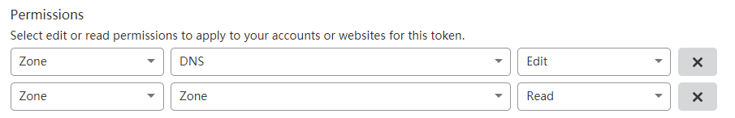

# Camouflage and Routing by Domain via SNI Fallback

VLESS is a lightweight protocol. Like Trojan, it does not perform complex encryption and obfuscation on traffic. Instead, it "hides in plain sight" by using the TLS protocol for encryption, blending in with other HTTPS traffic to pass in and out of the firewall. To better camouflage against active probing, the **Fallbacks** feature was introduced alongside VLESS. This tutorial will demonstrate how to use the fallback function of the VLESS inbound protocol in Xray, combined with Nginx or Caddy, to achieve routing based on domain names while ensuring complete camouflage.

## Scenarios

Due to XTLS, Xray needs to listen on port 443. If a website was previously running on the server, it would no longer be able to run, or would have to run on a different port, which is obviously unreasonable. There are three solutions to this problem:

- **Xray listens on other common ports (e.g., 22, 3389, 8443)**

  This solution is the simplest, but not perfect.

- **Nginx or HAProxy listens on port 443 and uses SNI routing for L4 reverse proxying to achieve port reuse**

  This solution is relatively complex and requires a certain understanding of Nginx or HAProxy, so it will not be explained in detail here.

- **Xray listens on port 443 and uses the Fallbacks function for SNI routing to fallback website traffic to Nginx or Caddy**

  This solution is of moderate difficulty and is the method this tutorial intends to demonstrate.

## Introduction to SNI

Server Name Indication (**SNI**) is an extension of the TLS protocol. Friends familiar with reverse proxies know that to proxy traffic to the correct content based on the domain name, the following configuration is needed:

```nginx
proxy_set_header Host hostname;
```

This line sets the HTTP Header named "Host" to a specific hostname. Why do this? Generally, one server corresponds to one IP but runs multiple websites. Visitors query the IP via the domain name to access the server. The question arises: how does the server determine which website the visitor wants to access? This requires "Name-based Virtual Hosting."

When a Web server receives a request, it looks at the requested Host header to serve the correct website. However, when the HTTP protocol is encrypted by the TLS protocol, this simple method becomes impossible. Because the TLS handshake happens before the server sees any HTTP headers, the server cannot use the information in the HTTP Host header to decide which certificate to present, nor can it determine the visitor's target.

The principle of SNI is simple: it solves this problem by having the client send the hostname as part of the TLS negotiation. Therefore, when using Nginx for reverse proxying HTTPS, you need to add `proxy_ssl_server_name on;` to the configuration. At this point, Nginx will send SNI information to the proxied server, solving the issue of virtual hosts failing under HTTPS. Additionally, when using SNI, the website can be accessed correctly even without specifying the Host header.

## The Logic


After receiving traffic on port 443, Xray decrypts the TLS. If the first packet length is < 18, the protocol version is invalid, or authentication fails, the traffic is forwarded to the address specified in `dest` by matching `name`, `path`, and `alpn`.

## Add DNS Records


Please modify the domain name and IP according to your actual situation.

## Apply for TLS Certificates

Since we need to route traffic for domains with different prefixes, and a wildcard certificate is limited to the scope between two dots (e.g., applying for `*.example.com` covers `example.com` but not `*.*.example.com`), we need to apply for a [SAN](https://en.wikipedia.org/wiki/Subject_Alternative_Name) wildcard certificate. According to Let's Encrypt's official site[^1], applying for a wildcard certificate requires DNS-01 validation. Here, we demonstrate using [acme.sh](https://acme.sh) to apply for a free Let's Encrypt TLS certificate for a domain with NS records managed by Cloudflare. For methods using other domain registrars, please read [dnsapi · acmesh-official/acme.sh Wiki](https://github.com/acmesh-official/acme.sh/wiki/dnsapi).

First, go to the [Cloudflare Dashboard](https://dash.cloudflare.com/profile/api-tokens) to create an API Token. The parameters are as follows:



The permissions section is crucial; other sections can be arbitrary.

After creation, you will get a mysterious string. Please keep it safe in a secure place where it won't be lost, as it will not be shown again. This string is the `CF_Token` used below.

::: tip Note
The following operations need to be performed as the root user; using sudo may cause errors.
:::

```bash
curl [https://get.acme.sh](https://get.acme.sh) | sh # Install acme.sh
export CF_Token="sdfsdfsdfljlbjkljlkjsdfoiwje" # Set API Token variable
acme.sh --issue -d example.com -d *.example.com --dns dns_cf # Apply for certificate using DNS-01 validation
mkdir /etc/ssl/xray # Create directory for certificates
acme.sh --install-cert -d example.com --fullchain-file /etc/ssl/xray/cert.pem --key-file /etc/ssl/xray/privkey.key --reloadcmd "chown nobody:nogroup -R /etc/ssl/xray && systemctl restart xray" # Install certificate to the specified directory and set the command to run after auto-renewal
```

## Xray Configuration

```json
{
  "log": {
    "loglevel": "warning"
  },
  "inbounds": [
    {
      "port": 443,
      "protocol": "vless",
      "settings": {
        "clients": [
          {
            "id": "UUID",
            "flow": "xtls-rprx-vision"
          }
        ],
        "decryption": "none",
        "fallbacks": [
          {
            "name": "example.com",
            "path": "/vmessws",
            "dest": 5000,
            "xver": 1
          },
          {
            "dest": 5001,
            "xver": 1
          },
          {
            "alpn": "h2",
            "dest": 5002,
            "xver": 1
          },
          {
            "name": "blog.example.com",
            "dest": 5003,
            "xver": 1
          },
          {
            "name": "blog.example.com",
            "alpn": "h2",
            "dest": 5004,
            "xver": 1
          }
        ]
      },
      "streamSettings": {
        "network": "tcp",
        "security": "tls",
        "tlsSettings": {
          "alpn": ["h2", "http/1.1"],
          "certificates": [
            {
              "certificateFile": "/etc/ssl/xray/cert.pem",
              "keyFile": "/etc/ssl/xray/privkey.key"
            }
          ]
        }
      }
    },
    {
      "listen": "127.0.0.1",
      "port": 5000,
      "protocol": "vmess",
      "settings": {
        "clients": [
          {
            "id": "UUID"
          }
        ]
      },
      "streamSettings": {
        "network": "ws",
        "wsSettings": {
          "acceptProxyProtocol": true,
          "path": "/vmessws"
        }
      }
    }
  ],
  "outbounds": [
    {
      "protocol": "freedom"
    }
  ]
}
```

The above configuration is for Nginx. Here are some details to note:

- **About Proxy Protocol**

  Proxy Protocol is a protocol developed by HAProxy designed to solve the problem of losing client information during proxying. It is often used in chained proxies and reverse proxies. Traditional handling methods are often complex and restrictive, while Proxy Protocol simply attaches the original connection 4-tuple information to the data packet during transmission, solving this problem.

  Everything has its pros and cons, and Proxy Protocol is no exception.
  - If sent, it must be received; and vice versa.
  - The same port cannot be compatible with both connections carrying Proxy Protocol data and those without (e.g., Nginx virtual hosts (server) on the same port essentially violate this).[^2][^3]

  If you encounter exceptions, please consider whether the configuration meets the above conditions.

  Here, we use Proxy Protocol to let the fallback target acquire the client's real IP.

  Additionally, when `"acceptProxyProtocol": true` exists in an Xray inbound configuration, ReadV will be disabled.

- **About HTTP/2**

  First, the order of `inbounds.streamSettings.tlsSettings.alpn` matters. `h2` should be placed before `http/1.1` to prioritize HTTP/2 while ensuring compatibility; reversing them will cause HTTP/2 to negotiate as HTTP/1.1, making it an ineffective configuration.

  In the above configuration, each fallback rule to Nginx is split into two. This is because `h2` is an HTTP/2 connection with mandatory TLS encryption, which is beneficial for data security over the internet but unnecessary within the server; whereas `h2c` is an unencrypted HTTP/2 connection, suitable for this environment. However, Nginx cannot listen for HTTP/1.1 and h2c on the same port simultaneously. To solve this, the `alpn` item (inside `fallbacks`, not `tlsSettings`) must be specified in the fallback to attempt to match the TLS ALPN negotiation result.

  It is recommended to use only two types of values for the `alpn` item as needed:[^4]
  - Omitted
  - `"h2"`

  If you use **Caddy**, you don't need to be this complicated because it **can** listen to HTTP/1.1 and h2c on the same port simultaneously. The configuration changes are as follows:

  ```json
  {
    "fallbacks": [
      {
        "name": "example.com",
        "path": "/vmessws",
        "dest": 5000,
        "xver": 1
      },
      {
        "dest": 5001,
        "xver": 1
      },
      {
        "name": "blog.example.com",
        "dest": 5002,
        "xver": 1
      }
    ]
  }
  ```

## Nginx Configuration

Nginx will be installed via the official repository.

```bash
sudo apt install curl gnupg2 ca-certificates lsb-release
echo "deb [arch=amd64] [http://nginx.org/packages/ubuntu](http://nginx.org/packages/ubuntu) `lsb_release -cs` nginx" \
    | sudo tee /etc/apt/sources.list.d/nginx.list
curl -fsSL [https://nginx.org/keys/nginx_signing.key](https://nginx.org/keys/nginx_signing.key) | sudo apt-key add -
sudo apt update
sudo apt install nginx
```

Delete `/etc/nginx/conf.d/default.conf` and create `/etc/nginx/conf.d/fallbacks.conf` with the following content:

```nginx
set_real_ip_from 127.0.0.1;
real_ip_header proxy_protocol;

server {
    listen 127.0.0.1:5001 proxy_protocol default_server;
    listen 127.0.0.1:5002 proxy_protocol default_server http2;

    location / {
        root /srv/http/default;
    }
}

server {
    listen 127.0.0.1:5003 proxy_protocol;
    listen 127.0.0.1:5004 proxy_protocol http2;

    server_name blog.example.com;

    location / {
        root /srv/http/blog.example.com;
    }
}

server {
    listen 80;
    return 301 https://$host$request_uri;
}
```

## Caddy Configuration

To install Caddy, please refer to [Install — Caddy Documentation](https://caddyserver.com/docs/install).

To enable Caddy to obtain the visitor's real IP, you need to compile Caddy with the Proxy Protocol module. It is recommended to compile online directly on the Caddy website.

```bash
sudo curl -o /usr/bin/caddy "[https://caddyserver.com/api/download?os=linux&arch=amd64&p=github.com%2Fmastercactapus%2Fcaddy2-proxyprotocol&idempotency=79074247675458](https://caddyserver.com/api/download?os=linux&arch=amd64&p=github.com%2Fmastercactapus%2Fcaddy2-proxyprotocol&idempotency=79074247675458)"
sudo chmod +x /usr/bin/caddy
```

Just replace it directly.

::: tip
It is recommended to install Caddy via the official documentation first, and then replace the binary file. This way, you don't need to manually configure the daemon process.
:::

Edit `/etc/caddy/Caddyfile`:

```Caddyfile
{
    servers 127.0.0.1:5001 {
        listener_wrappers {
            proxy_protocol
        }
        protocol {
            allow_h2c
        }
    }
    servers 127.0.0.1:5002 {
        listener_wrappers {
            proxy_protocol
        }
        protocol {
            allow_h2c
        }
    }
}

:5001 {
    root * /srv/http/default
    file_server
    log
    bind 127.0.0.1
}

http://blog.example.com:5002 {
    root * /srv/http/blog.example.com
    file_server
    log
    bind 127.0.0.1
}

:80 {
    redir https://{host}{uri} permanent
}
```

## References

1. [Server Name Indication - Wikipedia](https://en.wikipedia.org/wiki/Server_Name_Indication)
2. [Home · acmesh-official/acme.sh Wiki](https://github.com/acmesh-official/acme.sh/wiki)
3. [HTTP/2 - Wikipedia](https://en.wikipedia.org/wiki/HTTP/2)

## Citations

<!-- prettier-ignore-start -->
[^1]: [FAQ - Let's Encrypt](https://letsencrypt.org/docs/faq/)
[^2]: [Proxy Protocol - HAProxy Technologies](https://www.haproxy.com/blog/haproxy/proxy-protocol/)
[^3]: [Proxy protocol introduction and nginx configuration (Chinese)](https://www.jianshu.com/p/cc8d592582c9)
[^4]: [v2fly-github-io/vless.md at master · rprx/v2fly-github-io](https://github.com/rprx/v2fly-github-io/blob/master/docs/config/protocols/vless.md)
<!-- prettier-ignore-end -->
