# Implementing camouflage and domain-based routing through SNI fallback function

VLESS is a lightweight protocol that, like Trojan, does not perform complex encryption and obfuscation on traffic. Instead, it is encrypted through the TLS protocol and mixed in with other HTTPS traffic, making it difficult to detect. In order to better disguise itself and respond to active probing, the fallback function appeared with VLESS at the same time. This tutorial will demonstrate how to use the fallback function of VLESS inbound protocol in Xray, combined with Nginx or Caddy, to achieve domain name-based traffic routing while ensuring complete disguise.

## Application Scenarios

Due to XTLS, Xray needs to listen on port 443, which means that if there is a website running on the server, it cannot run or needs to run on another port, which is obviously unreasonable. There are three solutions to this problem:

- Xray monitors other commonly used ports (such as 22, 3389, 8443).

This plan is the simplest, but not perfect enough.

- Nginx or HAProxy listens on port 443, uses SNI for L4 load balancing, and achieves port multiplexing through reverse proxy.

This plan is relatively complicated and requires some understanding of using Nginx or HAProxy. We will not explain it in too much detail here.

- Xray listens on port 443, and uses Fallbacks feature to split website traffic based on SNI and fallbacks it to Nginx or Caddy.

This plan has a moderate level of difficulty and is the scheme that this tutorial will demonstrate next.

## Introduction to SNI

Server Name Indication (SNI) is an extension protocol of TLS. Friends who are familiar with reverse proxies know that the following configuration is required if you want to proxy traffic to the correct content through a domain name:

```nginx
proxy_set_header Host hostname;
```

(Note: "hostname" should be replaced with the actual hostname.)

This sentence sets the HTTP Header named "Host" to a certain hostname. Why do we need to do this? Generally, one server corresponds to one IP address, but it runs multiple websites. Visitors access the server by querying the IP address via domain name to visit the website. Then the question arises, how to determine which website the visitor wants to access? This requires "name-based virtual hosting".

When a Web server receives a request, it looks at the host header to direct the visitor to the correct website. However, this simple method cannot be used when HTTP protocol is encrypted by TLS protocol. This is because the TLS handshake occurs before the server sees any HTTP headers, so the server cannot use the information in the HTTP host header to determine which certificate to present or which destination the visitor wants to access.

The principle of SNI is also very simple. It solves the problem by allowing the client to send the hostname as part of the TLS negotiation. Therefore, when using Nginx to reverse proxy the HTTPS protocol, you need to add `proxy_ssl_server_name on;` to the configuration. At this time, Nginx will send SNI information to the proxied server, solving the problem of virtual host failure under the HTTPS protocol. In addition, when using SNI, even if the host header is not specified, the website can be accessed correctly.

## Idea



After receiving traffic from port 443, Xray will decrypt the TLS and forward the traffic that has a first packet length < 18, invalid protocol version, or failed authentication through matching name, path, and alpn to the address specified by dest.

## Adding DNS Records


Please modify the domain name and IP according to the actual situation.

## Applying for TLS Certificate

As it is necessary to route traffic to different domain name prefixes, but a wildcard certificate is only valid between two dots (for example, applying for `*.example.com`, the certificate cannot be used for `example.com` and `*.*.example.com`), it is necessary to apply for a [SAN](https://en.wikipedia.org/wiki/Subject_Alternative_Name) (Subject Alternative Name) wildcard certificate. According to the information on the Let's Encrypt official website, applying for a wildcard certificate requires DNS-01 verification. Here, we demonstrate how to apply for a free TLS certificate from Let's Encrypt using [acme.sh](https://acme.sh) for a domain with NS records hosted on Cloudflare. For the application method using other domain name hosting providers, please refer to [dnsapi · acmesh-official/acme.sh Wiki](https://github.com/acmesh-official/acme.sh/wiki/dnsapi).

First, you need to go to the [Cloudflare dashboard](https://dash.cloudflare.com/profile/api-tokens) to create an API token. The parameters are as follows:


The permission part is crucial, while other parts are optional.

After creating, you will receive a mysterious string of characters. Please keep it safe in a secure and non-losing place, as it will not be displayed again. This string of characters is the `CF_Token` that will be used soon.

::: tip Note
The following operations need to be performed under the root user. Using sudo will result in errors.
:::

```bash
curl https://get.acme.sh | sh # Install acme.sh
export CF_Token="sdfsdfsdfljlbjkljlkjsdfoiwje" # Set API Token variable
acme.sh --issue -d example.com -d *.example.com --dns dns_cf # Apply for a certificate using DNS-01 validation method
mkdir /etc/ssl/xray # Create a directory to store the certificate
acme.sh --install-cert -d example.com --fullchain-file /etc/ssl/xray/cert.pem --key-file /etc/ssl/xray/privkey.key --reloadcmd "chown nobody:nogroup -R /etc/ssl/xray && systemctl restart xray" # Install the certificate to the specified directory and set the effective command for automatic renewal
```

## Xray Configuration

```json
{
  "log": {
    "loglevel": "warning"
  },
  "inbounds": [
    {
      "port": 443,
      "protocol": "vless",
      "settings": {
        "clients": [
          {
            "id": "UUID",
            "flow": "xtls-rprx-vision"
          }
        ],
        "decryption": "none",
        "fallbacks": [
          {
            "name": "example.com",
            "path": "/vmessws",
            "dest": 5000,
            "xver": 1
          },
          {
            "dest": 5001,
            "xver": 1
          },
          {
            "alpn": "h2",
            "dest": 5002,
            "xver": 1
          },
          {
            "name": "blog.example.com",
            "dest": 5003,
            "xver": 1
          },
          {
            "name": "blog.example.com",
            "alpn": "h2",
            "dest": 5004,
            "xver": 1
          }
        ]
      },
      "streamSettings": {
        "network": "tcp",
        "security": "tls",
        "tlsSettings": {
          "alpn": ["h2", "http/1.1"],
          "certificates": [
            {
              "certificateFile": "/etc/ssl/xray/cert.pem",
              "keyFile": "/etc/ssl/xray/privkey.key"
            }
          ]
        }
      }
    },
    {
      "listen": "127.0.0.1",
      "port": 5000,
      "protocol": "vmess",
      "settings": {
        "clients": [
          {
            "id": "UUID"
          }
        ]
      },
      "streamSettings": {
        "network": "ws",
        "wsSettings": {
          "acceptProxyProtocol": true,
          "path": "/vmessws"
        }
      }
    }
  ],
  "outbounds": [
    {
      "protocol": "freedom"
    }
  ]
}
```

The above configuration is for Nginx. Here are some details that need to be noted.

- About Proxy Protocol

Proxy Protocol is a protocol developed by HaProxy to solve the problem of easily losing client information during proxying. It is often used for chain proxying and reverse proxying. The traditional approach to handling this problem is often complex and has many limitations, while Proxy Protocol simply attaches the original connection quadruple information packet to the transmitted data, solving this problem in a very simple way.

Everything has its advantages and disadvantages, and the same goes for the Proxy Protocol.

- If there is sending, there must be receiving, and vice versa.
- The same port cannot be compatible with connections that have Proxy Protocol data and those that don't have data (e.g., different virtual hosts (servers) on the same port in Nginx, which is essentially the previous point). [^2][^3]

Please consider whether the configuration meets the above conditions when encountering exceptions.

Here, we use the Proxy Protocol to allow the fallback target to obtain the real IP address of the client.

In addition, when the `"acceptProxyProtocol": true` exists in a certain inbound configuration of Xray, ReadV will be invalidated.

- Regarding HTTP/2

First, `inbounds.streamSettings.tlsSettings.alpn` has an order. `h2` should be placed before `http/1.1` to prioritize the use of HTTP/2 while ensuring compatibility. Placing them in reverse order will cause HTTP/2 to be negotiated as HTTP/1.1, resulting in an invalid configuration.

In the above configuration, each `fallback` configuration that falls back to Nginx needs to be divided into two. This is because h2 is an HTTP/2 connection that requires TLS encryption, which is beneficial for the security of data transmission over the Internet, but is unnecessary within the server. On the other hand, h2c is a non-encrypted HTTP/2 connection that is suitable for this environment. However, Nginx cannot listen for HTTP/1.1 and h2c on the same port at the same time. To solve this problem, the `alpn` option (in `fallbacks` rather than `tlsSettings`) needs to be specified in the fallback to try to match the TLS ALPN negotiation result.

Suggestion: Use only two types of fillings for the `alpn` item as needed: [^4]

- Omitted
- `"h2"`

If you use Caddy, you don't need to be so complicated, because **it can** listen to HTTP/1.1 and h2c on the same port at the same time. The configuration changes are as follows:

```json
{
  "fallbacks": [
    {
      "name": "example.com",
      "path": "/vmessws",
      "dest": 5000,
      "xver": 1
    },
    {
      "dest": 5001,
      "xver": 1
    },
    {
      "name": "blog.example.com",
      "dest": 5002,
      "xver": 1
    }
  ]
}
```

(Note: This is a JSON code block. It describes fallback configurations for a service.)

## Nginx Configuration

Nginx will be installed through official sources.

This is a set of Bash commands to install Nginx on Ubuntu.

The first command installs the necessary packages for the installation process.

The second command adds the Nginx repository to the list of sources that Ubuntu uses to find software packages.

The third command downloads the Nginx signing key and adds it to the system's keyring, which verifies the authenticity of the package.

The fourth command updates the package list with the newly added Nginx repository.

```bash
sudo apt install curl gnupg2 ca-certificates lsb-release
echo "deb [arch=amd64] http://nginx.org/packages/ubuntu `lsb_release -cs` nginx" \
    | sudo tee /etc/apt/sources.list.d/nginx.list
curl -fsSL https://nginx.org/keys/nginx_signing.key | sudo apt-key add -
sudo apt update
sudo apt install nginx
```

Delete `/etc/nginx/conf.d/default.conf` and create `/etc/nginx/conf.d/fallbacks.conf` with the following content:

```nginx
set_real_ip_from 127.0.0.1;
real_ip_header proxy_protocol;

server {
    listen 127.0.0.1:5001 proxy_protocol default_server;
    listen 127.0.0.1:5002 proxy_protocol default_server http2;

    location / {
        root /srv/http/default;
    }
}

server {
    listen 127.0.0.1:5003 proxy_protocol;
    listen 127.0.0.1:5004 proxy_protocol http2;

    server_name blog.example.com;

    location / {
        root /srv/http/blog.example.com;
    }
}

server {
    listen 80;
    return 301 https://$host$request_uri;
}
```

## Caddy Configuration

Please refer to [Install — Caddy Documentation](https://caddyserver.com/docs/install) for installing Caddy.

To enable Caddy to obtain the real IP address of visitors, it is necessary to compile Caddy with the Proxy Protocol module. It is recommended to compile it directly on the Caddy website.

```bash
sudo curl -o /usr/bin/caddy "https://caddyserver.com/api/download?os=linux&arch=amd64&p=github.com%2Fmastercactapus%2Fcaddy2-proxyprotocol&idempotency=79074247675458"

sudo chmod +x /usr/bin/caddy
```

This is a bash script that downloads the Caddy web server and sets the necessary permissions to run it on a Linux system.

Just replace it directly.

::: tip
It is recommended to install Caddy through the official website documentation first, and then replace the binary file. This way, there is no need to manually set the process management.
:::

Edit `/etc/caddy/Caddyfile`:

This is a Caddyfile, which is a configuration file used by the Caddy web server.

In this specific configuration, there are two servers defined: one listening on `127.0.0.1:5001` and another on `127.0.0.1:5002`. Both servers have a `listener_wrapper` defined for `proxy_protocol`, which is a protocol used for passing client connection information through a proxy or load balancer. Additionally, both servers have the `allow_h2c` option enabled, which allows clients to connect using HTTP/2 cleartext (h2c) protocol.

```Caddyfile
{
    servers 127.0.0.1:5001 {
        listener_wrappers {
            proxy_protocol
        }
	protocol {
            allow_h2c
        }
    }
    servers 127.0.0.1:5002 {
        listener_wrappers {
            proxy_protocol
        }
	protocol {
            allow_h2c
        }
    }
}

:5001 {
    root * /srv/http/default
    file_server
    log
    bind 127.0.0.1
}

http://blog.example.com:5002 {
    root * /srv/http/blog.example.com
    file_server
    log
    bind 127.0.0.1
}

:80 {
    redir https://{host}{uri} permanent
}
```

## Reference

1. [Server Name Indication - Wikipedia, the free encyclopedia](https://en.wikipedia.org/wiki/Server_Name_Indication)
2. [Home · acmesh-official/acme.sh Wiki](https://github.com/acmesh-official/acme.sh/wiki)
3. [HTTP/2 - Wikipedia, the free encyclopedia](https://en.wikipedia.org/wiki/HTTP/2)

## Quotation

[^1]: [Frequently Asked Questions - Let's Encrypt - Free SSL/TLS Certificates](https://letsencrypt.org/docs/faq/)
[^2]: [Proxy Protocol - HAProxy Technologies](https://www.haproxy.com/blog/haproxy/proxy-protocol/)
[^3]: [Introduction to Proxy Protocol and Nginx Configuration - Jianshu](https://www.jianshu.com/p/cc8d592582c9)
[^4]: [v2fly-github-io/vless.md at master · rprx/v2fly-github-io](https://github.com/rprx/v2fly-github-io/blob/master/docs/config/protocols/vless.md)
