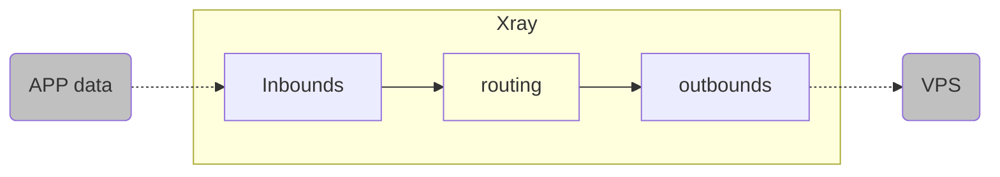
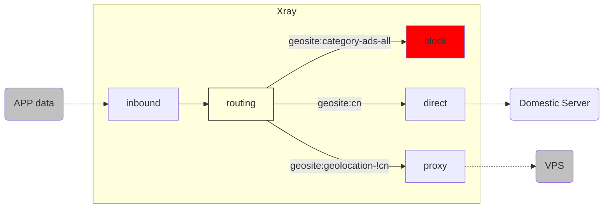
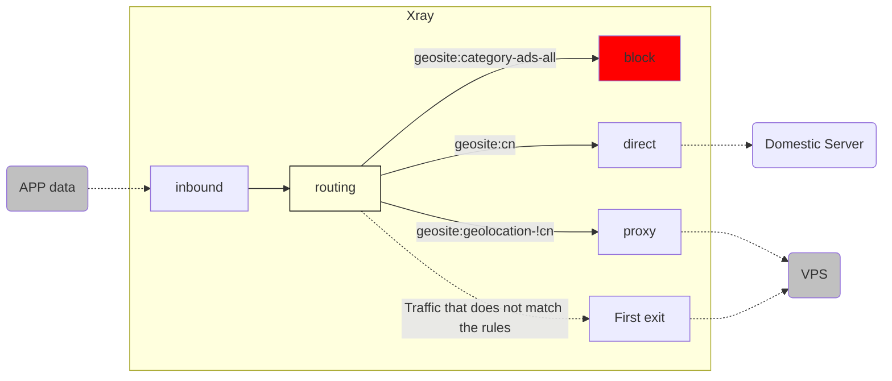
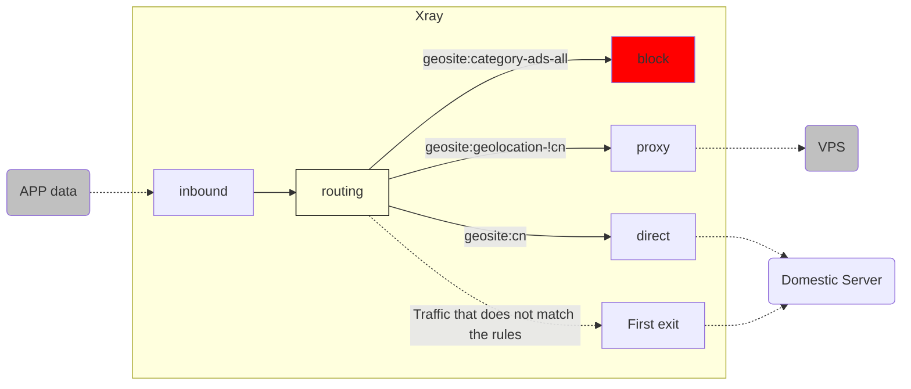

# Routing function analysis (Part 1)

If Xray's [power] is mainly reflected in its extreme speed and wide compatibility. Then Xray's [flexibility] should be mainly attributed to its clever [routing] function. This article will briefly explain the logic and usage of this function.

## 1. Introduction to the three brothers of [routing]

To understand routing, you must understand that the complete routing function requires the joint efforts of three brothers: 1. **inbound**; 2. **routing**; 3. **outbound**.


The three brothers swore brotherhood in Taoyuan, not asking to be born on the same day of the same month of the same year, but to die on the same day of the same month of the same year.

So remember: any error in any element may cause the routing function to not work properly.

Because routing is very flexible, it is easy to get confused just by reading the technical documentation, so in this article we use several specific examples to explain it layer by layer.

::: warning 噜咕君君
The routing function is too flexible, so the examples in this article are all for explaining the corresponding concepts. Please adjust according to your needs when actually using it.
:::

## 2. Basic skills: "Brothers are of one mind"

The example in the figure below is to receive APP data inbound on the client's `Xray`, forward it 100% to the outbound in the router, and flow from the outbound to the VPS.



Let's analyze them one by one:

### 2.1 Inbounds

::: tip
**Inbound:** is how traffic flows into `Xray`
:::

The following inbound configuration example, in plain language, means that data flows from the local machine `127.0.0.1` to `Xray` through `10808` port according to the `socks` protocol. At the same time, `Xray` names this inbound `inbound-10808` with `[tag]`.

```json
{
  "inbounds": [
    {
      "tag": "inbound-10808",
      "protocol": "socks",
      "listen": "127.0.0.1",
      "port": 10808,
      "settings": {
        "udp": true
      }
    }
  ]
}
```

**2.2 Outbound**

::: tip
**Outbound:** is how the traffic flows out of `Xray`

:::

The following outbound configuration example, in plain words, is: data is sent to the corresponding VPS in the `VLESS` protocol, in the `tcp + xtls` way, and other related settings. At the same time, `Xray` names this outbound as `proxy-out-vless` with `[tag]`:

```json
{
  "outbounds": [
    {
      "tag": "proxy-out-vless",
      "protocol": "vless",
      "settings": {
        "vnext": [
          {
            "address": "a-name.yourdomain.com",
            "port": 443,
            "users": [
              {
                "id": "uuiduuid-uuid-uuid-uuid-uuiduuiduuid",
                "flow": "xtls-rprx-vision",
                "encryption": "none",
                "level": 0
              }
            ]
          }
        ]
      },
      "streamSettings": {
        "network": "tcp",
        "security": "tls",
        "tlsSettings": {
          "serverName": "a-name.yourdomain.com",
          "allowInsecure": false,
          "fingerprint": "chrome"
        }
      }
    }
  ]
}
```

### 2.3 Routing

::: tip
**Routing:** is to connect the channels between [inbound] and [outbound] with some [conditions]

The following routing configuration example, in plain words, is: all the traffic flowing into `Xray` through `[tag]="inbound-10808"` inbound, `100%` all flow into `[tag]="proxy-out-vless"` outbound, without any diversion or other operations.

```json
{
  "routing": {
    "domainStrategy": "AsIs",
    "rules": [
      {
        "type": "field",
        "inboundTag": ["inbound-10808"],
        "outboundTag": "proxy-out-vless"
      }
    ]
  }
}
```

So far, the minimalist rule we designed at the beginning [the client's `Xray` receives APP data inbound, forwards 100% of it to the outbound in the route, and flows from the outbound to the VPS] has been completed.

### 2.4 Analysis of routing configuration items 1: the basis of traffic screening

Pay attention to the routing configuration, we can see several new terms:

1. `"domainStrategy": "AsIs"`
2. `“rules”`
3. `"type": "field"`
4. `"inboundTag": ["inbound-10808"]`
5. `"outboundTag": "proxy-out-vless"`

We will leave `domainStrategy` aside for now and briefly explain the following ones:

|    Configuration Name     |                                                                                        Configuration Values                                                                                         | Configuration Instructions                                                                                                         |
| :-------------: | :-----------------------------------------------------------------------------------------------------------------------------------------------------------------------------------: | :---------------------------------------------------------------------------------------------------------------: |
|    `“rules”`    | &nbsp; &nbsp; &nbsp; &nbsp; &nbsp; &nbsp; &nbsp; &nbsp; &nbsp; &nbsp; &nbsp; &nbsp; &nbsp; &nbsp; &nbsp; &nbsp; &nbsp; &nbsp; &nbsp; &nbsp; &nbsp; &nbsp; &nbsp; &nbsp; &nbsp; &nbsp; | Its inner layer is the detailed settings of [Routing Rules]                                                                               |
|    `"type"`     |                                                                                       `"field"`                                                                                       | This item has no special definition yet, but it cannot be omitted, so just remember to write it down.                                                             |
| `"inboundTag"`  |                                                                                  `["inbound-10808"]`                                                                                  | The **【basis】** for filtering traffic is the 【inbound tag】, and the specific **【condition】** is currently only one: 【Inbound source is `inbound-10808`】           |
| `"outboundTag"` |                                                                                  `"proxy-out-vless"`                                                                                  | When the above filter condition is met (i.e. inbound `[tag]="inbound-10808"`), `Xray` will direct the traffic to the outbound `[tag]="proxy-out-vless"` |

In this example, we have only one inbound, with "inboundTag" = "inbound-10808" . We also have only one outbound, with [tag] = "proxy-out-vless" . So according to the above routing rule, traffic flowing into Xray from the only inbound port 10808 will 100% meet the filter criteria, be selected by the routing module, and then forwarded to the only outbound.

At this point, **inbound**, **routing**, and **outbound** can work together. Of course, the 100% forwarding work now has no special significance. Then, let's see what benefits this division of labor and cooperation mechanism can bring.

## 3. Try it out: "Domain diversion" of "three-way division"

> `[geosite.dat]`



This configuration logic is actually the simplest and most commonly used routing configuration set (also used in "Little White Vernacular"):

1. Ad traffic blocking `[block]`
2. Domestic traffic direct connection `[direct]`
3. Foreign traffic forwarding VPS `[proxy]`

::: warning 
The direct connection configuration in Xiaoxiaobai's vernacular text includes [domestic domain name], [domestic IP], and [internal IP of the local machine]. Here we will first explain [domestic domain name].
:::

### 3.1 Inbound

Keep `inbound-10808` unchanged.

### 3.2 Outbound

Based on the above example, we already have the outbound `"proxy-out-vless"` of `[proxy]`, so it remains unchanged. Obviously, we need to add two new outbound methods: `[block]` and `[direct]`, as follows:

```json
{
  "outbounds": [
    {
      "tag": "proxy-out-vless"
      // ... ...
    },
    {
      "tag": "block",
      "protocol": "blackhole"
    },
    {
      "tag": "direct-out",
      "protocol": "freedom"
    }
  ]
}
```

The above configuration is translated into plain language as follows:

1. The `[proxy-out-vless]` outbound configuration in the above example remains unchanged

2. Add **`blackhole` black hole protocol**. The outbound traffic through this protocol is actually sent to the black hole inside `Xray` and can no longer escape, so the effect is to block `[block]`

3. Add **`freedom` free protocol**. The outbound traffic through this protocol is free to leave `Xray` to find the original server, as if it has never been there, so the effect is to directly connect `[direct]` (I named it `[direct-out]` here to emphasize that it is an outbound)

### 3.3 Routing

The next step is to witness the miracle. We can use the [routing] configuration to connect these!

```json
{
  "routing": {
    "domainStrategy": "AsIs",
    "rules": [
      {
        "type": "field",
        "domain": ["geosite:category-ads-all"],
        "outboundTag": "block"
      },
      {
        "type": "field",
        "domain": ["geosite:cn"],
        "outboundTag": "direct-out"
      },
      {
        "type": "field",
        "domain": ["geosite:geolocation-!cn"],
        "outboundTag": "proxy-out-vless"
      }
    ]
  }
}
```

In order to understand this configuration file, we need to explain a few new configuration items that appear here:

- `"domain": ["geosite:category-ads-all"]`
- `"domain": ["geosite:cn"]`
- `"domain": ["geosite:geolocation-!cn"]`

### 3.4 Brief analysis of the domain name file: `geosite.dat`

In fact, you can probably guess the general idea from the names of these configuration items:

- `"domain"`: The **[basis]** for filtering traffic this time is **[domain name]** (not inbound tag)
- `"geosite"`: `Xray` will search for **[qualified domain names]** in the `geosite.dat` file
- `"category-ads-all"`: **[all advertising domain names]** in the file
- `"cn"`: **[Chinese domain names]** in the file
- `"geolocation-!cn"`: **[non-Chinese domain names]** in the file
- 
Combined with these instructions, the configuration in 3.3 is translated into plain language:

1. APP attempts to access the traffic of the foreign domain name `"domain": "geolocation-!cn"`, and it is forwarded to the VPS through `[proxy-out-vless]`

2. APP attempts to access the traffic of the foreign domain name advertising domain name `"domain": "geosite:category-ads-all"`, and it is forwarded to the black hole for shielding through `[block]`

3. APP attempts to access the traffic of the domestic domain name `"domain": "geosite:cn"`, and it is freely left through `[direct-out]` to complete the direct connection

At this time, the benefits of the [routing function] are slightly demonstrated.

### 3.5 So what is `geosite.dat`? Isn't there a `GFWList`?

Think about it, there are tens of millions of domain names in the world. If we have to collect and manually enter domain names every time we write a routing rule based on [domain name] matching, the efficiency will be very low!

If all domain names have only one type, and you can only choose one of the three options, `[direct], [proxy], [block]`, how inconvenient it would be!

Just like Guan Yu needs his Green Dragon Crescent Blade, the `geosite.dat` file has emerged as a magic weapon driven by the [routing function]. It is committed to providing users with a mature and complete [domain name classification table]. Users can simply call any subclass through the `geosite:xxx` format and customize routing rules that meet their needs.

The flexibility provided by this modular structure is actually far beyond the traditional package firewall domain name list [`GFWList`](https://github.com/gfwlist/gfwlist). Why do you say that? For example, you can specify Apple's domain name `geosite:apple` and icloud-related domain name `geosite:icloud` through the proxy `[proxy]`, but Apple's software domain name `geosite:apple-update` remains directly connected to `[direct]` to maintain the maximum download speed.

::: warning
**Note:** Now, there are actually multiple options for `geosite.dat` files:

Initially, when `Victoria Raymond` was the main maintainer of the `Project V` project, she provided the initial supporting project: [`domain-list-community`](https://github.com/v2ray/domain-list-community), which was used to collect, precipitate, and classify various commonly used domain name types;

Afterwards, with the sudden disappearance of Sister V, the development of the original project of `Project V` stagnated, and the `v2fly` community maintained and continuously updated the community version of [`domain-list-community`](https://github.com/v2fly/domain-list-community);

At the same time, [@Loyalsoldier](Loyalsoldier) maintained his personally modified and enhanced routing rules file [v2ray-rules-dat](https://github.com/Loyalsoldier/v2ray-rules-dat), providing many different options and classification logic;

In addition, `Project X` also plans to customize and maintain a routing rule file [Xray-rules-dat](https://github.com/XTLS/Xray-rules-dat) that is more suitable for `Xray` in the future. ~~(Look, the folders are all built, so it's coming soon)~~

You can even customize your own `geosite` file and plug it into `Xray` for use, but this is off topic and will not be expanded in this article.

If you find that some domain names you encounter are not classified reasonably, please raise an `issue` or even submit a `Pull Request` to the above projects! Community list Community maintenance, everyone for me and I for everyone!

:::

### 3.6 A hidden weapon in the military strategist's bag: a hidden routing rule

In fact, when you think carefully about the above rules, it is not difficult to find a problem. All our rules only stipulate [when the inbound traffic **meets certain conditions**, it should be forwarded to which outbound station], then, if the `geosite.dat` file is not comprehensive, our inbound traffic [**does not meet any conditions**], how will `Xray` handle it?

::: warning Attention
If you think [of course you can't connect if you don't meet the conditions! ], you have to rethink it. Because only when the `[block]` rule is specified will it be imported into the `blackhole` black hole protocol to block the connection
:::

In fact, in order to avoid confusion caused by incomplete routing rules, `Xray` has thoughtfully provided a hidden routing rule: [**When the incoming traffic does not meet any conditions, forward it to the first outbound** ]

In this way, no traffic will be missed. Therefore, you must put your most trusted general in the [first outbound] to let it guard the city for you.

### 3.7 Look at the big map of "Three-part World"

Because we put `[proxy-out-vless]` in the first outbound in the previous example, when the hidden rule takes effect, the traffic will be forwarded to the remote VPS through the `VLESS` protocol. Therefore, the complete working logic of `Xray` at this time is as follows:



In fact, this is the traditional so-called **[Default scientific Internet access, domestic website whitelist direct connection]** configuration.

## 4. "Three Kingdoms" of "Shu Wei Struggle"

Now, you already know the hidden default routing rule: [**When the inbound traffic does not meet any conditions, forward to the first outbound** ]. At this time, you should be able to see whether [Scientific Internet access] is king or [Direct connection] dominates, all depending on what your first outbound is!

In the previous step, we have configured the **[Default scientific Internet access, domestic website whitelist direct connection]** rule. Now, as long as **[Put the direct connection rule first]**, it will immediately become the exact opposite **[Default direct connection, foreign website whitelist scientific Internet access]** rule.

Isn't it very simple?

```json
{
  "outbounds": [
    {
      "tag": "direct-out",
      "protocol": "freedom"
    },
    {
      "tag": "proxy-out-vless"
      // ... ...
    },
    {
      "tag": "block",
      "protocol": "blackhole"
    }
  ]
}
```

At this point, the routing rules actually become:



This is the flexibility of the routing function. You can freely change its order to achieve different designs.

So far, we have explained ** [How to use the `geosite.dat` file to divert network traffic according to the [domain name] through routing rules]. **

## 5. Attack the city and the pool - multiple routing matching conditions

Please make sure you have read the above content, because in this way, you have understood the working logic of the [routing] function. With this foundation, we can continue to analyze more detailed configuration methods and matching conditions of the [routing] function.

After you finish reading the following content, you can freely customize your own routing rules! What are you waiting for? Let's enter [《Brief Analysis of Routing Function (Part 2)》](./routing-lv1-part2.md) together!
