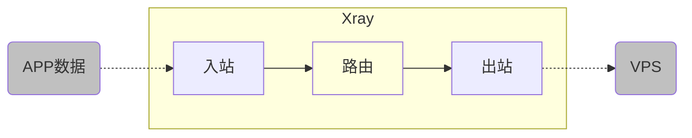
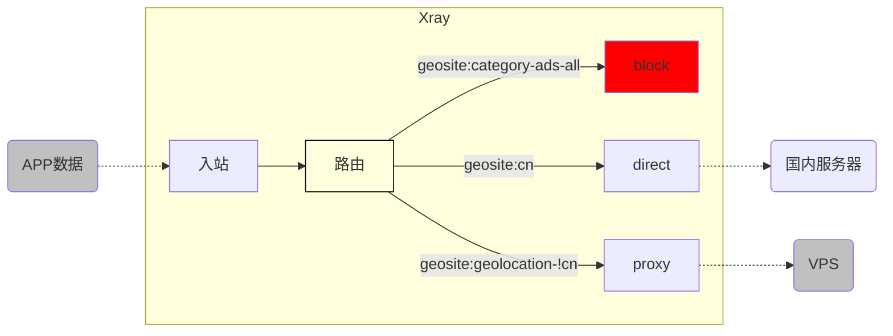
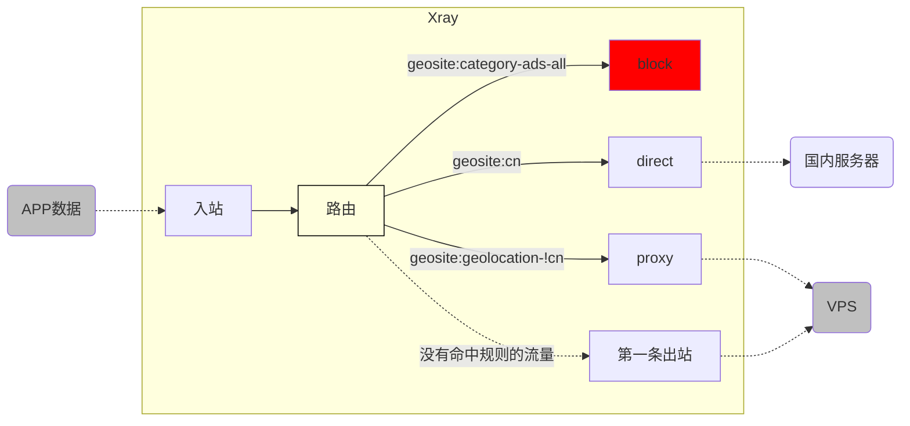
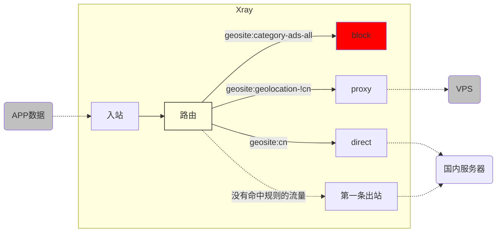

# 路由 (routing) 功能简析（上）

如果说 Xray 的【强大】主要体现在它极致的速度和广泛的兼容性。那么 Xray 的【灵活】，则主要应该归功于它巧妙的【路由】功能。本文就稍微说明一下这个功能的逻辑以及使用方式。

## 1. 初识【路由】三兄弟

要理解路由，就要理解完整的路由功能需要有三兄弟来合力完成：1. **入站**；2. **路由**；3. **出站**。


三兄弟桃园结义，不求同年同月同日生，但求同年同月同日死。

所以谨记：任何一个元素错误，就可能导致路由功能无法正常工作。

因为路由的灵活性非常高，只看技术文档很容易把自己绕晕，所以本文我们用几个具体的示例来逐层讲解。

::: warning 啰嗦君
路由功能实在过于灵活，所以本文的示例，都是为了讲解对应的概念，实际使用时请根据自己的需求进行调整。
:::

## 2. 基本功： “兄弟一条心”

下图的示例，就是在客户端的 `Xray` 入站接收 APP 数据、在路由 100%转发给出站，并从出站流向 VPS。



下面我们来逐个分析：

### 2.1 入站

::: tip
**入站：** 就是流量如何流入 `Xray`
:::

下面的入站配置示例，用大白话说就是：数据按照 `socks` 协议，通过 `10808` 端口，从本机 `127.0.0.1` 流入`Xray`。同时，`Xray` 将这个入站用 `[tag]` 命名为 `inbound-10808`。

```json
{
  "inbounds": [
    {
      "tag": "inbound-10808",
      "protocol": "socks",
      "listen": "127.0.0.1",
      "port": 10808,
      "settings": {
        "udp": true
      }
    }
  ]
}
```

**2.2 出站**

::: tip
**出站：** 就是流量如何流出 `Xray`
:::

下面的出站配置示例，用大白话说就是：数据按照 `VLESS` 协议，以 `tcp + xtls` 的方式、及其他相关设置，把流量发送给对应的 VPS。同时，`Xray` 将这个出站用 `[tag]` 命名为 `proxy-out-vless`：

```json
{
  "outbounds": [
    {
      "tag": "proxy-out-vless",
      "protocol": "vless",
      "settings": {
        "vnext": [
          {
            "address": "a-name.yourdomain.com",
            "port": 443,
            "users": [
              {
                "id": "uuiduuid-uuid-uuid-uuid-uuiduuiduuid",
                "flow": "xtls-rprx-vision",
                "encryption": "none",
                "level": 0
              }
            ]
          }
        ]
      },
      "streamSettings": {
        "network": "tcp",
        "security": "tls",
        "tlsSettings": {
          "serverName": "a-name.yourdomain.com",
          "allowInsecure": false,
          "fingerprint": "chrome"
        }
      }
    }
  ]
}
```

### 2.3 路由

::: tip
**路由：** 就是把【入站】和【出站】之间的通道，用某种【条件】串联起来
:::

下面的路由配置示例，用大白话说就是：把所有通过 `[tag]="inbound-10808"` 入站流入 `Xray` 的流量，`100%` 全部流转导入 `[tag]="proxy-out-vless"` 的出站，没有任何分流或其他操作。

```json
{
  "routing": {
    "domainStrategy": "AsIs",
    "rules": [
      {
        "type": "field",
        "inboundTag": ["inbound-10808"],
        "outboundTag": "proxy-out-vless"
      }
    ]
  }
}
```

至此，我们最开始设计的极简规则【客户端的 `Xray` 入站接收 APP 数据、在路由 100%转发给出站，并从出站流向 VPS】已经完成。

### 2.4 路由配置项解析之一：流量筛选的依据

注意观察路由配置，我们可以看到几个新名词：

1. `"domainStrategy": "AsIs"`
2. `“rules”`
3. `"type": "field"`
4. `"inboundTag": ["inbound-10808"]`
5. `"outboundTag": "proxy-out-vless"`

其中 `domainStrategy` 我们暂且按下不表，先简单说明后面几个：

|    配置名称     |                                                                                        配置值                                                                                         | 配置说明                                                                                                         |
| :-------------: | :-----------------------------------------------------------------------------------------------------------------------------------------------------------------------------------: | :--------------------------------------------------------------------------------------------------------------- |
|    `“rules”`    | &nbsp; &nbsp; &nbsp; &nbsp; &nbsp; &nbsp; &nbsp; &nbsp; &nbsp; &nbsp; &nbsp; &nbsp; &nbsp; &nbsp; &nbsp; &nbsp; &nbsp; &nbsp; &nbsp; &nbsp; &nbsp; &nbsp; &nbsp; &nbsp; &nbsp; &nbsp; | 它的内层就是【路由规则】的明细设置                                                                               |
|    `"type"`     |                                                                                       `"field"`                                                                                       | 该项暂时没有特别定义，但是不能省略，所以记得写上就好                                                             |
| `"inboundTag"`  |                                                                                  `["inbound-10808"]`                                                                                  | 筛选流量的 **【依据】** 是【入站 Tag】，具体 **【条件】** 现在只有一个：【入站来源是 `inbound-10808`】           |
| `"outboundTag"` |                                                                                  `"proxy-out-vless"`                                                                                  | 当上面的筛选条件成立时（即入站`[tag]="inbound-10808"`时 ），`Xray` 会将流量导入 `[tag]="proxy-out-vless"` 的出站 |

本例中，我们只有一个入站，它的`"inboundTag" = "inbound-10808"` 。我们也只有一个出站，它的 `[tag]="proxy-out-vless"`。所以根据上面这个路由规则，从唯一入站端口 `10808` 流入`Xray`的流量，`100%` 符合筛选条件、会被路由模块选中，然后转发给唯一的出站。

至此，**入站**、**路由**、**出站** 三兄弟就已经可以携手工作了。当然，现在这个 100%转发的工作并没有什么特别的意义。那么接下来，我们就看看这种分工合作的机制可以带来什么好处。

## 3. 小试牛刀： “三分天下” 之 “域名分流”

> `[geosite.dat]`



这个配置逻辑，其实就是最简单、最常用的（《小小白白话文》中也在用的）路由配置三件套：

1. 广告流量屏蔽 `[block]`
2. 国内流量直连 `[direct]`
3. 国外流量转发 VPS `[proxy]`

::: warning 注意
小小白白话文中的直连配置是包括【国内域名】、【国内 IP】、【本机内部 IP】的。这里先讲解【国内域名】。
:::

### 3.1 入站

保持上例的 `inbound-10808` 不变。

### 3.2 出站

在上例的基础上，我们已经有了 `[proxy]` 的出站 `"proxy-out-vless"`，所以它保持不变。显而易见，我们需要加入两个新的出站方式：`[block]` 和 `[direct]`，如下：

```json
{
  "outbounds": [
    {
      "tag": "proxy-out-vless"
      // ... ...
    },
    {
      "tag": "block",
      "protocol": "blackhole"
    },
    {
      "tag": "direct-out",
      "protocol": "freedom"
    }
  ]
}
```

上面的配置用大白话翻译如下：

1. 上例中的 `[proxy-out-vless]` 出站配置保持不变
2. 加入 **`blackhole` 黑洞协议**，通过这个协议出站的流量，其实都被发送到了 `Xray` 内部的黑洞里，再也无法逃脱，于是效果就是屏蔽 `[block]`
3. 加入 **`freedom` 自由协议**，通过这个协议出站的流量，是自由的离开`Xray`去寻找原定的服务器，就像从没有来过，于是效果就是直连 `[direct]` （我这里起名叫做 `[direct-out]` 是为了强调它是一个出站）

### 3.3 路由

接下来就是见证奇迹的时刻了，我们可以用【路由】的配置把这些连接起来！

```json
{
  "routing": {
    "domainStrategy": "AsIs",
    "rules": [
      {
        "type": "field",
        "domain": ["geosite:category-ads-all"],
        "outboundTag": "block"
      },
      {
        "type": "field",
        "domain": ["geosite:cn"],
        "outboundTag": "direct-out"
      },
      {
        "type": "field",
        "domain": ["geosite:geolocation-!cn"],
        "outboundTag": "proxy-out-vless"
      }
    ]
  }
}
```

为了理解这个配置文件，我们要稍微解释一下这里出现的几个新配置项：

- `"domain": ["geosite:category-ads-all"]`
- `"domain": ["geosite:cn"]`
- `"domain": ["geosite:geolocation-!cn"]`

### 3.4 简析域名文件： `geosite.dat`

其实，聪明的你大概可以通过这些配置项的名称猜出来个大概：

- `"domain"`：就是这次筛选流量的 **【依据】** 是 **【域名】** （而不再是入站 tag）
- `"geosite"`：就是 `Xray` 会去 `geosite.dat` 文件中寻找 **【符合条件的域名】**
- `"category-ads-all"`：就是该文件中的 **【所有广告类域名】**
- `"cn"`：就是该文件中的 **【中国域名】**
- `"geolocation-!cn"`：就是该文件中的 **【非中国域名】**

结合这些说明，3.3 中的配置用大白话翻译就是：

1. APP 试图访问国外域名 `"domain": "geolocation-!cn"` 的流量，通过 `[proxy-out-vless]` 出站，转发至 VPS
2. APP 试图访问国外域名广告域名 `"domain": "geosite:category-ads-all"` 的流量，通过 `[block]` 出站，转发至黑洞进行屏蔽
3. APP 试图访问国内域名 `"domain": "geosite:cn"` 的流量，通过 `[direct-out]` 出站，自由离开完成直连

这时，才让【路由功能】的好处稍微得到了一些展现。

### 3.5 所以 `geosite.dat` 到底是什么？不是有个 `GFWList` 吗？

你想，这世界上的域名何止千万，如果我们每写一个基于【域名】匹配的路由规则，都要自己收集、手动输入域名，那效率将会何其低下！

而如果所有的域名都只有一个种类，`[direct], [proxy], [block]` 只能三选其一，那又是多么的不方便！

就如关羽需要他的青龙偃月刀，`geosite.dat` 文件便作为【路由功能】驱使的神兵利器横空出世了，它致力于为用户提供成熟完善的【域名分类表】。让用户可以简单的通过 `geosite:xxx` 这种格式方便的调用任何子类，定制符合自身需求的路由规则。

这种模块化结构提供的灵活性，其实远超传统的一揽子防火墙域名列表 [`GFWList`](https://github.com/gfwlist/gfwlist)。为什么这么说呢？比如，你可以指定苹果的域名 `geosite:apple` 和 icloud 相关域名 `geosite:icloud` 通过代理 `[proxy]`，但是苹果的软件域名 `geosite:apple-update` 保持直连 `[direct]` 来保持最大下载速度。

::: warning
**注意：** 现在，`geosite.dat` 文件其实有多种选择：

最初，从 `Victoria Raymond` 主力维护 `Project V` 项目时期，便提供了最初的配套项目：[`domain-list-community`](https://github.com/v2ray/domain-list-community)，用来收集、沉淀、分类各种常用的域名类型；

之后，随着 V 姐突然消失导致 `Project V` 的原项目开发陷入停滞，`v2fly` 社区维护并持续更新了社区版本的 [`domain-list-community`](https://github.com/v2fly/domain-list-community)；

同时，[@Loyalsoldier](Loyalsoldier) 维护了其个人修改增强的路由规则文件 [v2ray-rules-dat](https://github.com/Loyalsoldier/v2ray-rules-dat)，提供了诸多不同的选择和分类逻辑；

另外，`Project X` 也计划于未来定制维护更适合 `Xray` 使用的路由规则文件 [Xray-rules-dat](https://github.com/XTLS/Xray-rules-dat)。~~(你们看，文件夹都建好了，所以快了快了)~~

甚至，你还可以定制自己的 `geosite` 文件，外挂给 `Xray` 使用，但是这个就跑题了，本文不展开。

如果你发现有些你遇到的域名没有被合理分类，请向上面的项目们提出 `issue` 甚至提交 `Pull Request` 吧！社区列表社区维护，人人为我我为人人！

:::

### 3.6 军师锦囊藏奇兵：一条隐藏的路由规则

事实上，当你认真思考上面的规则，不难发现一个问题，我们的所有规则都只规定了【当入站流量 **符合某种条件时** 应该被转发给哪个出站】，那么，如果 `geosite.dat` 文件不全面，我们的入站流量【**不符合任何条件时**】，`Xray` 会怎么处理呢？

::: warning 注意
如果你认为【不符合条件当然就无法连接啦！】的话，你可要重新思考一下哦。因为只有指定了 `[block]` 规则，才会被导入到 `blackhole` 黑洞协议从而阻断连接
:::

事实上，`Xray` 为了避免路由规则不完全导致的规则混乱，已经贴心的提供了一条隐藏的路由规则：【**当入站流量不符合任何条件时，转发给第一个出站** 】

这样，就不会有任何流量被漏掉了。所以，你一定要把你最信赖的心腹大将放在【第一条出站】，让它为你守城护池。

### 3.7 再看“三分天下”的大地图

因为我们在前面的示例中把 `[proxy-out-vless]` 放在了出站的第一位，所以隐藏规则生效时，流量会通过 `VLESS` 协议被转发至远端的 VPS。因此，`Xray` 此时的完整工作逻辑如下：



事实上，这就是传统所谓的 **【默认科学上网、国内网站白名单直连】** 的配置。

## 4. “三分天下” 之 “蜀魏争雄”

现在，你已经知道了隐藏的默认路由规则：【**当入站流量不符合任何条件时，转发给第一个出站** 】。这时候，你应该能看出来，究竟是【科学上网】为王，还是【直连】称霸，全看你的第一条出站是什么！

上一步我们已经配置出了 **【默认科学上网、国内网站白名单直连】** 的规则。那么现在只要 **【把直连规则放在第一位】**，就立即变成了正好相反的 **【默认直连、国外网站白名单科学上网】** 规则。

是不是，非常地简单？

```json
{
  "outbounds": [
    {
      "tag": "direct-out",
      "protocol": "freedom"
    },
    {
      "tag": "proxy-out-vless"
      // ... ...
    },
    {
      "tag": "block",
      "protocol": "blackhole"
    }
  ]
}
```

此时，路由规则其实变成了：



这就是路由功能的灵活之处了，你可以自由的改变它的顺序来实现不同的设计。

至此，我们已经解释完了 **【如何利用 `geosite.dat` 文件，通过路由规则，根据【域名】来分流网络流量】。**

## 5. 攻城略池 - 多种路由匹配条件

请确保你已经读懂了上面的内容，因为这样，你就已经理解了【路由】功能的工作逻辑。有了这个基础，我们就可以继续分析【路由】功能更多更详细的配置方式和匹配条件了。

等你看完后面的内容，就完全可以自由的定制属于自己的路由规则啦！还等什么，让我们一起进入 [《路由 (routing) 功能简析（下）》](./routing-lv1-part2.md) 吧！
