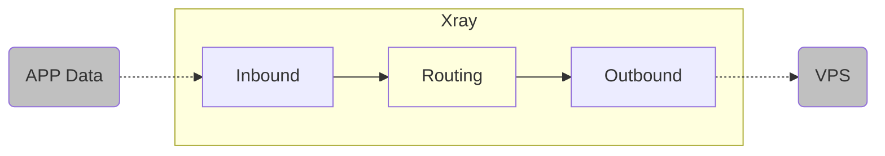
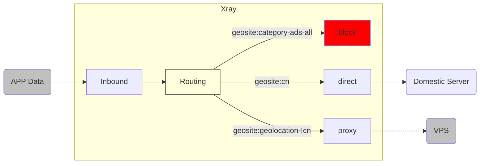
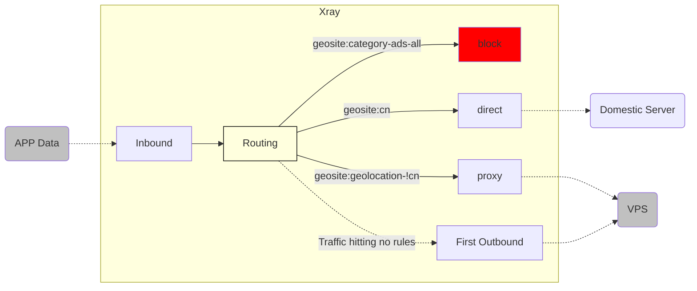
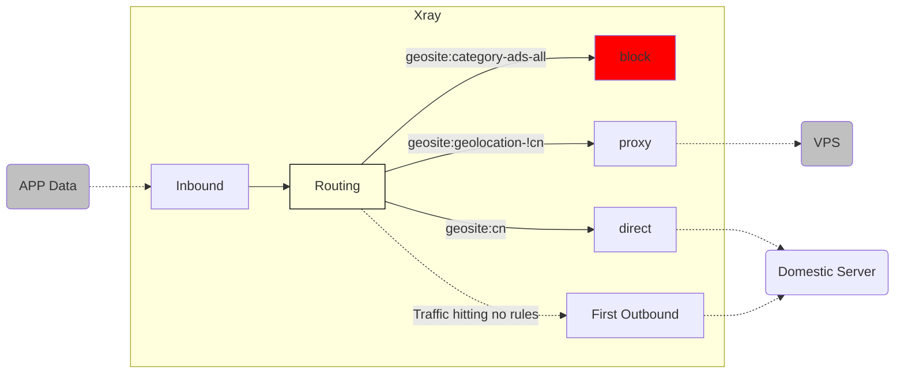

# A Brief Analysis of Routing Functionality (Part 1)

If Xray's [Power] is mainly reflected in its extreme speed and broad compatibility, then Xray's [Flexibility] should be mainly attributed to its ingenious [Routing] feature. This article will briefly explain the logic and usage of this function.

## 1. Meeting the "Routing" Trio

To understand routing, one must understand that the complete routing function requires three "brothers" working together to complete: 1. **Inbound**; 2. **Routing**; 3. **Outbound**.


The three brothers took the Oath of the Peach Garden: not asking to be born on the same year, month, and day, but asking to die on the same year, month, and day.

So bear in mind: An error in any single element may cause the routing function to fail.

Because the flexibility of routing is very high, just reading the technical documentation can easily make you dizzy. Therefore, this article will use a few specific examples to explain it layer by layer.

::: warning Verbose Note
The routing function is indeed overly flexible, so the examples in this article are meant to explain the corresponding concepts. Please adjust them according to your own needs in actual use.
:::

## 2. Basic Skills: "Brothers United"

The example in the chart below shows the client's `Xray` **Inbound** receiving APP data, the **Routing** forwarding it 100% to the **Outbound**, and the data flowing from the Outbound to the VPS.



Let's analyze them one by one:

### 2.1 Inbound

::: tip
**Inbound:** How traffic flows into `Xray`.
:::

The following inbound configuration example, in plain English, means: Data flows into `Xray` from the local machine `127.0.0.1` via port `10808` using the `socks` protocol. At the same time, `Xray` names this inbound using the `[tag]` `inbound-10808`.

```json
{
  "inbounds": [
    {
      "tag": "inbound-10808",
      "protocol": "socks",
      "listen": "127.0.0.1",
      "port": 10808,
      "settings": {
        "udp": true
      }
    }
  ]
}
```

**2.2 Outbound**

::: tip
**Outbound:** How traffic flows out of `Xray`.
:::

The following outbound configuration example, in plain English, means: Data is sent to the corresponding VPS using the `VLESS` protocol, via `tcp + xtls`, and other related settings. At the same time, `Xray` names this outbound using the `[tag]` `proxy-out-vless`:

```json
{
  "outbounds": [
    {
      "tag": "proxy-out-vless",
      "protocol": "vless",
      "settings": {
        "vnext": [
          {
            "address": "a-name.yourdomain.com",
            "port": 443,
            "users": [
              {
                "id": "uuiduuid-uuid-uuid-uuid-uuiduuiduuid",
                "flow": "xtls-rprx-vision",
                "encryption": "none",
                "level": 0
              }
            ]
          }
        ]
      },
      "streamSettings": {
        "network": "tcp",
        "security": "tls",
        "tlsSettings": {
          "serverName": "a-name.yourdomain.com",
          "allowInsecure": false,
          "fingerprint": "chrome"
        }
      }
    }
  ]
}
```

### 2.3 Routing

::: tip
**Routing:** Connecting the path between [Inbound] and [Outbound] using certain [Conditions].
:::

The following routing configuration example, in plain English, means: 100% of the traffic flowing into `Xray` through `[tag]="inbound-10808"` is forwarded to the outbound with `[tag]="proxy-out-vless"`, without any splitting or other operations.

```json
{
  "routing": {
    "domainStrategy": "AsIs",
    "rules": [
      {
        "inboundTag": ["inbound-10808"],
        "outboundTag": "proxy-out-vless"
      }
    ]
  }
}
```

At this point, our initially designed minimalist rule [Client `Xray` Inbound receives APP data, Routing forwards 100% to Outbound, and flows from Outbound to VPS] is complete.

### 2.4 Analysis of Routing Configuration Items Part 1: Basis for Traffic Filtering

Observing the routing configuration carefully, we can see several new terms:

1. "domainStrategy": "AsIs"
2. “rules”
3. "inboundTag": ["inbound-10808"]
4. "outboundTag": "proxy-out-vless"

We will put aside `domainStrategy` for now and briefly explain the latter ones:

|    Config Name    |                                                                                                  Config Value                                                                                                   | Config Explanation                                                                                                                                                             |
| :---------------: | :-------------------------------------------------------------------------------------------------------------------------------------------------------------------------------------------------------------: | :----------------------------------------------------------------------------------------------------------------------------------------------------------------------------- |
|     `“rules”`     |                                                                                                                                                                                                                 | Its inner layer contains the detailed settings of [Routing Rules].                                                                                                             |
|  `"inboundTag"`   |                                                                                             `["inbound-10808"]`                                                                                             | The **[Basis]** for filtering traffic is the [Inbound Tag]. The specific **[Condition]** right now is only one: [Inbound source is `inbound-10808`].                           |
|  `"outboundTag"`  |                                                                                              `"proxy-out-vless"`                                                                                              | When the above filtering condition is met (i.e., when inbound `[tag]="inbound-10808"`), `Xray` will import the traffic into the outbound with `[tag]="proxy-out-vless"`.       |

In this example, we have only one inbound, and its `"inboundTag" = "inbound-10808"`. We also have only one outbound, with `[tag]="proxy-out-vless"`. Therefore, according to this routing rule, traffic flowing into `Xray` from the sole inbound port `10808` matches the filtering condition `100%`, is selected by the routing module, and is then forwarded to the sole outbound.

Thus, the trio of **Inbound**, **Routing**, and **Outbound** can now work hand in hand. Of course, this 100% forwarding task doesn't have any special significance yet. Next, let's see what benefits this cooperative mechanism can bring.

## 3. First Try: "Three Kingdoms" of "Domain Routing"

> `[geosite.dat]`



This configuration logic is actually the simplest and most commonly used routing configuration set (also used in "Little White's Plain English Guide"):

1. Block ad traffic `[block]`
2. Direct connection for domestic traffic `[direct]`
3. Forward foreign traffic to VPS `[proxy]`

::: warning Note
The direct connection configuration in "Little White's Plain English Guide" includes [Domestic Domains], [Domestic IPs], and [Local Internal IPs]. Here we explain [Domestic Domains] first.
:::

### 3.1 Inbound

Keep `inbound-10808` from the previous example unchanged.

### 3.2 Outbound

Based on the previous example, we already have the `[proxy]` outbound `"proxy-out-vless"`, so it remains unchanged. Obviously, we need to add two new outbound methods: `[block]` and `[direct]`, as follows:

```json
{
  "outbounds": [
    {
      "tag": "proxy-out-vless"
      // ... ...
    },
    {
      "tag": "block",
      "protocol": "blackhole"
    },
    {
      "tag": "direct-out",
      "protocol": "freedom"
    }
  ]
}
```

The above configuration translated into plain English:

1. The `[proxy-out-vless]` outbound configuration from the previous example remains unchanged.
2. Add **`blackhole` protocol**. Traffic exiting through this protocol is actually sent into a black hole inside `Xray` and can never escape, thus achieving the effect of blocking `[block]`.
3. Add **`freedom` protocol**. Traffic exiting through this protocol leaves `Xray` freely to find the intended server as if it had never been here, thus achieving the effect of direct connection `[direct]` (I named it `[direct-out]` here to emphasize it is an outbound).

### 3.3 Routing

Now is the moment to witness the miracle; we can use the [Routing] configuration to connect these!

```json
{
  "routing": {
    "domainStrategy": "AsIs",
    "rules": [
      {
        "domain": ["geosite:category-ads-all"],
        "outboundTag": "block"
      },
      {
        "domain": ["geosite:cn"],
        "outboundTag": "direct-out"
      },
      {
        "domain": ["geosite:geolocation-!cn"],
        "outboundTag": "proxy-out-vless"
      }
    ]
  }
}
```

To understand this configuration file, we need to slightly explain the new configuration items appearing here:

- `"domain": ["geosite:category-ads-all"]`
- `"domain": ["geosite:cn"]`
- `"domain": ["geosite:geolocation-!cn"]`

### 3.4 Brief Analysis of Domain File: `geosite.dat`

Actually, the clever you can probably guess the gist from the names of these configuration items:

- `"domain"`: This means the **[Basis]** for filtering traffic this time is **[Domain Name]** (no longer inbound tag).
- `"geosite"`: This means `Xray` will look for **[Domains matching the condition]** in the `geosite.dat` file.
- `"category-ads-all"`: This means **[All advertising domains]** in that file.
- `"cn"`: This means **[Chinese domains]** in that file.
- `"geolocation-!cn"`: This means **[Non-Chinese domains]** in that file.

Combining these explanations, the configuration in 3.3 translates to plain English as:

1. Traffic where the APP attempts to access foreign domains `"domain": "geolocation-!cn"` goes through `[proxy-out-vless]` outbound and is forwarded to the VPS.
2. Traffic where the APP attempts to access foreign advertising domains `"domain": "geosite:category-ads-all"` goes through `[block]` outbound and is forwarded to the black hole for blocking.
3. Traffic where the APP attempts to access domestic domains `"domain": "geosite:cn"` goes through `[direct-out]` outbound and leaves freely to complete a direct connection.

At this point, the benefits of the [Routing Function] are finally somewhat revealed.

### 3.5 So what exactly is `geosite.dat`? Wasn't there a `GFWList`?

Think about it, there are tens of millions of domains in the world. If we had to collect and manually input domains every time we wrote a routing rule based on [Domain] matching, how inefficient that would be!

And if all domains were just one category, and we could only choose one out of `[direct], [proxy], [block]`, how inconvenient that would be!

Just as Guan Yu needed his Green Dragon Crescent Blade, the `geosite.dat` file was born as a divine weapon driven by the [Routing Function]. It is dedicated to providing users with a mature and complete [Domain Classification Table]. It allows users to easily call any subclass via the `geosite:xxx` format to customize routing rules that meet their own needs.

The flexibility provided by this modular structure actually far exceeds the traditional blanket firewall domain list [`GFWList`](https://github.com/gfwlist/gfwlist). Why do I say that? For example, you can specify Apple's domains `geosite:apple` and iCloud related domains `geosite:icloud` to go through the proxy `[proxy]`, but keep Apple's software update domains `geosite:apple-update` on direct connection `[direct]` to maintain maximum download speed.

::: warning
**Note:** Nowadays, there are actually multiple choices for the `geosite.dat` file:

Initially, during the time when `Victoria Raymond` was the main maintainer of the `Project V` project, the original companion project was provided: [`domain-list-community`](https://github.com/v2ray/domain-list-community), used to collect, precipitate, and classify various commonly used domain types;

Later, as V disappeared and the development of the original `Project V` stalled, the `v2fly` community maintained and continued to update the community version of [`domain-list-community`](https://github.com/v2fly/domain-list-community);

Meanwhile, Loyalsoldier maintains his personally modified and enhanced routing rule file [v2ray-rules-dat](https://github.com/Loyalsoldier/v2ray-rules-dat), offering many different choices and classification logic;

In addition, `Project X` also plans to customize and maintain a routing rule file better suited for `Xray` in the future: [Xray-rules-dat](https://github.com/XTLS/Xray-rules-dat). ~~(Look, the folder is already created, so it's coming soon, coming soon)~~

You can even customize your own `geosite` file and load it externally for `Xray` to use, but that's off-topic and won't be expanded upon in this article.

If you find that some domains you encounter are not properly classified, please raise an `issue` or even submit a `Pull Request` to the projects above! Community lists are maintained by the community; one for all, all for one!
:::

### 3.6 The Strategist's Hidden Card: A Hidden Routing Rule

In fact, if you think carefully about the rules above, it's not hard to spot a problem. All our rules only stipulate [which outbound to forward to **when the inbound traffic meets certain conditions**]. So, if the `geosite.dat` file is not comprehensive, how will `Xray` handle our inbound traffic **when it does not meet any conditions**?

::: warning Note
If you think "If it doesn't meet conditions, of course it can't connect!", you need to rethink. Because only when a `[block]` rule is specified will it be imported into the `blackhole` protocol to block the connection.
:::

In fact, to avoid rule chaos caused by incomplete routing rules, `Xray` has thoughtfully provided a hidden routing rule: [**When inbound traffic does not meet any conditions, forward it to the first outbound**].

This way, no traffic will be left out. Therefore, you must place your most trusted "general" at the [First Outbound] position to guard your city.

### 3.7 Looking at the "Three Kingdoms" Big Map Again

Because we placed `[proxy-out-vless]` in the first position of the outbounds in the previous example, when the hidden rule takes effect, traffic will be forwarded to the remote VPS via the `VLESS` protocol. Therefore, `Xray`'s complete working logic at this time is as follows:



In fact, this is the traditional configuration known as **[Default Proxy (Science Internet), Domestic Website Whitelist Direct]**.

## 4. "Three Kingdoms" - "Shu vs Wei": Changing Priorities

Now, you already know the hidden default routing rule: [**When inbound traffic does not meet any conditions, forward to the first outbound**]. At this point, you should be able to see that whether [Proxy/Science Internet] rules supreme or [Direct Connection] dominates depends entirely on what your first outbound is!

In the previous step, we configured the **[Default Proxy, Domestic Whitelist Direct]** rule. Now, as long as we **[place the direct rule in the first position]**, it immediately changes to the exact opposite **[Default Direct, Foreign Website Whitelist Proxy]** rule.

Isn't it very simple?

```json
{
  "outbounds": [
    {
      "tag": "direct-out",
      "protocol": "freedom"
    },
    {
      "tag": "proxy-out-vless"
      // ... ...
    },
    {
      "tag": "block",
      "protocol": "blackhole"
    }
  ]
}
```

At this time, the routing rules actually become:



This is the flexibility of the routing function; you can freely change its order to achieve different designs.

At this point, we have finished explaining **[How to use the `geosite.dat` file to route network traffic based on [Domain Name] through routing rules].**

## 5. Conquering Cities - Multiple Routing Match Conditions

Please ensure you have understood the content above, because this means you have understood the working logic of the [Routing] function. With this foundation, we can continue to analyze more detailed configuration methods and matching conditions of the [Routing] function.

Once you finish reading the subsequent content, you will be completely able to freely customize your own routing rules! What are you waiting for? Let's enter [《A Brief Analysis of Routing Functionality (Part 2)》](./routing-lv1-part2.md) together!
