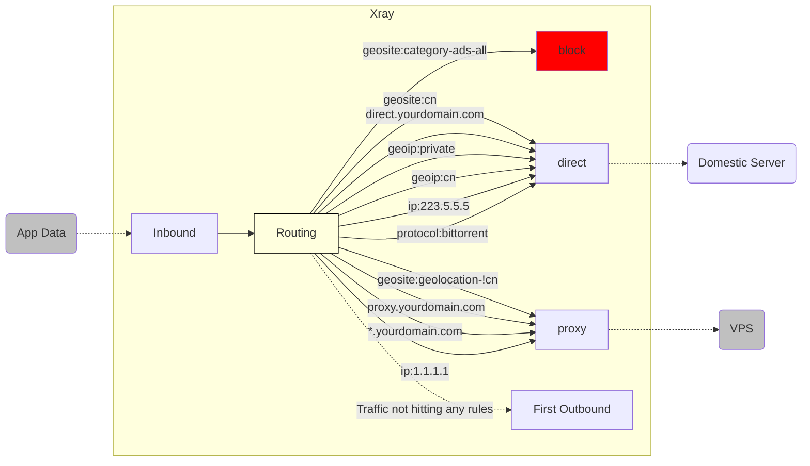

# Brief Analysis of Routing Functions (Part 2)

Welcome back to the study of `Xray`'s **[Routing]** function!

In [Brief Analysis of Routing Functions (Part 1)](./routing-lv1-part1.md), we gained a clear understanding of the working logic of the **[Routing]** function and set up simple domain-based shunting based on the `geosite.dat` file.

As mentioned earlier, domain-based shunting is just a small test of the **[Routing]** function's capabilities. Now, let's see what else, besides domains, can be used as a basis for shunting!

## 5. Expanding Horizons - Multiple Routing Matching Conditions

> `[domain], [IP], [protocol], etc.`

Shunting based on domains allows us to route network traffic in a basically reasonable way. Why do I say "basically reasonable"?

Because although "Dividing the world into three" (Block, Direct, Proxy) is the correct strategic direction, if you only use **[Domain]** to implement this strategy, it is actually full of loopholes. For example:

1. After reading the "Simple Guide for Beginners", I applied for a new domain `proxy.yourdomain.com` for my VPS. I want it to be proxied no matter what. Is it in `geosite.dat`?
2. If I have another domain `direct.yourdomain.com`, and I want it to be connected directly no matter what. Is it in `geosite.dat`?
3. Is the internal traffic of the local machine `127.0.0.1` (such as `docker`, etc.) correctly connected directly?
4. Is the traffic of the router and local LAN `192.168.*.*` correctly connected directly? (Such as routers, Synology NAS, etc.)
5. Are my domestic DNS queries (such as `223.5.5.5`) correctly connected directly?
6. Are my foreign DNS queries (such as `1.1.1.1`) correctly proxied?
7. Are other domestic websites that only have IP addresses and no domains (similar to domestic public DNS) correctly connected directly?
8. Are other foreign websites that only have IP addresses and no domains (similar to foreign public DNS) correctly proxied?
9. Although the source of BT download traffic is abroad, downloading via VPS may lead to a ban due to violation of usage terms. How can I force this to be direct?
10. ......

The reason I say using only **[Domain Shunting]** is full of loopholes is that the `geosite.dat` file only contains a portion of commonly used domains. In other words, relying solely on it will result in:

- Inability to match new domains not in the file.
- Inability to match rules based on IP addresses.
- Inability to match rules based on network protocols.

::: warning Mr. Wordy
Let's review: what happens when the situations above cannot be matched? That's right, the hidden routing rule will be triggered, which is **[Forward to the first outbound]**. This actually means:

- When your first outbound is `[direct-out]`: **Everything needing direct connection is correct, but everything needing proxy is wrong.**
- When your first outbound is `[proxy-out-vless]`: **Everything needing proxy is correct, but everything needing direct connection is wrong.**
  :::

Therefore, we need a way to have our cake and eat it too. Does such a way exist? **Of course!** All we need are more **[Shunting Judgment Criteria]** beyond just **[Domain]**.

### 5.1 Shunting Based on Specific Domains: `[domain], [full]`, etc

1. If we need to match a specific subdomain, such as `a-name.yourdomain.com`, we use `full: "a-name.yourdomain.com"`.
2. The previous `Question 1` and `Question 2` can be solved by assigning the `[proxy-out-vless]` outbound to `proxy.yourdomain.com` and the `[direct-out]` outbound to `direct.yourdomain.com`.
3. If we need to match all subdomains of `yourdomain.com`, we use `domain: "yourdomain.com"` to implement it.
4. The above two can become two independent routing rules, achieving a configuration where some subdomains are direct and others are proxied.
5. Additionally, `[domain]` also supports matching methods like regular expressions. For details, please refer to the [[Basic Configuration Module - Routing] documentation](../../config/routing.md).

The configuration is as follows:

```json
{
  "routing": {
    "domainStrategy": "AsIs",
    "rules": [
      // Specify subdomain for direct connection
      {
        "domain": ["full:direct.yourdomain.com"],
        "outboundTag": "direct-out"
      },
      // Specify subdomain for forwarding to VPS
      {
        "domain": ["full:proxy.yourdomain.com"],
        "outboundTag": "proxy-out-vless"
      },
      // Specify wildcard domain for forwarding to VPS
      {
        "domain": ["yourdomain.com"],
        "outboundTag": "proxy-out-vless"
      }
    ]
  }
}
```

### 5.2 Shunting Based on IP Files: `geoip.dat`

Very similar to the `geosite.dat` rule file, we also have the `geoip.dat` rule file. It is dedicated to providing users with a mature and complete **[IP Classification Table]**. It allows users to simply call any subclass via the `geoip:xxx` format to customize routing rules that meet their needs.

1. To solve the previous `[Question 3]` and `[Question 4]`, we use the `geoip:private` category to specify `[direct-out]`.
2. To solve the previous `[Question 7]`, we use the `geoip:cn` category to specify `[direct-out]`.
3. To solve the previous `[Question 8]`, since `geoip` does not have a category for "Non-Chinese IPs" (because this would mean collecting IP ranges from the entire world), we use the hidden rule instead, which is placing `[proxy-out-vless]` as the first outbound.

The configuration is as follows:

```json
{
  "routing": {
    "domainStrategy": "AsIs",
    "rules": [
      // Local internal addresses and LAN addresses direct connection
      {
        "ip": ["geoip:private"],
        "outboundTag": "direct-out"
      },
      // Domestic IP set direct connection
      {
        "ip": ["geoip:cn"],
        "outboundTag": "direct-out"
      }
    ]
  }
}
```

### 5.3 Shunting Based on Specific IP Addresses

In addition to using `geoip.dat`, the core naturally supports routing directly using IPs to meet various needs.

1. To solve the previous `[Question 5]`, we use `ip: "223.5.5.5"` to specify `[direct-out]`.
2. To solve the previous `[Question 6]`, we use `ip: "1.1.1.1"` to specify `[proxy-out-vless]`.

The configuration is as follows:

```json
{
  "routing": {
    "domainStrategy": "AsIs",
    "rules": [
      // Specific IP address direct connection
      {
        "ip": ["223.5.5.5"],
        "outboundTag": "direct-out"
      },
      // Specific IP address forwarding to VPS
      {
        "ip": ["1.1.1.1"],
        "outboundTag": "proxy-out-vless"
      }
    ]
  }
}
```

### 5.4 Shunting Based on Protocol Types: `[protocol]`, etc

1. To solve the previous `[Question 9]`, we use the `"protocol": ["bittorrent"]` category to specify `[direct-out]`.

::: tip
You need to enable `sniffing` in the inbound proxy to use this method for shunting.
:::

```json
{
  "routing": {
    "domainStrategy": "AsIs",
    "rules": [
      // Specific BT protocol direct connection
      {
        "protocol": ["bittorrent"],
        "outboundTag": "direct-out"
      }
    ]
  }
}
```

### 5.5 Shunting Based on More Conditions

Up to this point, we have only touched the tip of the iceberg of the **[Routing Function]**'s shunting capabilities! It supports many other judgment conditions! I will briefly list them below:

Covered in this article:

- `inboundTag`
- `domain`
- `ip`
- `protocol`

Not yet covered in this article:

- `port`
- `sourcePort`
- `network`
- `source`
- `user`
- `attrs`

However, expanding on all these would be too much content, far beyond the scope of `level-1`. Therefore, friends who need these complex conditions, please carefully read the [[Basic Configuration Module - Routing] documentation](../../config/routing.md) to learn on your own! If you have questions, ask in the Telegram group!

## 6. "The Empire is Set": A Comprehensive Review of Routing Rules

So far, we have accumulated a set of routing rules with grand strategy and precise tactics. To avoid confusion, let's now organize and review them completely.

::: warning Note
The order in which routing takes effect is: **[Top to bottom, judged sequentially]**. Therefore, the rule order I generally recommend is:

`[1-block] --> [2-direct] --> [3-proxy] --> [4-first-outbound]`
:::

```json
{
  "routing": {
    "domainStrategy": "AsIs",
    "rules": [
      // [1-block Ad traffic blocking]
      // 1.1 Ad domain set blocking
      {
        "domain": ["geosite:category-ads-all"],
        "outboundTag": "block"
      },
      // [2-direct Domestic traffic direct connection]
      // 2.1 Domestic domain set, specific subdomain direct connection
      {
        "domain": ["geosite:cn", "full:direct.yourdomain.com"],
        "outboundTag": "direct-out"
      },
      // 2.2 Local internal address + LAN, Domestic IP, Specific IP direct connection
      {
        "ip": ["geoip:private", "geoip:cn", "223.5.5.5"],
        "outboundTag": "direct-out"
      },
      // 2.3 BT protocol traffic direct connection
      {
        "protocol": ["bittorrent"],
        "outboundTag": "direct-out"
      },
      // [3-proxy Foreign traffic forwarding to VPS]
      // 3.1 Foreign domain set, specific subdomain, specific wildcard domain forwarding to VPS
      {
        "domain": [
          "geosite:geolocation-!cn",
          "full:proxy.yourdomain.com",
          "yourdomain.com"
        ],
        "outboundTag": "proxy-out-vless"
      },
      // 3.2 Specific IP forwarding to VPS
      {
        "ip": ["1.1.1.1"],
        "outboundTag": "proxy-out-vless"
      }
      // [4-default-routing First outbound]
      // Traffic not matching any rules defaults to the first outbound handling
    ]
  }
}
```

At this point, the routing rules have effectively become:



As for whether the first outbound is `[direct-out]` or `[proxy-out-vless]`, that depends entirely on your needs.

## 7. Common Routing Configuration Errors

Please pay attention: every routing rule I listed above is an independent matching basis. This is the only way to ensure they take effect. A common mistake newcomers make when customizing routing rules is: **Matching multiple different matching criteria within a single rule, causing the match to fail.**

For example, the configuration they hope to achieve is:

1. Their own `direct.yourdomain.com` connects directly.
2. Domestic DNS queries (such as `223.5.5.5`) connect directly.

### 7.1 Incorrect Example

To achieve the above goals, they wrote the following routing rule:

```json
{
  "routing": {
    "domainStrategy": "AsIs",
    "rules": [
      {
        "ip": ["223.5.5.5"],
        "domain": ["full:direct.yourdomain.com"],
        "outboundTag": "direct-out"
      }
    ]
  }
}
```

Can you spot the error here? At first glance, it seems correct?

::: warning Note
**Within the same rule, all criteria must be met simultaneously for the match to succeed.** The logical relationship is `AND`, not `OR`.
:::

In other words, this rule means: **[Xray will only forward traffic to `[direct-out]` when the target = `direct.yourdomain.com` **AND** at the same time the target = `223.5.5.5`]**.

Obviously, a target cannot equal two different values at the same time. So this is not only an invalid rule that can never be realized, but it also has nothing to do with the original goal.

### 7.2 Correct Example

The correct example is naturally to separate the different matching criteria:

```json
{
  "routing": {
    "domainStrategy": "AsIs",
    "rules": [
      {
        "ip": ["223.5.5.5"],
        "outboundTag": "direct-out"
      },
      {
        "domain": ["full:direct.yourdomain.com"],
        "outboundTag": "direct-out"
      }
    ]
  }
}
```

In fact, point 6 was already my organized rules. The principle is **[Identical matching criteria can be merged, different matching criteria must remain independent]**.

## 8. The Secret Passage

> The secret path from `[domain]` to `[ip]`: `domainStrategy`

In section 5.4, we presented various **[criteria]** for traffic judgment. One is domain `[domain]`, and another is `[IP]`.

If you have a preliminary understanding of how DNS works, you know that when we initiate a request to a domain `[domain]`, we actually need to first initiate a request to `DNS` to resolve the `[IP]` corresponding to the domain `[domain]`, and then initiate the actual request to that `[IP]`.

Therefore, facing an inbound domain request, `Xray` actually has two opportunities to judge its type. So, should we use these two opportunities? This is decided by the `domainStrategy` configuration. It has three options:

- `AsIs`
- `IPIfNonMatch`
- `IPOnDemand`

Let's explain them one by one:

### 8.1 Domain Strategy: `"AsIs"`

This means "As Domain Is", which implies **[Just let the domain be, don't fuss with it]**.

To understand it simply and crudely: **[Only use `[domain]` to match]**.

::: tip
The actual meaning of `AsIs` is "As shown in the original, without modification". Teacher Watermelon didn't describe it very precisely here.
:::

The processing of this method is completed within `Xray`, with no data exchange with the outside world, so it is the fastest. Its fallback strategy is also clear: that is, the unmatchable domains mentioned earlier are automatically transferred to the first outbound for processing. Therefore, this is the most recommended strategy for general routing usage.

### 8.2 Domain Strategy: `"IPIfNonMatch"`

This means "lookup IP if (there's) no matching rule", which implies **[If no other rules match, then convert to `IP` to match `IP` rules]**.

To understand it simply and crudely: **[First match the access target with all other types of rules. If there is no match, then convert it to `IP` via `DNS` query, and match it against all rules again from the beginning]**.

Under this strategy, domains that do not hit any rules need to go through the `DNS` query process and a second round of rule matching. It takes more time than the `AsIs` strategy, so it is not the preferred recommended strategy.

### 8.3 Domain Strategy: `"IPOnDemand"`

It is actually more accurate to say `Demand IP` here, which implies **[When matching, if any IP-based rule is encountered, immediately resolve the domain to IP for matching]**.

To understand it simply and crudely: **[As long as there are `IP` type rules in the routing rules, then all requests based on domain `[domain]` must be resolved into `[IP]` and then matched against `[IP]` type rules]**.

It requires `DNS` resolution for all initial domain accesses, so the first query is relatively time-consuming. Although due to the existence of the `DNS` caching mechanism in `Xray`, subsequent access speeds to the same domain will return to peak performance, generally speaking, it is not the preferred recommended strategy either.

::: warning Mr. Wordy
`domainStrategy` only takes effect for domains, don't get mixed up~
:::

## 9. Thought Exercises

So far, we have been explaining the various configuration logics within **[Routing]** based on **[Single Inbound]** and **[Single Outbound]**.

However, as you know, `Xray` itself supports multiple ports and multiple protocols. So, if I ask you:

1. I want the `VLESS` protocol to forward my daily web browsing and App traffic to a high-traffic server in the US.
2. I want the `trojan` protocol to forward all my Netflix traffic to a server in Japan to unlock various anime content.
3. I want the `shadowsocks` protocol to forward all my gaming traffic to a server in Hong Kong to achieve the lowest latency.
4. I want an independent port to forward all `telegram` traffic to the VPS.
5. I want an independent port to forward all `bittorrent` download traffic to a "Big Disk Chicken" (Server with large storage) in Europe.
6. I want......

Can these ideas be realized through **[Routing]** configuration?

The answer is, of course, **[Absolutely!]** But these are already beyond the scope of `level-1`, so I'll leave them for you to explore freely!

## 10. Conclusion

This concludes the introduction to `Xray`'s **[Routing]** function. I hope this article helps you understand the flexibility of `Xray`.

## 11. Endnotes

- Now you can read the [Routing](../../config/routing.md) documentation again to see if you have a deeper understanding.
- 🍉🍉🍉🍉🍉 :D
