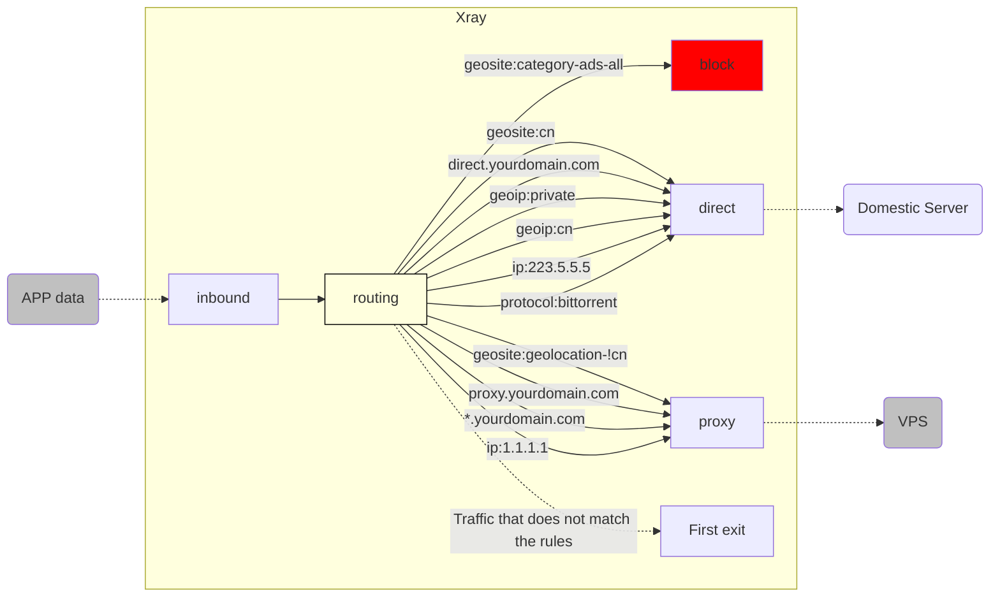

# Routing Function Analysis (Part 2)

Welcome to continue learning about `Xray`'s [Routing] function!

In [《Routing Function Analysis (Part 1)》](./routing-lv1-part1.md), we have a clear understanding of the working logic of the [Routing] function, and have also made a simple domain name diversion configuration based on the `geosite.dat` file.

As mentioned earlier, domain name diversion is just a small test of the [Routing] function. Let's take a look at what else can be used as a basis for diversion besides domain names!

## 5. Attack the city and the pool - multiple routing matching conditions

> `[Domain name], [IP], [Protocol], etc.`

Diversion based on domain names can already allow us to perform basically reasonable diversion of network traffic. Why is it [basically reasonable]?

Because [Dividing the world into three parts] is the correct strategic direction, but if you only use [domain name] to implement this strategy, it is actually full of loopholes, such as:

1. After reading "Little White Vernacular", I applied for a new domain name of `proxy.yourdomain.com` for my VPS. I hope it will always be a proxy. Is it in `geosite.dat`?

2. If I also have a domain name of `direct.yourdomain.com`, I hope it will always be directly connected. Is it in `geosite.dat`?

3. Is the internal traffic of the local machine `127.0.0.1` connected directly? (For example, `docker`, etc.)

4. Is the traffic of the router and local LAN `192.168.*.*` connected directly? (For example, router, Synology, etc.)

5. Is my domestic DNS query (such as `223.5.5.5`) connected directly?
6. Is my foreign DNS query (such as `1.1.1.1`) correctly proxied?
7. Are other domestic websites that do not have domain names but only IP addresses, like domestic public DNS, correctly proxied?
8. Are other foreign websites that do not have domain names but only IP addresses, like foreign public DNS, correctly proxied?
9. Although the source of BT download traffic is from abroad, if it is downloaded through VPS, it is likely to be blocked for illegal use. How can I force a direct connection?
10. ......

The reason why I say that only using [Domain Diversion] will be full of loopholes is that the `geosite.dat` file only contains a part of the commonly used domain names. In other words, relying solely on it will:

- Unable to match new domain names that are not in the file
- Unable to match rules based on IP addresses
- Unable to match rules based on network protocols

::: warning
Then let's review what happens when the above situations cannot be matched? By the way, it will trigger the hidden routing rule, that is, [**Forward to the first outbound station** ]. This actually means:

- When your first outbound station is `[direct-out]`: **All those that need direct connection are correct, but those that need proxy are wrong**
- When your first outbound station is `[proxy-out-vless]`: **All those that need proxy are correct, but those that need direct connection are wrong**
:::

So, we need a way to let us have the best of both worlds. Does such a method exist? **Of course it exists! ** All we need is more [**Diversion Judgment Basis**] besides [Domain Name].

### 5.1 Diversion based on specified domain name: `[domain], [full]`, etc.

1. If you need to match a subdomain, such as `a-name.yourdomain.com`, we use `full: "a-name.yourdomain.com"`
2. The previous `Question 1` and `Question 2` can be solved by specifying `[proxy-out-vless]` outbound for `proxy.yourdomain.com` and `[direct-out]` outbound for `direct.yourdomain.com`
3. If you need to match all subdomains of `yourdomain.com`, we use `domain: "yourdomain.com"` to achieve it
4. The above two can become two independent routing rules to achieve the configuration of direct connection for some subdomains and proxy for other subdomains
5. In addition, `[domain]` also supports matching methods such as regular expressions. For details, please refer to [《Basic Configuration Module - Routing》document](../../../config/base/routing/)

The above configuration is as follows:

```json
{
  "routing": {
    "domainStrategy": "AsIs",
    "rules": [
      // Direct connection to a specified subdomain
      {
        "type": "field",
        "domain": ["full:direct.yourdomain.com"],
        "outboundTag": "direct-out"
      },
      // Specify subdomain forwarding VPS
      {
        "type": "field",
        "domain": ["full:proxy.yourdomain.com"],
        "outboundTag": "proxy-out-vless"
      },
      // Specify wildcard domain name to forward to VPS
      {
        "type": "field",
        "domain": ["yourdomain.com"],
        "outboundTag": "proxy-out-vless"
      }
    ]
  }
}
```

### 5.2 Diversion based on IP file: `geoip.dat`

In addition to using `geosite.dat`, the core also supports direct use of IP for routing to meet various needs.

1. To solve the previous `[problem 3], [problem 4]`, we use the `geoip:private` category to specify `[direct-out]`
2. To solve the previous `[problem 7]`, we use the `geoip:cn` category to specify `[direct-out]`
3. To solve the previous `[problem 8]`, since there is no [non-Chinese IP] category in `geoip` (because this is equivalent to collecting IP segments from all over the world), we use hidden rules instead, that is, put `[proxy-out-vless]` in the first outbound

The above configuration is as follows:

```json
{
  "routing": {
    "domainStrategy": "AsIs",
    "rules": [
      // The local address and LAN address are directly connected
      {
        "type": "field",
        "ip": ["geoip:private"],
        "outboundTag": "direct-out"
      },
      // Domestic IP set direct connection
      {
        "type": "field",
        "ip": ["geoip:cn"],
        "outboundTag": "direct-out"
      }
    ]
  }
}
```

### 5.3 Diversion based on specified IP address

Similar to the `geosite.dat` rule file, we also have the `geoip.dat` rule file, which is the **second magic weapon** driven by the [routing function]. It is committed to providing users with a mature and complete [IP classification table]. Allow users to simply call any subclass through the `geoip:xxx` format and customize routing rules that meet their needs.

1. To solve the previous `[problem 5]`, we use `ip: "223.5.5.5"` to specify `[direct-out]`

2. To solve the previous `[problem 6]`, we use `ip: "1.1.1.1"` to specify `[proxy-out-vless]`

The above configuration is as follows:

```json
{
  "routing": {
    "domainStrategy": "AsIs",
    "rules": [
      // Direct connection by specifying an IP address
      {
        "type": "field",
        "ip": ["223.5.5.5"],
        "outboundTag": "direct-out"
      },
      // Specify IP address to forward to VPS
      {
        "type": "field",
        "ip": ["1.1.1.1"],
        "outboundTag": "proxy-out-vless"
      }
    ]
  }
}
```

### 5.4 Divert based on protocol type: `[protocol]` etc.

1. To solve the previous `[problem 9]`, we use the `"protocol": ["bittorrent"]` category to specify `[direct-out]`

::: tip
You need to turn on `sniffing` in the inbound proxy to use this diversion method.
:::

```json
{
  "routing": {
    "domainStrategy": "AsIs",
    "rules": [
      // Specify BitTorrent protocol direct connection
      {
        "type": "field",
        "protocol": ["bittorrent"],
        "outboundTag": "direct-out"
      }
    ]
  }
}
```

### 5.5 Traffic diversion based on more conditions

So far, we have only talked about the tip of the iceberg of the [routing function] traffic diversion capability! Because it also supports many other judgment conditions! I will briefly list them as follows:

This article has already talked about:

- `inboundTag`
- `domain`
- `ip`
- `protocol`

Not yet covered in this article：

- `port`
- `sourcePort`
- `network`
- `source`
- `user`
- `attrs`

But there are too many contents. If you want to expand them all, it is far from the content of `level-1`. Therefore, friends who need these complex conditions, please read [《Basic Configuration Module - Routing》Document](../../config/base/routing/) carefully and learn by yourself! If you have any questions, please ask in the TG group!

## 6. "The hegemony is initially determined": a review of the routing rules

So far, we have accumulated a set of strategically magnificent and tactically precise routing rules. In order to avoid confusion, we will now conduct a complete sorting and review of it.

::: warning Note
The order in which the routing takes effect is: [from top to bottom, judge in turn], so the order of rules I generally recommend is:

`[1-block] --> [2-direct] --> [3-proxy] --> [4-first-outbound]`
:::

```json
{
  "routing": {
    "domainStrategy": "AsIs",
    "rules": [
      // [1-block Ad traffic blocking]
      // 1.1  Advertisement domain name set blocking
      {
        "type": "field",
        "domain": ["geosite:category-ads-all"],
        "outboundTag": "block"
      },
      // [2-direct Domestic traffic direct connection]
      // 2.1 Domestic domain name set, designated subdomain direct connection
      {
        "type": "field",
        "domain": ["geosite:cn", "full:direct.yourdomain.com"],
        "outboundTag": "direct-out"
      },
      // 2.2 Local internal address + LAN, domestic IP, designated IP direct connection
      {
        "type": "field",
        "ip": ["geoip:private", "geoip:cn", "223.5.5.5"],
        "outboundTag": "direct-out"
      },
      // 2.3 BT protocol traffic direct connection
      {
        "type": "field",
        "protocol": ["bittorrent"],
        "outboundTag": "direct-out"
      },
      // [3-proxy Foreign traffic forwarding VPS]
      // 3.1 Foreign domain name set, designated subdomain, designated wildcard domain forwarding VPS
      {
        "type": "field",
        "domain": [
          "geosite:geolocation-!cn",
          "full:proxy.yourdomain.com",
          "yourdomain.com"
        ],
        "outboundTag": "proxy-out-vless"
      },
      // 3.2 Specify IP forwarding VPS
      {
        "type": "field",
        "ip": ["1.1.1.1"],
        "outboundTag": "proxy-out-vless"
      }
      // [4-default-routing First exit]
      // Traffic that does not match any rule is processed by the first outbound rule by default.
    ]
  }
}
```

At this point, the routing rules actually become:



As for whether the first outbound is `[direct-out]` or `[proxy-out-vless]`, it all depends on your needs.

## 7. Common mistakes in routing configuration

Please note that each of my routing rules above is an independent matching basis, only in this way can it be guaranteed to take effect. A common mistake made by newcomers when customizing routing rules is: **Matching multiple different matching criteria in one rule at the same time, resulting in invalid matching. **

For example, the configuration he hopes to achieve is:

1. Direct connection to his own `direct.yourdomain.com`

2. Direct connection to domestic DNS query (such as `223.5.5.5`)

### 7.1 Error demonstration

In order to achieve the above goal, he wrote the following routing rules:

```json
{
  "routing": {
    "domainStrategy": "AsIs",
    "rules": [
      {
        "type": "field",
        "ip": ["223.5.5.5"],
        "domain": ["full:direct.yourdomain.com"],
        "outboundTag": "direct-out"
      }
    ]
  }
}
```

Can you spot the error here? At first glance, it seems correct?

::: warning Note
**In the same rule, each basis must be established at the same time for the match to succeed**, the logical relationship is `and`, not `or`.

:::

In other words, this rule means: [When you visit `target = direct.yourdomain.com`, **and** it also satisfies `target = 223.5.5.5`, `Xray` will forward the traffic to `[direct-out]` direct connection outbound]

Obviously, a target cannot be equal to two different values ​​at the same time, so this is not only an invalid rule that can never be implemented, but also has nothing to do with the original goal.

### 7.2 Correct Demonstration

Correct demonstration is naturally to separate different matching criteria:

```json
{
  "routing": {
    "domainStrategy": "AsIs",
    "rules": [
      {
        "type": "field",
        "ip": ["223.5.5.5"],
        "outboundTag": "direct-out"
      },
      {
        "type": "field",
        "domain": ["full:direct.yourdomain.com"],
        "outboundTag": "direct-out"
      }
    ]
  }
}
```

In fact, point 6 is the rule I have sorted out. The principle is [the same matching criteria can be merged, and different matching criteria remain independent].

## 8. Repairing the plank road in the open and crossing Chencang in secret

> The secret way of converting `[domain]` to `[ip]`: `domainStrategy`

In 5.4, we submitted multiple [basis] for traffic judgment, one of which is the domain name `[domain]` and the other is `[IP]`.

If you have a preliminary understanding of the operation process of DNS, you will know that when we initiate an access request to a domain name `[domain]`, we actually need to initiate a request to `DNS` to resolve the `[IP]` corresponding to the domain name `[domain]`, and then initiate an actual request to it after obtaining the `[IP]`.

Therefore, facing an incoming domain name request, `Xray` actually has two opportunities to determine its type. So, should we use these two opportunities? This is determined by the configuration of `domainStrategy`. It has three options:

- `AsIs`
- `IPIfNonMatch`
- `IPOnDemand`

Let's explain them one by one:

### 8.1 Domain strategy: `"AsIs"`

It means "As Domain Is", which means [Domain is what it is, no more trouble].

A simple and rough understanding is [match only with `[domain]`].

::: tip
The actual meaning of `AsIs` is [as originally shown, without modification]. 🍉 The teacher's description here is not very appropriate.
:::

This method is processed inside `Xray`, without data exchange with the outside world, so the speed is the fastest. Its bottom-line strategy is also very clear: that is, the domain name that cannot be matched mentioned above is automatically transferred to the first outbound processing. Therefore, this is the most recommended strategy for regular use of routing functions.

### 8.2 Domain Name Strategy: `"IPIfNonMatch"`

It means "lookup IP if (there's) no matching rule", which means [if all other rules cannot be matched, then convert it to `IP` to match the `IP` rule].

In simple terms, it means [match the access target with all other types of rules first. If it cannot be matched, convert it to `IP` through `DNS` query, and then match it with all rules again from the beginning].

Under this strategy, the domain names that do not match any rules will need to go through the `DNS` query process and the second round of rule matching process, which will take more time than the `AsIs` strategy, so it is not the preferred recommended strategy.

### 8.3 Domain Name Strategy: `"IPOnDemand"`

It is more accurate to say `Demand IP` here, which means [when matching any IP-based rules, the domain name will be immediately resolved to IP for matching].

A simple and rough understanding is that [as long as there is an `IP` class rule in the routing rules, all requests based on the domain name `[domain]` must be resolved into `[IP]` and then matched against the `[IP]` class rule].

It needs to perform `DNS` resolution for all first-time domain name accesses, so the first query is time-consuming. Although the subsequent access speed to the same domain name will return to its peak due to the existence of the `DNS` caching mechanism in `Xray`, it is not the preferred strategy in general.

::: warning
`domainStrategy` is only effective for domain names, don't get confused~
:::

## 9. Thinking questions

So far, we have explained the various configuration logics inside [routing] based on [single inbound] and [single outbound].

However, as you know, `Xray` itself supports multiple ports and multiple protocols. So, if I ask you:

1. I hope that the `VLESS` protocol will forward my daily web browsing and APP traffic to the high-traffic server in the United States

2. I hope that the `trojan` protocol will forward all my Netflix traffic to the Japanese server to unlock various ACG

3. I hope that the `shadowsocks` protocol will forward all my game traffic to the Hong Kong server to achieve the lowest latency

4. I hope there is a separate port to forward all `telegram` traffic to the VPS

5. I hope there is a separate port to forward all `bittorrent` download traffic to the European Big Plate Chicken

6. I hope...

Can these ideas be implemented through the [routing] function configuration?

The answer is of course **[absolutely yes]**! But these are beyond the scope of `level-1`, so I will leave it to you to explore freely!

## 10. Conclusion

So far, the [routing] function of `Xray` has been introduced. I hope this article can help you understand the flexibility of `Xray`.

## 11. Endnote

- Now you can re-read [routing](../../config/routing.md) to see if you have a deeper understanding.
- 🍉🍉🍉🍉🍉 :D
