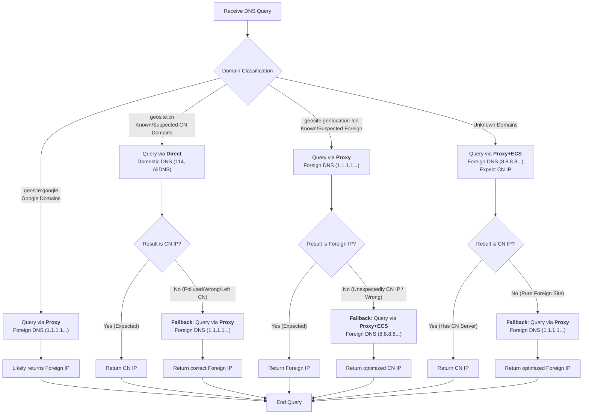

# Achieving Precise Domestic/Foreign Traffic Splitting via DNS

## Conventional Splitting Methods and Their Flaws

When you try to manually craft proxy rules, you inevitably ask yourself: Which traffic should go through the proxy, and which should go directly?

The answer is usually a Blacklist or Whitelist.

Over the past decade, the community has maintained massive rule lists, giving birth to many excellent projects:

- <https://github.com/gfwlist/gfwlist>
- <https://github.com/v2fly/domain-list-community>
- <https://github.com/Loyalsoldier/v2ray-rules-dat>

However, it is impossible for them to cover every website; they suffer from lag and cannot be 100% trusted.

Here are a few examples:

- `geosite:cn` is a hodgepodge. Anything remotely related to China gets thrown in. Even if a domain is blocked by the GFW, it might not be removed in time.
  If you rely solely on whether the target domain is in this list to decide on direct connection, it won't work perfectly. For example, `ai.ytimg.com` and `login.corp.google.com` remain in the list despite being blocked.
- The [README](https://github.com/Loyalsoldier/v2ray-rules-dat) of `v2ray-rules-dat` states: Apple, Microsoft, and Google CN domains exist in both `geosite:cn` and `geosite:geolocation-!cn`. But in reality, this is not always the case. (See: [PR#328](https://github.com/Loyalsoldier/v2ray-rules-dat/pull/328))
- What if the domain isn't in any list?

This undoubtedly causes trouble for traffic splitting. If your rules aren't updated in time, traffic that should go directly might be proxied, or some websites might not open at all.

What if an unknown domain has a server in China and you want to connect directly as much as possible, but after all your efforts, you encounter the legendary [DNS Leak](https://github.com/XTLS/BBS/issues/3#issuecomment-3505661189)?

So, is there a way to achieve 99.99% secure and precise traffic splitting?

The answer is: **Absolutely.**

## Achieving Precise Splitting with Xray-core DNS Module

By making reasonable use of Xray's ~~wheelchair-like~~ powerful built-in DNS features—such as Fallbacks, ECS (EDNS Client Subnet), IP filtering, and Tagging—and carefully adjusting their order, you can obtain a much more accurate and real-time routing condition than `geosite cn/!cn`: the IP address. This works because IP geolocation, especially CN geolocation, changes much less frequently than domain lists.

Before reading further, you need to fully read and understand the "Beginner Skills: Analysis of the Routing Feature [Part 1](./routing-lv1-part1.md) & [Part 2](./routing-lv1-part2.md)".
At the same time, you should have practically memorized the official configuration guide. You must fully understand the functions of `domainStrategy` in routing/outbounds, `sniffing` options in inbounds, and the behaviors produced by their different combinations.

Ready? Please try to understand the following paragraph:

When using **socks/http inbounds**, the request is a domain name. When it reaches the **Routing** module, a `domainStrategy` other than `AsIs` can use the built-in DNS to resolve an IP specifically for routing matching. When the traffic reaches a local **direct outbound**, a `domainStrategy` other than `AsIs` in the outbound can use the built-in DNS to resolve the IP again for the actual connection. The request sent to the Xray Server (remote) contains only the domain name; which IP is actually accessed depends on the server's direct outbound.

The situation becomes more complex with **Transparent Proxy**. If inbound `sniffing` is enabled and `destOverride` includes `[http, tls]`:

- If `routeOnly = false`, the requested IP will be wiped, and the subsequent flow acts just like a socks inbound.
- If `routeOnly = true`, both the domain and IP are available. When reaching the **Routing** module, it can match against both domain and IP rules directly. The local **direct outbound** will also use this IP. The request sent to the Xray Server contains only the IP. How does the server handle it? It repeats the process described above.

Having trouble? You need to re-read the official guide and try to understand it. Otherwise, it will be difficult for you to utilize the resolution results of the DNS module in the examples below for correct traffic splitting.

---

#### Example 1: This configuration resolves precise, CDN-friendly IP addresses. It guarantees no DNS Leaks while ensuring that if a domain has a server in China, it is prioritized. This is highly suitable for realIp transparent proxy scenarios

```json
{
  "dns": {
    "servers": [
      // Prevent Google CAPTCHA issues and prevent Google China from being monitored (since many 3rd party sites load Google Fonts, etc.)
      {
        "address": "1.1.1.1",
        "skipFallback": true,
        "domains": ["geosite:google", "geosite:google-cn"]
      },
      {
        "address": "8.8.8.8",
        "skipFallback": true,
        "domains": ["geosite:google", "geosite:google-cn"],
        "finalQuery": true // Terminate the query chain
      },
      // Resolve domains considered by the community to be in China via Direct connection.
      // If the result is not as expected, it might be blocked or have left China.
      // Resolve via Proxy for fallback in case it is blocked or left China.
      {
        "tag": "dns-direct",
        "address": "114.114.114.114",
        "skipFallback": true,
        "domains": ["geosite:cn"],
        "expectIPs": ["geoip:cn"]
      },
      {
        "tag": "dns-direct",
        "address": "223.5.5.5",
        "skipFallback": true,
        "domains": ["geosite:cn"],
        "expectIPs": ["geoip:cn"]
      },
      {
        "address": "1.1.1.1",
        "skipFallback": true,
        "domains": ["geosite:cn"]
      },
      {
        "address": "8.8.8.8",
        "skipFallback": true,
        "domains": ["geosite:cn"],
        "finalQuery": true // Terminate the query chain
      },
      // Resolve domains considered non-Chinese via Proxy.
      // If the result is not as expected, attempt optimized direct connection.
      {
        "address": "1.1.1.1",
        "skipFallback": true,
        "domains": ["geosite:geolocation-!cn"],
        "expectIPs": ["geoip:!cn"]
      },
      {
        "address": "8.8.8.8",
        "skipFallback": true,
        "domains": ["geosite:geolocation-!cn"],
        "expectIPs": ["geoip:!cn"]
      },
      {
        "address": "8.8.8.8",
        "clientIp": "222.85.85.85", // Provide your local ISP IP to get direct-connection optimized A/AAAA records
        // e.g., if you are Henan Telecom, use a Henan Telecom DNS (pun intended / example)
        // Cannot guarantee 100% China CDN friendliness as not all authoritative servers support ECS
        "skipFallback": true,
        "domains": ["geosite:geolocation-!cn"]
      },
      {
        "address": "8.8.4.4",
        "clientIp": "222.85.85.85", // Same as above
        "skipFallback": true,
        "domains": ["geosite:geolocation-!cn"],
        "finalQuery": true // Terminate the query chain
        // You might wonder: Are these 4 rules redundant with the 4 above? Can they be simplified?
        // Actually no, this is for extreme speed and because some authoritative DNS do not support ECS.
      },
      // Unknown domains, prioritize China. If unexpected, attempt optimized proxy.
      {
        "address": "8.8.8.8",
        "clientIp": "222.85.85.85", // Same as above
        "expectIPs": ["geoip:cn"]
      },
      {
        "address": "8.8.4.4",
        "clientIp": "222.85.85.85", // Same as above
        "expectIPs": ["geoip:cn"]
      },
      "1.1.1.1",
      "8.8.8.8"
    ],
    "tag": "dns-proxy",
    "enableParallelQuery": true // Intelligent parallel query: All parallel, smart grouping, race within group
  },
  "routing": {
    "domainStrategy": "Depends entirely on your needs",
    "rules": [
      {
        // Routing for DNS queries themselves
        "inboundTag": ["dns-direct"],
        "outboundTag": "direct"
      },
      {
        // Routing for DNS queries themselves
        "inboundTag": ["dns-proxy"],
        "outboundTag": "proxy"
      }
      // Your personalized routing rules
      // For media unlocking, use domain routing. For domestic/foreign splitting, ALWAYS use IP routing.
    ]
  }
  // Others ignored, configure as needed...
}
```



You can route traffic based on the IP resolved by this configuration combined with the domain name, or rely entirely on the IP.

In a realIp transparent proxy environment, you can even ensure that after hijacking DNS from various channels, you set `domainStrategy=AsIs` and `routeOnly=true` to achieve a process with no secondary DNS resolution throughout.

> Note: The "CDN-friendly" mentioned above regarding the foreign part is optimized for the location of your **proxy server**. If you are only proxying blacklisted sites rather than all foreign traffic, you need to adjust the ECS in the rules yourself.

#### Example 2: This configuration resolves correct but not necessarily foreign-CDN-friendly addresses. It guarantees no DNS Leaks while prioritizing China servers if they exist. It is suitable for fakeIp transparent proxy, socks, and http inbound scenarios

```json
{
  "dns": {
    "servers": [
      // Prevent Google CAPTCHA issues, prevent Google China monitoring
      {
        "address": "1.1.1.1",
        "skipFallback": true,
        "domains": ["geosite:google", "geosite:google-cn"],
        "finalQuery": true // Terminate query chain
      },
      {
        // We don't fully trust geosite:cn, but if a domain is in this list,
        // we try resolving it first. If it returns a China IP, it means it's not blocked.
        // Conversely, if not, it's highly likely blocked. Fallback to 8.8.8.8 to resolve again, solving potential DNS pollution.
        // We prioritize this because the cost is minimal; direct connection takes only ~10ms.
        "tag": "dns-direct",
        "address": "223.5.5.5",
        "skipFallback": true,
        "domains": ["geosite:cn"],
        "expectIPs": ["geoip:cn"]
      },
      {
        // If a domain is not in geosite:cn, or fell back from the rule above, use this server.
        // Here we use ECS to try and get China A/AAAA records.
        "address": "8.8.8.8",
        "clientIp": "222.85.85.85", // Provide local ISP IP to get direct-connection optimized A/AAAA records
        // e.g., if you are Henan Telecom, use a Henan Telecom DNS
        // Cannot guarantee 100% China CDN friendliness as not all authoritative servers support ECS
        "skipFallback": false
      }
    ],
    "tag": "dns-proxy"
  },
  "routing": {
    "domainStrategy": "Must be NON-AsIs, depends on your needs",
    "rules": [
      {
        // Routing for DNS queries themselves
        "inboundTag": ["dns-direct"],
        "outboundTag": "direct"
      },
      {
        // Routing for DNS queries themselves
        "inboundTag": ["dns-proxy"],
        "outboundTag": "proxy"
      }
      // Your personalized routing rules
      // For media unlocking, use domain routing. For domestic/foreign splitting, ALWAYS use IP routing.
    ]
  }
  // Others ignored, configure as needed...
}
```

In this scenario, since all requests sent to the Xray Server are domain names, there is no need to use DNS to repeatedly probe for the optimal result. We only need to quickly identify if the domain is polluted and resolve a Chinese CDN-friendly IP as much as possible.

The China IP resolved by the DNS module in this example is already 99% China CDN friendly. Therefore, you can set `domainStrategy` in the direct outbound to **non-AsIs** to utilize the cache if you wish.
<br>
If you pursue 100% China CDN friendliness, you can set it to `AsIs` to use the OS configured DNS to resolve it again. This adds about 1ms to hundreds of ms of latency; it is recommended to enable optimistic caching to further reduce latency.

## Postscript

It is known that many unscrupulous domestic Apps probe your overseas exit IP and correlate it with your sensitive information such as GPS location, phone number, and food delivery address, leaking it to social engineering databases. ~~Big brother is watching u!!!~~

Some people mistakenly believe this is caused by traffic splitting and that simply switching to Blacklist mode (only proxying blocked sites) will avoid it.
In reality, this is not the case. First, blacklists are very easy to poison; they can intentionally create bait websites and submit them to the list to probe your overseas IP.

Secondly, as long as any website in the blacklist is hosted on Cloudflare, they don't even need bait. Just try accessing: `https://chatgpt.com/cdn-cgi/trace`

Clever as you are, you might think: "Can't I just find another public proxy to layer on top?" The premise is that you must completely trust that this proxy keeps no logs and won't sell you out, and that it is heavily used by people in your country. If an overseas IP is correlated with thousands of people per unit of time, it is impossible to trace back to you via that IP. As for the annoying CAPTCHAs that come with such "dirty IPs," you just have to deal with them.

Doesn't the cyber-philanthropist Cloudflare's Warp fit all these characteristics perfectly? Unfortunately, for websites hosted on CF, Warp cannot completely hide your IP; it is only effective for non-CF servers.

Can Tor do it? It's not suitable for daily use. The IPs are too dirty, and the exit nodes jump frequently, causing many websites to ban your accounts.

Therefore, unless the client you use can split traffic by App (which is only possible on mobile phones and computers), any other method of wall-crossing will lead to your overseas IP leaking.

In short, for conventional wall-crossing methods, overseas IP leakage is almost inevitable. If you need high-level privacy protection, please use tools like Tor. Xray-core, as an anti-censorship tool, focuses on resisting blocking to help you cross the firewall, and its capabilities in privacy protection are very limited.
