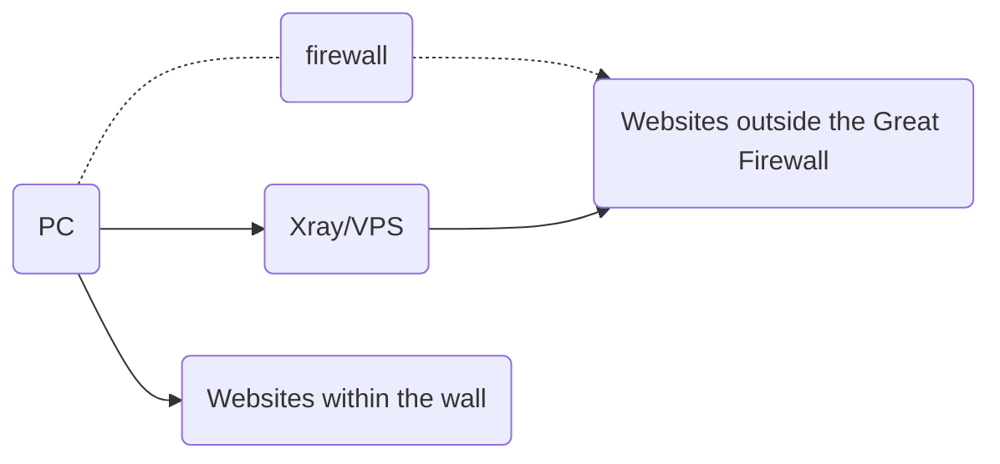
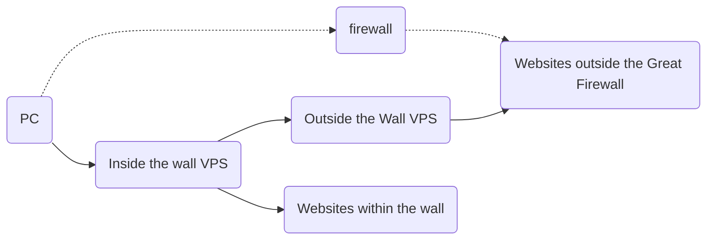
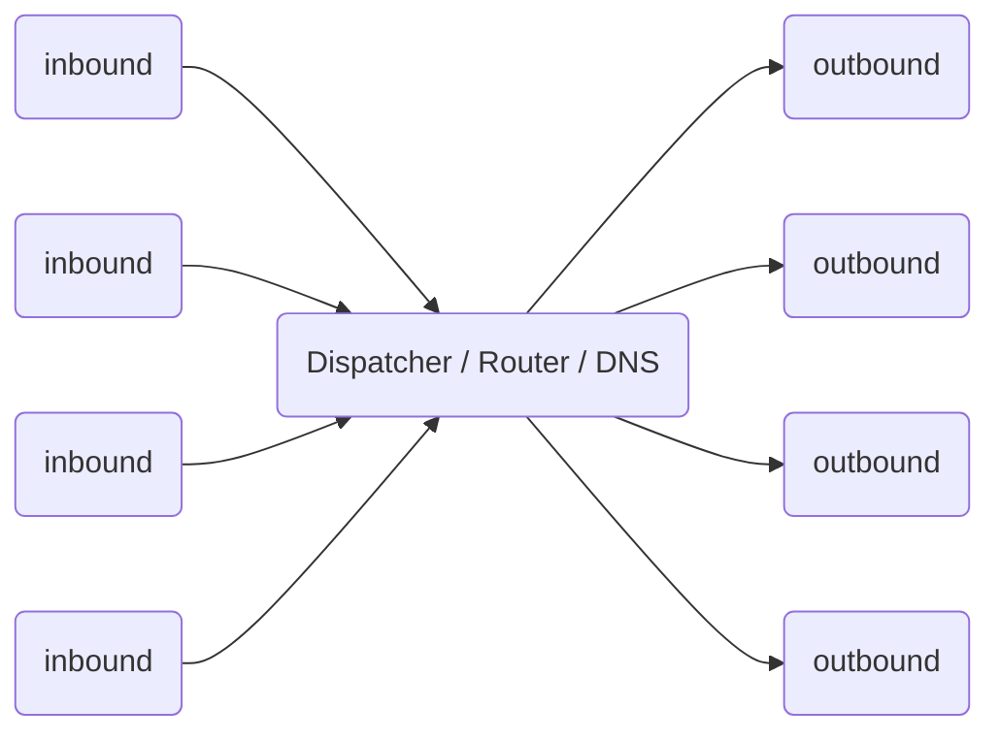

# Xray working mode

## Single Server Mode

Like other network proxy tools, you need a server with Xray configured, then install and configure the Xray client on your device, and then you can access the Internet smoothly.

An Xray server can support multiple devices using different proxy protocols to access at the same time. At the same time, after reasonable configuration, Xray can identify and distinguish between traffic that needs proxy and traffic that does not need proxy, and direct traffic does not need to be detoured.

## Bridge mode

If you don't want to configure routing on each device, you can also set up a transit server to receive all traffic sent by the client and then forward it in the server.

## Working Principle

Before configuring Xray, let's take a look at how Xray works. The following is a schematic diagram of the internal structure of a single Xray process. Multiple Xrays are independent of each other and do not affect each other.

- You need to configure at least one inbound connection (Inbound) and one outbound connection (Outbound) for it to work properly.
  - Inbound connections are responsible for communicating with clients such as browsers:
    - Inbound connections can usually be configured with user authentication, such as ID and password;
    - After the inbound connection receives the data, it will be handed over to the Dispatcher for distribution;
  - Outbound connections are responsible for sending data to a server, such as Xray on another host.
- When there are multiple outbound connections, you can configure routing to specify that a certain type of traffic is sent from a certain outbound connection.
  - The router will query DNS for more information when necessary to make a decision.
