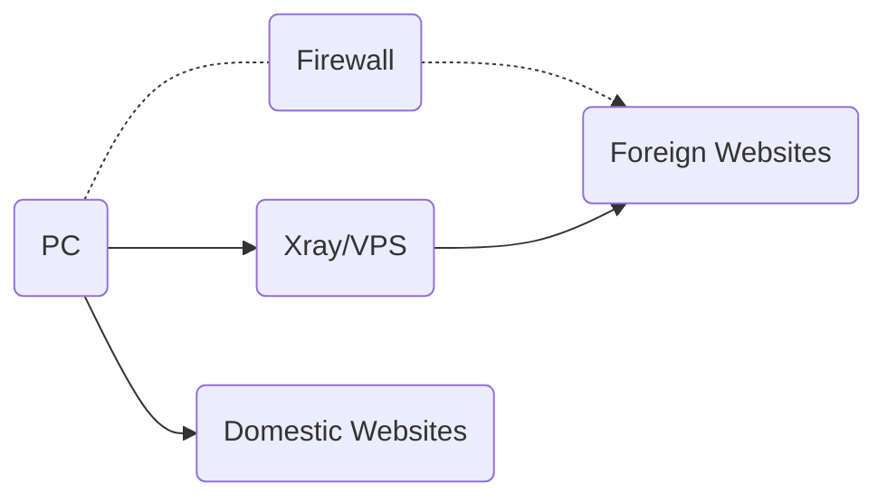
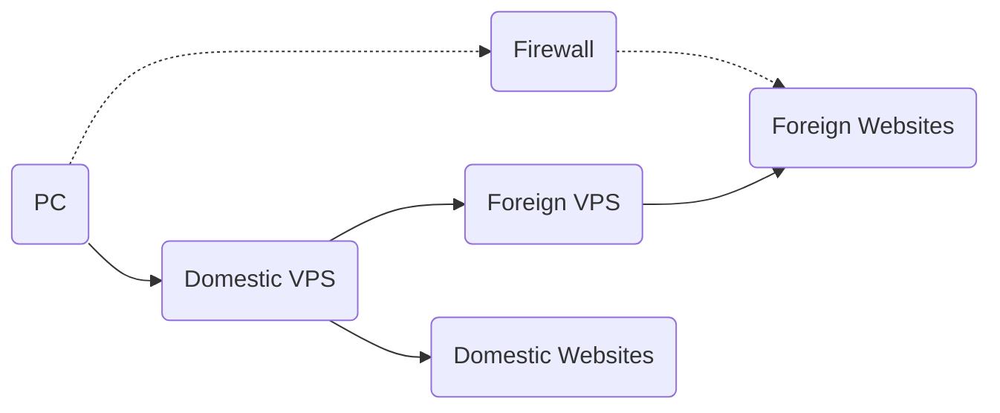
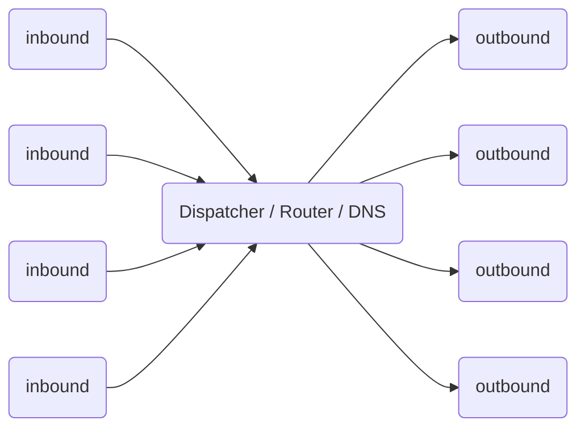

# Xray Working Modes

## Single Server Mode

Like other network proxy tools, you need a server configured with Xray. Then, install and configure the Xray client on your device to access the Internet smoothly.

A single Xray server can support multiple devices accessing via different proxy protocols simultaneously. Meanwhile, with reasonable configuration, Xray can identify and distinguish traffic that needs proxying from traffic that doesn't; direct traffic does not need to take a detour.

## Bridge Mode

If you don't want to configure routing on every single device, you can set up a relay (transit) server. This server receives all traffic sent from clients and then makes forwarding decisions within the server itself.

## Working Principle

Before configuring Xray, it is helpful to look at how Xray works. The following is a schematic diagram of the internal structure of a single Xray process. Multiple Xray instances are independent of each other and do not affect one another.

- You need to configure at least one **Inbound** and one **Outbound** connection for it to work properly.
  - **Inbound** connections are responsible for communicating with clients (such as browsers):
    - Inbound connections can usually be configured with user authentication, such as IDs and passwords.
    - After receiving data, the inbound connection hands it over to the **Dispatcher** for distribution.
  - **Outbound** connections are responsible for sending data to the destination, such as Xray on another host.
- When there are multiple outbound connections, you can configure **Routing** to specify that a certain category of traffic is sent via a specific outbound connection.
  - The Router will query DNS when necessary to obtain more information for decision-making.
