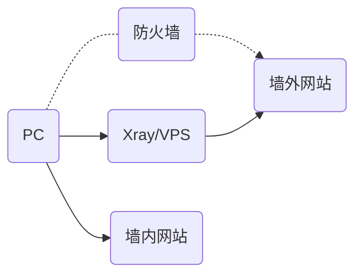
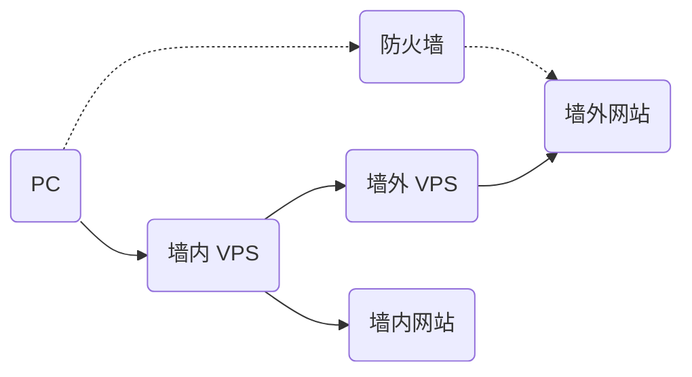

# Xray 的工作模式

## 单服务器模式

与其它的网络代理工具一样，你需要一台配置了 Xray 的服务器，然后在自己的设备上安装并配置 Xray 客户端，然后即可流畅地访问互联网。

一个 Xray 服务器可同时支持多台设备使用不同的代理协议访问。同时，经过合理的配置，Xray 可以识别并区分需要代理以及不需要代理的流量，直连的流量不需要绕路。

## 桥接模式

如果你不想在每一台设备上都配置路由，你也可以设置一台中转服务器，用于接收客户端发来的所有流量，然后在服务器中进行转发判断。

## 工作原理

在配置 Xray 之前，不妨先来看一下 Xray 的工作原理，以下是单个 Xray 进程的内部结构示意图。多个 Xray 之间相互独立，互不影响。

- 需要配置至少一个入站连接（Inbound）和一个出站连接（Outbound）才可以正常工作。
  - 入站连接负责与客户端（如浏览器）通信：
    - 入站连接通常可以配置用户认证，如 ID 和密码等；
    - 入站连接收到数据之后，会交给分发器（Dispatcher）进行分发；
  - 出站连接负责将数据发给服务器，如另一台主机上的 Xray。
- 当有多个出站连接时，可以配置路由（Routing）来指定某一类流量由某一个出站连接发出。
  - 路由会在必要时查询 DNS 以获取更多信息来进行判断。
