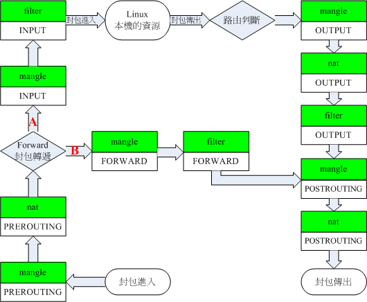

# Introduction to Transparent Proxy

## What is a Transparent Proxy?

Simply put, a transparent proxy means that the proxied device does not realize it is being proxied. In other words, no proxy software (such as Xray, V2RayNG, etc.) needs to be run on the proxied device itself. When you connect to the network, your device is automatically proxied.

This also implies that the proxy software is running elsewhere, for example, on a router. Devices accessing the Internet through this router are automatically proxied.

## Implementation of Transparent Proxy

There are two main ways to implement a transparent proxy:

### tun2socks

This can be implemented on Windows/Linux (including Android). Since the implementation process is relatively simple, there are few tutorials available. I will briefly describe it here.

**Windows**

1. Install **[Netch](https://github.com/NetchX/Netch/releases)** and start it using the mode `[3] [TUN/TAP] Bypass LAN`.

2. Enable the Mobile Hotspot.

3. Open `Control Panel` -> `Network and Internet` -> `Network and Sharing Center` -> `Change adapter settings`. Find `TAP-Windows Adapter` and `Microsoft Wi-Fi Direct Virtual Adapter`.

4. Right-click on `TAP-Windows Adapter`, select `Properties` -> `Sharing`. Check `Allow other network users to connect through this computer's Internet connection`. Under `Home networking connection`, select the network connection corresponding to the `Microsoft Wi-Fi Direct Virtual Adapter`, and click OK.

**Android**

1. Configure and connect V2RayNG.

2. Enable Hotspot.

3. Hotspot Settings -> Allow hotspot to use VPN (some Android systems may not have this option).

### iptables/nftables

The principle of implementing a transparent proxy with iptables and nftables is the same. The text below will unify the description using iptables.

Transparent proxy implementation based on iptables can only be used on Linux systems (including OpenWrt/Android). It is widely used because it is more efficient than tun2socks and is suitable for configuration in routers.

The three existing "Plain Language" transparent proxy tutorials are actually all based on this scheme. They are: **[New V2Ray Plain Guide - Transparent Proxy](https://guide.v2fly.org/app/transparent_proxy.html)**, **[New V2Ray Plain Guide - Transparent Proxy (TPROXY)](https://guide.v2fly.org/app/tproxy.html)**, and **[Transparent Proxy (TProxy) Configuration Tutorial](../tproxy.md)**. The first one is based on the iptables-redirect mode, which is obsolete and not recommended (for reference only). The second and third ones discuss transparent proxy implementation based on the iptables-tproxy mode.

## Principle of iptables-based Transparent Proxy

Linux uses `Netfilter` to manage the network. The `Netfilter` model is as follows:



**Assuming a router is used as the gateway (which is our usual way of accessing the Internet):**

Traffic direction for LAN devices accessing the Internet via the router:

`PREROUTING Chain -> FORWARD Chain -> POSTROUTING Chain`

Traffic direction for LAN devices accessing the router itself (e.g., logging into the router web UI / SSH connection to router / accessing the router's DNS server):

`PREROUTING Chain -> INPUT Chain -> Gateway Local Process`

Traffic direction for the router accessing the Internet:

`Gateway Local Process -> OUTPUT Chain -> POSTROUTING Chain`

**By using iptables to manipulate the traffic flow in the `PREROUTING Chain` and `OUTPUT Chain` and forwarding it to Xray, we can proxy both LAN devices and the gateway itself.**

## Where is the Difficulty?

The difficulty of transparent proxy lies in routing. Routing essentially means distinguishing which traffic should be direct and which should be proxied. Therefore, I personally think calling it **Traffic Splitting** is more appropriate.

We can divide routing into the following stages, from easy to difficult:

1. Proxy all requests.

2. Direct connection for local LAN IPs/Multicast IPs; proxy other requests.

3. Based on 2, direct connection for connection requests initiated by Xray itself.

4. Based on 3, direct connection for requests pointing to Mainland China IPs, and selecting domestic/foreign DNS servers for parsing domestic/foreign domains respectively.

The three tutorials mentioned above are all at the fourth stage. Therefore, it might seem a bit difficult for beginners to read directly.

## Implementing iptables-tproxy Transparent Proxy Step by Step from Scratch

### Before you start, you need some basic knowledge

1. Roughly know what TCP/IP protocol, domain names, and DNS servers are.

2. Know what WAN port, LAN port, LAN_IP, WAN_IP, and DHCP server are. For a "Side Router" (single-arm router), there is only one network port, which we call the LAN port here.

3. Have a basic understanding of the Linux system (know how to run commands).

4. Be able to hand-write client JSON configuration files, or at least understand them.

### Preparation Work

::: warning
Before starting operations, remember to use `sysctl -w net.ipv4.ip_forward=1` to enable Linux IPv4 packet forwarding.
:::
**1. Prepare a gateway running a Linux system**

For example, a router flashed with OpenWrt.

**2. Prepare the Xray executable and configuration file on the gateway (router)**

The configuration file should listen on port 12345 and enable tproxy:

```json
{
  "log": {
    "loglevel": "warning"
  },
  "inbounds": [
    {
      "port": 12345,
      "protocol": "dokodemo-door",
      "settings": {
        "network": "tcp,udp",
        "followRedirect": true
      },
      "streamSettings": {
        "sockopt": {
          "tproxy": "tproxy"
        }
      }
    }
  ],
  "outbounds": [
    {
      Your_Server_Configuration
    }
  ]
}
```

Moving from easy to difficult, we won't write `routing` for now, just one `inbound` and one `outbound`.

### First, let's try to achieve Stage 1

::: warning
If you cannot accept that your machine needs to be rebooted, it is best to start a virtual machine for practice first.
:::

Forward all traffic from the `PREROUTING Chain` to Xray.

Run Xray, and execute the following commands:

```bash
ip rule add fwmark 1 table 100
ip route add local 0.0.0.0/0 dev lo table 100
iptables -t mangle -N XRAY
iptables -t mangle -A XRAY -p tcp -j TPROXY --on-port 12345 --tproxy-mark 1
iptables -t mangle -A XRAY -p udp -j TPROXY --on-port 12345 --tproxy-mark 1
iptables -t mangle -A PREROUTING -j XRAY
```

After entering these commands, if you are connected to the gateway via SSH, you will find that the SSH connection is disconnected (don't panic, a power cycle will restore it), and the transparent proxy cannot access the Internet. If your gateway is a virtual machine, you will find that the gateway itself cannot access the Internet, and many requests with the source address as the destination address and the destination address as the WAN_IP appear in the Xray `access_log`.

Theoretically, the gateway's local access to the public network should only pass through the `OUTPUT Chain` and `POSTROUTING Chain`. Why does manipulating the `PREROUTING Chain` cause the gateway to lose Internet access? This is because network communication is often bidirectional. Although the gateway does not need to pass through the `PREROUTING Chain` to access a public IP, the information returned by the accessed server to the gateway must pass through the `PREROUTING Chain`. Since this part is forwarded to Xray, the reverse requests appear in the log.

Let's modify the rules to return (skip Xray) if the source IP is not from the LAN. Reboot the gateway, run Xray, and execute the following commands:

```bash
ip rule add fwmark 1 table 100
ip route add local 0.0.0.0/0 dev lo table 100
iptables -t mangle -N XRAY
# "Gateway_LAN_IP_Range" can be obtained by running "ip address | grep -w "inet" | awk '{print $2}'". Pick the correct one.
iptables -t mangle -A XRAY ! -s Gateway_LAN_IP_Range -j RETURN
iptables -t mangle -A XRAY -p tcp -j TPROXY --on-port 12345 --tproxy-mark 1
iptables -t mangle -A XRAY -p udp -j TPROXY --on-port 12345 --tproxy-mark 1
iptables -t mangle -A PREROUTING -j XRAY
```

Then you will find that although the SSH connection is disconnected, the transparent proxy is now available. As long as we change the system DNS to a public DNS, we can surf the Internet normally (because the gateway itself cannot be accessed now, setting the DNS to the gateway won't work).

At this point, Stage 1 is complete. The reason the gateway cannot be accessed is that the proxy rules cover _all_ traffic, including traffic accessing the gateway. Imagine trying to access your local gateway on a VPS; it certainly won't work. So, we need to make this part of the traffic direct. Please see Stage 2.

### Stage 2

Reboot the gateway, run Xray, and execute the following commands:

```bash
ip rule add fwmark 1 table 100
ip route add local 0.0.0.0/0 dev lo table 100
iptables -t mangle -N XRAY

# Direct connection for all requests where the destination address is in the gateway's subnet
# Obtained via "ip address | grep -w "inet" | awk '{print $2}'". Generally, there are multiple.
iptables -t mangle -A XRAY -d Gateway_Subnet_1 -j RETURN
iptables -t mangle -A XRAY -d Gateway_Subnet_2 -j RETURN
...

# Direct connection for Multicast IPs / Class E addresses / Broadcast IPs
iptables -t mangle -A XRAY -d 224.0.0.0/3 -j RETURN

iptables -t mangle -A XRAY -p tcp -j TPROXY --on-port 12345 --tproxy-mark 1
iptables -t mangle -A XRAY -p udp -j TPROXY --on-port 12345 --tproxy-mark 1
iptables -t mangle -A PREROUTING -j XRAY
```

After using this rule, the previous rule `iptables -t mangle -A XRAY ! -s Gateway_LAN_IP_Range -j RETURN` becomes redundant and can be removed.

At this point, Stage 2 is complete. The gateway is accessible, and SSH will not disconnect.

### Stage 3

The DNS we usually use generally comes from the router, but these iptables rules only proxy devices in the LAN and do not proxy the gateway itself. Thus, the returned DNS query results might be incorrect or polluted.

`iptables-tproxy` does not support operations on the `OUTPUT Chain`, but we can reroute packets from the `OUTPUT Chain` to the `PREROUTING Chain` by configuring `Policy Routing`.

```bash
# Add policy routing: Packets marked as 1 go to routing table 100
ip rule add fwmark 1 table 100
# Add route entry to table 100: All packets route to local
ip route add local 0.0.0.0/0 dev lo table 100
```

By configuring the above `Policy Routing`, we only need to mark packets with `1` in the `OUTPUT Chain`, and the corresponding packets will be routed to the local gateway, i.e., the `PREROUTING Chain`. So, we just need to mark requests from the gateway itself that need proxying with `1` on the `OUTPUT Chain`.

If we proxy all requests originating from the gateway, a problem arises: Xray runs on the gateway and sends requests to the proxy server. If this request is also proxied, a loop is formed.

Therefore, to proxy the gateway itself, we must avoid loops, which means avoiding Xray's own traffic in the proxy rules.

**There are three common methods:**

1. Direct connection for traffic destined for the VPS address

Reboot the gateway, run Xray, and execute the following commands:

```bash
# Proxy LAN devices
# Inherit results from the previous stage
ip rule add fwmark 1 table 100
ip route add local 0.0.0.0/0 dev lo table 100
iptables -t mangle -N XRAY
iptables -t mangle -A XRAY -d Gateway_Subnet_1 -j RETURN
iptables -t mangle -A XRAY -d Gateway_Subnet_2 -j RETURN
...
iptables -t mangle -A XRAY -d 224.0.0.0/3 -j RETURN
iptables -t mangle -A XRAY -p tcp -j TPROXY --on-port 12345 --tproxy-mark 1
iptables -t mangle -A XRAY -p udp -j TPROXY --on-port 12345 --tproxy-mark 1
iptables -t mangle -A PREROUTING -j XRAY

# Proxy the gateway itself
iptables -t mangle -N XRAY_MASK
iptables -t mangle -A XRAY_MASK -d Gateway_Subnet_1 -j RETURN
iptables -t mangle -A XRAY_MASK -d Gateway_Subnet_2 -j RETURN
...
iptables -t mangle -A XRAY_MASK -d 224.0.0.0/3 -j RETURN
iptables -t mangle -A XRAY_MASK -d VPS_Public_IP/32 -j RETURN
iptables -t mangle -A XRAY_MASK -j MARK --set-mark 1
iptables -t mangle -A OUTPUT -p tcp -j XRAY_MASK
iptables -t mangle -A OUTPUT -p udp -j XRAY_MASK
```

However, this configuration has a downside: if you use CDNs or many VPSs, writing rules becomes difficult.

1. Bypass via fwmark

The three "Plain Language" tutorials all use this method to avoid loops. Please refer to them; I won't repeat it here.

1. Bypass via GID (Recommended)

Refer to **[[Transparent Proxy] Bypassing Xray Traffic via GID](../iptables_gid.md)**.

This completes Stage 3 proxying, which is what we call Global Proxy. However, remember to set the gateway's DNS server to a foreign DNS server; otherwise, it may still return polluted results.

### Stage 4

In fact, not everyone needs to implement Stage 4. Global proxy is suitable for most situations.

Especially for "Side Routers" (Gateway Servers). When proxying is needed, set the device gateway to the Side Router's IP; when not needed, set the gateway back to the Main Router's IP.

As for the specific implementation of Stage 4, those three "Plain Language" tutorials cover it. After understanding the content above, reading those tutorials should be much easier.

### Proxying IPv6

The rules above only apply to IPv4. If you also want to proxy IPv6 requests, use the `ip6tables` command. The usage is basically the same as `iptables`. Refer to **[[Transparent Proxy] Bypassing Xray Traffic via GID#4-Set iptables rules](../iptables_gid#4-设置iptables规则.md)**.

# Other Notes on iptables Transparent Proxy

1. If the gateway acting as the proxy is the **Main Router**, you must add `iptables -t mangle -A XRAY ! -s Gateway_LAN_IP_Range -j RETURN` to the `PREROUTING Chain` rules. This is the command used in Stage 1 but removed in Stage 2. If you don't write this, other people in the same subnet on the WAN port can set their gateway to your WAN_IP, thereby leeching off your transparent proxy, which may also pose certain dangers.

2. **[New V2Ray Plain Guide - Transparent Proxy (TPROXY) #Set Gateway](https://guide.v2fly.org/app/tproxy.html#设置网关)**, item 3 states: `Manually configure the PC's network, pointing the default gateway to the Raspberry Pi's address, i.e., 192.168.1.22. At this time, the PC should be able to access the Internet normally (since no proxy is set yet, "normal" means accessing domestic websites).` In reality, on systems like Ubuntu, CentOS, Debian, etc., even if IP Forwarding is enabled, the PC cannot access the Internet normally. This is expected. Only OpenWrt can achieve what is described in the article. As pointed out by **[@BioniCosmos](https://github.com/BioniCosmos)**, this is because general Linux systems do not have Masquerade rules.

3. **[too many open files issue](https://guide.v2fly.org/app/tproxy.html#解决-too-many-open-files-问题)**. For the solution, see **[[Transparent Proxy] Bypassing Xray Traffic via GID - Config Max Open Files & Run Xray Client](../iptables_gid#3-配置最大文件大开数运行xray客户端)**.

4. Avoid double TPROXY for existing connections. To be added...

5. Main Router vs. Single-Arm Router vs. Side Router. To be added...
