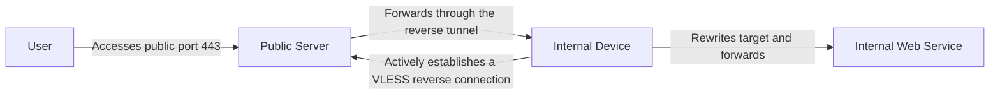
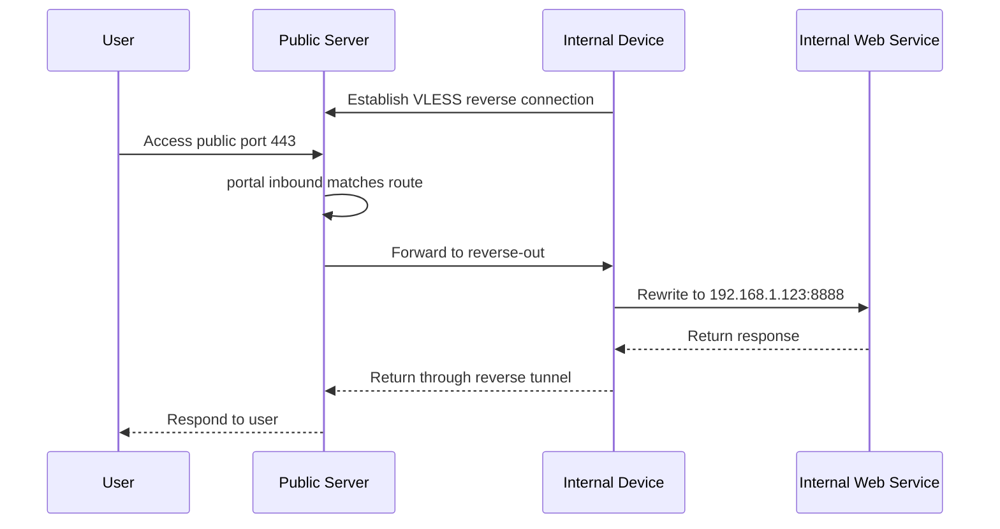
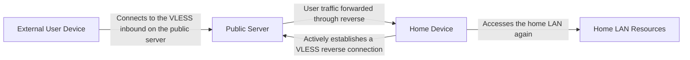
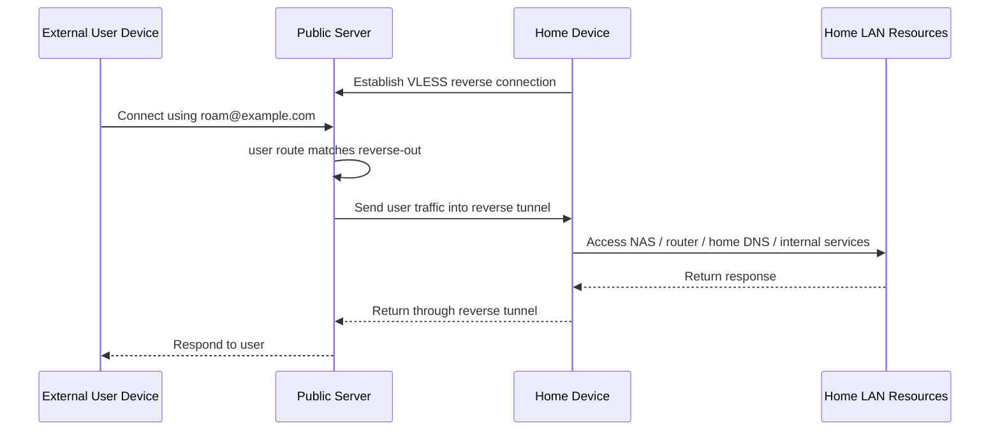

# VLESS Reverse Proxy Examples

This article demonstrates how to use Xray's VLESS reverse proxy capability to send traffic back into a remote private network through a public server. Two common use cases are covered here:

- `Ingress forwarding`: remote port mapping that maps a public entry port to a remote internal Web service;
- `Remote return home`: remote private-network roaming where a user relays through a public server and continues accessing resources inside the home network.

## Ingress Forwarding

Remote port mapping that maps a public entry port to a remote internal Web service.

### How It Works

There are three roles in this model:

- User: accesses the public entry point;
- Public server: receives traffic and hands it over to the reverse proxy tunnel;
- Internal device: actively establishes a connection to the public server and receives requests through the reverse tunnel.



In simple terms:

1. The internal device first initiates a connection to the public server.
2. The public server keeps this reverse tunnel open.
3. The user accesses port `443` on the public server.
4. The public server sends the request back to the internal device through the reverse tunnel.
5. The internal device rewrites the target to the actual Web service.

### Configuration Idea

There are two key points in VLESS reverse proxying:

- On the public side, declare `reverse.tag` for a VLESS client so it appears as a routable outbound;
- On the internal side, declare `reverse.tag` for a VLESS outbound so it actively establishes the reverse connection and appears locally as an inbound that can receive traffic.

The `reverse.tag` values on the two sides do not need to match. They are only local identifiers in their respective configurations. The actual correspondence is established by the reverse connection itself.

### Public Server Configuration

The example below does two things:

- It provides a VLESS inbound on port `8443`, where one `client` includes `reverse` and is therefore dedicated to establishing reverse connections for internal devices;
- It provides a `tunnel` inbound on port `443`, exposed externally as the Web service entry point, and forwards traffic received there into the reverse proxy tunnel.

At the same time, note that a `freedom` outbound must remain as a placeholder. Otherwise, if `outbounds` is empty, `reverse-out` will be treated as the default outbound, and traffic that does not match any routing rule may mistakenly enter the reverse proxy tunnel.

```json
{
  "inbounds": [
    {
      "listen": "0.0.0.0",
      "port": 8443,
      "protocol": "vless",
      "settings": {
        "decryption": "mlkem768x25519plus.native.600s.aCF82eKiK6g0DIbv0_nsjbHC4RyKCc9NRjl-X9lyi0k",
        "clients": [
          {
            "id": "ac04551d-6ebf-4685-86e2-17c12491f7f4",
            "flow": "xtls-rprx-vision",
            "reverse": {
              "tag": "reverse-out"
            }
          }
          // ... other normal clients
        ]
      }
    },
    {
      "listen": "0.0.0.0",
      "port": 443,
      "protocol": "tunnel",
      "tag": "portal"
    }
  ],
  "routing": {
    "rules": [
      {
        "inboundTag": ["portal"],
        "outboundTag": "reverse-out"
      }
    ]
  },
  "outbounds": [
    {
      "protocol": "freedom"
    }
  ]
}
```

### Internal Device Configuration

The job of the internal device is to connect out actively and establish the reverse tunnel. An extra routing rule is added here so that traffic entering through `reverse-in` is explicitly sent to a specific `freedom` outbound instead of relying entirely on the default outbound, because in practice the Xray instance on the internal side often also handles regular forward-proxy traffic.

The example keeps two `freedom` outbounds:

- One normal `freedom`, used as the default direct outbound;<br>
  (assuming you also need forward-proxying, those other parts of the configuration are omitted here)
- One tagged `freedom`, dedicated to handling traffic coming in from the reverse proxy inbound.

Assume your internal Web service listens on `192.168.1.123:8888`:

- You need to rewrite the destination address to this internal address on outbound;
- Because Xray has a default security policy, you also need to explicitly allow the target port in `finalRules`.

```json
{
  // Other forward-proxy-related configuration is omitted...
  "routing": {
    "rules": [
      {
        "inboundTag": ["reverse-in"],
        "outboundTag": "reverse-direct"
      }
    ]
  },
  "outbounds": [
    {
      "protocol": "freedom"
    },
    {
      "protocol": "freedom",
      "tag": "reverse-direct",
      "settings": {
        "redirect": "192.168.1.123:8888",
        "finalRules": [
          {
            "action": "allow",
            "network": "tcp",
            "ip": "192.168.1.123",
            "port": "8888"
          }
        ]
      }
    },
    {
      "protocol": "vless",
      "settings": {
        "address": "yourserver.com",
        "port": 8443,
        "encryption": "mlkem768x25519plus.native.0rtt.2PcBa3Yz0zBdt4p8-PkJMzx9hIj2Ve-UmrnmZRPnpRk",
        "id": "ac04551d-6ebf-4685-86e2-17c12491f7f4",
        "flow": "xtls-rprx-vision",
        "reverse": {
          "tag": "reverse-in"
        }
      }
    }
  ]
}
```

Points to note:

- On the public side, `reverse.tag` appears as an outbound;
- On the internal side, `reverse.tag` appears as an inbound;
- They do not need to share the same name, as long as they correspond through the same reverse connection `ac04551d...`;
- If you want finer control over traffic coming in through the reverse proxy on the internal side, you can explicitly specify which `freedom` outbound it should use in `routing`, as shown above.
- The internal side also supports `sniffing`, and if you configure `proxyProtocol` on `freedom`, your Web server can even see the real visitor IP. That topic is not expanded here.

### Request Flow



The meaning of this setup is very clear: the user perceives it as "accessing a Web service on the public server," while the requests are actually processed by the Web service on the remote internal device.

### Multiple Paths and Redundancy

An internal device can establish multiple reverse connections, for example through different networks, different uplinks, or different entry addresses to the public server. As long as the public side treats these connections as the same reverse proxy target, they can form redundant paths.

Benefits of this approach:

- If one path becomes temporarily unavailable, traffic can still go through the others;
- The public side does not need a separate routing design for each path;
- It is more convenient for link redundancy in private network penetration scenarios.

### Security Recommendations

- The public server should always keep an explicit default outbound. Depending on your needs, it can be `freedom`, `blackhole`, or something similar, so unmatched traffic does not accidentally enter the reverse proxy;
- The sample configuration focuses on explaining the mechanism. In a real public network environment, you will usually still want a more complete transport and camouflage setup.

## Remote Return Home

Remote private-network roaming where the user relays through a public server and returns to the home network to keep accessing resources.

### Scenario Description

This part is not about exposing a public port for external access. Instead, the user first connects to VLESS on the public server, then uses the already-established reverse tunnel to send that user's traffic back to the internal device at home for further handling.

This usage is closer to:

- Accessing home LAN resources while roaming outside;
- Sending a specific user's egress back through the home network;
- Relaying through a public server, then returning to the home network to access a NAS, router panel, home DNS, or other internal services.



### Configuration Idea

Compared with the first part, the biggest difference here is not the reverse connection itself, but the routing target on the public side:

- The first part uses `inboundTag -> reverse-out` to map a specific entry port back into the private network;
- The second part uses `user -> reverse-out` to hand a specific user's proxied traffic over to the internal device for continued processing.

In other words, the public server acts more like a relay station here. The user is not directly "accessing a service exposed through a public port mapping," but rather "first connecting to the VLESS inbound on the public server, then continuing from the device at home."

### Public Server Configuration

In this example:

- The first UUID is still used by the home device to establish the reverse connection;
- The second UUID is used by the external user to access the public server;
- Routing forwards that user's traffic to `reverse-out` based on `email`.

```json
{
  "inbounds": [
    {
      "listen": "0.0.0.0",
      "port": 8443,
      "protocol": "vless",
      "settings": {
        "decryption": "mlkem768x25519plus.native.600s.aCF82eKiK6g0DIbv0_nsjbHC4RyKCc9NRjl-X9lyi0k",
        "clients": [
          {
            "id": "ac04551d-6ebf-4685-86e2-17c12491f7f4",
            "flow": "xtls-rprx-vision",
            "reverse": {
              "tag": "reverse-out"
            }
          },
          {
            "id": "e8758aff-d830-4d08-a59e-271df65b995a",
            "flow": "xtls-rprx-vision",
            "email": "roam@example.com"
          }
        ]
      }
    }
  ],
  "routing": {
    "rules": [
      {
        "user": ["roam@example.com"],
        "outboundTag": "reverse-out"
      }
    ]
  },
  "outbounds": [
    {
      "protocol": "freedom"
    }
  ]
}
```

### Home Device Configuration

The home device still needs to connect to the public server proactively and establish the reverse tunnel. Unlike the first part, this time it does not rewrite all traffic to a fixed Web service. Instead, it hands all traffic arriving from `reverse-in` to the direct outbound at home for further handling.

The following example assumes:

- The home LAN subnet is `192.168.1.0/24`;
- The user device is already responsible for deciding which traffic needs to "go back home";
- The home device only takes over that traffic and passes it on to the home network for continued processing.

```json
{
  "routing": {
    "rules": [
      {
        "inboundTag": ["reverse-in"],
        "outboundTag": "home-direct"
      }
    ]
  },
  "outbounds": [
    {
      "protocol": "freedom"
    },
    {
      "protocol": "freedom",
      "tag": "home-direct",
      "settings": {
        "finalRules": [
          {
            "action": "allow",
            "network": "tcp,udp",
            "ip": ["192.168.1.0/24"]
          }
        ]
      }
    },
    {
      "protocol": "vless",
      "settings": {
        "address": "yourserver.com",
        "port": 8443,
        "encryption": "mlkem768x25519plus.native.0rtt.2PcBa3Yz0zBdt4p8-PkJMzx9hIj2Ve-UmrnmZRPnpRk",
        "id": "ac04551d-6ebf-4685-86e2-17c12491f7f4",
        "flow": "xtls-rprx-vision",
        "reverse": {
          "tag": "reverse-in"
        }
      }
    }
  ]
}
```

What these rules mean:

- Any traffic entering through `reverse-in` is sent to `home-direct`;
- Because Xray has a default security policy, you need `finalRules` to explicitly allow access to the home LAN. If you only want to access a NAS at home, it is recommended not to allow all IPs as shown in the example, but only the specific IPs and ports you actually need.

### User Device Configuration

On the user device side, it is generally not recommended to "send everything back home" by default. A more common approach is to send back only the traffic that needs access to home resources, while all other traffic continues to connect directly from the local network. The example below matches the home device configuration above. Assume:

- The user only wants to access the home subnet `192.168.1.0/24`;
- All other traffic continues to go out directly from the local network.

```json
{
  "routing": {
    "rules": [
      {
        "ip": ["192.168.1.0/24"],
        "outboundTag": "roam-home"
      }
    ]
  },
  "outbounds": [
    {
      "protocol": "freedom"
    },
    {
      "protocol": "vless",
      "tag": "roam-home",
      "settings": {
        "address": "yourserver.com",
        "port": 8443,
        "encryption": "mlkem768x25519plus.native.0rtt.2PcBa3Yz0zBdt4p8-PkJMzx9hIj2Ve-UmrnmZRPnpRk",
        "id": "e8758aff-d830-4d08-a59e-271df65b995a",
        "flow": "xtls-rprx-vision"
      }
    }
  ]
}
```

What these rules mean:

- Traffic destined for `192.168.1.0/24` goes through `roam-home`;
- Other traffic does not match any rule, so it continues through the default `freedom`, meaning a direct local connection.

To the user, this feels like "only the traffic for home resources is sent back home," rather than sending all internet traffic through the public server first and then relaying it back home.

### Request Flow



### How This Differs from the First Part

- The first part is "map a public entry port to a fixed service in a remote private network"; without extra authentication, anyone on the internet can access that service.
- The second part is "let a specific user first connect to the public Xray server, then use the reverse proxy to continue back home."
- The first part is more like remote port mapping, also known as private network penetration;
- The second part is more like remote roaming or lightweight cross-site networking.

### Security Recommendations

- If there are multiple roaming users, it is recommended that each user have an independent UUID or identifier;
- The sample configuration uses only VLESS-enc for simplicity. In real deployments, you may need REALITY, XHTTP, or similar traffic camouflage methods.

## Summary

VLESS reverse proxy can cover at least two types of scenarios:

- Map a public entry port to a fixed service inside a remote private network;
- Let users connect to a public server and then roam back home through the reverse tunnel.

Both use the same reverse connection mechanism. The main difference lies in how the public side routes the traffic and how the private side continues processing it. Once you understand that, you can freely extend the model between "port mapping" and "remote roaming" according to your own needs.

## Advanced Technique: Advanced Load Balancing

If multiple inbounds on the public side use the same reverse tag, they still end up producing only one outbound. You can think of this as multiple lines hanging off the same availability pool, with one live line chosen at random each time it is used.

This makes more flexible many-to-many setups possible. If one line is temporarily unavailable, for example because the corresponding internal device has not connected yet, it simply does not enter the current availability pool. Subsequent traffic is then forwarded automatically to other lines that are still online, with no manual switching required.

In other words, `reverse.tag` has the same "same tag means merge into one connection pool" semantics on both sides:

- Multiple clients on the public side that share the same `reverse-out` converge into one outbound pool;
- Multiple VLESS outbounds on the internal side that share the same `reverse-in` converge into one inbound pool.

So it naturally scales to N-to-N. A more common real deployment looks like this: externally there is only one service domain, for example `www.example.com`, and GeoDNS sends visitors to the nearest public server in Los Angeles or Tokyo. On the internal side, connections are established back to `us-reverse.example.com` and `jp-reverse.example.com`. Then deploy two internal devices, one at home and one in the office. Both home and office connect to both Los Angeles and Tokyo, so each public node maintains an availability pool of "home + office". During actual forwarding, one available line is selected at random from the currently established connections. If one endpoint goes offline, it disappears from the pool automatically.

Below is a minimal snippet that keeps only the reverse-related parts and continues using the "public entry port mapped to an internal service" style.

### Los Angeles Public Server

```json
{
  "inbounds": [
    {
      "port": 8443,
      "protocol": "vless",
      "settings": {
        "clients": [
          {
            "id": "us-home-uuid",
            "reverse": {
              "tag": "reverse-out"
            }
          },
          {
            "id": "us-office-uuid",
            "reverse": {
              "tag": "reverse-out"
            }
          }
        ]
      }
    },
    {
      "port": 443,
      "protocol": "tunnel",
      "tag": "portal"
    }
  ],
  "routing": {
    "rules": [
      {
        "inboundTag": ["portal"],
        "outboundTag": "reverse-out"
      }
    ]
  },
  "outbounds": [
    {
      "protocol": "freedom"
    }
  ]
}
```

### Tokyo Public Server

Exactly the same idea, except that the UUIDs are changed to `jp-home-uuid` and `jp-office-uuid`.

### Home Internal Device

```json
{
  "routing": {
    "rules": [
      {
        "inboundTag": ["reverse-in"],
        "outboundTag": "reverse-direct"
      }
    ]
  },
  "outbounds": [
    {
      "protocol": "freedom",
      "tag": "reverse-direct",
      "settings": {
        "redirect": "192.168.1.123:80",
        "finalRules": [
          {
            "action": "allow",
            "network": "tcp",
            "ip": "192.168.1.123",
            "port": "80"
          }
        ]
      }
    },
    {
      "protocol": "vless",
      "settings": {
        "address": "us-reverse.example.com",
        "port": 8443,
        "id": "us-home-uuid",
        "reverse": {
          "tag": "reverse-in"
        }
      }
    },
    {
      "protocol": "vless",
      "settings": {
        "address": "jp-reverse.example.com",
        "port": 8443,
        "id": "jp-home-uuid",
        "reverse": {
          "tag": "reverse-in"
        }
      }
    }
  ]
}
```

### Office Internal Device

Exactly the same as the home internal device, except that the UUIDs are changed to `us-office-uuid` and `jp-office-uuid`, and `redirect` is changed to the internal service that the office side should expose.

## Advanced Technique: Preserve the Real Visitor IP

If you want the internal Web service to see the real visitor IP instead of identifying the source as the internal-side Xray machine, you can enable `proxyProtocol` on the internal-side `freedom` outbound. If it is not enabled, the backend Web server usually sees the source address of the internal-side Xray machine. If it is enabled, Xray sends a PROXY protocol header first when forwarding the connection to the backend specified by `redirect`, so that the real source address is passed along to the Web server.

For example:

```json
{
  "outbounds": [
    {
      "protocol": "freedom",
      "tag": "reverse-direct",
      "settings": {
        "redirect": "192.168.1.123:80",
        "proxyProtocol": 1,
        "finalRules": [
          {
            "action": "allow",
            "network": "tcp",
            "ip": "192.168.1.123",
            "port": "80"
          }
        ]
      }
    }
  ]
}
```

In that case, the backend pointed to by `redirect` cannot just be an ordinary HTTP listener. It must explicitly enable PROXY protocol as well. Suppose the Web server is `192.168.1.123` and the internal-side Xray address is `192.168.1.10`. With `nginx`, for example, it can be configured like this:

```nginx
server {
    listen 80 proxy_protocol;
    server_name _;

    set_real_ip_from 192.168.1.10;
    real_ip_header proxy_protocol;

    location / {
        root /srv/www/html;
        index index.html;
    }
}
```

The `set_real_ip_from 192.168.1.10;` line above means that only the PROXY protocol header sent by the internal-side Xray is trusted. `192.168.1.10` here is only an example; replace it with the actual IP of your internal Xray machine. `proxyProtocol` can be either `1` or `2`. As long as the backend supports it, the `nginx` side configuration remains the same.

## Advanced Technique: Fine-Grained Routing by Domain and Visitor IP on the Internal Side

If you want external users to reach more than one internal site and those sites are not all on the same machine, you can enable `sniffing` directly on the reverse proxy entry, extract the domain name from the HTTP Host or TLS SNI, and then route traffic by domain to different `freedom` outbounds. This way the public side keeps only one entry, while the internal side can still fan traffic out to different hosts by site.

At the same time, the VLESS reverse proxy preserves the real visitor source IP. Once the traffic enters the internal-side routing system, you can continue using `sourceIP` for finer control, for example sending some sources directly to `blackhole`, or steering specific sources to another backend group. Here is a combined example:

```json
{
  "routing": {
    "domainStrategy": "AsIs",
    "rules": [
      {
        "inboundTag": ["reverse-in"],
        "sourceIP": ["!geoip:cn"],
        "outboundTag": "reverse-block"
      },
      {
        "inboundTag": ["reverse-in"],
        "domain": ["full:admin.example.com"],
        "outboundTag": "reverse-admin"
      },
      {
        "inboundTag": ["reverse-in"],
        "domain": ["domain:blog.example.com"],
        "outboundTag": "reverse-blog"
      },
      {
        "inboundTag": ["reverse-in"],
        "outboundTag": "reverse-default"
      }
    ]
  },
  "outbounds": [
    {
      "protocol": "freedom"
    },
    {
      "protocol": "blackhole",
      "tag": "reverse-block"
    },
    {
      "protocol": "freedom",
      "tag": "reverse-admin",
      "settings": {
        "redirect": "192.168.1.10:8443",
        "proxyProtocol": 1,
        "finalRules": [
          {
            "action": "allow",
            "network": "tcp",
            "ip": "192.168.1.10",
            "port": "8443"
          }
        ]
      }
    },
    {
      "protocol": "freedom",
      "tag": "reverse-blog",
      "settings": {
        "redirect": "192.168.1.20:8080",
        "proxyProtocol": 1,
        "finalRules": [
          {
            "action": "allow",
            "network": "tcp",
            "ip": "192.168.1.20",
            "port": "8080"
          }
        ]
      }
    },
    {
      "protocol": "freedom",
      "tag": "reverse-default",
      "settings": {
        "redirect": "192.168.1.30:80",
        "proxyProtocol": 1,
        "finalRules": [
          {
            "action": "allow",
            "network": "tcp",
            "ip": "192.168.1.30",
            "port": "80"
          }
        ]
      }
    },
    {
      "protocol": "vless",
      "settings": {
        "address": "yourserver.com",
        "port": 8443,
        "id": "ac04551d-6ebf-4685-86e2-17c12491f7f4",
        "flow": "xtls-rprx-vision",
        "reverse": {
          "tag": "reverse-in",
          "sniffing": {
            "enabled": true,
            "destOverride": ["http", "tls"]
          }
        }
      }
    }
  ]
}
```

The key points of this example are:

- `reverse.sniffing` is enabled under `reverse` on the internal-side VLESS outbound, which means sniffing is performed on connections entering from the reverse proxy entry;
- Routing rules are evaluated in order, so restrictive rules like `sourceIP -> blackhole` should be placed first;
- `proxyProtocol` is only used to pass the real visitor IP further to the backend application. If you only want to route inside Xray by `sourceIP`, you can leave it disabled.

With this setup, one public entry can serve multiple internal sites, and the internal side can still perform more flexible rejection, steering, and auditing based on the visitor source address.

## Security Notes

The following points are more about deployment safety and boundary control. It is recommended to read through them before using this in production:

- A UUID used for reverse proxying cannot be shared with normal forward proxy clients. It must be created separately. Also, reverse proxy UUIDs should be protected carefully. Once a client configuration leaks, an attacker may try to hijack your reverse proxy tunnel.
- For the connection used in private network penetration, even if `XTLS Vision` is enabled, the current practical benefits are still mainly things like `padding`. It is not the same as the commonly discussed "direct exposure" effect. Whether the connection facing end users should also enable XTLS depends on your actual link structure and threat model.
- The internal `freedom` outbound that receives reverse proxy traffic, often called the `direct` outbound, should be configured according to the principle of least privilege. Set the default outbound to `blackhole`, only route explicitly allowed targets to a dedicated `freedom`, and then use `finalRules` to allow only the necessary addresses and ports.
- If you are using a penetration service provided by someone else for remote access home, or if you do not fully trust the public VPS, it is recommended not to let reverse proxy traffic land directly on your real internal services. Instead, deploy another server on the internal side with `VLESS Encryption` enabled specifically to receive that traffic, and let it forward traffic to the actual service. This adds authentication and data protection; otherwise anyone with sufficient access to the public server may be able to roam through your internal network.
- When traffic is delivered to the internal side through inbound protocols such as `VLESS`, the protocol shown by `Source` or `Local` in the routing system is not necessarily the same as the final `Target`. When using conditions such as `source`, `local`, or `network`, rely on the actual traffic shape instead of assuming they are all equivalent.
- HTTP-based inbounds such as `XHTTP` and `WebSocket` currently read `X-Forwarded-For` by default. If there is no HTTP reverse proxy in front that you trust, the header can be forged by the client. Therefore, do not use it directly for strict security decisions such as IP whitelists, blacklists, or audit attribution.
