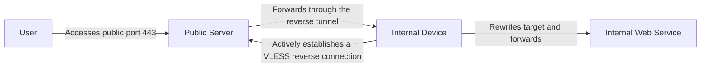
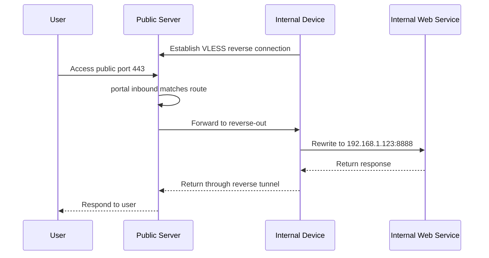
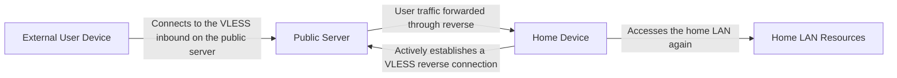
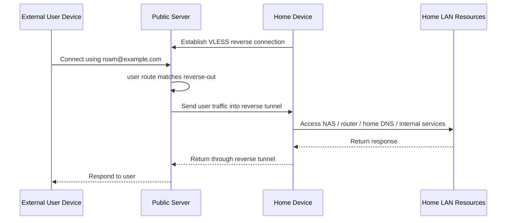

# VLESS Reverse Proxy Examples

This article demonstrates how to use Xray's VLESS reverse proxy capability to send traffic back into a private network through a public server. Two common use cases are covered here:

- `Ingress forwarding`: map a public entry port to an internal Web service;
- `Remote return home`: let a user relay through a public server and continue accessing resources inside the home network.

## Ingress Forwarding

Map a public entry port to an internal Web service.

### How It Works

There are three roles in this model:

- User: accesses the public entry point;
- Public server: receives traffic and hands it over to the reverse proxy tunnel;
- Internal device: actively establishes a connection to the public server and receives requests through the reverse tunnel.



In simple terms:

1. The internal device first initiates a connection to the public server.
2. The public server keeps this reverse tunnel open.
3. The user accesses port `443` on the public server.
4. The public server sends the request back to the internal device through the reverse tunnel.
5. The internal device rewrites the target to the actual Web service.

### Configuration Idea

There are two key points in VLESS reverse proxying:

- On the public side, declare `reverse.tag` for a VLESS client so it appears as a routable outbound;
- On the internal side, declare `reverse.tag` for a VLESS outbound so it actively establishes the reverse connection and appears locally as an inbound that can receive traffic.

The `reverse.tag` values on the two sides do not need to match. They are only local identifiers in their respective configurations. The actual correspondence is established by the reverse connection itself.

### Public Server Configuration

The example below does two things:

- It provides a VLESS inbound on port `8443`, where one `client` includes `reverse` and is therefore dedicated to establishing reverse connections for internal devices;
- It provides a `tunnel` inbound on port `443`, exposed externally as the Web service entry point, and forwards traffic received there into the reverse proxy tunnel.

At the same time, note that a `freedom` outbound must remain as a placeholder. Otherwise, if `outbounds` is empty, `reverse-out` will be treated as the default outbound, and traffic that does not match any routing rule may mistakenly enter the reverse proxy tunnel.

```json
{
  "inbounds": [
    {
      "listen": "0.0.0.0",
      "port": 8443,
      "protocol": "vless",
      "settings": {
        "decryption": "mlkem768x25519plus.native.600s.aCF82eKiK6g0DIbv0_nsjbHC4RyKCc9NRjl-X9lyi0k",
        "clients": [
          {
            "id": "ac04551d-6ebf-4685-86e2-17c12491f7f4",
            "flow": "xtls-rprx-vision",
            "reverse": {
              "tag": "reverse-out"
            }
          }
          // ... other normal clients
        ]
      }
    },
    {
      "listen": "0.0.0.0",
      "port": 443,
      "protocol": "tunnel",
      "tag": "portal"
    }
  ],
  "routing": {
    "rules": [
      {
        "inboundTag": ["portal"],
        "outboundTag": "reverse-out"
      }
    ]
  },
  "outbounds": [
    {
      "protocol": "freedom"
    }
  ]
}
```

### Internal Device Configuration

The job of the internal device is to connect out actively and establish the reverse tunnel. An extra routing rule is added here so that traffic entering through `reverse-in` is explicitly sent to a specific `freedom` outbound instead of relying entirely on the default outbound, because in practice your internal Xray often also handles daily proxying or circumvention traffic.

The example keeps two `freedom` outbounds:

- One normal `freedom`, used as the default direct outbound<br>
  (assuming you also need circumvention traffic, that part of the configuration is omitted here);
- One tagged `freedom`, dedicated to handling traffic coming in from the reverse proxy inbound.

Assume your internal Web service listens on `192.168.1.123:8888`:

- You need to rewrite the destination address to this internal address on outbound;
- Because Xray has a default security policy, you also need to explicitly allow the target port in `finalRules`.

```json
{
  "routing": {
    "rules": [
      {
        "inboundTag": ["reverse-in"],
        "outboundTag": "reverse-direct"
      }
    ]
  },
  "outbounds": [
    {
      "protocol": "freedom"
    },
    {
      "protocol": "freedom",
      "tag": "reverse-direct",
      "settings": {
        "redirect": "192.168.1.123:8888",
        "finalRules": [
          {
            "action": "allow",
            "network": "tcp",
            "ip": "192.168.1.123",
            "port": "8888"
          }
        ]
      }
    },
    {
      "protocol": "vless",
      "settings": {
        "address": "yourserver.com",
        "port": 8443,
        "encryption": "mlkem768x25519plus.native.0rtt.2PcBa3Yz0zBdt4p8-PkJMzx9hIj2Ve-UmrnmZRPnpRk",
        "id": "ac04551d-6ebf-4685-86e2-17c12491f7f4",
        "flow": "xtls-rprx-vision",
        "reverse": {
          "tag": "reverse-in"
        }
      }
    }
  ]
}
```

Points to note:

- On the public side, `reverse.tag` appears as an outbound;
- On the internal side, `reverse.tag` appears as an inbound;
- They do not need to share the same name, as long as they correspond through the same reverse connection;
- If you want finer control over traffic coming in through the reverse proxy on the internal side, you can explicitly specify which `freedom` outbound it should use in `routing`, as shown above.

### Request Flow



The meaning of this setup is very clear: the user perceives it as "accessing a Web service on the public server," while the requests are actually processed by the Web service on the internal device.

### Multiple Paths and Redundancy

An internal device can establish multiple reverse connections, for example through different networks, different uplinks, or different entry addresses to the public server. As long as the public side treats these connections as the same reverse proxy target, they can form redundant paths.

Benefits of this approach:

- If one path becomes temporarily unavailable, traffic can still go through the others;
- The public side does not need a separate routing design for each path;
- It is more convenient for link redundancy in private network penetration scenarios.

### Security Recommendations

- The UUID used to establish reverse connections should preferably not be shared with regular users;
- The public server should always keep an explicit default outbound to prevent unmatched traffic from accidentally entering the reverse proxy;
- The sample configuration focuses on explaining the mechanism. In a real public network environment, you will usually still want a more complete transport and camouflage setup.

## Remote Return Home

The user relays through a public server and returns to the home network to keep accessing resources.

### Scenario Description

This part is not about exposing a public port for external access. Instead, the user first connects to VLESS on the public server, then uses the already-established reverse tunnel to send that user's traffic back to the internal device at home for further handling.

This usage is closer to:

- Accessing home LAN resources while roaming outside;
- Sending a specific user's egress back through the home network;
- Relaying through a public server, then returning to the home network to access a NAS, router panel, home DNS, or other internal services.



### Configuration Idea

Compared with the first part, the biggest difference here is not the reverse connection itself, but the routing target on the public side:

- The first part uses `inboundTag -> reverse-out` to map a specific entry port back into the private network;
- The second part uses `user -> reverse-out` to hand a specific user's proxied traffic over to the internal device for continued processing.

In other words, the public server acts more like a relay station here. The user is not directly "accessing a service exposed through a public port mapping," but rather "first connecting to the VLESS inbound on the public server, then continuing from the device at home."

### Public Server Configuration

In this example:

- The first UUID is still used by the home device to establish the reverse connection;
- The second UUID is used by the external user to access the public server;
- Routing forwards that user's traffic to `reverse-out` based on `email`.

```json
{
  "inbounds": [
    {
      "listen": "0.0.0.0",
      "port": 8443,
      "protocol": "vless",
      "settings": {
        "decryption": "mlkem768x25519plus.native.600s.aCF82eKiK6g0DIbv0_nsjbHC4RyKCc9NRjl-X9lyi0k",
        "clients": [
          {
            "id": "ac04551d-6ebf-4685-86e2-17c12491f7f4",
            "flow": "xtls-rprx-vision",
            "reverse": {
              "tag": "reverse-out"
            }
          },
          {
            "id": "e8758aff-d830-4d08-a59e-271df65b995a",
            "flow": "xtls-rprx-vision",
            "email": "roam@example.com"
          }
        ]
      }
    }
  ],
  "routing": {
    "rules": [
      {
        "user": ["roam@example.com"],
        "outboundTag": "reverse-out"
      }
    ]
  },
  "outbounds": [
    {
      "protocol": "freedom"
    }
  ]
}
```

### Home Device Configuration

The home device still needs to connect to the public server proactively and establish the reverse tunnel. Unlike the first part, this time it does not rewrite all traffic to a fixed Web service. Instead, it hands all traffic arriving from `reverse-in` to the default direct outbound at home for further handling.

The following example assumes:

- The home LAN subnet is `192.168.1.0/24`;
- The user device is already responsible for deciding which traffic needs to "go back home";
- The home device only takes over that traffic and passes it on to the home network for continued processing.

```json
{
  "routing": {
    "rules": [
      {
        "inboundTag": ["reverse-in"],
        "outboundTag": "home-direct"
      }
    ]
  },
  "outbounds": [
    {
      "protocol": "freedom"
    },
    {
      "protocol": "freedom",
      "tag": "home-direct",
      "settings": {
        "finalRules": [
          {
            "action": "allow",
            "network": "tcp,udp",
            "ip": ["192.168.1.0/24"]
          }
        ]
      }
    },
    {
      "protocol": "vless",
      "settings": {
        "address": "yourserver.com",
        "port": 8443,
        "encryption": "mlkem768x25519plus.native.0rtt.2PcBa3Yz0zBdt4p8-PkJMzx9hIj2Ve-UmrnmZRPnpRk",
        "id": "ac04551d-6ebf-4685-86e2-17c12491f7f4",
        "flow": "xtls-rprx-vision",
        "reverse": {
          "tag": "reverse-in"
        }
      }
    }
  ]
}
```

What these rules mean:

- Any traffic entering through `reverse-in` is sent to `home-direct`;
- Because Xray has a default security policy, you need `finalRules` to explicitly allow access to the home LAN. If you only want to access a NAS at home, it is recommended not to allow all IPs as shown in the example, but only the specific IPs and ports you actually need.

### User Device Configuration

On the user device side, it is generally not recommended to "send everything back home" by default. A more common approach is to send back only the traffic that needs access to home resources, while all other traffic continues to connect directly from the local network. The example below matches the home device configuration above. Assume:

- The user only wants to access the home subnet `192.168.1.0/24`;
- All other traffic continues to go out directly from the local network.

```json
{
  "routing": {
    "rules": [
      {
        "ip": ["192.168.1.0/24"],
        "outboundTag": "roam-home"
      }
    ]
  },
  "outbounds": [
    {
      "protocol": "freedom"
    },
    {
      "protocol": "vless",
      "tag": "roam-home",
      "settings": {
        "address": "yourserver.com",
        "port": 8443,
        "encryption": "mlkem768x25519plus.native.0rtt.2PcBa3Yz0zBdt4p8-PkJMzx9hIj2Ve-UmrnmZRPnpRk",
        "id": "e8758aff-d830-4d08-a59e-271df65b995a",
        "flow": "xtls-rprx-vision"
      }
    }
  ]
}
```

What these rules mean:

- Traffic destined for `192.168.1.0/24` goes through `roam-home`;
- Other traffic does not match any rule, so it continues through the default `freedom`, meaning a direct local connection.

To the user, this feels like "only the traffic for home resources is sent back home," rather than sending all internet traffic through the public server first and then relaying it back home.

### Request Flow



### How This Differs from the First Part

- The first part is "map a public entry port to a fixed internal service"; anyone on the internet can access that service.
- The second part is "let a specific user first connect to the public Xray server, then use the reverse proxy to continue back home."
- The first part is more like private network penetration;
- The second part is more like remote roaming or lightweight networking.

### Security Recommendations

- The UUID used for the reverse connection and the UUIDs used by regular users must be separated;
- If there are multiple roaming users, it is recommended that each user have an independent UUID or identifier;
- The sample configuration uses only VLESS-enc for simplicity. In real deployments, you may need REALITY, XHTTP, or similar traffic camouflage methods.

## Summary

VLESS reverse proxy can cover at least two types of scenarios:

- Map a public entry port to a fixed service inside the private network;
- Let users connect to a public server and then roam back home through the reverse tunnel.

Both use the same reverse connection mechanism. The main difference lies in how the public side routes the traffic and how the private side continues processing it. Once you understand that, you can freely extend the model between "port mapping" and "remote roaming" according to your own needs.
