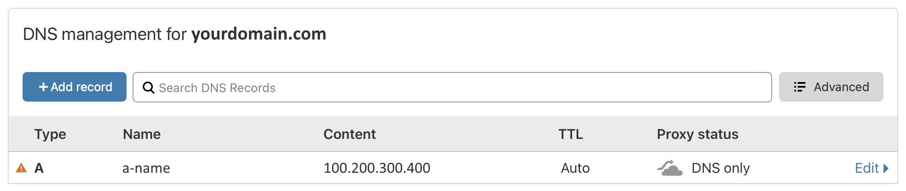

# 【Глава 2】 Подготовка

Эта глава особенная, поскольку затрагивает финансовые операции. В соответствии с нейтральной позицией проекта, здесь не будет конкретных рекомендаций. Всё, что я могу сделать, — это рассказать, что вам понадобится.

## 2.1 Приобретение VPS

Вам нужно получить работающий VPS с не заблокированным IP-адресом и выполнить следующие базовые действия в панели управления:

1. Установить на VPS операционную систему Debian 10 64-bit.
2. Записать IP-адрес VPS (в этой статье он будет обозначаться как `"100.200.300.400"`).
   ::: tip
   Это **неверный** IP-адрес, используемый только в качестве примера. Не забудьте заменить его на свой реальный IP-адрес.
   :::
3. Записать порт (Port) SSH для удалённого подключения к VPS.
4. Записать имя пользователя и пароль для удалённого подключения по SSH.

Выбор и покупка VPS — дело непростое. Рекомендуем сначала изучить этот вопрос и выбрать тариф, который соответствует вашим финансовым возможностям и требованиям к скорости и качеству связи.  Также можно воспользоваться бесплатными (постоянными или временными) предложениями от крупных облачных провайдеров, таких как Oracle Cloud и Google Cloud. Главное — не влезайте в долги.

::: tip Пояснение
Несколько слов о выборе Debian 10 в качестве операционной системы. Что бы вы ни слышали в интернете, какой бы дистрибутив Linux ни советовали вам гуру, все эти споры о том, какой Linux лучше, **не имеют к вам никакого отношения**! Debian 10 — это надёжная и стабильная операционная система, которая отлично подходит для работы VPN-сервера и достаточно оптимизирована (например, имеет специальное ядро для облачных сред и своевременную поддержку BBR). Когда вы освоитесь с Linux, можете попробовать и другие дистрибутивы.
:::

## 2.2 Выбор доменного имени

Вам нужно получить доменное имя и добавить A-запись, указывающую на IP-адрес вашего VPS, в настройках DNS.

1. Выберите надёжного международного регистратора доменных имён. Доменная зона (расширение домена) может быть любой, главное — не используйте `.cn`.
2. В настройках DNS добавьте A-запись, указывающую на IP-адрес вашего VPS (имя A-записи может быть любым, в этой статье оно будет обозначаться как `"a-name"`. Полное доменное имя будет выглядеть как `"a-name.yourdomain.com"`). Должно получиться примерно так:

::: tip
Это **не** настоящий URL-адрес. Не забудьте заменить его на свой реальный адрес.
:::

## 2.3 Необходимое программное обеспечение

1. SSH-клиент для удалённого подключения:

   - Windows: [PuTTY](https://www.chiark.greenend.org.uk/~sgtatham/putty/latest.html)
   - macOS/Linux: Terminal

2. Программа для передачи файлов:

   - Windows: [WinSCP](https://winscp.net/eng/index.php)
   - macOS/Linux: Terminal

3. Хороший текстовый редактор:
   - Windows/macOS/Linux: [VSCode](https://code.visualstudio.com)

## 2.4 Ваш прогресс

Если вы выполнили все пункты из этого раздела, у вас уже есть всё необходимое, чтобы открыть для себя новый мир. Так чего же мы ждём? Давайте перейдём к следующей главе и сделаем это!

> ⬛⬛⬜⬜⬜⬜⬜⬜ 25%

