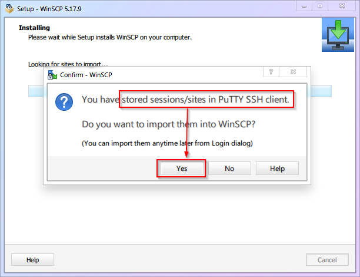

# 【Глава 4】 Обеспечение безопасности

## 4.1 Зачем нужна безопасность?

Безопасность Linux-серверов — это обширная и сложная тема. Бесчисленные веб-сайты, приложения, сервисы и даже критически важная инфраструктура построены на базе Linux. За всем этим стоят огромные деньги и коммерческие интересы, что, естественно, привлекает злоумышленников.  В то же время надёжная работа этих сервисов крайне важна, поэтому любые серьёзные уязвимости недопустимы.  Именно поэтому множество специалистов по безопасности изо дня в день ведут борьбу на передовой, обеспечивая стабильную работу цифрового мира, к которому мы все привыкли.

Теперь, когда у вас есть собственный VPS-сервер, и вы собираетесь открыть на нём порты для перенаправления трафика, вы фактически оказываетесь на передовой этой борьбы и подвергаетесь тем же рискам.  В то же время, новички, не обладающие достаточными знаниями и информацией, склонны впадать в крайности: либо они считают, что им ничего не угрожает, либо же, наоборот, впадают в паранойю.

- Первым я бы посоветовал не относиться к безопасности легкомысленно и изучить этот вопрос более подробно, чтобы потом не пришлось кусать локти.

- Вторым я бы посоветовал не паниковать. Ваш сервер вряд ли представляет собой лакомую цель для серьёзных злоумышленников, поэтому вам достаточно базовых мер защиты от автоматических сканеров и ботов, о которых мы и поговорим в этой главе.

## 4.2 Какие именно риски существуют?

Как мы уже говорили в главе про удалённое подключение, для доступа к вашему VPS достаточно знать четыре вещи: **IP-адрес**, **порт**, **имя пользователя** и **пароль**. Очевидно, что эти четыре элемента нужно защищать в первую очередь.  Давайте разберём каждый из них:

1. **IP-адрес**: злоумышленники могут сканировать целые диапазоны IP-адресов в поисках уязвимых серверов.  Ваш IP-адрес — это публичная информация, которую невозможно скрыть.

2. **Порт**: если вы используете настройки по умолчанию, то порт SSH равен `22`.

3. **Имя пользователя**: если вы используете настройки по умолчанию, то имя пользователя — `root`.

4. **Пароль**: пароль не имеет значения по умолчанию. Он либо генерируется автоматически при создании VPS, либо задаётся вами.  Таким образом, если вы не меняли настройки сервера, то три из четырёх элементов уже известны злоумышленникам, и вся безопасность вашего сервера держится на одном только пароле.  Возможны следующие варианты:

   - Вы используете автоматически сгенерированный пароль из панели управления VPS.  Такие пароли обычно состоят из случайного набора символов (букв в разных регистрах, цифр и спецсимволов) и достаточно надёжны.

   - Вы установили простой пароль, например, `123456`.  Взломать такой сервер не составит труда.

   - Вы установили сложный пароль, который используете где-то ещё.  Это тоже небезопасно.  Злоумышленники используют специальные программы, которые перебирают миллионы ранее скомпрометированных паролей из утечек данных.

5. Важно понимать, что никакой хакер не будет лично подбирать ваш пароль.  Все атаки выполняются автоматически с помощью специальных скриптов, которые работают круглосуточно.  Пока вы спите, ваш сервер может подвергаться атакам.

   Если пароль будет подобран, злоумышленники получат полный доступ к вашему серверу (права пользователя `root`), смогут установить на него вредоносное ПО и использовать его в своих целях (например, для майнинга криптовалюты, рассылки спама, фишинговых атак, организации торрент-трекера, размещения публичных узлов для доступа к даркнету и т.д.).  При этом злоумышленники могут действовать очень скрытно, и вы даже не заметите, что ваш сервер взломан, пока не получите уведомление от хостинг-провайдера о блокировке вашего аккаунта или, что ещё хуже, повестку в суд.

6. Не забывайте, что при покупке VPS вы, скорее всего, указывали свои реальные платёжные данные.  А при посещении сайтов и использовании социальных сетей ваш IP-адрес также сохраняется.  Всё это может быть использовано против вас.  **Поэтому, если на вашем сервере произойдёт что-то противозаконное, отвечать за это придётся вам.**

## 4.3 Какие меры безопасности нужно предпринять?

Исходя из всего вышесказанного, нам нужно защитить **порт**, **имя пользователя** и **пароль**, чтобы снизить риск взлома.  Для этого необходимо:

1. Изменить порт SSH на **нестандартный** (отличный от 22) (см. раздел 4.4).
2. Создать **нового пользователя** (не `root`) и **запретить удалённое подключение по SSH** для пользователя `root` (см. разделы 4.5 и 4.6).
3. Настроить **аутентификацию по SSH-ключам** и **запретить аутентификацию по паролю** (см. раздел 4.7).

Выполняйте эти действия по порядку, чтобы не оказаться случайно заблокированным на своём же сервере.

## 4.4 Изменение порта SSH

Давайте решим проблему с портом SSH, который по умолчанию равен `22` (обратите внимание: у некоторых хостинг-провайдеров порт SSH по умолчанию уже отличается от 22.  В этом случае вы можете пропустить этот шаг, но можете и изменить порт ещё раз, следуя инструкциям ниже).

1. Базовые команды Linux:

   | Номер | Команда            | Описание                   |
   | :----: | :---------------- | :------------------------ |
   | `cmd-03` | `nano`           | Текстовый редактор      |
   | `cmd-04` | `systemctl restart` | Перезапуск службы        |

2. Важные файлы конфигурации Linux:

   | Номер   | Путь к файлу              | Описание                    |
   | :------ | :----------------------- | :------------------------- |
   | `conf-01` | `/etc/ssh/sshd_config` | Настройки SSH-сервера      |

3. Первое, что нужно сделать, — это открыть файл настроек SSH-сервера (`/etc/ssh/sshd_config`) в текстовом редакторе `nano`.  В Windows вы бы просто нашли этот файл и дважды кликнули по нему.  А как это сделать в Linux?  Если вы внимательно читали предыдущие разделы, то наверняка уже догадались!  Правильно, нужно выполнить команду:

   ```shell
   nano /etc/ssh/sshd_config
   ```

4. После открытия файла вы увидите интерфейс редактора `nano`.  Обратите внимание на нижнюю часть экрана, где перечислены основные горячие клавиши (на скриншоте ниже выделены красной рамкой).  Не нужно ничего заучивать, всё необходимое всегда перед глазами!

   

5) Второе, что нужно сделать, — это найти строку, начинающуюся с `Port`, и изменить номер порта.  Число после `Port` — это номер порта SSH.  Рекомендуется использовать число в диапазоне от `1024` до `65535` (в этой статье мы будем использовать порт `9753`).  Как это сделать, используя горячие клавиши `nano`?  Вы уже наверняка догадались!  

   - Нажмите `Ctrl+W`, чтобы открыть поиск, введите `Port 22` и нажмите Enter.
   - Замените `22` на `9753`.
   - Примечание: если в начале строки стоит символ `#`, значит, эта строка закомментирована и не будет применяться.  Вы можете либо раскомментировать её (удалив `#`), либо добавить новую строку без `#` в конце файла, как показано на скриншоте.

   ::: warning
   Использование порта `9753` в этой статье делает его менее безопасным, поскольку злоумышленники могут начать сканировать этот порт в первую очередь.  Кроме того, этот порт может быть заблокирован некоторыми провайдерами.  Поэтому настоятельно рекомендуем использовать другой порт.  У вас в распоряжении более 60 тысяч портов, так что выбрать есть из чего.
   :::

6. Третье, что нужно сделать, — это сохранить изменения и выйти из редактора.

   - Как вы уже могли заметить, для сохранения файла используется не `Ctrl+S`, как в большинстве программ.
   - Горячие клавиши: `Ctrl+O` — сохранить, `Ctrl+X` — выйти.
- Добавьте новое правило в брандмауэр, чтобы открыть новый порт SSH. В противном случае, после перезагрузки инстанса, подключение по SSH будет недоступно.

- **Пример для Ubuntu с использованием `ufw`:**

   ```shell
   sudo ufw allow 9753/tcp
   ```
7. И последнее, что нужно сделать, — это перезапустить SSH-сервер, чтобы изменения вступили в силу.

   ```shell
   systemctl restart ssh
   ```
Затем можно попробовать открыть новую сессию в SSH-клиенте и проверить подключение. Если возникнут проблемы, можно изменить конфигурацию в старой SSH-сессии (открытые SSH-соединения не будут разорваны при перезапуске службы SSHD). 

8. Весь процесс показан на гифке ниже:

   

9. Изменение настроек PuTTY

   Теперь, когда вы изменили порт SSH, вам нужно указать новый порт (`9753`) в настройках PuTTY.  Вы ведь помните, где это делается?  (Если нет, вернитесь и перечитайте предыдущие разделы!)

## 4.5 Создание нового пользователя

Перейдём ко второму шагу — избавлению от пользователя `root`.

Прежде всего, нужно понимать, что пользователь `root` в Linux — это не просто администратор.  Это корень системы, её основа, верховный правитель.  Если безопасность учётной записи `root` будет нарушена, под угрозой окажется вся система.

1. Базовые команды Linux:

   | Номер | Команда       | Описание                            |
   | :----: | :------------ | :---------------------------------- |
   | `cmd-05` | `adduser`    | Добавление нового пользователя      |
   | `cmd-06` | `apt install` | Установка программного обеспечения |
   | `cmd-07` | `visudo`      | Редактор файла sudoers           |

2. Первое, что нужно сделать, — это создать нового пользователя и установить для него пароль.  Имя пользователя может быть любым, в этой статье мы будем использовать имя `vpsadmin`.

   ```shell
   adduser vpsadmin
   ```

   Следуйте инструкциям на экране.  Обязательно укажите пароль для нового пользователя (и не удивляйтесь, что при вводе пароля символы не отображаются).  Далее система может запросить дополнительную информацию о пользователе.  Можете пропустить эти пункты, нажав Enter.

   

   ::: warning
   Использование имени пользователя `vpsadmin` в этой статье делает его менее безопасным, поскольку злоумышленники могут начать перебирать пароли для этого имени в первую очередь.  Поэтому, как и в случае с портом, настоятельно рекомендуем использовать другое имя пользователя.
   :::

3. Весь процесс показан на гифке ниже:

   

4. Второе, что нужно сделать, — это установить пакет `sudo` (`sudo` позволяет обычным пользователям временно получать права суперпользователя `root`, чтобы выполнять задачи, требующие повышенных привилегий).

   ```shell
   apt update && apt install sudo
   ```

   Вы, наверное, заметили, что эта строка содержит две команды.  Первая команда, `apt update`, уже знакома вам — она обновляет информацию о доступных пакетах.  Вторая команда, `apt install`, используется для установки программного обеспечения.  В данном случае мы обновляем информацию о пакетах и устанавливаем последнюю версию `sudo`.  Символы `&&` используются для объединения нескольких команд в одну строку.

5. Третье, что нужно сделать, — это добавить пользователя `vpsadmin` в группу `sudo`, чтобы он мог использовать команду `sudo`.

   ```shell
   visudo
   ```

   Добавьте следующую строку в раздел `User Privilege Specification`: `vpsadmin ALL=(ALL) NOPASSWD: ALL`.

   ::: warning
   Обратите внимание на опцию `NOPASSWD`.  Она означает, что пользователю `vpsadmin` не нужно будет вводить пароль при использовании команды `sudo`.  **Это противоречит общепринятым рекомендациям по безопасности.**  Однако я рекомендую сделать именно так, потому что многие новички используют учётную запись `root` именно потому, что им не нужно каждый раз вводить пароль.  Я считаю, что **риски от использования учётной записи `root` гораздо выше**, чем риски от использования `sudo` без пароля.

   Если вы всё же хотите, чтобы при каждом использовании `sudo` запрашивался пароль, используйте следующую строку: `vpsadmin ALL=(ALL:ALL) ALL`.
   :::

6. Весь процесс показан на гифке ниже:

   

## 4.6 Запрет удалённого подключения по SSH для пользователя root

1. Вы уже немного освоились в Linux, поэтому попробуйте сами догадаться, что нужно сделать в первую очередь.  Правильно, нужно снова открыть файл настроек SSH-сервера (`/etc/ssh/sshd_config`) в редакторе `nano`.  Не помните, как это сделать?  Вернитесь и перечитайте предыдущие разделы!  ...  Правильный ответ:

   ```shell
   nano /etc/ssh/sshd_config
   ```

2. Найдите строку `PermitRootLogin Yes` и замените `yes` на `no`.  Помните, как это сделать?  ...  Правильный ответ:

   - Нажмите `Ctrl+W`, чтобы открыть поиск, введите `PermitRootLogin` и нажмите Enter.
   - Замените `yes` на `no`.

3. Сохраните изменения и выйдите из редактора.  Помните, как это сделать? ...  Правильный ответ:

   - `Ctrl+O` — сохранить, `Enter` — подтвердить сохранение.
   - `Ctrl+X` — выйти.

4. Перезапустите SSH-сервер, чтобы изменения вступили в силу.  Помните...  Ладно, вот правильный ответ:

   ```shell
   systemctl restart ssh
   ```

5. Весь процесс показан на гифке ниже:

   

6. Теперь при попытке подключения по SSH с помощью PuTTY под пользователем `root` вы получите ошибку.  Используйте имя пользователя `vpsadmin` для подключения.  Для удобства вы можете указать `vpsadmin` в качестве имени пользователя по умолчанию в настройках PuTTY (не забудьте сохранить сеанс!).

   

## 4.7 Настройка аутентификации по SSH-ключам и запрет аутентификации по паролю

Перейдём к третьему шагу — защите от подбора пароля.

Как мы уже говорили, хакеры не будут подбирать ваш пароль вручную.  Они используют специальные программы и базы данных с миллионами скомпрометированных паролей.  Если вы не используете случайно сгенерированный пароль достаточной длины (например, с помощью менеджера паролей, такого как 1Password или Keychain в macOS), ваш пароль могут подобрать.

Конечно, можно использовать длинный и сложный пароль, но такой пароль сложно запомнить и легко ввести неправильно.  Чтобы решить эту проблему, можно вообще отказаться от аутентификации по паролю и использовать более безопасный способ — аутентификацию по SSH-ключам.

**Аутентификация по SSH-ключам** основана на использовании пары связанных ключей — **публичного** и **приватного**.  Публичный ключ помещается на сервер, а приватный ключ хранится у вас на компьютере.  При подключении по SSH клиент предъявляет серверу публичный ключ, а сервер, в свою очередь, шифрует с помощью него случайное сообщение и отправляет клиенту.  Клиент расшифровывает сообщение с помощью приватного ключа и отправляет результат обратно на сервер.  Если результат совпадает с ожидаемым, аутентификация считается успешной (таким образом, вам не нужно запоминать и вводить сложный пароль, достаточно лишь защитить свой приватный ключ от кражи).

::: warning
В этой статье мы рассмотрим использование **RSA-ключей**, поскольку они поддерживаются практически всеми SSH-клиентами и до сих пор считаются достаточно надёжными.  Однако это не единственный вариант.

Существуют и другие алгоритмы:

- **DSA**: этот алгоритм считается небезопасным, поэтому использовать его не рекомендуется.
- **ECDSA**: этот алгоритм обеспечивает высокий уровень безопасности при меньшем размере ключа, однако существуют подозрения, что в нём есть уязвимости, которые могут быть использованы АНБ.  Поэтому, если вы храните на своём сервере что-то действительно важное, лучше не использовать этот алгоритм.
- **Ed25519**: этот алгоритм похож на ECDSA, но считается более безопасным, поскольку его код открыт и доступен для изучения.

Поэтому, если ваше оборудование и программное обеспечение поддерживают этот алгоритм, рекомендуется использовать именно его.
:::

Итак, давайте настроим аутентификацию по SSH-ключам.

1. Запустите программу **PuTTYgen** (генератор ключей PuTTY).  Она находится в меню «Пуск» --> «Все программы» --> «PuTTY (64-bit)» --> «PuTTYgen».

   1. Нажмите кнопку **Generate**, чтобы сгенерировать ключи (поводите курсором мыши по пустому пространству окна, чтобы добавить энтропии).

      

   ::: warning
   На скриншоте показан пример генерации 2048-битного RSA-ключа.  Однако для достижения уровня безопасности, со comparableного с 256-битным ключом ECDSA/Ed25519, вам нужно сгенерировать 3072-битный RSA-ключ (т.е. ввести значение `3072` в поле «Number of bits in a generated key»).
   :::

   2. Вы можете установить пароль для защиты приватного ключа.
   3. Нажмите кнопку **Save public key**, чтобы сохранить публичный ключ в файл `id_rsa.pub`.
   4. Нажмите кнопку **Save private key**, чтобы сохранить приватный ключ в файл `id_rsa` (приватные ключи PuTTY имеют расширение `.ppk`).
   5. **Важно!** Скопируйте содержимое поля, выделенного красной рамкой (не забудьте прокрутить текст до конца!), и сохраните его в файл `authorized_keys`.  (Если вы будете использовать для этого VSCode, файл будет сохранён с расширением `.txt` — `authorized_keys.txt`.  Это нормально, позже мы переименуем файл).

      

2. Скопируйте публичный ключ на VPS в домашний каталог пользователя `vpsadmin`.

   1. Для этого используйте программу **WinSCP**, которую мы установили ранее.
   2. Скачайте и установите WinSCP с [официального сайта](https://winscp.net/eng/index.php).  При первом запуске программа предложит импортировать настройки из PuTTY.  Согласитесь на импорт.

      

   3. Если вам не предложили импортировать настройки или вы уже настроили WinSCP ранее, настройте подключение к VPS, как показано на скриншоте ниже.

      

   4. В левой части окна WinSCP отображаются файлы и папки на вашем компьютере, а в правой — на VPS.  Перейдите в папку с сохранёнными ключами на вашем компьютере.

   5. В правой части окна (VPS) по умолчанию открыт каталог `/home/vpsadmin/`.  Нажмите кнопку «Show hidden files» (скрытые файлы), чтобы отобразить скрытые файлы и папки.

      

   6. щёлкните правой кнопкой мыши в правой части окна (VPS) и создайте новую папку с именем `.ssh` (обратите внимание на точку в начале имени).

      

   7. Скопируйте файл `authorized_keys` в папку `.ssh`.

      

   8. При копировании файла `authorized_keys.txt` переименуйте его в `authorized_keys` (удалите расширение `.txt`).

      

   9. Весь процесс показан на гифке ниже:

      

3. Настройте SSH-сервер на использование ключей и отключите аутентификацию по паролю.

   1. Базовые команды Linux:
      | Номер | Команда | Описание                                  |
      | :----: | :------ | :--------------------------------------- |
      | `cmd-08` | `sudo`     | Выполнение команды от имени root       |
      | `cmd-09` | `chmod`    | Изменение прав доступа к файлам и папкам |

   2. Подключитесь к VPS по SSH (PuTTY).

   3. Измените права доступа к файлу `authorized_keys` на `600` (только владелец может читать и записывать файл).

      ```shell
      chmod 600 ~/.ssh/authorized_keys
      ```

   4. Откройте файл настроек SSH.  Мы уже делали это раньше, но теперь мы работаем не под пользователем `root`, а под пользователем `vpsadmin`.  У этого пользователя нет прав на редактирование системных файлов, поэтому нужно использовать команду `sudo`:

      ```shell
      sudo nano /etc/ssh/sshd_config
      ```

   5. Найдите (`Ctrl+W`) строку `PasswordAuthentication` и измените значение на `no`.

   6. Найдите (`Ctrl+W`) строку `PubkeyAuthentication` и измените значение на `yes`.  Сохраните изменения (`Ctrl+O`) и выйдите из редактора (`Ctrl+X`).

   7. Перезапустите SSH-сервер (не забудьте, что теперь вам нужно использовать команду `sudo`):

      ```shell
      sudo systemctl restart ssh
      ```

   8. Весь процесс показан на гифке ниже:

      

4. Теперь, когда на сервере настроен публичный ключ, нужно указать PuTTY путь к приватному ключу (не забудьте сохранить сеанс!).

   

5. Готово!  Теперь у вас настроена аутентификация по SSH-ключам, а аутентификация по паролю отключена.  Кроме того, вы сохранили имя пользователя и путь к приватному ключу в сеансе PuTTY.  Теперь для подключения к VPS достаточно будет выбрать сохранённый сеанс `VPS-SERVER` и нажать кнопку «Open».

   Если вы установили пароль для защиты приватного ключа, вам нужно будет ввести его при подключении, как показано на скриншоте ниже:

   

6. Не забудьте настроить аутентификацию по ключам и в WinSCP.  В противном случае вы не сможете подключаться к серверу для передачи файлов:

   

::: warning
Теперь для подключения к вашему серверу по SSH требуется авторизация по ключам.  Мы рассмотрели настройку PuTTY и WinSCP, но существует множество других программ, которые также используют SSH.  Настройте их самостоятельно при необходимости.
:::

## 4.8 Ваш прогресс

На этом этапе ваш VPS защищён базовыми мерами безопасности.  Конечно, это не панацея, но большинство автоматизированных атак вам уже не страшны!

Теперь у нас есть надёжный фундамент, и в следующей главе мы можем приступить к установке и настройке необходимых компонентов Xray (а именно, веб-сервера и SSL-сертификата).

> ⬛⬛⬛⬛⬜⬜⬜⬜ 50%


