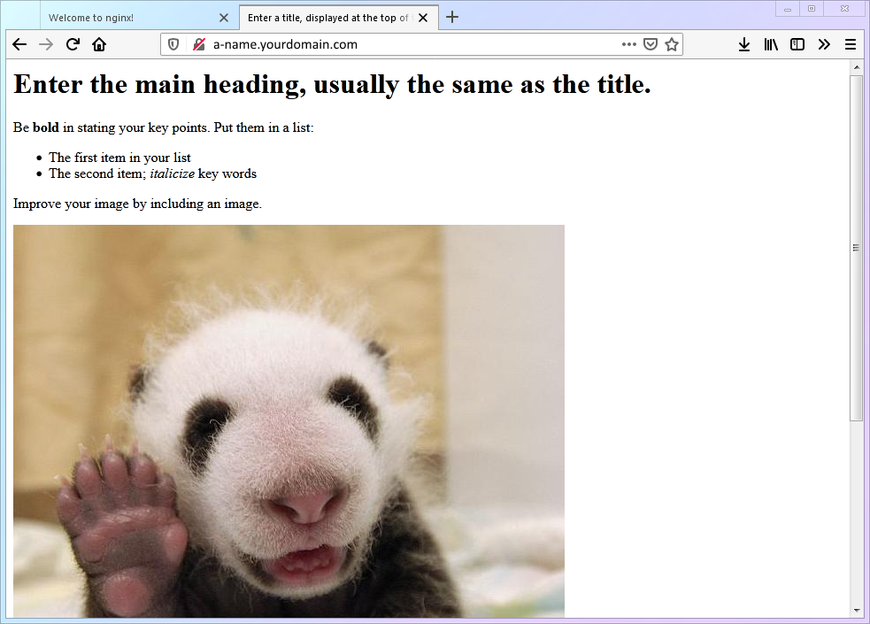

# 【Глава 5】 Создание веб-сайта

## 5.1 Зачем нужен веб-сайт?

Начинающие пользователи могут задаться вопросом: зачем создавать веб-сайт для обхода блокировок?  Я не программист, это же сложно?

Начнём с первого вопроса.  Веб-сайт нужен для того, чтобы:

1. Получить действующий SSL-сертификат (это очень важно).
2. Обеспечить маскировку трафика (fallback) и защититься от атак, направленных на выявление VPN-серверов.
3. Создать сайт-прикрытие (например, блог, облачное хранилище, медиа-портал, игровой сайт), который будет отображаться при прямом доступе к серверу, делая использование VPN менее заметным.

Теперь ответим на второй вопрос:

1. В этой статье мы создадим максимально простой веб-сайт, состоящий из **одного HTML-файла** и работающий на веб-сервере **Nginx**, чтобы решить поставленные выше задачи.  Это очень просто.
2. Этот веб-сайт не обязательно должен быть просто прикрытием.  Вы можете развивать его и превратить в полноценный проект.  Всё зависит от ваших желаний и возможностей.
3. Создание сайта-прикрытия и его продвижение — это отдельная большая тема, которая выходит за рамки этой статьи.  Если вам интересно, вы можете найти информацию об этом в интернете.

## 5.2 Подключение к VPS и установка Nginx

1. В этом разделе мы будем использовать команды, которые уже были подробно рассмотрены ранее.  Если вы что-то не понимаете, вернитесь и перечитайте предыдущие главы.

   ```shell
   sudo apt update && sudo apt install nginx
   ```

2. После завершения установки Nginx запустится автоматически.  Откройте браузер на своём компьютере и введите адрес `http://100.200.300.400:80`.  Если вы увидите страницу, как на скриншоте ниже, значит, Nginx работает.

   

3. Если вы не видите страницу Nginx, возможно, вам нужно настроить Uncomplicated Firewall (UFW), стандартный брандмауэр в Debian, чтобы разрешить трафик на портах HTTP (80) и HTTPS (443).

   a. Чтобы проверить, введите:
   ```shell
   sudo ufw status
   ```
   b. Если вывод команды такой, как показано ниже, это означает, что порты 80 и 443 закрыты.  Выполните действия, описанные в пункте c.
   ```shell
   Status: active
   To                         Action      From
   --                         ------      ----
   22/tcp                     ALLOW       Anywhere
   22/tcp (v6)                ALLOW       Anywhere (v6)
   ```
   c. Чтобы открыть порты 80 и 443 для Nginx в UFW, выполните команду:
   ```shell
   sudo ufw allow 'Nginx Full'
   ```
   d. Снова проверьте статус UFW, выполнив команду из пункта a.  Если вы видите вывод, как показано ниже, значит, трафик для Nginx разрешён, и вы должны увидеть стандартную страницу Nginx.
   ```shell
   Status: active
   To                         Action      From
   --                         ------      ----
   22/tcp                     ALLOW       Anywhere
   Nginx Full                 ALLOW       Anywhere
   22/tcp (v6)                ALLOW       Anywhere (v6)
   Nginx Full (v6)            ALLOW       Anywhere (v6)
   ```

## 5.3 Создание простой веб-страницы

1. Базовые команды Linux:
   | Номер | Команда   | Описание                   |
   | :----: | :-------- | :------------------------ |
   | `cmd-10` | `mkdir`  | Создание папки          |
   | `cmd-11` | `systemctl reload` | Перезагрузка службы        |

2. Важные файлы конфигурации Linux:
   | Номер   | Путь к файлу           | Описание                  |
   | :------ | :-------------------- | :------------------------- |
   | `conf-02` | `/etc/nginx/nginx.conf` | Настройки Nginx           |

3. Создайте папку `/home/vpsadmin/www/webpage/` для вашего сайта и файл `index.html` внутри неё:
   ```shell
   mkdir -p ~/www/webpage/ && nano ~/www/webpage/index.html
   ```

::: warning
Если вы используете имя пользователя, отличное от `vpsadmin`, обратите внимание на символ `~` в этой команде (это важно для 5-го шага):

- Для пользователей, **отличных от `root`**: `~` эквивалентно `/home/имя_пользователя`.
- Для пользователя **`root`**: `~` эквивалентно `/root`.
  :::

4. Скопируйте следующий код в файл `index.html` и сохраните его (`Ctrl+O`, `Enter`), затем выйдите из редактора (`Ctrl+X`):

   ```html
   <html lang="">
     <!-- Text between angle brackets is an HTML tag and is not displayed.
           Most tags, such as the HTML and /HTML tags that surround the contents of
           a page, come in pairs; some tags, like HR, for a horizontal rule, stand
           alone. Comments, such as the text you're reading, are not displayed when
           the Web page is shown. The information between the HEAD and /HEAD tags is
           not displayed. The information between the BODY and /BODY tags is displayed.-->
     <head>
       <title>Enter a title, displayed at the top of the window.</title>
     </head>
     <!-- The information between the BODY and /BODY tags is displayed.-->
     <body>
       <h1>Enter the main heading, usually the same as the title.</h1>
       <p>Be <b>bold</b> in stating your key points. Put them in a list:</p>
       <ul>
         <li>The first item in your list</li>
         <li>The second item; <i>italicize</i> key words</li>
       </ul>
       <p>Improve your image by including an image.</p>
       <p>
         
       </p>
       <p>
         Add a link to your favorite
         <a href="https://www.dummies.com/">Web site</a>. Break up your page
         with a horizontal rule or two.
       </p>
       <hr />
       <p>
         Finally, link to <a href="page2.html">another page</a> in your own Web
         site.
       </p>
       <!-- And add a copyright notice.-->
       <p>&#169; Wiley Publishing, 2011</p>
     </body>
   </html>
   ```

5. Дайте другим пользователям право на чтение этого файла:

   ```shell
   chmod -R a+r .
   ```

6. Отредактируйте файл `nginx.conf` и перезапустите Nginx, чтобы он открывал созданную нами страницу `index.html` при обращении к порту `80`.

   1. Отредактируйте файл `nginx.conf`.

      ```shell
      sudo nano /etc/nginx/nginx.conf
      ```

   2. Добавьте следующий блок кода внутрь блока `http{}` и сохраните изменения (`Ctrl+O`, `Enter`), затем выйдите из редактора (`Ctrl+X`).  (Не забудьте заменить доменное имя на ваше реальное доменное имя, включая поддомен).

      ```
              server {
                      listen 80;
                      server_name поддомен.ваш_домен.com;
                      root /home/vpsadmin/www/webpage;
                      index index.html;
              }
      ```

      ::: warning Важно!
      Как уже говорилось в 3-м шаге, убедитесь, что путь `/home/vpsadmin/www/webpage` соответствует реальному пути к вашему файлу.
      :::

   3. Перезагрузите Nginx, чтобы применить изменения.

      ```shell
      sudo systemctl reload nginx
      ```

   4. Весь процесс настройки показан на гифке ниже:

      

   5. Теперь, если вы откроете в браузере адрес `http://поддомен.ваш_домен.com`, вы должны увидеть созданную нами страницу:

      

## 5.4 Распространённые ошибки

Вообще, если вы внимательно следовали инструкциям, ошибок быть не должно.  Однако на этом этапе многие пользователи сталкиваются с проблемами.  В чём же дело?  Ответ прост: **невнимательность**.  Здесь возможны только две ошибки, и обе они связаны с невнимательностью.

**Ошибки:**

- Путь `/home/vpsadmin/www/webpage` в файле `nginx.conf` не соответствует реальному пути к файлу `index.html`.  Nginx не может найти файл.
- Путь указан верно, но у Nginx нет прав на чтение файла.

**Причины:**

- Вы работаете не под пользователем `root`, но скопировали команды из статьи без изменений (как будто списали домашнее задание вместе с именем одноклассника).
- Вы работаете под пользователем `root`.

Если у вас возникли проблемы, вернитесь к разделу 5.3 и внимательно перечитайте пункты 3 и 6.2.

::: warning
В предыдущих главах мы много говорили о важности использования пользователя, отличного от `root`, и вся статья написана с учётом этого.  Поэтому проблемы, связанные с использованием `root`, не рассматриваются в рамках этой статьи.

Однако я уверен, что те, кто всё-таки работает под `root`, достаточно опытны и смогут решить эти проблемы самостоятельно.
:::

## 5.5 Ваш прогресс

Первый компонент Xray — веб-сайт — готов.  Давайте перейдём ко второму компоненту — SSL-сертификату!

> ⬛⬛⬛⬛⬛⬜⬜⬜ 62.5%