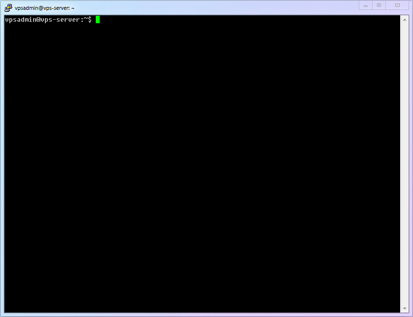
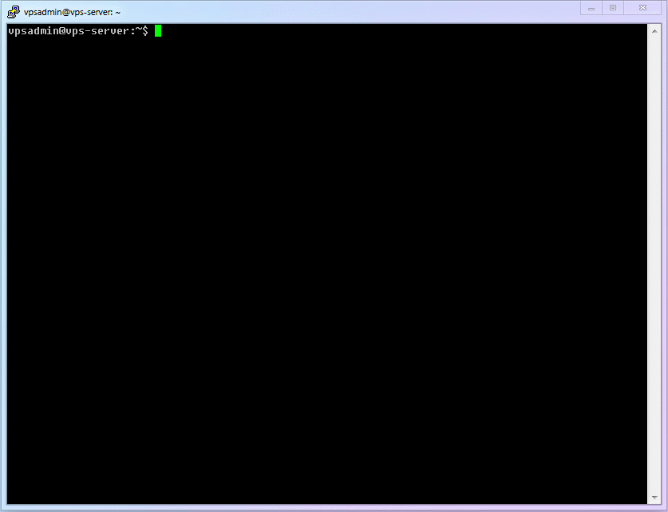
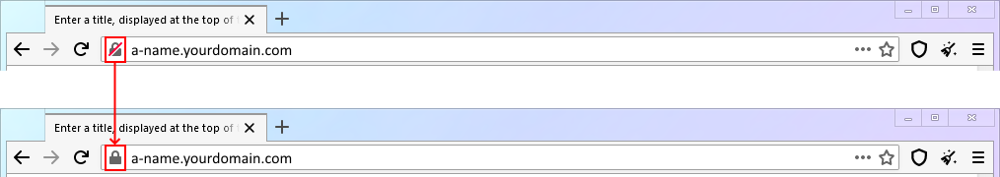

# 【Глава 7】Настройка Xray на сервере

## 7.1 Познать многое, усвоить нужное; копить постепенно, тратить осмотрительно

Во время написания этого руководства один знакомый в шутку заметил: "Твое руководство уже 6 глав публикуется, а до Xray всё никак не дойдёт. Кто не знает, подумает, что это руководство "Создание сайта с нуля". (И ведь не поспоришь! 😂)

На самом деле такая структура — результат моего осознанного решения. Ведь только заложив прочный фундамент, можно в дальнейшем двигаться вперёд семимильными шагами. Я видел в чатах много новичков, которые не могут правильно использовать даже `nano`, не говоря уже о `WinSCP`. Из-за этого их `config.json`, написанные вручную на удалённом сервере, пестрят ошибками, а поиск и исправление этих ошибок превращается в мучение.

::: warning
Пройдя первые 6 глав, мы вместе с вами преодолели несколько важных этапов: освоили базовые операции Linux, научились удалённо управлять VPS, разобрались с установкой веб-сервера, управлением доменными именами, получением SSL-сертификатов. Оглядываясь назад, разве всё это кажется таким уж сложным? Теперь, имея такой солидный багаж знаний, мы подойдём к установке и настройке Xray с чувством лёгкости и уверенности, ведь всё уже готово!
:::

Дальнейшие шаги предельно просты:

1. Установка
2. Настройка (например, установка TLS-сертификата, настройка `config.json`)
3. Запуск
4. Оптимизация (например, обновление ядра, включение `bbr`, автоматическое перенаправление `http`-запросов на `https` и т. д.)

## 7.2 Установка Xray

Xray основан на проекте с открытым исходным кодом [xray-core](https://github.com/XTLS/Xray-core) (лицензия `MPL 2.0`). Запущенный на сервере, скомпилированный бинарный файл этого проекта,  работает как серверная часть Xray; запущенный на локальном компьютере, он становится клиентской частью. Основное различие заключается в **конфигурации**.

Для установки воспользуемся официальным скриптом. Он предлагает несколько вариантов установки. Вы можете ознакомиться с ними в [репозитории скриптов](https://github.com/XTLS/Xray-install). **В данном руководстве мы будем использовать установку от имени непривилегированного пользователя**.

На момент написания руководства в скрипте есть небольшая ошибка при установке от имени непривилегированного пользователя, поэтому мы выполним эти шаги вручную. Заодно рассмотрим команду удаления файлов в Linux.

1.  Базовые команды Linux:

    | Номер |   Команда  | Описание        |
    | :----: | :--------: | :-------------- |
    | `cmd-14` |    `rm`     | Удаление файлов |

2.  Скачиваем установочный скрипт:

    ```shell
    wget https://github.com/XTLS/Xray-install/raw/main/install-release.sh
    ```

3.  Запускаем установку:

    ```shell
    sudo bash install-release.sh
    ```

4.  После завершения установки удаляем скрипт:

    ```shell
    rm ~/install-release.sh
    ```

    ::: warning
    При использовании команды `rm` для удаления файлов по умолчанию подразумевается удаление файлов в текущей директории. Однако **я всё же указал полный путь**: `~/install-release.sh`. Это моя привычка, которая повышает безопасность при использовании `rm`. Думаю, вы слышали истории про "программиста, который удалил базу данных и сбежал". 😉
    :::

5.  Весь процесс показан на гифке:

    

## 7.3 Установка TLS-сертификата для Xray

Хотя мы уже получили TLS-сертификат, согласно [официальной документации `acme.sh`](https://github.com/acmesh-official/acme.sh/wiki/%E8%AF%B4%E6%98%8E#3-copy%E5%AE%89%E8%A3%85-%E8%AF%81%E4%B9%A6), не рекомендуется использовать полученные файлы сертификата напрямую. Правильный способ — использовать команду `--install-cert` для установки сертификата для нужного приложения. Давайте установим сертификат для `xray-core`.

1.  Чтобы избежать проблем с правами доступа при работе от имени непривилегированного пользователя, создадим папку для сертификатов в домашней директории пользователя `vpsadmin`:

    ```shell
    mkdir ~/xray_cert
    ```

2.  Используем команду `--install-cert` из `acme.sh` для установки (копирования) файлов сертификата:

    ```shell
    acme.sh --install-cert -d sub.yourdomain.com --ecc \
               --fullchain-file ~/xray_cert/xray.crt \
               --key-file ~/xray_cert/xray.key
    ```

3.  По умолчанию файл `xray.key` недоступен для чтения другим пользователям, поэтому нужно выдать права на чтение:

    ```shell
    chmod +r ~/xray_cert/xray.key
    ```

4.  Процесс довольно простой, поэтому обойдёмся без гифки:

    

5.  `acme.sh` проверяет срок действия сертификата каждые 60 дней и автоматически обновляет его при необходимости. Однако, насколько мне известно, он не устанавливает новый сертификат для `xray-core` автоматически. Поэтому нам нужно добавить автоматическое задание cron, которое будет делать это за нас.

    1.  Базовые команды Linux:

        | Номер |   Команда   | Описание                               |
        | :----: | :----------: | :------------------------------------ |
        | `cmd-15` | `crontab -e` | Редактирование crontab текущего пользователя |

    2.  Создаём файл скрипта (`xray-cert-renew.sh`):

        ```shell
        nano ~/xray_cert/xray-cert-renew.sh
        ```

    3.  Копируем в него следующий код, заменив `sub.yourdomain.com` на своё доменное имя, и сохраняем файл:

        ```bash
        #!/bin/bash

        /home/vpsadmin/.acme.sh/acme.sh --install-cert -d sub.yourdomain.com --ecc --fullchain-file /home/vpsadmin/xray_cert/xray.crt --key-file /home/vpsadmin/xray_cert/xray.key
        echo "Xray Certificates Renewed"

        chmod +r /home/vpsadmin/xray_cert/xray.key
        echo "Read Permission Granted for Private Key"

        sudo systemctl restart xray
        echo "Xray Restarted"
        ```

        ::: warning
        Как заметили пользователи, `acme.sh` имеет команду `reloadcmd`, которая позволяет выполнить произвольную команду после обновления сертификата. Таким образом, можно настроить автоматическую установку сертификата для `Xray`. Однако, поскольку `crontab` — очень полезный и часто используемый инструмент в Linux, в данном руководстве мы будем использовать его для обновления сертификата `Xray`. (Подробнее о команде `reloadcmd` можно прочитать в [документации `acme.sh`](https://github.com/acmesh-official/acme.sh)).

        Кроме того, в момент записи гифки в скрипт не была добавлена команда перезапуска `Xray`, поскольку в планах разработчиков `Xray` — поддержка **горячего обновления сертификатов**. Это означает, что `Xray` сможет автоматически обнаруживать обновление сертификата и перезагружать его без необходимости перезапуска. После добавления этой функции я обновлю конфигурацию `config.json`, включив эту настройку, и удалю команду перезапуска из скрипта.
        :::

    4.  Делаем скрипт исполняемым:

        ```shell
        chmod +x ~/xray_cert/xray-cert-renew.sh
        ```

    5.  Запускаем `crontab -e`, чтобы добавить задание на автоматическое выполнение `xray-cert-renew.sh` каждый месяц (не используйте `sudo`, так как мы добавляем задание для пользователя `vpsadmin`. При первом запуске `crontab` вам будет предложено выбрать редактор. Выбираем знакомый нам `nano`!):

        ```shell
        crontab -e
        ```

    6.  Добавляем следующую строку в конец файла и сохраняем его:

        ```
        # 1:00am, 1st day each month, run `xray-cert-renew.sh`
        0 1 1 * *   bash /home/vpsadmin/xray_cert/xray-cert-renew.sh
        ```

    7.  Весь процесс показан на гифке:

        

## 7.4 Настройка Xray

Для начала можете ознакомиться с [примерами конфигурации VLESS](https://github.com/XTLS/Xray-examples). В этом руководстве мы будем использовать официальный пример для настройки максимально простого варианта: **один входящий прокси-сервер VLESS + перенаправление с порта 80**. Такая конфигурация обеспечит максимальную скорость и необходимый уровень безопасности в большинстве случаев.

1.  Генерируем валидный `UUID` и сохраняем его (грубо говоря, `UUID` — это уникальный идентификатор, который можно сравнить с отпечатком пальца):

    ```shell
    xray uuid
    ```

2.  Создаём файлы и папки для логов:

    1.  Базовые команды Linux:

        | Номер | Команда | Описание                |
        | :----: | :-----: | :---------------------- |
        | `cmd-16` | `touch`  | Создание пустого файла |

    2.  Создаём папку для логов в домашней директории пользователя `vpsadmin`:

        ```shell
        mkdir ~/xray_log
        ```

    3.  Создаём два файла для логов (логи доступа и логи ошибок):

        ```shell
        touch ~/xray_log/access.log && touch ~/xray_log/error.log
        ```

        ::: warning
        Это не стандартное расположение файлов логов `Xray`. Мы используем его, чтобы избежать проблем с правами доступа, которые могут возникнуть у новичков. Когда разберётесь, рекомендуется использовать стандартные пути: `/var/log/xray/access.log` и `/var/log/xray/error.log`.
        :::

    4.  По умолчанию Xray запускается от имени пользователя `nobody`, поэтому нужно дать другим пользователям права на запись в файлы логов (`*.log` — это все файлы с расширением `log`. Здесь проявляются преимущества использования командной строки):

        ```shell
        chmod a+w ~/xray_log/*.log
        ```

3.  Создаём файл конфигурации `Xray` с помощью `nano`:

    ```shell
    sudo nano /usr/local/etc/xray/config.json
    ```

4.  Копируем в него следующий код и вставляем сгенерированный ранее `UUID` в строку 61: `"id": "",` (должно получиться что-то вроде `"id": "uuiduuid-uuid-uuid-uuid-uuiduuiduuid"`). В этом файле конфигурации я добавил свои комментарии, чтобы вам было проще понять, за что отвечает каждый модуль.

    ```json
    // ССЫЛКИ:
    // https://github.com/XTLS/Xray-examples
    // https://xtls.github.io/config/
    // Типичный конфигурационный файл, как для сервера, так и для клиента, состоит из 5 основных частей. Разберём их по полочкам:
    // ┌─ 1_log Настройки логирования - что и куда писать в лог (чтобы было проще искать ошибки)
    // ├─ 2_dns Настройки DNS - как выполнять DNS-запросы (защита от DNS-спуфинга, защита от слежки, предотвращение маршрутизации трафика на китайские серверы и т. д.)
    // ├─ 3_routing Настройки маршрутизации - как обрабатывать трафик (фильтрация рекламы, разделение трафика для разных стран)
    // ├─ 4_inbounds Настройки входящих подключений - какой трафик может поступать на Xray
    // └─ 5_outbounds Настройки исходящих подключений - куда направлять трафик, исходящий от Xray
    {
      // 1_Настройки логирования
      "log": {
        "loglevel": "warning", // Уровень детализации логов: "none", "error", "warning", "info", "debug" (от меньшего к большему)
        "access": "/home/vpsadmin/xray_log/access.log", // Файл для записи логов доступа
        "error": "/home/vpsadmin/xray_log/error.log" // Файл для записи логов ошибок
      },
      // 2_Настройки DNS
      "dns": {
        "servers": [
          "https+local://1.1.1.1/dns-query", // Используем DoH-сервер 1.1.1.1 в первую очередь. Это снижает скорость, но защищает от слежки со стороны интернет-провайдера
          "localhost"
        ]
      },
      // 3_Настройки маршрутизации
      "routing": {
        "domainStrategy": "IPIfNonMatch",
        "rules": [
          // 3.1 Предотвращение проблем с локальной маршрутизацией: атаки на внутреннюю сеть, неправильная обработка локальных адресов и т. д.
          {
            "type": "field",
            "ip": [
              "geoip:private" // Условие: адреса из списка "private" в файле geoip (локальные адреса)
            ],
            "outboundTag": "block" // Действие: отправить трафик на исходящее подключение "block" (блокировка)
          },
          {
            // 3.2 Предотвращение прямого подключения к китайским серверам
            "type": "field",
            "ip": ["geoip:cn"],
            "outboundTag": "block"
          },
          // 3.3 Блокировка рекламы
          {
            "type": "field",
            "domain": [
              "geosite:category-ads-all" // Условие: домены из списка "category-ads-all" в файле geosite (рекламные домены)
            ],
            "outboundTag": "block" // Действие: отправить трафик на исходящее подключение "block" (блокировка)
          }
        ]
      },
      // 4_Настройки входящих подключений
      // 4.1 Здесь указан только один простейший входящий прокси-сервер vless+xtls, так как это самый производительный режим Xray. При необходимости вы можете добавить другие прокси-серверы, используя этот шаблон.
      "inbounds": [
        {
          "port": 443,
          "protocol": "vless",
          "settings": {
            "clients": [
              {
                "id": "", // Укажите свой UUID
                "flow": "xtls-rprx-vision",
                "level": 0,
                "email": "vpsadmin@yourdomain.com"
              }
            ],
            "decryption": "none",
            "fallbacks": [
              {
                "dest": 80 // Перенаправлять на порт 80 по умолчанию
              }
            ]
          },
          "streamSettings": {
            "network": "tcp",
            "security": "tls",
            "tlsSettings": {
              "alpn": "http/1.1",
              "certificates": [
                {
                  "certificateFile": "/home/vpsadmin/xray_cert/xray.crt",
                  "keyFile": "/home/vpsadmin/xray_cert/xray.key"
                }
              ]
            }
          }
        }
      ],
      // 5_Настройки исходящих подключений
      "outbounds": [
        // 5.1 Первое исходящее подключение - это правило по умолчанию. freedom - это прямое подключение (VPS и так находится во внешней сети)
        {
          "tag": "direct",
          "protocol": "freedom"
        },
        // 5.2 Правило блокировки. Протокол blackhole отправляет трафик в никуда (блокирует его)
        {
          "tag": "block",
          "protocol": "blackhole"
        }
      ]
    }
    ```

5.  Весь процесс показан на гифке:

    

## 7.5 Запуск Xray! (и проверка состояния сервиса)

Если вы всё делали по инструкции, то должны были избежать двух самых распространённых ошибок: **недостаточно прав для записи в файлы логов** и **недостаточно прав для чтения файлов сертификата**. Так что запуск `Xray` должен пройти без сучка и задоринки.

1.  Вводим команду и наслаждаемся историческим моментом запуска `Xray`!!!

    ```shell
    sudo systemctl start xray
    ```

2.  Однако просто выполнить команду `start` недостаточно, чтобы убедиться, что сервис `Xray` запущен и работает корректно. Для проверки состояния сервиса используем следующую команду:

    ```shell
    sudo systemctl status xray
    ```

    Видите надпись зелёного цвета `active (running)`? Это означает, что `Xray` запущен и работает.

3.  Весь процесс показан на гифке:

    

## 7.6 Базовое управление сервисами с помощью `systemd`

Мы уже использовали несколько команд `systemctl`: `start`, `status`, `reload`. Все эти команды используются для управления сервисами в Linux с помощью системы инициализации `systemd`. Давайте рассмотрим ещё несколько полезных команд.

1.  Чтобы временно остановить сервис `Xray`, используем команду `stop`:

    ```shell
    sudo systemctl stop xray
    ```

2.  Чтобы перезапустить сервис `Xray`, используем команду `restart`:

    ```shell
    sudo systemctl restart xray
    ```

3.  Чтобы запретить автозапуск сервиса `Xray` после перезагрузки, используем команду `disable`:

    ```shell
    sudo systemctl disable xray
    ```

4.  Чтобы разрешить автозапуск сервиса `Xray` после перезагрузки, используем команду `enable`:

    ```shell
    sudo systemctl enable xray
    ```

## 7.7 Оптимизация сервера: включение BBR

1.  Что говорят о `BBR`

Уверен, что, изучая различные способы обхода блокировок, вы не раз сталкивались с аббревиатурой `bbr`. В многочисленных блогах её расхваливают на все лады, наделяя чуть ли не магическими свойствами. Существуют также различные модификации, такие как `bbrplus`, `bbr2`, `магически модифицированный bbr` и т. д. Создаётся ощущение, что это какая-то волшебная палочка, которая превращает тыкву в карету, а медленный интернет — в сверхскоростной.

Так что же такое `BBR` на самом деле? Действительно ли он так хорош? И какую версию использовать?

2.  `BBR` на самом деле

**BBR** = **B**ottleneck **B**andwidth and **R**ound-trip propagation time — это алгоритм управления перегрузками для протокола TCP. Проще говоря, это **регулировщик дорожного движения для интернет-трафика**: когда на дороге нет пробок, каждая машина может двигаться с максимальной скоростью.

Так работает ли он? Как правило, разница между включенным и выключенным `BBR` заметна (улучшается скорость, стабильность и снижается пинг), поэтому **настоятельно рекомендуется включить `BBR`**.

Однако разница между версиями `BBR` для ядер 4.x и 5.x зачастую не столь существенна и зависит от конкретной ситуации. Решающим фактором, влияющим на качество связи, по-прежнему остаётся качество самого интернет-канала. Поэтому **не стоит гнаться за новейшими версиями `BBR`. Достаточно использовать версию, которая поставляется с вашей версией дистрибутива Linux**.

3.  Действительно ли `bbrplus`, `bbr2`, `магически модифицированный bbr` и другие версии с крутыми названиями лучше?

Одним словом: **нет! Не используйте их! Все эти названия придуманы только для привлечения внимания!**

Обновления `BBR` выпускаются вместе с обновлениями ядра Linux (`Kernel`). Другими словами, если вы используете относительно новое ядро, то у вас уже будет установлена последняя версия `BBR`.

А все эти скрипты с крутыми названиями просто скачивают и устанавливают предварительные версии ядра (или даже модифицированные сторонними разработчиками версии) с более новыми версиями `BBR`.

Стабильность ядра — это основа стабильной работы сервера. **Незначительное повышение производительности, которое могут дать тестовые версии `BBR`, не стоит того, чтобы рисковать стабильностью сервера.** Используйте последнюю версию ядра, которая поддерживается вашим дистрибутивом Linux. Это обеспечит максимальную стабильность и совместимость вашего сервера.

::: warning
Так называемое "преимущество" модифицированных версий `bbr` **очень недолговечно**. Например, многие скрипты `bbrplus` до сих пор устанавливают ядро версии 4.19, поскольку не обновлялись уже несколько лет. А ведь на дворе уже эпоха Debian 11 с ядром 5.10! То есть, если в январе 2018 года этот скрипт, возможно, и давал какое-то преимущество, то уже к октябрю 2018 года, когда вышла стабильная версия ядра 4.19, он потерял всякий смысл. А сейчас его использование и вовсе можно назвать **даунгрейдом**.
:::

4.  Какой алгоритм управления очередями использовать: `fq`, `fq_codel`, `fq_pie`, `cake` или какой-то другой?

Одним словом: **если не знаете, что выбрать, оставьте `fq`. Этого достаточно, и это не ухудшит качество связи**.

5.  Стоит ли использовать "ускорители" типа **锐速**, **Finalspeed**, **LotServer**?

Одним словом: **нет! Забудьте о них, как о страшном сне!**

Единственная проблема, которую они решают, — это проблема потери пакетов. Если проводить аналогию, то представьте, что вам нужно отправить груз, но машина, которая его везёт, иногда ломается по дороге (теряются пакеты). Эти "ускорители" просто отправляют три одинаковых груза на трёх машинах одновременно. Даже если две машины сломаются, третья всё равно доставит груз. Конечно, если на дороге будет много ваших машин, то вы будете создавать помехи другим участникам движения. Но и они будут создавать помехи вам. А поскольку пропускная способность канала ограничена, то в итоге все будут стоять в пробке.

::: warning
Эти "ускорители" не оптимизируют алгоритмы и не увеличивают скорость соединения. В большинстве своём это просто **увеличители количества отправляемых пакетов**. Для каналов с **очень высокими потерями пакетов** они могут дать незначительный эффект, но **для хороших каналов с низкими потерями пакетов они бесполезны и даже вредны, поскольку увеличивают расход трафика**. Это создаёт ненужную нагрузку на сервер и на каналы других пользователей.

Если у вас действительно плохой канал с высокими потерями пакетов, то единственное правильное решение — **сменить провайдера**.
:::

6.  Я так подробно остановился на `BBR`, потому что вокруг него слишком много мифов и откровенной дезинформации, нацеленной на новичков. Надеюсь, теперь у вас есть чёткое представление о том, что такое `BBR` и как он работает. А теперь давайте установим последнюю версию ядра Debian и включим `BBR`! (Это действительно просто)

    1.  Добавляем репозиторий `backports` в Debian 10, чтобы получить доступ к более новым версиям пакетов:

        ```shell
        sudo nano /etc/apt/sources.list
        ```

        ::: warning
        В Debian 10 можно без проблем использовать файл `/etc/apt/sources.list`. Однако, если вы используете другой дистрибутив Linux или не устанавливали систему с нуля по этой инструкции, то рекомендуется создать папку `/etc/apt/sources.list.d/` и добавлять свои файлы конфигурации в неё, например, `/etc/apt/sources.list.d/vpsadmin.list`. Это обеспечит совместимость с другими дистрибутивами и предотвратит потерю настроек при случайном перезаписывании файла `/etc/apt/sources.list`.
        :::

    2.  Добавляем следующую строку в конец файла и сохраняем его:

        ```
        deb http://archive.debian.org/debian buster-backports main
        ```

    3.  Обновляем список доступных пакетов, ищем последнюю версию ядра Debian и устанавливаем её. Устанавливайте версию ядра, которая подходит для вашей архитектуры (в данном руководстве мы используем `amd64`):

        ```shell
        sudo apt update && sudo apt -t buster-backports install linux-image-amd64
        ```

        ::: warning
        Если ваш VPS поддерживает это, вы можете попробовать установить **специальное ядро для облачных серверов** `linux-image-cloud-amd64`. Его преимущества — это меньший размер и меньшее потребление ресурсов. Однако некоторые пользователи сталкивались с проблемами при установке этого ядра на неподдерживаемые системы, вплоть до невозможности загрузки (ядро не определялось).

        Чтобы не попасть в такую ситуацию, перед установкой этого ядра:

        - создайте снапшот системы или
        - убедитесь, что у вас есть доступ к `vnc`-консоли (и вы знаете, как ей пользоваться)

        :::

    4.  Редактируем файл конфигурации `sysctl.conf` и включаем `BBR`:

        ```shell
        sudo nano /etc/sysctl.conf
        ```

        ::: warning
        В Debian 10 можно без проблем использовать файл `/etc/sysctl.conf`. Однако, если вы используете другой дистрибутив Linux или не устанавливали систему с нуля по этой инструкции, то рекомендуется создать папку `/etc/sysctl.d/` и добавлять свои файлы конфигурации в неё, например, `/etc/sysctl.d/vpsadmin.conf`. Это обеспечит совместимость с другими дистрибутивами, поскольку в некоторых из них, начиная с версии `systemd` 207, параметры из файла `/etc/sysctl.conf` не читаются. Использование отдельного файла конфигурации также предотвратит потерю настроек при случайном перезаписывании файла `/etc/sysctl.conf`.
        :::

    5.  Добавляем следующие строки в конец файла:

        ```
        net.core.default_qdisc=fq
        net.ipv4.tcp_congestion_control=bbr
        ```

    6.  Перезагружаем VPS, чтобы изменения вступили в силу:

        ```shell
        sudo reboot
        ```

    7.  Весь процесс показан на гифке:

        ::: tip
        На моём VPS поддерживается специальное ядро для облачных серверов, поэтому на гифке я устанавливаю `linux-image-cloud-amd64`. Если вы не уверены, поддерживается ли оно на вашем VPS, то установите обычное ядро `linux-image-amd64`, как показано в пункте 3.
        :::

        

    8.  Проверяем, что `BBR` включен

        Чтобы убедиться, что модуль `BBR` загружен, выполните команду:

        ```shell
        lsmod | grep bbr
        ```

        В результате вы должны увидеть что-то вроде этого:

        ```
        tcp_bbr
        ```

        Чтобы убедиться, что алгоритм `fq` используется, выполните команду:

        ```shell
        lsmod | grep fq
        ```

        В результате вы должны увидеть что-то вроде этого:

        ```
        sch_fq
        ```

## 7.8 Оптимизация сервера: автоматическое перенаправление HTTP на HTTPS

1.  Ранее мы настроили веб-сервер на порту 80 и получили TLS-сертификат.

    Однако, если вы попытаетесь открыть наш сайт по протоколу HTTP, то заметите, что он не перенаправляется автоматически на HTTPS, как это делают большинство сайтов. Другими словами, в нашей текущей конфигурации HTTP (порт 80) и HTTPS (порт 443) — это два совершенно независимых сайта. Чтобы это исправить, нужно внести некоторые изменения.

2.  Открываем файл конфигурации Nginx:

    ```shell
    sudo nano /etc/nginx/nginx.conf
    ```

3.  В настройках сервера, который слушает порт 80, добавляем следующую строку и сохраняем файл (строки `root` и `index` можно удалить):

    ```
    return 301 https://$http_host$request_uri;
    ```

4.  Добавляем новый сервер, который будет прослушивать локальный порт и отдавать файлы сайта. В данном примере мы будем использовать порт 8080 (вы можете использовать любой другой порт):

    ```
    server {
        listen 127.0.0.1:8080;
        root /home/vpsadmin/www/webpage;
        index index.html;
        add_header Strict-Transport-Security "max-age=63072000" always;
    }
    ```

5.  Перезапускаем Nginx:

    ```shell
    sudo systemctl restart nginx
    ```

6.  Изменяем настройки перенаправления в файле конфигурации Xray, заменив порт 80 на 8080 (находим `"dest": 80` и меняем на `"dest": 8080`):

    ```shell
    sudo nano /usr/local/etc/xray/config.json
    ```

7.  Перезапускаем Xray:

    ```shell
    sudo systemctl restart xray
    ```

8.  Весь процесс показан на гифке:

    

9.  Теперь, если вы попытаетесь открыть сайт по адресу `http://sub.yourdomain.com`, он должен автоматически перенаправиться на HTTPS:

    

## 7.9 Оптимизация сервера: более гибкая настройка перенаправления

Если вам нужны более гибкие настройки перенаправления, обратитесь к статье [«Разбор функции Fallback»](../level-1/fallbacks-lv1/).

## 7.10 Ваши успехи

Поздравляю! На этом этапе у вас есть работающий сервер с обходом блокировок и сайт-приманка, который защитит вас от сканирования. Теперь достаточно установить клиентское приложение на ваше устройство — и можно наслаждаться свободным интернетом!

> ⬛⬛⬛⬛⬛⬛⬛⬜ 87.5%

## 7.11 Важные исправления

1.  В первоначальной версии руководства был указан неверный путь к файлу конфигурации `Xray` (`config.json`). Если вы настроили `Xray` по старой инструкции, то он не запустится. Приносим извинения за неудобства!

    - Верный путь: `/usr/local/etc/xray/config.json`
    - Неверный путь: `/usr/local/etc/config.json`

    Затронутые разделы:

    - 7.4 Настройка Xray - 3. Создание файла конфигурации `Xray` с помощью `nano`
    - 7.8 Оптимизация сервера: автоматическое перенаправление HTTP на HTTPS - 6. Изменяем настройки перенаправления в файле конфигурации Xray

2.  В первоначальной версии руководства была ошибка в настройках Nginx (неверный путь к папке с файлами сайта). Если вы настроили Nginx по старой инструкции, то сайт не будет работать. Приносим извинения за неудобства!

    - Верный путь: `root /home/vpsadmin/www/webpage;`
    - Неверный путь: `root /var/www/website/html`

    Затронутые разделы:

    - 7.8 Оптимизация сервера: автоматическое перенаправление HTTP на HTTPS - 4. Добавляем новый сервер, который будет прослушивать локальный порт и отдавать файлы сайта.