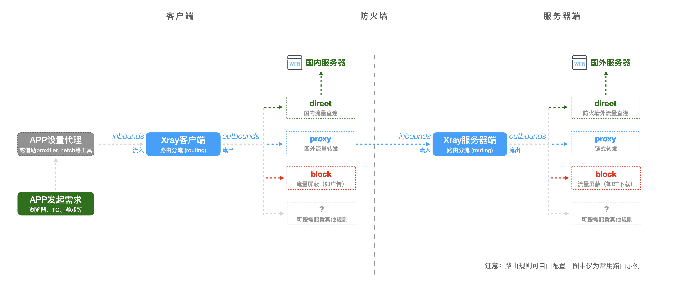

# 【Глава 8】Настройка Xray на клиенте

## 8.1 Как работает Xray: краткое описание

Чтобы правильно настраивать и использовать `Xray`, важно понимать принципы его работы. Новичкам поможет упрощённая схема, на которой не показаны некоторые сложные моменты:



Ключевые моменты:

1.  Приложение должно самостоятельно или с помощью стороннего инструмента перенаправить трафик на **входящее подключение** (`inbounds`) клиента `Xray`.

2.  Поступивший на клиент трафик обрабатывается **модулем маршрутизации** (`routing`) в соответствии с заданными правилами и перенаправляется на разные **исходящие подключения** (`outbounds`) клиента `Xray`, например:

    -   Трафик на китайские ресурсы — напрямую (`direct`)
    -   Трафик на зарубежные ресурсы — через VPS (`proxy`)
    -   Рекламный трафик — блокируется (`block`)

3.  Трафик на зарубежные ресурсы, перенаправленный на VPS, проходит через Великий Китайский Файрвол и попадает на **входящее подключение** (`inbounds`) сервера `Xray`.

4.  Как и на клиенте, трафик, поступивший на сервер, обрабатывается **модулем маршрутизации** (`routing`) в соответствии с заданными правилами и перенаправляется на разные **исходящие подключения** (`outbounds`):

    -   Поскольку сервер находится за пределами Китая, трафик по умолчанию идёт напрямую, что позволяет получить доступ к заблокированным ресурсам (`direct`).
    -   При необходимости можно настроить перенаправление трафика на другие VPS (`proxy`).
    -   На сервере также можно блокировать нежелательный трафик, например, рекламу или торренты (`block`).

:::warning Внимание!

Важно помнить, что маршрутизация в `Xray` очень гибкая, и описанный выше сценарий — лишь один из множества возможных.

Используя файлы `geosite.dat` и `geoip.dat`, можно очень гибко управлять маршрутизацией трафика по доменным именам и IP-адресам. Это гораздо удобнее, чем устаревший `GFWList`, поскольку позволяет очень точно настроить правила: например, можно разрешить прямое подключение к доменам Apple, перенаправить трафик на домены Amazon через прокси-сервер, блокировать доступ к доменам Baidu и т. д.

Более подробно о маршрутизации в Xray читайте в статье [«Разбор функции маршрутизации (routing)»](../level-1/routing-lv1-part1.md). Советую сначала дочитать эту главу и настроить базовый клиент, а потом уже углубляться в тонкости маршрутизации.
:::

## 8.2 Подключение клиента к серверу

Теперь, когда вы понимаете принципы работы `Xray`, настройка клиента сводится к тому, чтобы **сообщить ему, как подключиться к вашему VPS**. Это как настроить `PuTTY` для подключения к серверу, только в случае с Xray параметров подключения больше, чем IP-адрес, порт, имя пользователя и пароль.

Набор параметров подключения в `Xray` зависит от используемого [протокола](../../config/inbounds/). В главе 7 мы настроили сервер на использование протокола `VLESS` с шифрованием `XTLS`. Посмотрим на файл конфигурации сервера, чтобы узнать, какие параметры нужны для подключения:

-   **Адрес сервера**: `sub.yourdomain.com`
-   **Порт сервера**: `443`
-   **Протокол**: `vless`
-   **Поток**: `xtls-rprx-vision` (режим `vision` подходит для всех платформ)
-   **Идентификатор**: `uuiduuid-uuid-uuid-uuid-uuiduuiduuid`
-   **Безопасность**: `"allowInsecure": false`

Ниже приведен список популярных клиентов Xray для мобильных и настольных устройств. Каждый клиент имеет свой собственный интерфейс, поэтому я не буду делать скриншоты для каждого из них. Внимательно изучите документацию к выбранному клиенту и укажите нужные параметры подключения.

:::warning Внимание!

Многие клиенты поддерживают как `xray-core`, так и `v2fly-core`. Но по умолчанию может использоваться не тот, который вам нужен. Убедитесь, что вы выбрали нужный инструмент!
:::

-   **v2rayN - для Windows**

    -   Скачайте последнюю версию из [репозитория на GitHub](https://github.com/2dust/v2rayN/releases)
    -   Настройте клиент в соответствии с документацией

-   **v2rayNG - для Android**

    -   Скачайте последнюю версию из [репозитория на GitHub](https://github.com/2dust/v2rayNG/releases)
    -   Настройте клиент в соответствии с документацией

-   **Shadowrocket - для iOS, macOS на базе Apple M1**

    -   Создайте учётную запись iCloud **не** в китайском регионе
    -   Купите приложение в App Store
    -   Настройте клиент в соответствии с документацией

-   **Qv2ray - кроссплатформенный графический интерфейс для Linux, Windows, macOS**

    -   Скачайте последнюю версию из [репозитория на GitHub](https://github.com/Qv2ray/Qv2ray/releases) (или более новую версию из раздела [сборок на GitHub](https://github.com/Qv2ray/Qv2ray/actions))
    -   Изучите документацию на [сайте проекта](https://qv2ray.net/)
    -   Настройте клиент в соответствии с документацией

-   **V2RayXS - клиент для macOS, основанный на V2RayX и использующий xray-core**

    -   Скачайте последнюю версию из [репозитория на GitHub](https://github.com/tzmax/v2rayXS/releases)
    -   Поддерживает импорт ссылок на конфигурации VLESS / VMessAEAD по стандарту, предложенному в [этой задаче](https://github.com/XTLS/Xray-core/issues/91)
    -   Настройте клиент в соответствии с документацией

На этом этапе ваша система готова к работе!

## 8.3 Дополнительное задание 1: настройка `xray-core` на ПК вручную

Хотя на предыдущем шаге мы уже всё настроили, любознательным и обладающим хорошей памятью читателям наверняка вспомнятся мои слова из предыдущей главы о том, что `xray-core` можно запускать как на сервере, так и на клиенте. Так как же использовать `xray-core` в качестве клиента?

Чтобы ответить на этот вопрос, я добавил этот раздел с дополнительным заданием. Оно немного выходит за рамки основного материала и может показаться сложным, но у него есть свои преимущества:

-   Вы всегда будете использовать самую последнюю версию `xray-core`, не дожидаясь, пока разработчики клиентов выпустят обновления.
-   Вы получите максимальную гибкость в настройке маршрутизации (хотя стоит отметить, что Qv2ray имеет мощный редактор маршрутизации, который позволяет настраивать все функции `xray-core`).
-   Вы сэкономите системные ресурсы (графические клиенты всегда потребляют больше ресурсов, чем консольные).

Недостаток этого способа заключается в том, что вам придётся **настраивать клиент вручную, редактируя файл конфигурации**. Но ведь на сервере вы уже делали это, так что ничего сложного здесь нет. Давайте разберёмся по шагам:

1.  Скачайте последнюю версию `xray-core` для вашей платформы из [репозитория на GitHub](https://github.com/XTLS/Xray-core/releases) и распакуйте архив в удобное место.
2.  Создайте пустой файл конфигурации `config.json` в той же папке (думаю, с этим проблем не возникнет).
3.  Что значит "удобное место"? Это зависит от платформы.
4.  Заполните файл конфигурации.

    -   Я написал пример конфигурации, основанный на схеме из раздела 8.1 (прямое подключение к китайским ресурсам, проксирование трафика на зарубежные ресурсы через VPS, блокировка рекламы) и параметрах подключения из раздела 8.2.
    -   Замените `uuid` на идентификатор из вашей конфигурации сервера.
    -   Замените `address` на доменное имя вашего сервера.
    -   Замените `serverName` на доменное имя вашего сервера.
    -   Я добавил подробные комментарии к каждому разделу конфигурации.

    ```json
    // ССЫЛКИ:
    // https://github.com/XTLS/Xray-examples
    // https://xtls.github.io/config/

    // Типичный конфигурационный файл, как для сервера, так и для клиента, состоит из 5 основных частей. Разберём их по полочкам:
    // ┌─ 1_log          Настройки логирования - что и куда писать в лог (чтобы было проще искать ошибки)
    // ├─ 2_dns          Настройки DNS - как выполнять DNS-запросы (защита от DNS-спуфинга, защита от слежки, предотвращение маршрутизации трафика на китайские серверы и т. д.)
    // ├─ 3_routing      Настройки маршрутизации - как обрабатывать трафик (фильтрация рекламы, разделение трафика для разных стран)
    // ├─ 4_inbounds     Настройки входящих подключений - какой трафик может поступать на Xray
    // └─ 5_outbounds    Настройки исходящих подключений - куда направлять трафик, исходящий от Xray

    {
      // 1_Настройки логирования
      // В этом примере я закомментировал настройки файлов логов, потому что в Windows, macOS и Linux используются разные пути. Укажите свои пути.
      "log": {
        // "access": "/home/local/xray_log/access.log",    // Файл для записи логов доступа
        // "error": "/home/local/xray_log/error.log",    // Файл для записи логов ошибок
        "loglevel": "warning" // Уровень детализации логов: "none", "error", "warning", "info", "debug" (от меньшего к большему)
      },

      // 2_Настройки DNS
      "dns": {
        "servers": [
          // 2.1 Запросы к зарубежным доменам отправляем на зарубежный DNS-сервер
          {
            "address": "1.1.1.1",
            "domains": ["geosite:geolocation-!cn"]
          },
          // 2.2 Запросы к китайским доменам отправляем на китайский DNS-сервер и ожидаем получить китайский IP-адрес. Если адрес не китайский, используем следующий DNS-сервер
          {
            "address": "223.5.5.5",
            "domains": ["geosite:cn"],
            "expectIPs": ["geoip:cn"]
          },
          // 2.3 Резервный китайский DNS-сервер
          {
            "address": "114.114.114.114",
            "domains": ["geosite:cn"]
          },
          // 2.4 Если все предыдущие DNS-серверы не ответили, используем локальный DNS-сервер
          "localhost"
        ]
      },

      // 3_Настройки маршрутизации
      // Маршрутизация позволяет перенаправлять трафик, соответствующий определённым условиям, на определённое исходящее подключение (см. раздел 5).
      "routing": {
        "domainStrategy": "IPIfNonMatch",
        "rules": [
          // 3.1 Блокировка рекламных доменов
          {
            "type": "field",
            "domain": ["geosite:category-ads-all"],
            "outboundTag": "block"
          },
          // 3.2 Прямое подключение к китайским доменам
          {
            "type": "field",
            "domain": ["geosite:cn"],
            "outboundTag": "direct"
          },
          // 3.3 Проксирование трафика на зарубежные домены
          {
            "type": "field",
            "domain": ["geosite:geolocation-!cn"],
            "outboundTag": "proxy"
          },
          // 3.4 Трафик, который идёт на DNS-сервер 223.5.5.5, отправляем напрямую
          {
            "type": "field",
            "ip": ["223.5.5.5"],
            "outboundTag": "direct"
          },
          // 3.5 Прямое подключение к китайским IP-адресам
          {
            "type": "field",
            "ip": ["geoip:cn", "geoip:private"],
            "outboundTag": "direct"
          }
          // 3.6 Правило по умолчанию
          // В Xray любой трафик, который не соответствует ни одному из правил маршрутизации, отправляется на первое исходящее подключение (см. раздел 5.1). Поэтому важно разместить настройки прокси-сервера на первом месте.
        ]
      },

      // 4_Настройки входящих подключений
      "inbounds": [
        // 4.1 Обычно используется протокол SOCKS5 для локального перенаправления трафика
        {
          "tag": "socks-in",
          "protocol": "socks",
          "listen": "127.0.0.1", // Адрес, на котором будет слушать SOCKS5-сервер
          "port": 10800, // Порт, на котором будет слушать SOCKS5-сервер
          "settings": {
            "udp": true
          }
        },
        // 4.2 Некоторые приложения не поддерживают SOCKS. Для них можно использовать HTTP-прокси
        {
          "tag": "http-in",
          "protocol": "http",
          "listen": "127.0.0.1", // Адрес, на котором будет слушать HTTP-сервер
          "port": 10801 // Порт, на котором будет слушать HTTP-сервер
        }
      ],

      // 5_Настройки исходящих подключений
      "outbounds": [
        // 5.1 Настройки прокси-сервера
        // Этот раздел должен быть первым, как уже было сказано в разделе 3.6. Все правила по умолчанию будут использовать эти настройки.
        {
          "tag": "proxy",
          "protocol": "vless",
          "settings": {
            "vnext": [
              {
                "address": "sub.yourdomain.com", // Замените на доменное имя вашего сервера
                "port": 443,
                "users": [
                  {
                    "id": "uuiduuid-uuid-uuid-uuid-uuiduuiduuid", // Должен совпадать с идентификатором на сервере
                    "flow": "xtls-rprx-vision",
                    "encryption": "none",
                    "level": 0
                  }
                ]
              }
            ]
          },
          "streamSettings": {
            "network": "tcp",
            "security": "tls",
            "tlsSettings": {
              "serverName": "sub.yourdomain.com", // Замените на доменное имя вашего сервера
              "allowInsecure": false, // Запретить использование недоверенных сертификатов
              "fingerprint": "chrome" // Использовать uTLS для подмены отпечатка браузера Chrome / Firefox / Safari или случайный отпечаток
            }
          }
        },
        // 5.2 Прямое подключение
        // Используется, если в настройках маршрутизации указан тег "direct"
        {
          "tag": "direct",
          "protocol": "freedom"
        },
        // 5.3 Блокировка трафика
        // Используется, если в настройках маршрутизации указан тег "block"
        {
          "tag": "block",
          "protocol": "blackhole"
        }
      ]
    }
    ```

## 8.4 Дополнительное задание 2: запуск `xray-core` на ПК

Итак, мы создали файл конфигурации. Как теперь запустить `xray-core`? Двойной клик по файлу не работает!

Во-первых, вам нужно открыть **командную строку**.

1.  Пользователи Linux и macOS наверняка знают, как это сделать. Просто найдите приложение **«Терминал»**.
2.  В Windows используйте **«Командную строку»** или **PowerShell** (пользователи WSL, можете использовать привычный вам **«Терминал»**).

Во-вторых, нам нужно **указать `xray` путь к файлу конфигурации `config.json` и запустить его**.

1.  В Windows, если файл `xray.exe` находится в папке `C:\Xray-windows-64\`, а файл `config.json` — в той же папке, то команда запуска будет выглядеть так:

    ```shell
    C:\Xray-windows-64\xray.exe -c C:\Xray-windows-64\config.json
    ```

    :::tip
    Параметр `-c` указывает путь к файлу конфигурации.
    :::

2.  Аналогично, в Linux и macOS, если файл `xray` находится в папке `/usr/local/bin/`, а файл `config.json` — в папке `/usr/local/etc/xray/`, то команда запуска будет выглядеть так:

    ```shell
    /usr/local/bin/xray -c /usr/local/etc/xray/config.json
    ```

    :::tip
    В каждой системе есть переменные окружения, которые хранят пути к часто используемым папкам. Указывать полный путь к файлу `xray` не обязательно, при его расположении в таких директориях. Но я всё же указал его для надёжности.
    :::

## 8.5 Дополнительное задание 3: автозапуск `xray-core` на ПК

Если вы попробовали запускать `xray-core` вручную, то наверняка заметили следующие недостатки:

1.  При каждом запуске `Xray` открывается чёрное окно консоли, что не очень красиво.
2.  `Xray` не запускается автоматически при загрузке системы, поэтому его приходится запускать вручную каждый раз.

Спешу вас обрадовать: **эти проблемы решаемы!** Но как именно их решить, я оставлю вам в качестве домашнего задания (подсказка: загляните в раздел FAQ на сайте документации).

## 8.6 Финишная прямая!

Уверен, что те, кто дочитал до этого места, — это любознательные и целеустремлённые люди, которые готовы учиться новому! Я от всей души поздравляю вас, ведь вы **самостоятельно, начиная с самых азов, настроили сервер VPS и клиент Xray!** Это огромная победа!

Надеюсь, теперь вы больше не боитесь `Linux` и разобрались с тем, как работает `Xray`.

**На этом наше повествование завершается!**

> ⬛⬛⬛⬛⬛⬛⬛⬛ 100%

## 8.7 В бесконечность и далее!

**Но это ещё не всё, что может Xray.**

`Xray` — это мощный и многофункциональный инструмент, который можно использовать для решения самых разных задач. В этом руководстве мы лишь поверхностно рассмотрели **самые простые** и **наглядные** варианты его настройки.

Если вам достаточно и этого, то наслаждайтесь свободой в интернете! Но если ваш пытливый ум жаждет новых знаний, то продолжайте изучать безграничные возможности `Xray`!

Дополнительную информацию можно найти здесь:

1.  [xtls.github.io](https://xtls.github.io/) — официальная документация
2.  [Официальная группа в Telegram](https://t.me/projectXray) — активное и дружелюбное сообщество


:::tip Вместо послесловия

Надеюсь, это небольшое путешествие, в которое я вас отправил, поможет вам сделать интернет лучше.

Конечно, со временем информация из этого руководства устареет. Но вы будете расти и развиваться, и, возможно, когда-нибудь, вспоминая это руководство и те цели, которые я ставил перед собой, создавая его, вы передадите свои знания другим, чтобы эта эстафета помощи новичкам не прекращалась.

Мы живём в мире, где царят тьма и цензура. Люди бродят в одиночестве в поисках лучика света. И если мы не будем помогать друг другу и поддерживать друг друга на этом пути, то в конце концов нас ждёт лишь печальная картина запустения.
:::
