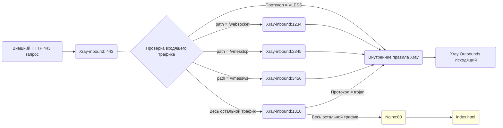

# Обзор функции Fallback

При использовании Xray вы наверняка много раз слышали о функции **"fallback"**. В этой статье мы кратко рассмотрим логику этой функции и способы ее применения.

## 1. Что такое Fallback в простых словах

Если вы использовали [конфигурацию Xray](../level-0/ch07-xray-server.md#_7-4-配置xray) из нашего руководства и настроили [автоматическое перенаправление HTTP на HTTPS](../level-0/ch07-xray-server.md#_7-8-服务器优化之二-开启http自动跳转https), то у вас уже есть простой fallback на основе протокола `VLESS`:

```json
{
  "inbounds": [
    {
      "port": 443,
      "protocol": "vless",
      "settings": {
        "clients": [
          // ... ...
        ],
        "decryption": "none",
        "fallbacks": [
          {
            "dest": 8080 // По умолчанию перенаправлять на прокси-сервер, защищенный от сканирования
          }
        ]
      },
      "streamSettings": {
        // ... ...
      }
    }
  ]
}
```

Как объяснить этот фрагмент конфигурации простыми словами?

1. **`Xray` прослушивает порт `[inbound port]`  `443`**

    Это означает, что `Xray` отвечает за прослушивание трафика `HTTPS` на порту `443`.

2. **`Xray` использует протокол `[inbound protocol]`  `vless`**

    Только трафик протокола `vless` будет обрабатываться `Xray`  и перенаправляться на исходящие модули.

    ::: warning
    **Примечание:** Легковесный протокол `VLESS`  был разработан с целью добавления функции fallback в `xray`, `v2fly`  и другие ядра, а также для уменьшения избыточных проверок/шифрования. (Конечно, на данный момент протокол `trojan`  в `xray`  также полностью поддерживает функцию fallback.)
    :::

3. **Целевой порт fallback  `[fallback dest]`  -  `8080`**

    После того, как `Xray`  получает входящий трафик на порт `443`, трафик протокола `vless`  обрабатывается внутренне и перенаправляется на исходящий модуль. Другой трафик, не относящийся к протоколу `vless`, перенаправляется на порт `8080`.

    ::: warning
    **Вопрос:** Использовать единственное или множественное число?

    Ответ: Внимательные читатели, должно быть, заметили, что в файле конфигурации используются множественные числа `inbounds`, `fallbacks`, но почему я использую единственное число: `inbound`, `fallback`?

    Потому что множественное число в файле конфигурации означает, что `xray`  поддерживает N элементов одного уровня (т.е. N входящих, M резервных и т.д.), а в приведенном выше примере анализа используется только один, поэтому я использовал единственное число.
    :::

4. **Трафик, перенаправляемый на порт `8080`, обрабатывается последующей программой**

    В нашем примере порт `8080`  обрабатывается `Nginx`, который находит и отображает страницу с маленькой пандой в соответствии с конфигурацией.

5. **В итоге, полный маршрут данных в нашем примере выглядит следующим образом:**

   ```mermaid
   graph LR;

   W(Внешний HTTP:80 запрос) --> N80(HTTP:80)

   subgraph Nginx Внешнее прослушивание
   N80 -.- N301(301 перенаправление) -.- N443(HTTPS:443)
   end

   N443 --> X(Xray прослушивает 443) .- X1{Проверка входящего трафика}
   X1 --> |Трафик VLESS| X2(Внутренние правила Xray)
   X2 --> O(Xray Outbounds Исходящий)
   X1 ==> |Fallback не VLESS трафика| N8080(Nginx:8080)
   N8080:::nginxclass ==> H(index.html)

   H:::nginxclass
   classDef nginxclass fill:#FFFFDE

   ```

## 2. Что такое Fallback (ЧТО, КАК `v1`)

Основываясь на приведенном выше примере, вы должны понять, что такое fallback (Что) и как он работает (Как), проще говоря, вот эти несколько элементов:

1. Fallback происходит после того, как трафик поступает на **порт прослушивания `Xray`**.
2. Fallback основывается на таких характеристиках трафика, как **тип протокола**.
3. Целью fallback является определенный **порт**.
4. Трафик, для которого выполнен fallback, обрабатывается программой, прослушивающей **порт fallback**.

## 3. Зачем нужен Fallback (ЗАЧЕМ `v1`)

Изначально он был предназначен для защиты от **активного зондирования** (Active Probing).

**Активное зондирование:** Проще говоря, это означает, что внешние злоумышленники отправляют определенные сетевые запросы и интерпретируют ответы сервера, чтобы определить, запущены ли на сервере такие прокси-инструменты, как `xray`, `v2fly`, `shadowsocks` и т.д. Если это удается точно определить, сервер может подвергнуться атаке или блокировке.

Интерпретировать ответы сервера можно потому, что полный запрос данных на самом деле состоит из множества этапов обмена данными, и на каждом этапе генерируются определенные характеристики программного обеспечения. Проще говоря:

- Ответ обычного сайта **обязательно будет** содержать характеристики таких инструментов веб-сервиса и базы данных, как `Nginx`, `Apache`, `MySQL` и т.д.
- Ответ обычного сайта **не будет** содержать характеристики таких прокси-инструментов, как `xray`, `v2fly`, `shadowsocks`  и т.д.

Таким образом, когда мы предоставляем `Xray`  функцию **"fallback"** (как в приведенном выше примере, fallback на `Nginx`), любой запрос, используемый для зондирования, приводит к следующему:

- Зондирующий трафик не может получить доступ к вашим параметрам `VLESS`  и поэтому будет перенаправлен на `Nginx`.
- Весь зондирующий трафик перенаправляется на `Nginx`, поэтому ответ VPS-сервера **обязательно будет** содержать характеристики `Nginx`.
- Поскольку сам `Xray`  не отвечает на зондирующий трафик, ответ VPS **не будет** содержать характеристики `Xray`.

Таким образом, функция **"fallback"**  решает проблему безопасности **активного зондирования** сервера с точки зрения логики взаимодействия данных.

## 4. Полное понимание Fallback (ЧТО, ЗАЧЕМ, КАК `v2`)

Почему нужно снова говорить о fallback? Потому что выше мы рассмотрели только первую версию fallback, основанную на "протоколе" и защите от **активного зондирования**.

В процессе постоянного развития и обновления протокола `VLESS`  и функции `fallback`  командой [RPRX](https://github.com/rprx) постепенно выяснилось, что fallback может быть более гибким и мощным. При условии обеспечения защиты от **активного зондирования** можно в полной мере использовать информацию, содержащуюся в первом пакете данных, для реализации многоэлементного и многоуровневого fallback (например, `path`, `alpn`  и т.д.).

Основываясь на этой концепции разработки, функция **"fallback"**  постепенно превратилась в то, чем она является сейчас, - в механизм, реализующий **полную маскировку --> ws-разделение --> многопротокольное и многопараметрическое разделение**. Финальная версия даже полностью заменила функцию разделения, которую раньше выполняли веб-серверы и другие инструменты. А поскольку описанная выше обработка **"fallback/разделения"** выполняется на этапе определения первого пакета за миллисекунды и не связана с какими-либо операциями с данными, она практически не приводит к потерям производительности.

**Таким образом, сейчас **полноценная функция "fallback" в `Xray`** обладает следующими свойствами:**

- **Безопасность:**  полная защита от атак активного зондирования.
- **Эффективность:**  практически полное отсутствие потерь производительности.
- **Гибкость:**  гибкое разделение данных, повторное использование часто используемых портов (например, 443).

::: tip
Хотя такой подробный подход может показаться несколько утомительным, только он позволяет в полной мере раскрыть уникальные преимущества **полноценного "fallback"**.
:::

## 5. Пример и описание многоуровневого fallback

Теперь, когда мы понимаем, что такое **"полноценный fallback"**, мы можем приступить к настройке многоуровневого fallback.

### 5.1 Сначала скопируем фрагмент конфигурации прослушивания порта 443 на стороне сервера:

```json
{
  "port": 443,
  "protocol": "vless",
  "settings": {
    "clients": [
      {
        "id": "", // Укажите свой UUID
        "flow": "xtls-rprx-vision",
        "level": 0,
        "email": "love@example.com"
      }
    ],
    "decryption": "none",
    "fallbacks": [
      {
        "dest": 1310, // По умолчанию перенаправлять на протокол Trojan Xray
        "xver": 1
      },
      {
        "path": "/websocket", // Обязательно укажите свой путь
        "dest": 1234,
        "xver": 1
      },
      {
        "path": "/vmesstcp", // Обязательно укажите свой путь
        "dest": 2345,
        "xver": 1
      },
      {
        "path": "/vmessws", // Обязательно укажите свой путь
        "dest": 3456,
        "xver": 1
      }
    ]
  },
  "streamSettings": {
    "network": "tcp",
    "security": "tls",
    "tlsSettings": {
      "alpn": ["http/1.1"],
      "certificates": [
        {
          "certificateFile": "/path/to/fullchain.crt", // Укажите путь к вашему сертификату, абсолютный путь
          "keyFile": "/path/to/private.key" // Укажите путь к вашему закрытому ключу, абсолютный путь
        }
      ]
    }
  }
}
```

Как объяснить этот фрагмент конфигурации простыми словами?

1. **`Xray` прослушивает порт (`inbound port`)  `443`**

    Это означает, что `Xray` отвечает за прослушивание трафика `HTTPS` на порту `443`  и использует сертификат `TLS`, указанный в `certificates`, для аутентификации.

2. **`Xray` использует протокол (`inbound protocol`)  `vless`**

    Трафик протокола `vless`  напрямую передается в `Xray`  для дальнейшей обработки.

3. **Трафик, не относящийся к протоколу `VLESS`, перенаправляется на 4 различных порта fallback:**

    1. Трафик с `path`, равным `websocket`, перенаправляется на порт `1234`  для дальнейшей обработки.
    2. Трафик с `path`, равным `vmesstcp`, перенаправляется на порт `2345`  для дальнейшей обработки.
    3. Трафик с `path`, равным `vmessws`, перенаправляется на порт `3456`  для дальнейшей обработки.
    4. Весь остальной трафик перенаправляется на порт `1310`  для дальнейшей обработки.

4. **`xver`, равный `1`, означает, что функция `proxy protocol`  включена, и реальный IP-адрес источника будет передан дальше.**

5. **Структура fallback показана на рисунке ниже:**

   ```mermaid
   graph LR;

   W443(Внешний HTTP:443 запрос) --> X443(Xray-inbound: 443) .- X1{Проверка входящего трафика}
   X1 --> |Протокол = VLESS| X2(Внутренние правила Xray)
   X2 --> O(Xray Outbounds Исходящий)

   X1 --> |path = /websocket| X1234(Xray-inbound:1234)
   X1 --> |path = /vmesstcp| X2345(Xray-inbound:2345)
   X1 --> |path = /vmessws| X3456(Xray-inbound:3456)
   X1 --> |Весь остальной трафик| X1310(Xray-inbound:1310)

   ```

6. **Куда делся fallback на веб-страницу?**

    Верно, внимательные читатели должны были заметить, что `fallback на nginx`, защищающий от **активного зондирования**, исчез!!! Почему? Не опасно ли это? Не волнуйтесь, давайте разбираться дальше:

### 5.2 Фрагмент конфигурации, отвечающий за обработку fallback:

1. Трафик, перенаправляемый на порт `1310`, обрабатывается в соответствии со следующей конфигурацией:

   ```json
   {
     "port": 1310,
     "listen": "127.0.0.1",
     "protocol": "trojan",
     "settings": {
       "clients": [
         {
           "password": "", // Укажите свой пароль
           "level": 0,
           "email": "love@example.com"
         }
       ],
       "fallbacks": [
         {
           "dest": 80 // Или перенаправлять на другой прокси-сервер, защищенный от сканирования
         }
       ]
     },
     "streamSettings": {
       "network": "tcp",
       "security": "none",
       "tcpSettings": {
         "acceptProxyProtocol": true
       }
     }
   }
   ```

    Смотрите, произошло чудо, в протоколе `trojan`  появился новый `fallbacks`. Как уже говорилось ранее, протокол `trojan`  в `xray`  также обладает полной функциональностью fallback, поэтому на этом этапе протокол `trojan`  может снова выполнять проверку и fallback (это и есть легендарный "fallback в fallback"):

    - Весь трафик протокола `trojan`  передается в `Xray`  для дальнейшей обработки.
    - Весь остальной трафик перенаправляется на порт `80`. **Защита от активного зондирования** реализована!

2. Трафик, перенаправляемый на порт `1234`, на самом деле является `vless+ws`:

   ```json
   {
     "port": 1234,
     "listen": "127.0.0.1",
     "protocol": "vless",
     "settings": {
       "clients": [
         {
           "id": "", // Укажите свой UUID
           "level": 0,
           "email": "love@example.com"
         }
       ],
       "decryption": "none"
     },
     "streamSettings": {
       "network": "ws",
       "security": "none",
       "wsSettings": {
         "acceptProxyProtocol": true, // Напоминание: если вы используете Nginx/Caddy и т.д. для обратного проксирования WS, удалите эту строку
         "path": "/websocket" // Обязательно укажите свой путь, он должен совпадать с путем разделения
       }
     }
   }
   ```

3. Трафик, перенаправляемый на порт `2345`, на самом деле является прямым подключением `vmess`:

   ```json
   {
     "port": 2345,
     "listen": "127.0.0.1",
     "protocol": "vmess",
     "settings": {
       "clients": [
         {
           "id": "", // Укажите свой UUID
           "level": 0,
           "email": "love@example.com"
         }
       ]
     },
     "streamSettings": {
       "network": "tcp",
       "security": "none",
       "tcpSettings": {
         "acceptProxyProtocol": true,
         "header": {
           "type": "http",
           "request": {
             "path": [
               "/vmesstcp" // Обязательно укажите свой путь, он должен совпадать с путем разделения
             ]
           }
         }
       }
     }
   }
   ```

4. Трафик, перенаправляемый на порт `3456`, на самом деле является `vmess+ws(+cdn)`.

   ::: warning
   Да, вы не ослышались, это одна из комбинаций, рекомендованных v2fly, и она полностью поддерживает `CDN`. Теперь она добавлена в наш идеальный набор fallback!
   :::

   ```json
   {
     "port": 3456,
     "listen": "127.0.0.1",
     "protocol": "vmess",
     "settings": {
       "clients": [
         {
           "id": "", // Укажите свой UUID
           "level": 0,
           "email": "love@example.com"
         }
       ]
     },
     "streamSettings": {
       "network": "ws",
       "security": "none",
       "wsSettings": {
         "acceptProxyProtocol": true, // Напоминание: если вы используете Nginx/Caddy и т.д. для обратного проксирования WS, удалите эту строку
         "path": "/vmessws" // Обязательно укажите свой путь, он должен совпадать с путем разделения
       }
     }
   }
   ```

5. Теперь мы можем нарисовать полную схему fallback:



## 6. Заключение

На этом обзор функции **"fallback"**  в `Xray`  завершен. Надеемся, что эта статья поможет вам лучше понять возможности `Xray`.

## 7. Дополнительное задание

Позвольте мне нагло оставить вам дополнительное задание: есть ли что-то, что можно оптимизировать в шаблоне [VLESS-TCP-XTLS-WHATEVER](https://github.com/XTLS/Xray-examples/blob/main/VLESS-TCP-XTLS-WHATEVER/), описанном в этой статье?

Подсказка: автоматическое перенаправление HTTP на HTTPS.
