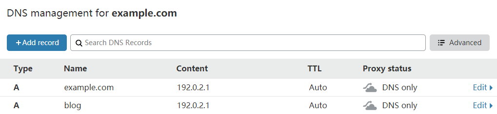
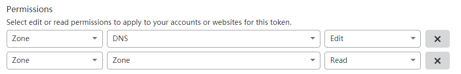

# Маскировка и разделение трафика по доменам с помощью функции SNI Fallback

VLESS - это очень легкий протокол, который, как и Trojan, не использует сложного шифрования и обфускации трафика. Вместо этого он, подобно тому, как искусный мастер кунг-фу скрывает свою силу, шифрует трафик с помощью протокола TLS, маскируя его под обычный HTTPS-трафик и позволяя ему беспрепятственно проходить через Великий китайский файрвол. Для лучшей маскировки от активного зондирования вместе с VLESS была представлена функция Fallbacks (резервирование). В этой статье мы рассмотрим, как использовать функцию Fallbacks входящего протокола VLESS в Xray совместно с Nginx или Caddy для реализации разделения трафика по доменам при обеспечении полной маскировки.

## Сценарии использования

Из-за XTLS Xray необходимо прослушивать порт 443, что создает проблему, если на сервере уже запущен веб-сайт - сайт либо не сможет работать, либо его придется запускать на другом порту, что нежелательно. Есть три способа решить эту проблему:

- Xray прослушивает другие часто используемые порты (например, 22, 3389, 8443).

  Это самое простое решение, но оно не идеально.

- Nginx или HAProxy прослушивает порт 443 и выполняет обратное проксирование на уровне L4 с разделением трафика по SNI, что позволяет использовать один порт для нескольких сервисов.

  Этот вариант более сложный и требует определенных знаний Nginx или HAProxy, поэтому мы не будем его здесь подробно рассматривать.

- Xray прослушивает порт 443 и использует функцию Fallbacks для перенаправления трафика веб-сайта на Nginx или Caddy на основе SNI.

  Этот вариант имеет среднюю сложность и является тем, который мы рассмотрим в этом руководстве.

## Что такое SNI

**SNI** (Server Name Indication) - это расширение протокола TLS. Те, кто знаком с обратным проксированием, знают, что для правильной маршрутизации трафика по доменному имени необходимо следующее правило:

```nginx
proxy_set_header Host имя_хоста;
```

Эта строка устанавливает HTTP-заголовок "Host" на определенное имя хоста. Зачем это нужно? Обычно у одного сервера один IP-адрес, но на нем может быть запущено несколько сайтов. Пользователи получают IP-адрес по доменному имени и обращаются к серверу, но как сервер определяет, какой именно сайт запрашивает пользователь? Для этого используются виртуальные хосты, основанные на имени.

Когда веб-сервер получает запрос, он проверяет заголовок "Host" и направляет пользователя на нужный сайт. Однако, когда HTTP-трафик шифруется с помощью TLS, этот простой метод перестает работать. TLS-рукопожатие происходит до того, как сервер увидит какие-либо HTTP-заголовки, поэтому сервер не может использовать информацию из заголовка "Host", чтобы решить, какой сертификат предоставить, и тем более не может определить, к какому сайту обращается пользователь.

SNI решает эту проблему, позволяя клиенту отправлять имя хоста как часть TLS-рукопожатия. Поэтому при использовании Nginx для обратного проксирования HTTPS-трафика необходимо добавить в конфигурацию `proxy_ssl_server_name on;`. В этом случае Nginx будет отправлять информацию SNI на проксируемый сервер, решая проблему неработающих виртуальных хостов по HTTPS. Кроме того, при использовании SNI можно получить доступ к нужному сайту, даже не указывая заголовок "Host".

## Идея



После получения трафика на порт 443 Xray расшифровывает TLS и перенаправляет трафик с длиной первого пакета менее 18 байт, неверной версией протокола или ошибкой аутентификации на адрес, указанный в `dest`, на основе совпадения `name`, `path` или `alpn`.

## Добавление DNS-записей



Измените домен и IP-адрес в соответствии с вашей ситуацией.

## Запрос TLS-сертификата

Поскольку нам нужно разделять трафик по доменам с разными поддоменами, а wildcard-сертификат покрывает только домены между двумя точками (например, сертификат для `*.example.com` не будет действовать для `example.com` и `*.*.example.com`), нам нужно запросить wildcard-сертификат с [SAN](https://ru.wikipedia.org/wiki/Subject_Alternative_Name). Согласно информации на сайте Let's Encrypt[^1], для запроса wildcard-сертификата требуется проверка DNS-01. В этом руководстве мы рассмотрим, как запросить бесплатный TLS-сертификат Let's Encrypt с помощью [acme.sh](https://acme.sh) для домена, управляемого Cloudflare. Инструкции для других провайдеров DNS можно найти в [dnsapi · acmesh-official/acme.sh Wiki](https://github.com/acmesh-official/acme.sh/wiki/dnsapi).

Сначала нужно создать API-токен на [панели управления Cloudflare](https://dash.cloudflare.com/profile/api-tokens). Параметры следующие:



Настройка прав доступа очень важна, остальные параметры можно оставить по умолчанию.

После создания вы получите строку символов - это и есть ваш API-токен (`CF_Token`). Сохраните его в надежном месте, так как он больше не будет отображаться.

::: tip Внимание
Следующие действия необходимо выполнять от имени пользователя root. Использование sudo может привести к ошибкам.
:::

```bash
curl https://get.acme.sh | sh # Установка acme.sh
export CF_Token="sdfsdfsdfljlbjkljlkjsdfoiwje" # Установка переменной окружения с API-токеном
acme.sh --issue -d example.com -d *.example.com --dns dns_cf # Запрос сертификата с проверкой DNS-01
mkdir /etc/ssl/xray # Создание каталога для хранения сертификата
acme.sh --install-cert -d example.com --fullchain-file /etc/ssl/xray/cert.pem --key-file /etc/ssl/xray/privkey.key --reloadcmd "chown nobody:nogroup -R /etc/ssl/xray && systemctl restart xray" # Установка сертификата в указанный каталог и настройка команды для автоматического перезапуска Xray после обновления сертификата
```

## Конфигурация Xray

```json
{
  "log": {
    "loglevel": "warning"
  },
  "inbounds": [
    {
      "port": 443,
      "protocol": "vless",
      "settings": {
        "clients": [
          {
            "id": "UUID",
            "flow": "xtls-rprx-vision"
          }
        ],
        "decryption": "none",
        "fallbacks": [
          {
            "name": "example.com",
            "path": "/vmessws",
            "dest": 5000,
            "xver": 1
          },
          {
            "dest": 5001,
            "xver": 1
          },
          {
            "alpn": "h2",
            "dest": 5002,
            "xver": 1
          },
          {
            "name": "blog.example.com",
            "dest": 5003,
            "xver": 1
          },
          {
            "name": "blog.example.com",
            "alpn": "h2",
            "dest": 5004,
            "xver": 1
          }
        ]
      },
      "streamSettings": {
        "network": "tcp",
        "security": "tls",
        "tlsSettings": {
          "alpn": ["h2", "http/1.1"],
          "certificates": [
            {
              "certificateFile": "/etc/ssl/xray/cert.pem",
              "keyFile": "/etc/ssl/xray/privkey.key"
            }
          ]
        }
      }
    },
    {
      "listen": "127.0.0.1",
      "port": 5000,
      "protocol": "vmess",
      "settings": {
        "clients": [
          {
            "id": "UUID"
          }
        ]
      },
      "streamSettings": {
        "network": "ws",
        "wsSettings": {
          "acceptProxyProtocol": true,
          "path": "/vmessws"
        }
      }
    }
  ],
  "outbounds": [
    {
      "protocol": "freedom"
    }
  ]
}
```

Эта конфигурация предназначена для Nginx. Обратите внимание на следующие детали:

- О Proxy Protocol

  Proxy Protocol - это протокол, разработанный HaProxy для решения проблемы потери информации о клиенте при проксировании, часто используемый в цепочках прокси-серверов и обратных прокси. Традиционные методы решения этой проблемы, как правило, сложны и имеют много ограничений, в то время как Proxy Protocol очень прост - он просто добавляет пакет данных с информацией об исходном соединении (четверка "источник-назначение:порт") при передаче данных.

  У всего есть свои плюсы и минусы, и Proxy Protocol не исключение.

  - Если есть отправка, должен быть и прием, и наоборот.
  - Один и тот же порт не может одновременно поддерживать соединения с данными Proxy Protocol и без них (например, разные виртуальные хосты (server) Nginx на одном порту, что по сути является следствием предыдущего пункта)[^2][^3].

  Если вы столкнулись с ошибками, убедитесь, что ваша конфигурация соответствует этим условиям.

  Здесь мы используем Proxy Protocol, чтобы целевой сервер, на который перенаправляется трафик, получал реальный IP-адрес клиента.

  Кроме того, если в конфигурации входящего трафика Xray есть `"acceptProxyProtocol": true`, ReadV будет отключен.

- О HTTP/2

  Во-первых, порядок элементов в `inbounds.streamSettings.tlsSettings.alpn` важен: `h2` должен быть перед `http/1.1`, чтобы обеспечить совместимость при использовании HTTP/2. Обратный порядок приведет к тому, что HTTP/2 будет понижен до HTTP/1.1 во время согласования, делая конфигурацию недействительной.

  В приведенной выше конфигурации каждая запись fallback для Nginx разделена на две. Это связано с тем, что h2 - это обязательное зашифрованное соединение HTTP/2, что хорошо для безопасности передачи данных в Интернете, но не нужно внутри сервера. h2c же - это незашифрованное соединение HTTP/2, подходящее для этой среды. Однако Nginx не может одновременно прослушивать HTTP/1.1 и h2c на одном порту. Чтобы решить эту проблему, необходимо указать `alpn` (в разделе `fallbacks`, а не `tlsSettings`), чтобы сопоставить результаты согласования TLS ALPN.

  Рекомендуется указывать `alpn` только в двух случаях[^4]:

  - опустить
  - `"h2"`

  Если вы используете Caddy, то вам не нужно так усложнять, поскольку он **может** одновременно прослушивать HTTP/1.1 и h2c на одном порту. Изменения в конфигурации следующие:

  ```json
  {
    "fallbacks": [
      {
        "name": "example.com",
        "path": "/vmessws",
        "dest": 5000,
        "xver": 1
      },
      {
        "dest": 5001,
        "xver": 1
      },
      {
        "name": "blog.example.com",
        "dest": 5002,
        "xver": 1
      }
    ]
  }
  ```

## Конфигурация Nginx

Nginx будет установлен из официального репозитория.

```bash
sudo apt install curl gnupg2 ca-certificates lsb-release
echo "deb [arch=amd64] http://nginx.org/packages/ubuntu `lsb_release -cs` nginx" \
    | sudo tee /etc/apt/sources.list.d/nginx.list
curl -fsSL https://nginx.org/keys/nginx_signing.key | sudo apt-key add -
sudo apt update
sudo apt install nginx
```

Удалите `/etc/nginx/conf.d/default.conf` и создайте `/etc/nginx/conf.d/fallbacks.conf` со следующим содержимым:

```nginx
set_real_ip_from 127.0.0.1;
real_ip_header proxy_protocol;

server {
    listen 127.0.0.1:5001 proxy_protocol default_server;
    listen 127.0.0.1:5002 proxy_protocol default_server http2;

    location / {
        root /srv/http/default;
    }
}

server {
    listen 127.0.0.1:5003 proxy_protocol;
    listen 127.0.0.1:5004 proxy_protocol http2;

    server_name blog.example.com;

    location / {
        root /srv/http/blog.example.com;
    }
}

server {
    listen 80;
    return 301 https://$host$request_uri;
}
```

## Конфигурация Caddy

Инструкции по установке Caddy можно найти в [Install — Caddy Documentation](https://caddyserver.com/docs/install).

Чтобы Caddy мог получать реальный IP-адрес посетителя, необходимо скомпилировать Caddy с модулем Proxy Protocol. Рекомендуется скомпилировать его прямо на сайте Caddy.

```bash
sudo curl -o /usr/bin/caddy "https://caddyserver.com/api/download?os=linux&arch=amd64&p=github.com%2Fmastercactapus%2Fcaddy2-proxyprotocol&idempotency=79074247675458"
sudo chmod +x /usr/bin/caddy
```

Просто замените существующий бинарный файл.

::: tip
Рекомендуется сначала установить Caddy, следуя инструкциям на официальном сайте, а затем заменить бинарный файл. Это избавит от необходимости настраивать запуск сервиса вручную.
:::

Отредактируйте `/etc/caddy/Caddyfile`:

```Caddyfile
{
    servers 127.0.0.1:5001 {
        listener_wrappers {
            proxy_protocol
        }
	protocol {
            allow_h2c
        }
    }
    servers 127.0.0.1:5002 {
        listener_wrappers {
            proxy_protocol
        }
	protocol {
            allow_h2c
        }
    }
}

:5001 {
    root * /srv/http/default
    file_server
    log
    bind 127.0.0.1
}

http://blog.example.com:5002 {
    root * /srv/http/blog.example.com
    file_server
    log
    bind 127.0.0.1
}

:80 {
    redir https://{host}{uri} permanent
}
```

## Ссылки

1. [Указание имени сервера - Википедия](https://ru.wikipedia.org/wiki/Указание_имени_сервера)
2. [Home · acmesh-official/acme.sh Wiki](https://github.com/acmesh-official/acme.sh/wiki)
3. [HTTP/2 - Википедия](https://ru.wikipedia.org/wiki/HTTP/2)

## Примечания

[^1]: [Часто задаваемые вопросы - Let's Encrypt - бесплатные SSL/TLS сертификаты](https://letsencrypt.org/ru/docs/faq/)
[^2]: [Proxy Protocol - HAProxy Technologies](https://www.haproxy.com/blog/haproxy/proxy-protocol/)
[^3]: [proxy protocol 介绍及 nginx 配置 - 简书](https://www.jianshu.com/p/cc8d592582c9)
[^4]: [v2fly-github-io/vless.md at master · rprx/v2fly-github-io](https://github.com/rprx/v2fly-github-io/blob/master/docs/config/protocols/vless.md)


