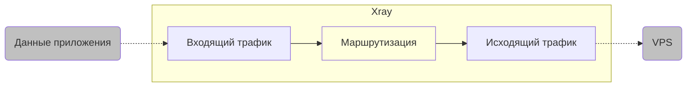
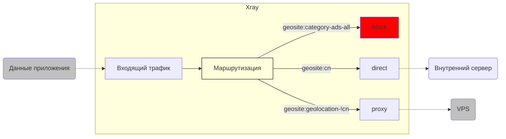
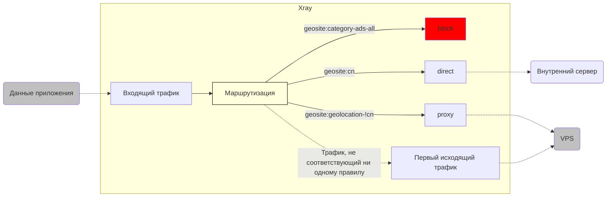
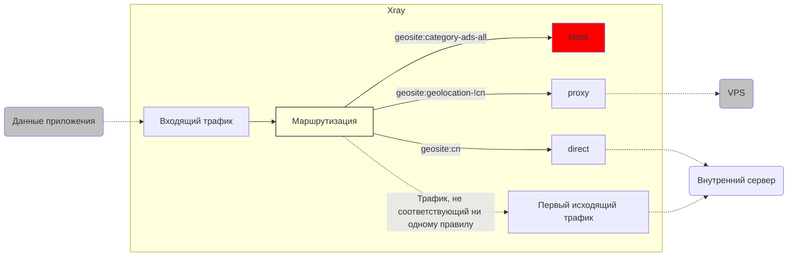

# Краткий обзор функции маршрутизации (routing) (часть 1)

Если "мощность" Xray в основном заключается в его высокой скорости и широкой совместимости, то его "гибкость" в первую очередь связана с продуманной функцией **"routing" (маршрутизация)**. В этой статье мы кратко рассмотрим логику этой функции и способы ее применения.

## 1. Знакомство с тремя братьями-маршрутизаторами

Чтобы понять маршрутизацию, нужно понимать, что для ее полноценной работы нужны три компонента: 1. **входящий трафик** (inbound); 2. **маршрутизация** (routing); 3. **исходящий трафик** (outbound).


Три брата, поклявшиеся в верности, не обязательно родились в один день, но должны быть готовы умереть в один день.

Поэтому запомните: если один из элементов работает неправильно, функция маршрутизации может не работать.

Поскольку маршрутизация очень гибкая, чтение только технической документации может вас запутать, поэтому в этой статье мы будем использовать конкретные примеры, чтобы объяснить все пошагово.

::: warning 
Функция маршрутизации настолько гибкая, что примеры в этой статье приведены только для объяснения соответствующих концепций. На практике, пожалуйста, корректируйте их в соответствии с вашими потребностями.
:::

## 2. Основы: "Братья едины"

На рисунке ниже показан пример, когда входящий трафик от приложения поступает на `Xray` на клиенте, маршрутизируется на исходящий трафик и отправляется на VPS.



Давайте проанализируем каждый шаг:

### 2.1 Входящий трафик

::: tip
**Входящий трафик (inbound):** это то, как трафик попадает в `Xray`.
:::

Пример конфигурации входящего трафика ниже означает, что данные поступают в `Xray` по протоколу `socks` через порт `10808` с локального адреса `127.0.0.1`.  `Xray`  присваивает этому входящему трафику имя `inbound-10808` с помощью `[tag]`.

```json
{
  "inbounds": [
    {
      "tag": "inbound-10808",
      "protocol": "socks",
      "listen": "127.0.0.1",
      "port": 10808,
      "settings": {
        "udp": true
      }
    }
  ]
}
```

### 2.2 Исходящий трафик

::: tip
**Исходящий трафик (outbound):** это то, как трафик выходит из `Xray`.
:::

Пример конфигурации исходящего трафика ниже означает, что данные отправляются на соответствующий VPS по протоколу `VLESS` с использованием `tcp + xtls` и других параметров. `Xray`  присваивает этому исходящему трафику имя `proxy-out-vless` с помощью `[tag]`.

```json
{
  "outbounds": [
    {
      "tag": "proxy-out-vless",
      "protocol": "vless",
      "settings": {
        "vnext": [
          {
            "address": "a-name.yourdomain.com",
            "port": 443,
            "users": [
              {
                "id": "uuiduuid-uuid-uuid-uuid-uuiduuiduuid",
                "flow": "xtls-rprx-vision",
                "encryption": "none",
                "level": 0
              }
            ]
          }
        ]
      },
      "streamSettings": {
        "network": "tcp",
        "security": "tls",
        "tlsSettings": {
          "serverName": "a-name.yourdomain.com",
          "allowInsecure": false,
          "fingerprint": "chrome"
        }
      }
    }
  ]
}
```

### 2.3 Маршрутизация

::: tip
**Маршрутизация (routing):** это соединение канала между **входящим** и **исходящим** трафиком с помощью определенного **условия**.
:::

Пример конфигурации маршрутизации ниже означает, что весь трафик, поступающий в `Xray`  через входящий трафик с `[tag]="inbound-10808"`,  **на 100%** перенаправляется на исходящий трафик с `[tag]="proxy-out-vless"` без разделения или каких-либо других действий.

```json
{
  "routing": {
    "domainStrategy": "AsIs",
    "rules": [
      {
        "type": "field",
        "inboundTag": ["inbound-10808"],
        "outboundTag": "proxy-out-vless"
      }
    ]
  }
}
```

Таким образом, мы реализовали очень простое правило, описанное в начале: **входящий трафик от приложения поступает на `Xray`  на клиенте, маршрутизируется на исходящий трафик и отправляется на VPS**.

### 2.4 Анализ параметров конфигурации маршрутизации: критерии фильтрации трафика

Обратите внимание на конфигурацию маршрутизации. Мы видим несколько новых терминов:

1. `"domainStrategy": "AsIs"`
2. `“rules”`
3. `"type": "field"`
4. `"inboundTag": ["inbound-10808"]`
5. `"outboundTag": "proxy-out-vless"`

Пока оставим `domainStrategy`  в стороне и кратко объясним остальные:

| Название параметра | Значение параметра | Описание параметра |
| :---------------- | :----------------- | :------------------ |
| `“rules”`        |  &nbsp; &nbsp; &nbsp; &nbsp; &nbsp; &nbsp; &nbsp; &nbsp; &nbsp; &nbsp; &nbsp; &nbsp; &nbsp; &nbsp; &nbsp; &nbsp; &nbsp; &nbsp; &nbsp; &nbsp; &nbsp; &nbsp; &nbsp; &nbsp; &nbsp; &nbsp; | Внутри этого параметра находятся подробные настройки **правил маршрутизации**. |
| `"type"`         | `"field"`           | На данный момент этот параметр не имеет особого значения, но его нельзя опускать, поэтому просто укажите его. |
| `"inboundTag"`    | `["inbound-10808"]`  | **Критерий** фильтрации трафика - это **тег входящего трафика**, а **условие** сейчас только одно: **источник входящего трафика - `inbound-10808`**. |
| `"outboundTag"`   | `"proxy-out-vless"`  | Если указанное выше условие фильтрации выполняется (т.е. входящий трафик имеет `[tag]="inbound-10808"`), `Xray`  направит трафик на исходящий трафик с `[tag]="proxy-out-vless"`. |

В этом примере у нас есть только один входящий трафик с `"inboundTag" = "inbound-10808"`  и один исходящий трафик с `[tag]="proxy-out-vless"`.  Поэтому, согласно приведенному выше правилу маршрутизации, весь трафик, поступающий в `Xray`  через порт `10808`,  **на 100%** соответствует условиям фильтрации, выбирается модулем маршрутизации и перенаправляется на единственный исходящий трафик.

Таким образом, **входящий трафик**, **маршрутизация** и **исходящий трафик** уже могут работать вместе. Конечно, в данном случае 100% перенаправление не имеет особого смысла. Давайте посмотрим, какие преимущества может дать такой механизм разделения труда.

## 3. Первые шаги: "Разделение мира на три части" - "Разделение по домену"

> `[geosite.dat]`



Эта конфигурация реализует самый простой и распространенный (используемый в нашем руководстве) набор правил маршрутизации:

1. Блокировка рекламы (`[block]`)
2. Прямое подключение к внутренним ресурсам (`[direct]`)
3. Перенаправление трафика на VPS (`[proxy]`)

::: warning Внимание
В нашем руководстве прямое подключение настроено для **внутренних доменов**, **внутренних IP-адресов** и **локальных IP-адресов**. Здесь мы рассмотрим только **внутренние домены**.
:::

### 3.1 Входящий трафик

Оставляем `inbound-10808` из предыдущего примера без изменений.

### 3.2 Исходящий трафик

В предыдущем примере у нас уже есть исходящий трафик `[proxy]` - `"proxy-out-vless"`, поэтому он остается без изменений. Очевидно, что нам нужно добавить два новых типа исходящего трафика: `[block]` и `[direct]`, как показано ниже:

```json
{
  "outbounds": [
    {
      "tag": "proxy-out-vless"
      // ... ...
    },
    {
      "tag": "block",
      "protocol": "blackhole"
    },
    {
      "tag": "direct-out",
      "protocol": "freedom"
    }
  ]
}
```

Приведенная выше конфигурация означает:

1. Конфигурация исходящего трафика `[proxy-out-vless]` из предыдущего примера остается без изменений.
2. Добавлен протокол **`blackhole` (черная дыра)**. Трафик, отправляемый через этот протокол, попадает в "черную дыру" внутри `Xray`  и не может выйти наружу, что фактически блокирует его (`[block]`).
3. Добавлен протокол **`freedom` (свобода)**. Трафик, отправляемый через этот протокол, свободно покидает `Xray`  и следует к своему первоначальному адресу, как будто его и не было, что фактически означает прямое подключение (`[direct]`). (Здесь я назвал его `[direct-out]`, чтобы подчеркнуть, что это исходящий трафик).

### 3.3 Маршрутизация

Настало время для чуда! Мы можем связать все это вместе с помощью конфигурации **маршрутизации**!

```json
{
  "routing": {
    "domainStrategy": "AsIs",
    "rules": [
      {
        "type": "field",
        "domain": ["geosite:category-ads-all"],
        "outboundTag": "block"
      },
      {
        "type": "field",
        "domain": ["geosite:cn"],
        "outboundTag": "direct-out"
      },
      {
        "type": "field",
        "domain": ["geosite:geolocation-!cn"],
        "outboundTag": "proxy-out-vless"
      }
    ]
  }
}
```

Чтобы понять этот файл конфигурации, нам нужно кратко объяснить несколько новых параметров:

- `"domain": ["geosite:category-ads-all"]`
- `"domain": ["geosite:cn"]`
- `"domain": ["geosite:geolocation-!cn"]`

### 3.4 Краткий обзор файла доменов: `geosite.dat`

На самом деле, вы, вероятно, уже догадались по названиям этих параметров:

- `"domain"`: **критерий** фильтрации трафика в этот раз - это **доменное имя** (а не тег входящего трафика).
- `"geosite"`: `Xray`  будет искать **соответствующие доменные имена** в файле `geosite.dat`.
- `"category-ads-all"`: **все рекламные домены**, указанные в этом файле.
- `"cn"`: **китайские домены**, указанные в этом файле.
- `"geolocation-!cn"`: **не китайские домены**, указанные в этом файле.

С учетом этих пояснений конфигурацию из пункта 3.3 можно перевести так:

1. Трафик от приложений, пытающихся получить доступ к иностранным доменам (`"domain": "geolocation-!cn"`), перенаправляется на VPS через исходящий трафик `[proxy-out-vless]`.
2. Трафик от приложений, пытающихся получить доступ к иностранным рекламным доменам (`"domain": "geosite:category-ads-all"`), блокируется (`[block]`) путем перенаправления в "черную дыру".
3. Трафик от приложений, пытающихся получить доступ к китайским доменам (`"domain": "geosite:cn"`), отправляется напрямую (`[direct-out]`).

Вот так проявляются преимущества **функции маршрутизации**.

### 3.5 Так что же такое `geosite.dat`? Разве у нас нет `GFWList`?

Представьте, что в мире миллионы доменов. Если бы нам приходилось вручную собирать и вводить каждый домен для каждого правила маршрутизации, основанного на доменном имени, это было бы крайне неэффективно!

А если бы все домены относились только к одному типу и могли быть обработаны только одним из трех способов: `[direct], [proxy], [block]`, это было бы очень неудобно!

Как Гуань Юю нужен его Цинлун Яньюэдао, так и **функции маршрутизации** нужен свой волшебный меч - файл `geosite.dat`, который представляет собой готовый к использованию **список категорий доменов**. Он позволяет пользователям легко вызывать любую подкатегорию с помощью формата `geosite:xxx` и настраивать правила маршрутизации в соответствии со своими потребностями.

Такая модульная структура обеспечивает гораздо большую гибкость, чем традиционный список заблокированных доменов [`GFWList`](https://github.com/gfwlist/gfwlist). Например, вы можете указать, что домены Apple (`geosite:apple`) и домены, связанные с iCloud (`geosite:icloud`), должны проксироваться (`[proxy]`), а домены обновлений Apple (`geosite:apple-update`) должны подключаться напрямую (`[direct]`) для максимальной скорости загрузки.

::: warning
**Внимание:**  на данный момент существует несколько вариантов файла `geosite.dat`:

- Изначально, когда `Victoria Raymond`  активно занималась проектом `Project V`, она предоставляла соответствующий проект [`domain-list-community`](https://github.com/v2ray/domain-list-community), который использовался для сбора, хранения и классификации часто используемых типов доменов.
- После того, как Виктория внезапно исчезла, и разработка `Project V`  приостановилась, сообщество `v2fly`  продолжило поддерживать и обновлять свою версию [`domain-list-community`](https://github.com/v2fly/domain-list-community).
- В то же время [@Loyalsoldier](Loyalsoldier) ведет свой собственный, модифицированный и расширенный файл правил маршрутизации [v2ray-rules-dat](https://github.com/Loyalsoldier/v2ray-rules-dat), который предлагает множество различных вариантов и логики классификации.
- Кроме того, команда `Project X`  планирует в будущем создать и поддерживать файл правил маршрутизации [Xray-rules-dat](https://github.com/XTLS/Xray-rules-dat), который будет лучше подходить для использования с `Xray`. ~~(Как видите, папка уже создана, так что это дело времени)~~

Вы даже можете создать свой собственный файл `geosite`  и подключить его к `Xray`, но это выходит за рамки данной статьи, поэтому мы не будем на этом останавливаться.

Если вы обнаружите, что некоторые домены не классифицированы должным образом, пожалуйста, создайте issue или отправьте pull request в один из перечисленных выше проектов! Поддерживайте сообщество - каждый за всех, и все за одного!

:::

### 3.6 Секретное оружие: скрытое правило маршрутизации

На самом деле, если вы внимательно посмотрите на приведенные выше правила, то заметите одну проблему: все наши правила определяют только то, **куда** следует перенаправлять входящий трафик, **если он соответствует определенному условию**. Но что произойдет, если файл `geosite.dat`  неполный, и наш входящий трафик **не соответствует ни одному условию**? Как поступит `Xray`?

::: warning Внимание
Если вы думаете, что **если условие не выполняется, то соединение не будет установлено**, то вам нужно подумать еще раз. Соединение будет разорвано только в том случае, если указано правило `[block]`, которое перенаправляет трафик в "черную дыру" (`blackhole`).
:::

На самом деле, чтобы избежать путаницы из-за неполных правил маршрутизации, `Xray`  предоставляет скрытое правило: **если входящий трафик не соответствует ни одному условию, он перенаправляется на первый исходящий трафик**.

Таким образом, ни один трафик не будет потерян. Поэтому важно поместить ваш самый надежный исходящий трафик на **первое место**, чтобы он служил вам верным стражем.

### 3.7 Снова смотрим на карту "трех царств"

Поскольку в предыдущем примере мы поместили `[proxy-out-vless]`  на первое место в списке исходящего трафика, при срабатывании скрытого правила трафик будет перенаправляться на удаленный VPS по протоколу `VLESS`.  Таким образом, полная логика работы `Xray`  выглядит следующим образом:



Фактически, это и есть то, что традиционно называется **"проксирование по умолчанию, прямой доступ к внутренним сайтам по белому списку"**.

## 4. "Разделение мира на три части" - "Битва Вэй и Шу"

Теперь, когда вы знаете о скрытом правиле маршрутизации по умолчанию (**"если входящий трафик не соответствует ни одному условию, он перенаправляется на первый исходящий трафик"**), вы должны понимать, что то, будет ли **проксирование** или **прямое подключение** основным режимом работы, зависит от того, какой исходящий трафик стоит на первом месте!

На предыдущем шаге мы настроили правило **"проксирование по умолчанию, прямой доступ к внутренним сайтам по белому списку"**.  Теперь, чтобы получить правило **"прямое подключение по умолчанию, проксирование иностранных сайтов по белому списку"**, нам просто нужно **поместить правило прямого подключения на первое место**.

Это очень просто, не правда ли?

```json
{
  "outbounds": [
    {
      "tag": "direct-out",
      "protocol": "freedom"
    },
    {
      "tag": "proxy-out-vless"
      // ... ...
    },
    {
      "tag": "block",
      "protocol": "blackhole"
    }
  ]
}
```

Теперь правила маршрутизации выглядят так:



В этом и заключается гибкость функции маршрутизации - вы можете свободно менять порядок правил для достижения различных результатов.

На этом мы закончили объяснение того, **как использовать файл `geosite.dat`  для разделения сетевого трафика по доменному имени с помощью правил маршрутизации**.

## 5. Покорение новых высот - Различные условия сопоставления маршрутов

Пожалуйста, убедитесь, что вы хорошо усвоили материал, изложенный выше, поскольку это основа для понимания принципов работы **функции маршрутизации**. Имея эту базу, мы можем двигаться дальше и рассмотреть более подробные параметры конфигурации и условия сопоставления.

После того, как вы прочитаете следующий раздел, вы сможете свободно настраивать свои собственные правила маршрутизации! Так чего же мы ждем? Давайте перейдем к [части 2](./routing-lv1-part2.md)!
