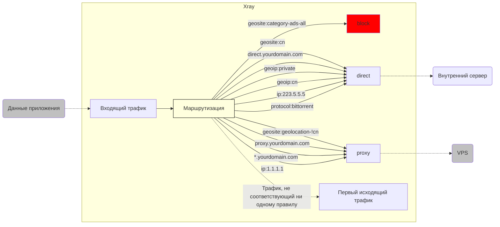

# Краткий обзор функции маршрутизации (routing) (часть 2)

Добро пожаловать на продолжение изучения **функции маршрутизации** в `Xray`!

В [части 1](./routing-lv1-part1.md) мы разобрались с логикой работы **функции маршрутизации** и настроили простое разделение трафика по домену на основе файла `geosite.dat`.

Как уже было сказано, разделение по домену — это лишь верхушка айсберга возможностей **функции маршрутизации**. Давайте посмотрим, что еще, кроме домена, можно использовать в качестве критерия для разделения трафика!

## 5. Покорение новых высот - Различные условия сопоставления маршрутов

> `[домен], [IP], [протокол], etc.`

Разделение по домену уже позволяет нам в общих чертах разделить сетевой трафик. Почему **в общих чертах**?

Потому что, хотя **"разделение мира на три части"** — это правильная стратегия, ее реализация только с помощью **доменов** имеет множество недостатков, например:

1. После прочтения нашего руководства я зарегистрировал новый домен `proxy.yourdomain.com` для своего VPS и хочу, чтобы трафик на него всегда проксировался. Есть ли он в `geosite.dat`?
2. У меня есть еще один домен `direct.yourdomain.com`, и я хочу, чтобы трафик на него всегда шел напрямую. Есть ли он в `geosite.dat`?
3. Правильно ли настроен прямой доступ для локального трафика на `127.0.0.1` (например, `docker`)?
4. Правильно ли настроен прямой доступ для трафика в моей локальной сети `192.168.*.*` (например, роутер, NAS)?
5. Правильно ли настроен прямой доступ для моих DNS-запросов к внутренним DNS-серверам (например, `223.5.5.5`)?
6. Правильно ли настроен прокси для моих DNS-запросов к внешним DNS-серверам (например, `1.1.1.1`)?
7. Правильно ли настроен прямой доступ для других внутренних сайтов, у которых нет доменного имени, а только IP-адрес, как у внутренних DNS-серверов?
8. Правильно ли настроен прокси для других внешних сайтов, у которых нет доменного имени, а только IP-адрес, как у внешних DNS-серверов?
9. Как настроить принудительное прямое подключение для торрент-трафика, который, хотя и поступает извне, может привести к блокировке VPS при проксировании?
10. ......

Я говорю, что разделение по домену имеет много недостатков, потому что файл `geosite.dat`  содержит только ограниченный набор часто используемых доменов. Другими словами, полагаясь только на него, мы:

- не сможем сопоставить новые домены, которых нет в файле;
- не сможем сопоставить правила на основе IP-адресов;
- не сможем сопоставить правила на основе сетевых протоколов.

::: warning 
Давайте вспомним, что происходит, когда эти условия не выполняются? Верно, срабатывает скрытое правило маршрутизации: **трафик перенаправляется на первый исходящий трафик**.  Это означает, что:

- если вашим первым исходящим трафиком является `[direct-out]`: **все, что должно идти напрямую, будет работать правильно, а все, что должно проксироваться, будет работать неправильно**;
- если вашим первым исходящим трафиком является `[proxy-out-vless]`: **все, что должно проксироваться, будет работать правильно, а все, что должно идти напрямую, будет работать неправильно**.
:::

Поэтому нам нужен способ, который позволит нам получить и то, и другое. Существует ли такой способ? **Конечно, существует!** Нам просто нужны дополнительные **критерии сопоставления** помимо **домена**.

### 5.1 Разделение по определенному домену: `[domain], [full]`  и т. д.

1. Для сопоставления поддомена, например `a-name.yourdomain.com`,  мы используем `full: "a-name.yourdomain.com"`.
2. **Проблемы 1** и **2**, описанные выше, можно решить, указав исходящий трафик `[proxy-out-vless]`  для `proxy.yourdomain.com`  и исходящий трафик `[direct-out]`  для `direct.yourdomain.com`.
3. Для сопоставления всех поддоменов `yourdomain.com`  мы используем `domain: "yourdomain.com"`.
4. Эти два правила могут быть независимыми, чтобы настроить прямое подключение для одних поддоменов и проксирование для других.
5. Кроме того, `[domain]`  поддерживает сопоставление с помощью регулярных выражений. Подробнее см. [документацию по модулю маршрутизации](../../../config/base/routing/).

Конфигурация выглядит следующим образом:

```json
{
  "routing": {
    "domainStrategy": "AsIs",
    "rules": [
      // Прямое подключение для определенного поддомена
      {
        "type": "field",
        "domain": ["full:direct.yourdomain.com"],
        "outboundTag": "direct-out"
      },
      // Проксирование для определенного поддомена
      {
        "type": "field",
        "domain": ["full:proxy.yourdomain.com"],
        "outboundTag": "proxy-out-vless"
      },
      // Проксирование для всех поддоменов
      {
        "type": "field",
        "domain": ["yourdomain.com"],
        "outboundTag": "proxy-out-vless"
      }
    ]
  }
}
```

### 5.2 Разделение по IP-адресам из файла: `geoip.dat`

Подобно файлу правил `geosite.dat`, у нас есть файл правил `geoip.dat`, который предоставляет **готовый к использованию список категорий IP-адресов**, чтобы удовлетворить Ваши различные потребности. 


1. Чтобы решить **проблемы 3** и **4**, описанные выше, мы используем категорию `geoip:private`  и указываем исходящий трафик `[direct-out]`.
2. Чтобы решить **проблему 7**, мы используем категорию `geoip:cn`  и указываем исходящий трафик `[direct-out]`.
3. Чтобы решить **проблему 8**, мы используем скрытое правило маршрутизации, поскольку в `geoip`  нет категории "не китайские IP-адреса" (потому что это равносильно сбору всех IP-адресов в мире).  Другими словами, мы размещаем `[proxy-out-vless]`  на первом месте в списке исходящего трафика.

Конфигурация выглядит следующим образом:

```json
{
  "routing": {
    "domainStrategy": "AsIs",
    "rules": [
      // Прямое подключение для локальных и внутренних IP-адресов
      {
        "type": "field",
        "ip": ["geoip:private"],
        "outboundTag": "direct-out"
      },
      // Прямое подключение для китайских IP-адресов
      {
        "type": "field",
        "ip": ["geoip:cn"],
        "outboundTag": "direct-out"
      }
    ]
  }
}
```

### 5.3 Разделение по определенному IP-адресу

1. Чтобы решить **проблему 5**, мы используем `ip: "223.5.5.5"`  и указываем исходящий трафик `[direct-out]`.
2. Чтобы решить **проблему 6**, мы используем `ip: "1.1.1.1"`  и указываем исходящий трафик `[proxy-out-vless]`.

Конфигурация выглядит следующим образом:

```json
{
  "routing": {
    "domainStrategy": "AsIs",
    "rules": [
      // Прямое подключение для определенного IP-адреса
      {
        "type": "field",
        "ip": ["223.5.5.5"],
        "outboundTag": "direct-out"
      },
      // Проксирование для определенного IP-адреса
      {
        "type": "field",
        "ip": ["1.1.1.1"],
        "outboundTag": "proxy-out-vless"
      }
    ]
  }
}
```

### 5.4 Разделение по типу протокола: `[protocol]`  и т. д.

1. Чтобы решить **проблему 9**, мы используем `"protocol": ["bittorrent"]`  и указываем исходящий трафик `[direct-out]`.

::: tip
Вам нужно включить `sniffing`  во входящем прокси, чтобы использовать этот метод разделения.
:::

```json
{
  "routing": {
    "domainStrategy": "AsIs",
    "rules": [
      // Прямое подключение для торрент-трафика
      {
        "type": "field",
        "protocol": ["bittorrent"],
        "outboundTag": "direct-out"
      }
    ]
  }
}
```

### 5.5 Разделение по другим критериям

На данный момент мы рассмотрели лишь малую часть возможностей разделения трафика **функции маршрутизации**! Она поддерживает множество других критериев сопоставления!  Я перечислю их здесь:

Критерии, которые мы уже рассмотрели:

- `inboundTag`
- `domain`
- `ip`
- `protocol`

Критерии, которые мы еще не рассмотрели:

- `port`
- `sourcePort`
- `network`
- `source`
- `user`
- `attrs`

Однако, это слишком много информации для уровня 1, поэтому, если вам нужны эти сложные критерии, пожалуйста, внимательно изучите [документацию по модулю маршрутизации](../../config/base/routing/) самостоятельно!  Если у вас возникнут вопросы, задавайте их в Telegram-группе!

## 6. "Начало новой эры": обзор правил маршрутизации

К настоящему моменту у нас накопился внушительный набор правил маршрутизации. Чтобы избежать путаницы, давайте проведем полный обзор.

::: warning Внимание
Правила маршрутизации обрабатываются **последовательно сверху вниз**. Поэтому я рекомендую следующий порядок:

`[1-block] --> [2-direct] --> [3-proxy] --> [4-first-outbound]`
:::

```json
{
  "routing": {
    "domainStrategy": "AsIs",
    "rules": [
      // [1-block Блокировка рекламы]
      // 1.1 Блокировка рекламных доменов
      {
        "type": "field",
        "domain": ["geosite:category-ads-all"],
        "outboundTag": "block"
      },
      // [2-direct Прямое подключение к внутренним ресурсам]
      // 2.1 Прямое подключение для китайских доменов и определенного поддомена
      {
        "type": "field",
        "domain": ["geosite:cn", "full:direct.yourdomain.com"],
        "outboundTag": "direct-out"
      },
      // 2.2 Прямое подключение для локальных, внутренних, китайских и определенных IP-адресов
      {
        "type": "field",
        "ip": ["geoip:private", "geoip:cn", "223.5.5.5"],
        "outboundTag": "direct-out"
      },
      // 2.3 Прямое подключение для торрент-трафика
      {
        "type": "field",
        "protocol": ["bittorrent"],
        "outboundTag": "direct-out"
      },
      // [3-proxy Проксирование для внешних ресурсов]
      // 3.1 Проксирование для иностранных доменов, определенного поддомена и всех поддоменов
      {
        "type": "field",
        "domain": [
          "geosite:geolocation-!cn",
          "full:proxy.yourdomain.com",
          "yourdomain.com"
        ],
        "outboundTag": "proxy-out-vless"
      },
      // 3.2 Проксирование для определенного IP-адреса
      {
        "type": "field",
        "ip": ["1.1.1.1"],
        "outboundTag": "proxy-out-vless"
      }
      // [4-default-routing Первый исходящий трафик]
      // Трафик, не соответствующий ни одному правилу, обрабатывается первым исходящим трафиком
    ]
  }
}
```

Теперь правила маршрутизации выглядят так:



Будет ли первым исходящим трафиком `[direct-out]` или `[proxy-out-vless]`,  зависит от ваших потребностей.

## 7. Распространенные ошибки в конфигурации маршрутизации

Обратите внимание, что каждое правило маршрутизации, которое я привел выше, имеет **только один критерий сопоставления**.  Это необходимо для того, чтобы правило работало корректно.  Частая ошибка новичков при настройке маршрутизации заключается в том, что они **указывют несколько критериев сопоставления в одном правиле, что делает его недействительным**.

Например, предположим, что нужно настроить следующее:

1. Прямое подключение для собственного домена `direct.yourdomain.com`.
2. Прямое подключение для DNS-запросов к внутренним DNS-серверам (например, `223.5.5.5`).

### 7.1 Неправильный пример

Чтобы достичь этой цели, новичок может написать следующее правило маршрутизации:

```json
{
  "routing": {
    "domainStrategy": "AsIs",
    "rules": [
      {
        "type": "field",
        "ip": ["223.5.5.5"],
        "domain": ["full:direct.yourdomain.com"],
        "outboundTag": "direct-out"
      }
    ]
  }
}
```

Видите ли вы здесь ошибку? На первый взгляд, кажется, все правильно?

::: warning Внимание
**В одном правиле все критерии должны выполняться одновременно**, чтобы правило сработало. Логическое отношение — "**И**", а не "**ИЛИ**".
:::

Другими словами, это правило означает: **`Xray`  направит трафик на исходящий трафик `[direct-out]`  только в том случае, если целевой адрес равен `direct.yourdomain.com`  **и**  `223.5.5.5`  одновременно**.

Очевидно, что один адрес не может быть равен двум разным значениям одновременно, поэтому это не только невыполнимое правило, но и не имеет ничего общего с нашей первоначальной целью.

### 7.2 Правильный пример

Правильное решение — разделить разные критерии сопоставления на разные правила:

```json
{
  "routing": {
    "domainStrategy": "AsIs",
    "rules": [
      {
        "type": "field",
        "ip": ["223.5.5.5"],
        "outboundTag": "direct-out"
      },
      {
        "type": "field",
        "domain": ["full:direct.yourdomain.com"],
        "outboundTag": "direct-out"
      }
    ]
  }
}
```

На самом деле, в пункте 6 я уже привел упорядоченные правила, принцип которых заключается в том, что **одинаковые критерии сопоставления можно объединять, а разные критерии сопоставления должны быть разделены**.

## 8. Скрытые пути

> Секретный проход для преобразования `[domain]` в `[ip]`: `domainStrategy`

В пункте 5.4 мы рассмотрели различные **критерии** для сопоставления трафика, среди которых были **домен** `[domain]`  и **IP-адрес** `[IP]`.

Если вы знакомы с принципами работы DNS, то знаете, что при обращении к домену `[domain]`  сначала нужно отправить запрос на DNS-сервер, чтобы получить IP-адрес `[IP]`,  соответствующий домену, а затем отправить фактический запрос на этот IP-адрес.

Поэтому у `Xray`  есть два шанса определить тип входящего запроса к домену.  Использовать ли эти два шанса, решает параметр `domainStrategy`.  Он имеет три значения:

- `AsIs`
- `IPIfNonMatch`
- `IPOnDemand`

Давайте рассмотрим каждое из них:

### 8.1 Стратегия домена: `"AsIs"`

"As Domain Is" означает **"как есть, без лишних действий"**.

Проще говоря, **"сопоставлять только по домену"**.

::: tip
`AsIs`  на самом деле означает **"как есть, без изменений"**. Описание 🍉-sensei не совсем точное.
:::

В этом режиме вся обработка выполняется внутри `Xray`  без обмена данными с внешним миром, поэтому скорость максимальна. Стратегия обработки несопоставимых доменов также ясна: как уже говорилось ранее, они автоматически перенаправляются на первый исходящий трафик.  Поэтому это **наиболее рекомендуемая стратегия** для обычного использования функции маршрутизации.

### 8.2 Стратегия домена: `"IPIfNonMatch"`

"lookup IP if (there's) no matching rule" означает **"искать IP-адрес, если не найдено совпадений по другим правилам"**.

Проще говоря, **"сначала сопоставить целевой адрес со всеми правилами, а если совпадений не найдено, то получить IP-адрес через DNS и снова сопоставить его со всеми правилами"**.

В этом режиме домены, не сопоставленные ни с одним правилом, будут проходить через DNS-запрос и второй этап сопоставления правил, что займет больше времени, чем в режиме `AsIs`.  Поэтому это **не самая рекомендуемая стратегия**.

### 8.3 Стратегия домена: `"IPOnDemand"`

"Demand IP" означает **"запрашивать IP-адрес"**.

Проще говоря, **"если в правилах маршрутизации есть правила на основе IP-адреса, то все запросы на основе домена `[domain]`  будут преобразованы в IP-адреса `[IP]`  и сопоставлены с правилами на основе IP-адреса"**.

В этом режиме все запросы к доменам будут проходить через DNS-запрос, поэтому первый запрос будет медленным.  Хотя благодаря механизму кэширования DNS в `Xray`  последующие запросы к тому же домену будут быстрыми, в целом это **не самая рекомендуемая стратегия**.

::: warning 
`domainStrategy`  действует **только для доменов**, не путайте!
:::

## 9. Задание для размышления

До сих пор мы рассматривали логику конфигурации **маршрутизации** на основе **одного входящего** и **одного исходящего** трафика.

Но, как вы знаете, `Xray`  поддерживает несколько портов и протоколов.  Что, если я спрошу вас:

1. Я хочу, чтобы протокол `VLESS`  перенаправлял мой обычный веб-трафик и трафик приложений на высокоскоростной сервер в США.
2. Я хочу, чтобы протокол `trojan`  перенаправлял весь мой трафик Netflix на сервер в Японии, чтобы разблокировать все аниме.
3. Я хочу, чтобы протокол `shadowsocks`  перенаправлял весь мой игровой трафик на сервер в Гонконге для минимальной задержки.
4. Я хочу, чтобы был отдельный порт, который перенаправлял бы весь трафик `telegram`  на VPS.
5. Я хочу, чтобы был отдельный порт, который перенаправлял бы весь торрент-трафик на мощный сервер в Европе.
6. Я хочу......

Можно ли реализовать эти сценарии с помощью **функции маршрутизации**?

Ответ, конечно же, **да**!  Однако, это выходит за рамки уровня 1, поэтому я оставлю это вам для самостоятельного изучения!

## 10. Заключение

На этом обзор **функции маршрутизации** в `Xray`  завершен.  Надеюсь, эта статья помогла вам лучше понять гибкость `Xray`.

## 11. Примечания

- Теперь вы можете перечитать раздел [Маршрутизация](../../config/routing.md) и посмотреть, стало ли вам что-то понятнее.
- 🍉🍉🍉🍉🍉 :D


