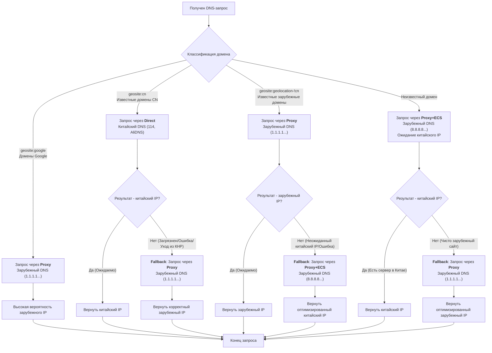

# Реализация точного разделения трафика с помощью DNS

## Традиционные методы маршрутизации и их недостатки

Когда вы пытаетесь вручную создать правила проксирования, неизбежно возникает вопрос: какой трафик пускать через Proxy, а какой — через Direct?

Обычный ответ — использование черных и белых списков (Blacklist/Whitelist).

За более чем десять лет сообщество создало огромные списки правил, и появилось множество отличных проектов:

- https://github.com/gfwlist/gfwlist
- https://github.com/v2fly/domain-list-community
- https://github.com/Loyalsoldier/v2ray-rules-dat

Однако они не могут охватить абсолютно все веб-сайты, обладают задержкой в обновлении и не являются на 100% достоверными.

Несколько примеров:

- `geosite:cn` — это "сборная солянка": туда добавляют всё, что хоть как-то связано с Китаем. Даже если домен был заблокирован (GFW), его могут не успеть вовремя удалить из списка.
  Если вы полагаетесь только на наличие целевого домена в этом списке для направления в Direct, это не сработает. Например, `ai.ytimg.com` или `login.corp.google.com` могут быть заблокированы, но все еще присутствовать в списке.
- В [README](https://github.com/Loyalsoldier/v2ray-rules-dat) репозитория `v2ray-rules-dat` сказано: домены Apple, Microsoft, Google CN одновременно присутствуют и в `geosite:cn`, и в `geosite:geolocation-!cn`, хотя на практике это не так. (См.: [PR#328](https://github.com/Loyalsoldier/v2ray-rules-dat/pull/328))
- А что, если домена вообще нет в списке?

Это создает проблемы при маршрутизации. Если ваши правила обновляются несвоевременно, трафик, который должен идти через Direct, может пойти через Proxy, или некоторые сайты вообще перестанут открываться.

Что делать, если неизвестный домен имеет сервер в Китае, и вы хотите максимально использовать Direct, но после настройки сталкиваетесь с пресловутым [DNS Leak](https://github.com/XTLS/BBS/issues/3#issuecomment-3505661189)?

Существует ли способ добиться 99.99% безопасности и точности маршрутизации?

Ответ: Безусловно.

## Использование DNS-модуля Xray-core для точного разделения трафика

Рационально используя мощные возможности встроенного DNS в Xray (Fallback, ECS, фильтрация по IP, тегирование), и тщательно настраивая порядок серверов, вы получите IP-адрес как условие маршрутизации, который будет гораздо точнее и актуальнее, чем `geosite cn/!cn`. Это связано с тем, что принадлежность IP к региону (GeoIP), особенно к Китаю, меняется довольно редко.

Прежде чем продолжить чтение, вам необходимо внимательно изучить и понять: "Основы: Краткий анализ функции маршрутизации (routing) — [Часть 1](./routing-lv1-part1.md), [Часть 2](./routing-lv1-part2.md)".
Предполагается, что вы уже досконально изучили официальное руководство по конфигурации и полностью понимаете работу `domainStrategy` в Routing и Outbound, назначение опций `sniffing` в Inbound, а также поведение системы при различных комбинациях этих параметров.

Всё готово? Попробуйте осмыслить следующий абзац:

При входящих соединениях `socks` или `http` запрашивается домен. Когда запрос попадает в Routing, стратегия `domainStrategy` (если она отлична от `AsIs`) может использовать встроенный DNS для резолвинга IP, который временно используется для сопоставления правил маршрутизации. При отправке в локальный `direct` Outbound, если его `domainStrategy` не `AsIs`, встроенный DNS снова резолвит IP для исходящего соединения. Запрос, отправляемый на удаленный сервер Xray, содержит только домен; какой именно IP будет использован для доступа, зависит от `direct` Outbound на сервере.

В режиме прозрачного прокси (Transparent Proxy) ситуация сложнее. Если включен `sniffing` на Inbound и `destOverride` содержит `[http, tls]`:

- Если `routeOnly = false`, запрошенный IP будет стерт, и дальнейший процесс аналогичен `socks` Inbound.
- Если `routeOnly = true`, то доступны и домен, и IP. В Routing можно напрямую сопоставлять правила по домену и IP, а локальный `direct` Outbound также будет использовать этот IP. Запрос к серверу Xray содержит только IP. Как сервер его обработает? Повторит описанный выше процесс.

Возникли трудности? Вам нужно вернуться к официальному руководству и попытаться вникнуть. В противном случае вам будет сложно использовать результаты резолвинга DNS-модуля из примеров ниже для правильной маршрутизации.

---

#### Пример 1: Конфигурация для получения точного, дружественного к CDN IP-адреса. Гарантирует отсутствие DNS Leak. Если в Китае есть сервер, он будет разрешен приоритетно. Идеально подходит для сценариев RealIP в прозрачном прокси.

```json
{
  "dns": {
    "servers": [
      // Предотвращение зависания Google CAPTCHA и мониторинга Google China
      // (так как многие сторонние сайты могут загружать шрифты Google и т.д.)
      {
        "address": "1.1.1.1",
        "skipFallback": true,
        "domains": ["geosite:google", "geosite:google-cn"]
      },
      {
        "address": "8.8.8.8",
        "skipFallback": true,
        "domains": ["geosite:google", "geosite:google-cn"],
        "finalQuery": true // Завершить цепочку запросов
      },
      // Резолвим через Direct домены, которые сообщество считает имеющими узлы в Китае.
      // Если результат не соответствует ожидаемому, возможно, домен заблокирован или ушел из Китая.
      // Резолвим через Proxy домены, считающиеся китайскими, для Fallback в случае блокировки/ухода.
      {
        "tag": "dns-direct",
        "address": "114.114.114.114",
        "skipFallback": true,
        "domains": ["geosite:cn"],
        "expectIPs": ["geoip:cn"]
      },
      {
        "tag": "dns-direct",
        "address": "223.5.5.5",
        "skipFallback": true,
        "domains": ["geosite:cn"],
        "expectIPs": ["geoip:cn"]
      },
      {
        "address": "1.1.1.1",
        "skipFallback": true,
        "domains": ["geosite:cn"]
      },
      {
        "address": "8.8.8.8",
        "skipFallback": true,
        "domains": ["geosite:cn"],
        "finalQuery": true // Завершить цепочку запросов
      },
      // Резолвим через Proxy домены, которые сообщество считает НЕ китайскими.
      // Если результат не соответствует ожидаемому, пытаемся оптимизировать Direct.
      {
        "address": "1.1.1.1",
        "skipFallback": true,
        "domains": ["geosite:geolocation-!cn"],
        "expectIPs": ["geoip:!cn"]
      },
      {
        "address": "8.8.8.8",
        "skipFallback": true,
        "domains": ["geosite:geolocation-!cn"],
        "expectIPs": ["geoip:!cn"]
      },
      {
        "address": "8.8.8.8",
        "clientIp": "222.85.85.85", // Укажите IP вашего локального ISP для получения оптимизированных A/AAAA записей
        // Например, если вы используете Henan Telecom, используйте соответствующий IP.
        // Не гарантирует 100% дружелюбность к китайским CDN, так как не все Authoritative DNS поддерживают ECS.
        "skipFallback": true,
        "domains": ["geosite:geolocation-!cn"]
      },
      {
        "address": "8.8.4.4",
        "clientIp": "222.85.85.85", // См. выше
        "skipFallback": true,
        "domains": ["geosite:geolocation-!cn"],
        "finalQuery": true // Завершить цепочку запросов
        // Здесь у вас может возникнуть вопрос: эти 4 правила кажутся избыточными по сравнению с 4 выше? Можно ли сократить?
        // На самом деле нет, это сделано для достижения максимальной скорости, а также потому что некоторые Authoritative DNS не поддерживают ECS.
      },
      // Неизвестные домены: приоритет Китая. Если результат не соответствует, пытаемся оптимизировать Proxy.
      {
        "address": "8.8.8.8",
        "clientIp": "222.85.85.85", // См. выше
        "expectIPs": ["geoip:cn"]
      },
      {
        "address": "8.8.4.4",
        "clientIp": "222.85.85.85", // См. выше
        "expectIPs": ["geoip:cn"]
      },
      "1.1.1.1",
      "8.8.8.8"
    ],
    "tag": "dns-proxy",
    "enableParallelQuery": true // Интеллектуальная параллельность: все параллельно, умная группировка, гонка внутри группы
  },
  "routing": {
    "domainStrategy": "Зависит от ваших требований",
    "rules": [
      {
        // Маршрутизация для самих DNS-запросов
        "inboundTag": ["dns-direct"],
        "outboundTag": "direct"
      },
      {
        // Маршрутизация для самих DNS-запросов
        "inboundTag": ["dns-proxy"],
        "outboundTag": "proxy"
      }
      // Ваши персональные правила маршрутизации
      // Для разблокировки стриминга и т.д. используйте domain, для разделения трафика (CN/!CN) всегда используйте ip
    ]
  }
  // Остальное пропущено, настройте по необходимости...
}
```



Вы можете использовать IP-адреса, полученные с помощью этой конфигурации, в сочетании с доменами или полагаться исключительно на IP для разделения трафика.

В среде прозрачного прокси RealIP вы даже можете обеспечить полный перехват DNS по всем каналам, установив `domainStrategy=AsIs` и `routeOnly=true`, чтобы избежать вторичного DNS-резолвинга.

> Примечание: Упомянутая "дружественность к CDN" для зарубежного сегмента оптимизирована под местоположение вашего прокси-сервера. Если вы используете режим "только черный список через прокси" (а не весь зарубежный трафик через прокси), вам необходимо самостоятельно скорректировать ECS в правилах.

#### Пример 2: Конфигурация для получения корректного адреса (не гарантируется оптимизация для зарубежных CDN). Гарантирует отсутствие DNS Leak. Если в Китае есть сервер, он будет разрешен приоритетно. Подходит для FakeIP прозрачного прокси, Socks, HTTP Inbound.

```json
{
  "dns": {
    "servers": [
      // Предотвращение зависания Google CAPTCHA и мониторинга Google China
      // (так как многие сторонние сайты могут загружать шрифты Google и т.д.)
      {
        "address": "1.1.1.1",
        "skipFallback": true,
        "domains": ["geosite:google", "geosite:google-cn"],
        "finalQuery": true // Завершить цепочку запросов
      },
      {
        // Мы не доверяем geosite:cn полностью, но если домен уже есть в списке,
        // пробуем разрешить его приоритетно. Если возвращается китайский IP — он не заблокирован.
        // Если нет — высока вероятность блокировки, Fallback на 8.8.8.8 для повторного резолвинга,
        // чтобы устранить возможное загрязнение DNS.
        // Причина приоритета: цена ошибки минимальна, Direct-запрос занимает всего ~10 мс.
        "tag": "dns-direct",
        "address": "223.5.5.5",
        "skipFallback": true,
        "domains": ["geosite:cn"],
        "expectIPs": ["geoip:cn"]
      },
      {
        // Если домена нет в geosite:cn или сработал Fallback из правила выше, используется этот сервер.
        // Используем ECS для попытки получения A/AAAA записей для Китая.
        "address": "8.8.8.8",
        "clientIp": "222.85.85.85", // Укажите IP вашего локального ISP для получения оптимизированных A/AAAA записей
        // Например, если вы используете Henan Telecom, используйте соответствующий IP.
        // Не гарантирует 100% дружелюбность к китайским CDN, так как не все Authoritative DNS поддерживают ECS.
        "skipFallback": false
      }
    ],
    "tag": "dns-proxy"
  },
  "routing": {
    "domainStrategy": "Обязательно НЕ AsIs, конкретное значение зависит от требований",
    "rules": [
      {
        // Маршрутизация для самих DNS-запросов
        "inboundTag": ["dns-direct"],
        "outboundTag": "direct"
      },
      {
        // Маршрутизация для самих DNS-запросов
        "inboundTag": ["dns-proxy"],
        "outboundTag": "proxy"
      }
      // Ваши персональные правила маршрутизации
      // Для разблокировки стриминга и т.д. используйте domain, для разделения трафика (CN/!CN) всегда используйте ip
    ]
  }
  // Остальное пропущено, настройте по необходимости...
}
```

В этом сценарии, поскольку все запросы к серверу Xray передаются в виде доменов, нет необходимости использовать DNS для многократного поиска оптимального результата. Достаточно быстро определить, не "загрязнен" ли домен, и по возможности получить китайский IP, дружественный к CDN.

В этом примере китайский IP, полученный DNS-модулем, уже на 99% оптимизирован для CDN в Китае. Поэтому вы можете установить `domainStrategy` в `direct` Outbound в значение **не** `AsIs`, чтобы использовать кэш, если это необходимо.<br>
Если вы стремитесь к 100% оптимизации для китайских CDN, можно установить `AsIs`, чтобы использовать системный DNS для повторного резолвинга (дополнительные затраты времени от 1 до сотен мс). Рекомендуется включить "оптимистичное кэширование" (optimistic caching) для дальнейшего снижения задержки.

## Послесловие

Известно, что многие недобросовестные локальные приложения (в Китае) сканируют ваш исходящий зарубежный IP и связывают его с вашим GPS-положением, номером телефона, адресом доставки и другой конфиденциальной информацией, сливая эти данные в базы для социальной инженерии (社工库). ~~Большой брат следит за тобой!!!~~

Некоторые ошибочно полагают, что это вызвано разделением трафика, и что переход на режим "черного списка" (только сайты из черного списка идут через прокси) решит проблему.
На самом деле это не так. Во-первых, в "черный список" очень легко внедрить "отравленные" данные: злоумышленники могут намеренно создать сайты-приманки и добавить их туда, чтобы выявить ваш зарубежный IP.

Во-вторых, если хотя бы один сайт из черного списка размещен на Cloudflare, даже приманка не нужна. Попробуйте посетить: `https://chatgpt.com/cdn-cgi/trace`

Сообразительный читатель может подумать: "А что, если я найду публичный прокси и пущу трафик через него?" Это сработает при условии, что вы полностью доверяете этому прокси (отсутствие логов, продажа данных) и он активно используется множеством людей из вашей страны. Когда один зарубежный IP в единицу времени связан с десятками тысяч людей, невозможно вычислить конкретно вас через этот IP. А с назойливыми капчами на "грязных" IP придется смириться.

Cloudflare Warp от "кибер-филантропа" Cloudflare идеально подходит под описание? К сожалению, для сайтов, размещенных на CF, Warp не скрывает ваш IP полностью; он эффективен только для серверов, не принадлежащих CF.

Подойдет ли Tor? Он плохо подходит для повседневного использования: IP слишком "грязные", а выходные узлы часто меняются, что приводит к блокировке ваших аккаунтов на многих сайтах.

Поэтому, если ваш клиент не умеет разделять трафик по приложениям (App split tunneling, доступно только на мобильных устройствах), любой метод обхода блокировок приведет к утечке вашего зарубежного IP.

В заключение хочу сказать: при обычных методах обхода блокировок утечка зарубежного IP практически неизбежна. Если вам требуется высокий уровень конфиденциальности, используйте Tor и подобные инструменты. Xray-core — это инструмент противодействия цензуре, ориентированный на пробивание "стен" (Firewall), а его возможности в области защиты приватности весьма ограничены.
