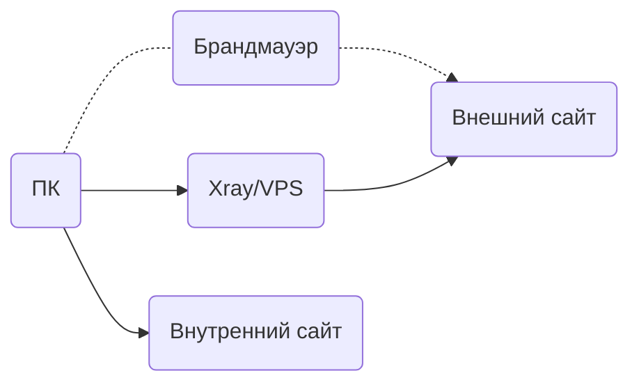
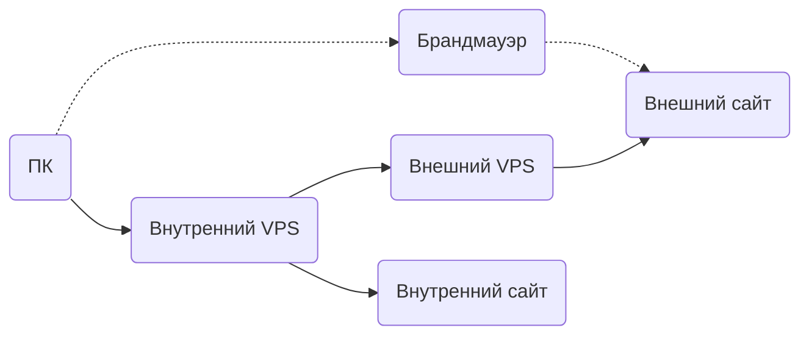
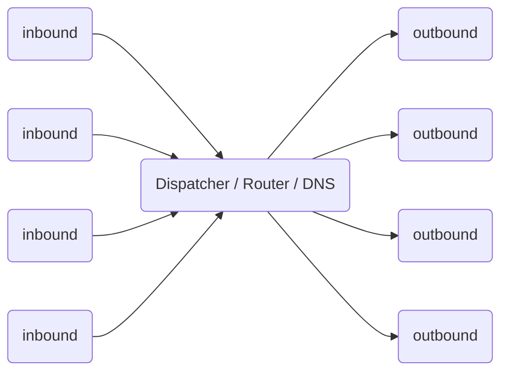

# Режимы работы Xray

## Режим одного сервера

Как и в случае с другими прокси-инструментами, вам понадобится сервер с настроенным Xray, а затем установить и настроить клиент Xray на вашем устройстве, после чего вы сможете свободно пользоваться Интернетом.

Один сервер Xray может одновременно обслуживать несколько устройств, использующих разные протоколы проксирования. При правильной настройке Xray может распознавать и различать трафик, который нужно проксировать, и трафик, который можно отправлять напрямую, без проксирования.

## Режим моста

Если вы не хотите настраивать маршрутизацию на каждом устройстве, вы можете настроить промежуточный сервер, который будет принимать весь трафик от клиентов и перенаправлять его в зависимости от настроек.

## Принцип работы

Перед настройкой Xray давайте рассмотрим, как он работает.  Ниже представлена схема внутреннего устройства одного процесса Xray.  Несколько процессов Xray работают независимо друг от друга.

- Для нормальной работы необходимо настроить как минимум одно входящее соединение (Inbound) и одно исходящее соединение (Outbound).
  - Входящее соединение отвечает за связь с клиентом (например, браузером):
    - Входящее соединение обычно можно настроить с аутентификацией пользователя, например, с использованием ID и пароля;
    - После получения данных входящее соединение передает их диспетчеру (Dispatcher) для распределения.
  - Исходящее соединение отвечает за отправку данных на сервер, например, на другой Xray, работающий на другом хосте.
- При наличии нескольких исходящих соединений можно настроить маршрутизацию (Routing) для указания, какое исходящее соединение должно использоваться для определенного типа трафика.
  - При необходимости маршрутизатор обращается к DNS для получения дополнительной информации для принятия решения.

