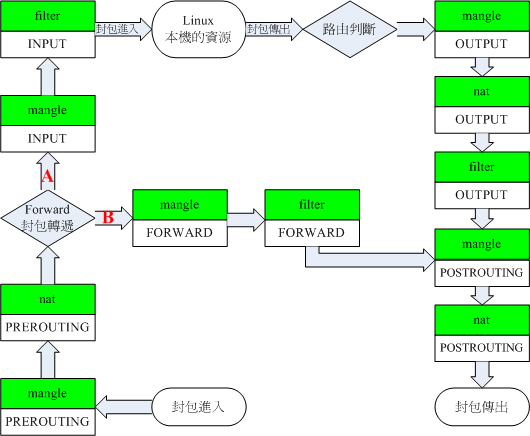

## Погружение в прозрачное проксирование

### Что такое прозрачное проксирование?

Проще говоря, прозрачное проксирование не позволяет проксируемому устройству понять, что оно проксируется. Это означает, что на проксируемом устройстве не нужно запускать какое-либо программное обеспечение для проксирования (например, Xray, V2RayNG и т. д.). Когда вы подключаетесь к сети, ваше устройство уже проксируется.

Это также означает, что программное обеспечение прокси работает в другом месте, например, на маршрутизаторе, и устройства, подключенные к Интернету через маршрутизатор, автоматически проксируются.

### Реализация прозрачного проксирования

В настоящее время существует два основных способа реализации прозрачного проксирования:

### tun2socks

Доступно для Windows/Linux (включая Android). Поскольку процесс реализации относительно прост, существует не так много руководств, поэтому я кратко опишу его здесь.

**Windows**

1. Установите **[Netch](https://github.com/NetchX/Netch/releases)**, используя режим `[3] [TUN/TAP] Обход локальной сети` для запуска.

2. Включите точку доступа.

3. Откройте `Панель управления` -> `Сеть и Интернет` -> `Центр управления сетями и общим доступом` -> `Изменение параметров адаптера`, найдите `TAP-Windows Adapter` и `Microsoft Wi-Fi Direct Virtual Adapter`.

4. Щелкните правой кнопкой мыши `TAP-Windows Adapter`, `Свойства` -> `Доступ`, установите флажок `Разрешить другим пользователям сети подключаться к Интернету через это подключение к Интернету`, в `Домашнее сетевое подключение` выберите сетевое подключение `Microsoft Wi-Fi Direct Virtual Adapter`, нажмите `ОК`.

**Android**

1. Настройте подключение V2RayNG.

2. Включите точку доступа.

3. Настройки точки доступа -> Разрешить использование VPN для точки доступа (эта опция может отсутствовать в некоторых системах Android).

### iptables/nftables

iptables и nftables реализуют прозрачное проксирование по одному и тому же принципу, в дальнейшем мы будем использовать iptables.

Реализация прозрачного проксирования на основе iptables применима только к системам Linux (включая openwrt/Android). Благодаря своей эффективности по сравнению с tun2socks и возможности настройки на маршрутизаторах, она получила широкое распространение.

Существующие три русскоязычных руководства по прозрачному проксированию на самом деле описывают реализацию прозрачного проксирования на основе этого решения: **[Новое руководство по V2Ray на русском языке - Прозрачное проксирование](https://guide.v2fly.org/app/transparent_proxy.html)**, **[Новое руководство по V2Ray на русском языке - Прозрачное проксирование (TPROXY)](https://guide.v2fly.org/app/tproxy.html)**, **[Руководство по настройке прозрачного проксирования (TProxy)](../tproxy.md)**. Первое основано на устаревшем режиме iptables-redirect, который не рекомендуется использовать и приводится только для справки. Второе и третье описывают реализацию прозрачного проксирования на основе режима iptables-tproxy.

## Принцип реализации прозрачного проксирования с помощью iptables

Linux использует `Netfilter` для управления сетью, модель `Netfilter` выглядит следующим образом:



**Предположим, что в качестве шлюза используется маршрутизатор (т. е. наш обычный способ подключения к Интернету), тогда:**

Направление трафика от устройств локальной сети к Интернету через маршрутизатор:

`Цепочка PREROUTING -> Цепочка FORWARD -> Цепочка POSTINGROUTING`

Направление трафика от устройств локальной сети к маршрутизатору (например, вход в веб-интерфейс маршрутизатора/подключение к маршрутизатору по ssh/доступ к DNS-серверу маршрутизатора и т. д.):

`Цепочка PREROUTING -> Цепочка INPUT -> Хост шлюза`

Направление трафика от маршрутизатора к Интернету:

`Хост шлюза -> Цепочка OUTPUT -> Цепочка POSTINGROUTING`

**Управляя направлением трафика цепочек `PREROUTING` и `OUTPUT` с помощью iptables и перенаправляя его на Xray, мы можем проксировать устройства локальной сети и хост шлюза.**

## В чем сложность прозрачного проксирования?

Сложность прозрачного проксирования заключается в маршрутизации, то есть в различении того, какой трафик должен быть прямым, а какой должен проксироваться, поэтому я лично считаю, что термин **разделение трафика** более уместен.

Мы можем разделить маршрутизацию на следующие этапы по возрастанию сложности:

1. Проксирование всех запросов.
2. Прямое подключение для локальных IP-адресов/многоадресных IP-адресов, проксирование для остальных запросов.
3. На основе пункта 2, прямое подключение для исходящих запросов, инициированных Xray.
4. На основе пункта 3, прямое подключение для запросов, адресованных китайским IP-адресам, и выбор внутренних и внешних DNS-серверов для разрешения внутренних и внешних доменных имен.

Три вышеупомянутых руководства описывают четвертый этап. Поэтому новичкам может быть сложно понять их, читая напрямую.

## Пошаговая реализация прозрачного проксирования на основе iptables-tproxy с нуля

### Прежде чем начать, вам необходимо иметь базовые знания:

1. Примерное представление о протоколах TCP/IP, доменных именах и DNS-серверах.
2. Знание того, что такое WAN-порт, LAN-порт, LAN_IP, WAN_IP и DHCP-сервер. Для пограничных маршрутизаторов есть только один сетевой порт, который мы будем называть LAN-портом.
3. Базовое понимание системы Linux (знание того, как запускать команды).
4. Умение писать конфигурационные файлы клиента в формате json или, по крайней мере, понимать их.

### Предварительная подготовка
::: warning
Перед началом работы не забудьте включить пересылку пакетов ipv4 в Linux с помощью команды `sysctl -w net.ipv4.ip_forward=1`
:::
**1. Подготовьте шлюз под управлением Linux**

Например, маршрутизатор с прошивкой OpenWRT.

**2. Подготовьте исполняемый файл Xray и конфигурационный файл на шлюзе (маршрутизаторе)**

Конфигурационный файл прослушивает порт 12345 и включает tproxy:

```json
{
  "log": {
    "loglevel": "warning"
  },
  "inbounds": [
    {
      "port": 12345,
      "protocol": "dokodemo-door",
      "settings": {
        "network": "tcp,udp",
        "followRedirect": true
      },
      "streamSettings": {
        "sockopt": {
          "tproxy": "tproxy"
        }
      }
    }
  ],
  "outbounds": [
    {
      // Конфигурация вашего сервера
    }
  ]
}
```

Мы пойдем от простого к сложному, не будем писать routing, а напишем только один inbound и один outbound.

### Сначала давайте попробуем достичь первого этапа

::: warning
Если вы не хотите перезагружать свою машину, лучше сначала попрактиковаться на виртуальной машине
:::

Перенаправьте весь трафик цепочки `PREROUTING` в Xray.

Запустите Xray и выполните следующие команды:

```bash
ip rule add fwmark 1 table 100
ip route add local 0.0.0.0/0 dev lo table 100
iptables -t mangle -N XRAY
iptables -t mangle -A XRAY -p tcp -j TPROXY --on-port 12345 --tproxy-mark 1
iptables -t mangle -A XRAY -p udp -j TPROXY --on-port 12345 --tproxy-mark 1
iptables -t mangle -A PREROUTING -j XRAY
```

После ввода команд, если вы подключены к шлюзу по ssh, вы обнаружите, что соединение ssh разорвано (не беспокойтесь, перезагрузка восстановит его), и прозрачное проксирование не работает; если ваш шлюз - это виртуальная машина, вы обнаружите, что сам шлюз не может получить доступ к Интернету, и в журнале доступа Xray появится множество запросов с исходным адресом, равным целевому адресу, и целевым адресом, равным WAN_IP.

Теоретически доступ хоста шлюза к общедоступной сети должен проходить только через цепочки `OUTPUT` и `POSTINGROUTING`, так почему же управление цепочкой `PREROUTING` приводит к тому, что шлюз не может получить доступ к Интернету? Это связано с тем, что сетевое взаимодействие, как правило, двунаправленное, и хотя доступ шлюза к общедоступному IP-адресу не требует прохождения через цепочку `PREROUTING`, информация, возвращаемая сервером на шлюз, должна проходить через цепочку `PREROUTING`, и эта часть перенаправляется на Xray, что приводит к обратным запросам в журнале.

Давайте изменим правило, чтобы возвращать трафик, источник которого не находится в локальной сети. Перезагрузите шлюз, запустите Xray и выполните следующие команды:

```bash
ip rule add fwmark 1 table 100
ip route add local 0.0.0.0/0 dev lo table 100
iptables -t mangle -N XRAY
# "Диапазон LAN-адресов шлюза" можно получить, выполнив команду "ip address | grep -w "inet" | awk '{print $2}'", это будет один из адресов
iptables -t mangle -A XRAY ! -s Диапазон LAN-адресов шлюза -j RETURN
iptables -t mangle -A XRAY -p tcp -j TPROXY --on-port 12345 --tproxy-mark 1
iptables -t mangle -A XRAY -p udp -j TPROXY --on-port 12345 --tproxy-mark 1
iptables -t mangle -A PREROUTING -j XRAY
```

Теперь вы обнаружите, что, хотя соединение ssh разорвано, прозрачное проксирование уже работает. Если мы изменим системный DNS на общедоступный DNS, мы сможем нормально просматривать веб-страницы (поскольку в настоящее время шлюз недоступен, мы не можем установить DNS на шлюз).

На этом первый этап завершен. Причина, по которой мы не можем получить доступ к шлюзу, заключается в том, что правило проксирования проксирует весь трафик, включая трафик, адресованный шлюзу. Представьте, что вы пытаетесь получить доступ к своему локальному шлюзу с VPS, вы не сможете этого сделать, поэтому нам нужно сделать этот трафик прямым, смотрите второй этап:

### Второй этап

Перезагрузите шлюз, запустите Xray и выполните следующие команды:

```bash
ip rule add fwmark 1 table 100
ip route add local 0.0.0.0/0 dev lo table 100
iptables -t mangle -N XRAY

# Прямое подключение для всех запросов, адресованных сегменту сети шлюза
# Получите сегменты сети, выполнив команду "ip address | grep -w "inet" | awk '{print $2}'", как правило, их несколько
iptables -t mangle -A XRAY -d Сегмент сети шлюза 1 -j RETURN
iptables -t mangle -A XRAY -d Сегмент сети шлюза 2 -j RETURN
...

# Прямое подключение для запросов, адресованных многоадресным IP-адресам/адресам класса E/широковещательным IP-адресам
iptables -t mangle -A XRAY -d 224.0.0.0/3 -j RETURN

iptables -t mangle -A XRAY -p tcp -j TPROXY --on-port 12345 --tproxy-mark 1
iptables -t mangle -A XRAY -p udp -j TPROXY --on-port 12345 --tproxy-mark 1
iptables -t mangle -A PREROUTING -j XRAY
```

После использования этого правила предыдущее правило `iptables -t mangle -A XRAY ! -s Диапазон LAN-адресов шлюза -j RETURN` становится лишним и его можно удалить.

На этом второй этап завершен. Шлюз доступен, ssh не разрывается.

### Третий этап

Обычно мы используем DNS, предоставляемый маршрутизатором, но это правило iptables проксирует только устройства в локальной сети, а не сам хост шлюза, поэтому возвращаемые результаты DNS-запросов могут быть неверными или загрязненными.

iptables-tproxy не поддерживает работу с цепочкой `OUTPUT`, но мы можем настроить `маршрутизацию по политике`, чтобы перенаправлять соответствующие пакеты из цепочки `OUTPUT` обратно в цепочку `PREROUTING`.

```bash
# Добавить маршрут по политике: пакеты с меткой 1 направляются в таблицу маршрутизации 100
ip rule add fwmark 1 table 100
# Добавить запись маршрута в таблицу маршрутизации 100: все пакеты направляются локально
ip route add local 0.0.0.0/0 dev lo table 100
```

Настроив `маршрутизацию по политике` выше, нам нужно только пометить пакеты, которые необходимо проксировать от хоста шлюза, меткой `1` в цепочке `OUTPUT`, и соответствующие пакеты будут направлены на сам хост шлюза, то есть в цепочку `PREROUTING`.

Если мы хотим проксировать все запросы, отправленные хостом шлюза, это вызовет проблему: Xray работает на шлюзе, Xray отправляет запросы на сервер прокси, и эти запросы снова проксируются, образуя петлю.

Поэтому, чтобы проксировать хост шлюза, необходимо избежать зацикливания, то есть исключить трафик запросов Xray из правил проксирования.

**Существуют три распространенных метода:**

1. Прямое подключение трафика, адресованного VPS

Перезагрузите шлюз, запустите Xray и выполните следующие команды:

```bash
# Проксирование устройств локальной сети
# Наследуем достижения предыдущего этапа
ip rule add fwmark 1 table 100
ip route add local 0.0.0.0/0 dev lo table 100
iptables -t mangle -N XRAY
iptables -t mangle -A XRAY -d Сегмент сети шлюза 1 -j RETURN
iptables -t mangle -A XRAY -d Сегмент сети шлюза 2 -j RETURN
...
iptables -t mangle -A XRAY -d 224.0.0.0/3 -j RETURN
iptables -t mangle -A XRAY -p tcp -j TPROXY --on-port 12345 --tproxy-mark 1
iptables -t mangle -A XRAY -p udp -j TPROXY --on-port 12345 --tproxy-mark 1
iptables -t mangle -A PREROUTING -j XRAY

# Проксирование хоста шлюза
iptables -t mangle -N XRAY_MASK
iptables -t mangle -A XRAY_MASK -d Сегмент сети шлюза 1 -j RETURN
iptables -t mangle -A XRAY_MASK -d Сегмент сети шлюза 2 -j RETURN
...
iptables -t mangle -A XRAY_MASK -d 224.0.0.0/3 -j RETURN
iptables -t mangle -A XRAY_MASK -d Общедоступный IP-адрес VPS/32 -j RETURN
iptables -t mangle -A XRAY_MASK -j MARK --set-mark 1
iptables -t mangle -A OUTPUT -p tcp -j XRAY_MASK
iptables -t mangle -A OUTPUT -p udp -j XRAY_MASK
```

Однако у этого метода есть недостаток: если используется CDN или много VPS, то написание правил становится неудобным.

2. Исключение с помощью меток

Три вышеупомянутых русскоязычных руководства используют этот метод исключения, обратитесь к ним, мы не будем повторяться здесь.

3. Исключение с помощью gid (рекомендуется)

См. **[[Прозрачное проксирование] Исключение трафика Xray с помощью gid](../iptables_gid.md)**

На этом третий этап проксирования, также известный как глобальное проксирование, завершен. Но не забудьте установить DNS-сервер шлюза на зарубежный DNS-сервер, иначе вы все равно можете получить загрязненные результаты.

### Четвертый этап

На самом деле, не всем нужно реализовывать четвертый этап. Глобальное проксирование подходит для большинства случаев.

Особенно для пограничных маршрутизаторов. При необходимости проксирования установите шлюз на IP-адрес пограничного маршрутизатора, при отсутствии необходимости проксирования - на IP-адрес основного маршрутизатора.

Что касается конкретной реализации четвертого этапа, то об этом подробно рассказывается в трех вышеупомянутых русскоязычных руководствах. После того, как вы поймете вышеизложенное, вам будет легче понять эти руководства.

### Проксирование IPv6

Вышеуказанные правила действительны только для IPv4, если вы хотите проксировать запросы IPv6, используйте команду ip6tables, ее использование в основном такое же, как и у iptables. См. **[[Прозрачное проксирование] Исключение трафика Xray с помощью gid # 4-Настройка правил iptables](../iptables_gid # 4-Настройка правил iptables.md)**

# Другие замечания по прозрачному проксированию с помощью iptables

1. Если шлюз, выступающий в качестве прокси, также является основным маршрутизатором, необходимо добавить правило `iptables -t mangle -A XRAY ! -s Диапазон LAN-адресов шлюза -j RETURN` в цепочку `PREROUTING`, то есть команду, использованную на первом этапе и удаленную на втором этапе. Если этого не сделать, другие люди в той же подсети, что и WAN-порт, смогут использовать ваш WAN_IP в качестве шлюза, чтобы злоупотреблять вашим прозрачным прокси, что может быть небезопасно.

2. В **[Новое руководство по V2Ray на русском языке - Прозрачное проксирование (TPROXY) # Настройка шлюза](https://guide.v2fly.org/app/tproxy.html # Настройка шлюза)** третий пункт гласит: `Настройте сеть ПК вручную, указав в качестве шлюза по умолчанию адрес Raspberry Pi, то есть 192.168.1.22. Теперь ПК должен иметь доступ к Интернету (поскольку проксирование еще не настроено, “доступ” означает возможность доступа к внутренним веб-сайтам)`. На самом деле, даже если включена переадресация IP, ПК под управлением Ubuntu, CentOS, Debian и других систем не смогут получить доступ к Интернету, это нормально. Фактически, только OpenWRT может сделать то, что описано в статье, как указал **[@BioniCosmos](https://github.com/BioniCosmos)**, это связано с тем, что в обычных системах Linux нет правил Masquerade.

3. **[Проблема too many open files](https://guide.v2fly.org/app/tproxy.html#решение-проблемы-too-many-open-files)**, см. решение в **[[Прозрачное проксирование] Исключение трафика Xray с помощью gid - Настройка максимального количества открытых файлов и запуск клиента Xray](../iptables_gid#3-настройка-максимального-количества-открытых-файлов-запуск-клиента-xray)**

4. Избегайте повторного прохождения пакетов с существующими подключениями через TPROXY, будет дополнено...

5. Основной маршрутизатор, однорукий маршрутизатор и пограничный маршрутизатор, будет дополнено...
