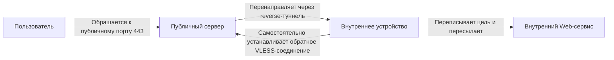
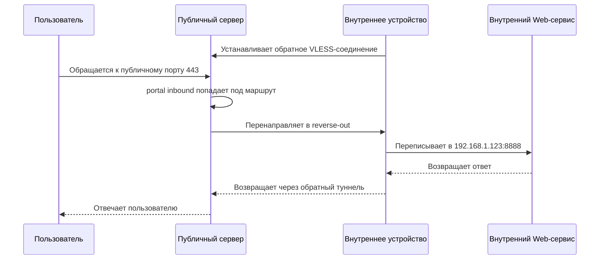
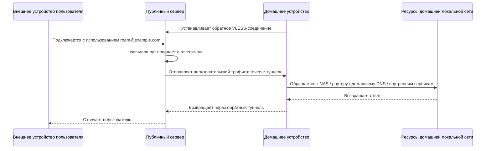

# Примеры обратного проксирования VLESS

В этой статье показано, как использовать возможность обратного проксирования VLESS в Xray, чтобы через публичный сервер возвращать трафик в удаленную внутреннюю сеть. Ниже рассмотрены два распространенных сценария:

- `Проброс входа`: удаленный проброс порта, то есть сопоставление публичного входного порта с Web-сервисом в удаленной внутренней сети;
- `Удаленно домой`: удаленный роуминг по внутренней сети, когда пользователь проходит через публичный сервер и затем продолжает доступ к ресурсам домашней сети.

## Проброс Входа

Удаленный проброс порта, то есть сопоставление публичного входного порта с Web-сервисом в удаленной внутренней сети.

### Как Это Работает

В этой модели есть три роли:

- Пользователь: обращается к публичной точке входа;
- Публичный сервер: принимает трафик и передает его в туннель обратного прокси;
- Внутреннее устройство: само устанавливает соединение с публичным сервером и принимает запросы через обратный туннель.



Проще говоря:

1. Внутреннее устройство сначала само подключается к публичному серверу.
2. Публичный сервер удерживает этот обратный туннель.
3. Пользователь обращается к входу `443` на публичном сервере.
4. Публичный сервер отправляет запрос обратно во внутреннее устройство через обратный туннель.
5. Внутреннее устройство переписывает цель на реальный Web-сервис.

### Идея Конфигурации

В обратном проксировании VLESS есть два ключевых момента:

- На публичной стороне для одного из клиентов VLESS объявляется `reverse.tag`, и тогда он будет выглядеть как маршрутизируемый outbound;
- На внутренней стороне для одного из outbound-соединений VLESS объявляется `reverse.tag`, и тогда оно будет само устанавливать обратное соединение и локально проявляться как inbound, способный принимать трафик.

Значения `reverse.tag` на обеих сторонах не обязаны совпадать. Это лишь локальные идентификаторы в своих конфигурациях. Реальное соответствие задается самой обратной связью.

### Конфигурация Публичного Сервера

Пример ниже делает две вещи:

- Поднимает inbound VLESS на порту `8443`, где один `client` содержит `reverse` и поэтому специально используется для установления обратных соединений с внутренних устройств;
- Поднимает inbound `tunnel` на порту `443`, который снаружи используется как вход Web-сервиса, а весь пришедший туда трафик перенаправляется в туннель обратного прокси.

Также обратите внимание, что outbound `freedom` нужно оставить как заглушку. Иначе, если `outbounds` окажется пустым, `reverse-out` будет считаться outbound по умолчанию, и трафик, не совпавший ни с одним правилом маршрутизации, может по ошибке попасть в туннель обратного прокси.

```json
{
  "inbounds": [
    {
      "listen": "0.0.0.0",
      "port": 8443,
      "protocol": "vless",
      "settings": {
        "decryption": "mlkem768x25519plus.native.600s.aCF82eKiK6g0DIbv0_nsjbHC4RyKCc9NRjl-X9lyi0k",
        "clients": [
          {
            "id": "ac04551d-6ebf-4685-86e2-17c12491f7f4",
            "flow": "xtls-rprx-vision",
            "reverse": {
              "tag": "reverse-out"
            }
          }
          // ... остальные обычные client
        ]
      }
    },
    {
      "listen": "0.0.0.0",
      "port": 443,
      "protocol": "tunnel",
      "tag": "portal"
    }
  ],
  "routing": {
    "rules": [
      {
        "inboundTag": ["portal"],
        "outboundTag": "reverse-out"
      }
    ]
  },
  "outbounds": [
    {
      "protocol": "freedom"
    }
  ]
}
```

### Конфигурация Внутреннего Устройства

Задача внутреннего устройства состоит в том, чтобы само инициировать исходящее соединение и создать обратный туннель. Здесь дополнительно задается маршрут, чтобы трафик, приходящий через `reverse-in`, явно отправлялся в указанный outbound `freedom`, а не целиком зависел от outbound по умолчанию, потому что на практике Xray на внутренней стороне часто еще обслуживает обычный прямой прокси.

В примере сохранены два outbound `freedom`:

- Один обычный `freedom`, который используется как outbound прямого подключения по умолчанию;<br>
  (если вам также нужен прямой прокси, остальные части такой конфигурации здесь опущены)
- Один `freedom` с `tag`, специально предназначенный для приема трафика, пришедшего через inbound обратного прокси.

Предположим, что ваш внутренний Web-сервис слушает на `192.168.1.123:8888`:

- На outbound нужно переписать целевой адрес на этот внутренний адрес;
- Поскольку в Xray действует политика безопасности по умолчанию, целевой порт нужно явно разрешить в `finalRules`.

```json
{
  // Остальная конфигурация, связанная с прямым прокси, опущена...
  "routing": {
    "rules": [
      {
        "inboundTag": ["reverse-in"],
        "outboundTag": "reverse-direct"
      }
    ]
  },
  "outbounds": [
    {
      "protocol": "freedom"
    },
    {
      "protocol": "freedom",
      "tag": "reverse-direct",
      "settings": {
        "redirect": "192.168.1.123:8888",
        "finalRules": [
          {
            "action": "allow",
            "network": "tcp",
            "ip": "192.168.1.123",
            "port": "8888"
          }
        ]
      }
    },
    {
      "protocol": "vless",
      "settings": {
        "address": "yourserver.com",
        "port": 8443,
        "encryption": "mlkem768x25519plus.native.0rtt.2PcBa3Yz0zBdt4p8-PkJMzx9hIj2Ve-UmrnmZRPnpRk",
        "id": "ac04551d-6ebf-4685-86e2-17c12491f7f4",
        "flow": "xtls-rprx-vision",
        "reverse": {
          "tag": "reverse-in"
        }
      }
    }
  ]
}
```

Важно понимать следующее:

- На публичной стороне `reverse.tag` проявляется как outbound;
- На внутренней стороне `reverse.tag` проявляется как inbound;
- Они не обязаны называться одинаково, главное, чтобы обе стороны соответствовали одной и той же обратной связи `ac04551d...`;
- Если вы хотите тоньше управлять трафиком, приходящим через обратный прокси на внутренней стороне, можно, как в примере выше, явно указать в `routing`, через какой `freedom` outbound он должен идти.
- На внутренней стороне также поддерживается `sniffing`, а если в `freedom` настроить `proxyProtocol`, ваш Web-сервер сможет видеть реальный IP посетителя. Здесь эту тему не раскрываем.

### Поток Запроса



Смысл такого сценария вполне ясен: для пользователя это выглядит как "доступ к Web-сервису на публичном сервере", но фактически запросы обрабатывает Web-сервис на устройстве в удаленной внутренней сети.

### Несколько Каналов и Резервирование

Одно внутреннее устройство может устанавливать несколько обратных соединений, например через разные сети, разные исходящие каналы или разные адреса входа на публичном сервере. Если публичная сторона рассматривает все эти соединения как одну и ту же цель обратного прокси, получается резервирование каналов.

Преимущества такого подхода:

- Если один канал временно недоступен, трафик может идти по другим;
- На публичной стороне не нужно проектировать отдельную схему маршрутизации для каждого канала;
- Для сценариев проброса во внутреннюю сеть так удобнее организовывать резервирование.

### Рекомендации По Безопасности

- На публичном сервере обязательно должен оставаться явный outbound по умолчанию. В зависимости от ваших задач это может быть `freedom`, `blackhole` или что-то похожее, чтобы трафик, не совпавший с маршрутами, случайно не попадал в обратный прокси;
- Пример конфигурации в первую очередь объясняет принцип. В реальной публичной сети обычно также требуется более полноценная транспортная схема и маскировка.

## Удаленно Домой

Удаленный роуминг по внутренней сети, когда пользователь проходит через публичный сервер и возвращается в домашнюю сеть, чтобы продолжать доступ к ресурсам.

### Описание Сценария

Здесь речь не о том, чтобы открыть какой-то публичный порт для внешнего доступа. Вместо этого пользователь сначала подключается к VLESS на публичном сервере, а затем с помощью уже установленного обратного туннеля его трафик отправляется обратно на домашнее внутреннее устройство для дальнейшей обработки.

Этот вариант ближе к следующим сценариям:

- Доступ к ресурсам домашней локальной сети во время поездок;
- Возврат исходящего трафика конкретного пользователя домой;
- Переход через публичный сервер с последующим доступом к NAS, панели роутера, домашнему DNS или другим внутренним сервисам.


### Идея Конфигурации

По сравнению с первой частью, главное отличие здесь не в самой обратной связи, а в цели маршрутизации на публичной стороне:

- В первой части используется `inboundTag -> reverse-out`, чтобы сопоставить определенный входной порт с внутренней сетью;
- Во второй части используется `user -> reverse-out`, чтобы передать проксируемый трафик конкретного пользователя внутреннему устройству для дальнейшей обработки.

Иными словами, здесь публичный сервер больше похож на транзитный узел. Пользователь не "обращается напрямую к сервису, проброшенному через публичный порт", а "сначала подключается к VLESS inbound на публичном сервере, а затем продолжает путь через домашнее устройство".

### Конфигурация Публичного Сервера

В этом примере:

- Первый UUID по-прежнему используется домашним устройством для установления обратного соединения;
- Второй UUID используется внешним пользователем для подключения к публичному серверу;
- Маршрутизация по `email` отправляет трафик этого пользователя в `reverse-out`.

```json
{
  "inbounds": [
    {
      "listen": "0.0.0.0",
      "port": 8443,
      "protocol": "vless",
      "settings": {
        "decryption": "mlkem768x25519plus.native.600s.aCF82eKiK6g0DIbv0_nsjbHC4RyKCc9NRjl-X9lyi0k",
        "clients": [
          {
            "id": "ac04551d-6ebf-4685-86e2-17c12491f7f4",
            "flow": "xtls-rprx-vision",
            "reverse": {
              "tag": "reverse-out"
            }
          },
          {
            "id": "e8758aff-d830-4d08-a59e-271df65b995a",
            "flow": "xtls-rprx-vision",
            "email": "roam@example.com"
          }
        ]
      }
    }
  ],
  "routing": {
    "rules": [
      {
        "user": ["roam@example.com"],
        "outboundTag": "reverse-out"
      }
    ]
  },
  "outbounds": [
    {
      "protocol": "freedom"
    }
  ]
}
```

### Конфигурация Домашнего Устройства

Домашнее устройство по-прежнему должно само подключаться к публичному серверу и поднимать обратный туннель. В отличие от первой части, теперь оно не переписывает весь трафик на один фиксированный Web-сервис, а передает весь трафик, пришедший через `reverse-in`, на домашний outbound прямого подключения для дальнейшей обработки.

В примере ниже предполагается:

- Домашняя подсеть имеет вид `192.168.1.0/24`;
- Пользовательское устройство уже само решает, какой трафик нужно "вернуть домой";
- Домашнее устройство только принимает этот трафик и передает его домашней сети для дальнейшей обработки.

```json
{
  "routing": {
    "rules": [
      {
        "inboundTag": ["reverse-in"],
        "outboundTag": "home-direct"
      }
    ]
  },
  "outbounds": [
    {
      "protocol": "freedom"
    },
    {
      "protocol": "freedom",
      "tag": "home-direct",
      "settings": {
        "finalRules": [
          {
            "action": "allow",
            "network": "tcp,udp",
            "ip": ["192.168.1.0/24"]
          }
        ]
      }
    },
    {
      "protocol": "vless",
      "settings": {
        "address": "yourserver.com",
        "port": 8443,
        "encryption": "mlkem768x25519plus.native.0rtt.2PcBa3Yz0zBdt4p8-PkJMzx9hIj2Ve-UmrnmZRPnpRk",
        "id": "ac04551d-6ebf-4685-86e2-17c12491f7f4",
        "flow": "xtls-rprx-vision",
        "reverse": {
          "tag": "reverse-in"
        }
      }
    }
  ]
}
```

Смысл этих правил:

- Любой трафик, входящий через `reverse-in`, отправляется в `home-direct`;
- Поскольку в Xray есть политика безопасности по умолчанию, через `finalRules` нужно явно разрешить доступ во внутреннюю домашнюю сеть. Если вам нужен доступ только к домашнему NAS, лучше не открывать все IP, как в примере, а разрешить только конкретные IP и порты по необходимости.

### Конфигурация Устройства Пользователя

На стороне пользовательского устройства обычно не рекомендуется по умолчанию "возвращать домой весь трафик". Более распространенный вариант - отправлять назад только тот трафик, которому нужен доступ к домашним ресурсам, а остальной трафик оставлять на локальном прямом подключении. Ниже приведен пример, соответствующий домашней конфигурации выше. Предположим:

- Пользователь хочет обращаться только к домашней подсети `192.168.1.0/24`;
- Остальной трафик продолжает идти напрямую из локальной сети пользователя.

```json
{
  "routing": {
    "rules": [
      {
        "ip": ["192.168.1.0/24"],
        "outboundTag": "roam-home"
      }
    ]
  },
  "outbounds": [
    {
      "protocol": "freedom"
    },
    {
      "protocol": "vless",
      "tag": "roam-home",
      "settings": {
        "address": "yourserver.com",
        "port": 8443,
        "encryption": "mlkem768x25519plus.native.0rtt.2PcBa3Yz0zBdt4p8-PkJMzx9hIj2Ve-UmrnmZRPnpRk",
        "id": "e8758aff-d830-4d08-a59e-271df65b995a",
        "flow": "xtls-rprx-vision"
      }
    }
  ]
}
```

Смысл этих правил:

- Трафик, направленный в `192.168.1.0/24`, идет через `roam-home`;
- Остальной трафик не попадает ни под одно правило и продолжает идти через `freedom` по умолчанию, то есть напрямую через локальную сеть.

С точки зрения пользователя это выглядит как "домой отправляется только та часть трафика, которая нужна для доступа к домашним ресурсам", а не как перенаправление всего интернет-трафика через публичный сервер с последующим возвратом домой.

### Поток Запроса



### Чем Этот Вариант Отличается От Первого

- Первый вариант - это "сопоставить один публичный входной порт с фиксированным сервисом в удаленной внутренней сети"; без дополнительной аутентификации такой сервис может быть доступен любому пользователю из интернета.
- Второй вариант - это "дать конкретному пользователю сначала подключиться к публичному Xray-серверу, а затем через обратный прокси вернуться домой и продолжить доступ";
- Первый вариант больше похож на удаленный проброс порта, то есть на проникновение во внутреннюю сеть;
- Второй вариант больше похож на удаленный роуминг или легкую межплощадочную сеть.

### Рекомендации По Безопасности

- Если у вас несколько роуминговых пользователей, рекомендуется выдавать каждому отдельный UUID или отдельный идентификатор;
- В примере ради упрощения используется только VLESS-enc. В реальной эксплуатации могут понадобиться REALITY, XHTTP или другие способы маскировки трафика.

## Итоги

Обратный прокси VLESS как минимум покрывает два типа сценариев:

- Сопоставление публичного входного порта с фиксированным сервисом в удаленной внутренней сети;
- Подключение пользователя к публичному серверу с последующим возвратом домой через обратный туннель.

Оба сценария используют один и тот же механизм обратного соединения. Основное различие состоит в том, как публичная сторона маршрутизирует трафик и как внутренняя сторона продолжает его обрабатывать. Поняв это, можно свободно расширять схему между "пробросом порта" и "удаленным возвращением домой" под свои задачи.
